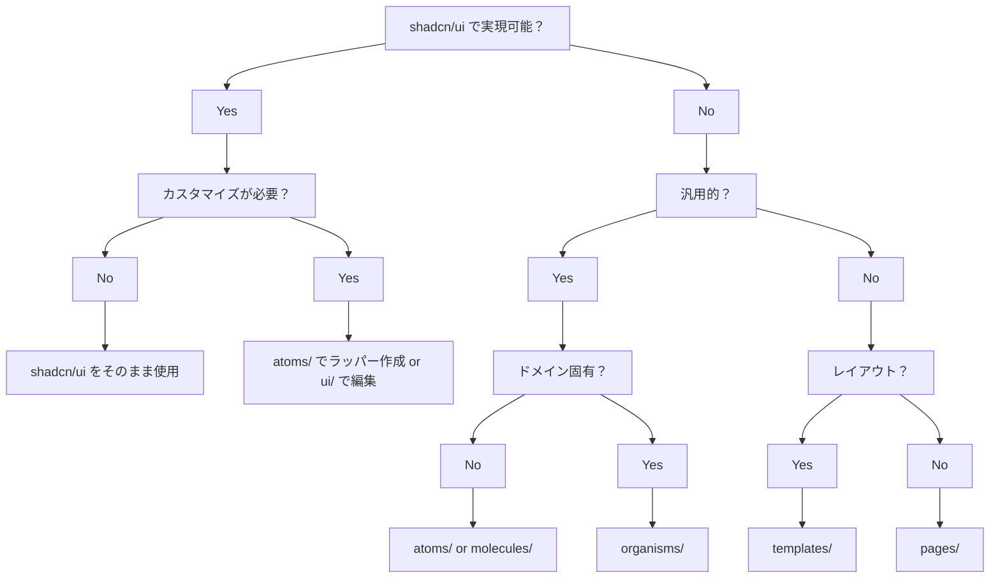

この記事は、Atomic Design によるコンポーネント分割で苦しんだ経験を元に、
AI 駆動で UI 開発にあたり、Atomic Design を取り入れてみた話です。

Feature-driven や Presentational/Container などの分割ルールよりも良かったというよりは、
Atomic Design でも AI を活用することでしっかり運用・保守を考えたコンポーネント分割ができたという体験をお伝えします！

# 要約

- これまで、Atomic Design によるコンポーネント分割で苦しんだ経験があった
- AI 駆動で開発する際に Atomic Design を取り入れ、コンポーネント分割のルールを策定してみた
- 細かいルールの遵守、認識のずれなど、人に依存していた課題が解消でき AI を活用できた


_ルールの一部_

# 今回の構成

- Next.js（App Router）
- shadcn/ui
- Claude Code

# Atomic Design 概要と課題

Atomic Design は、コンポーネント分割のための設計手法です。
5 つの階層に分かれており、化学用語を用いてコンポーネント間に階層を持たせる考え方です。

- Atom → 原子
- Molecule → 分子
- Organism → 有機体
- Template → テンプレート
- Page → ページ

## 課題：役割間でのルールの認識ずれ

Atomic Design を Web フロントエンドで UI 構築に取り入れる際、
デザインチームとフロントエンドチームの間で解釈や運用にずれが生じ、混乱を招くことが少なくありませんでした。
主なずれの原因と課題は以下の通りです。

### HTML とデザインツールでの定義の違い

HTML では単一要素として扱われる input フィールドが、Figma では「Frame」と「Text」の組み合わせとして認識されるなど、
技術的構造とデザイン構造で分類基準が根本的に異なります。この違いがより複雑なコンポーネントの分類判断を困難にしています。

### 独自ルールの連携不足

Atomic Design の原典では詳細な運用ルール（データの取得やビジネスロジックの扱いなど）が明確でないため、各チームが独自のルールを策定します。
しかし、このカスタマイズがデザイナーとエンジニア間で十分にすり合わせされないと、デザインファイルと実装が一致しない問題が発生します。

### 分類への過度な意識

本来重要な「小さな要素から大きな要素を作る」という再利用の考え方よりも、「正しい分類」に注力してしまう傾向があります。
Atoms と Molecules の境界線を厳密に定めることに時間を費やし、実用的なメリットを見失うケースが見られます。

これらの課題は、デザインとフロントエンド間の「溝」を深め、円滑なコミュニケーションや効率的な開発を妨げる一因となっていました。

参考記事：
@[card](https://note.com/jp_knj/n/nff0205e9d2be)

@[card](https://note.com/tabelog_frontend/n/n07b4077f5cf3)

@[card](https://lydesign.jp/n/nfd699e1d0177)

# コンポーネント設計ルール

AI 駆動での開発において、Atomic Design を効果的に活用するため、以下の詳細な設計ルールを策定しました。
今回は shadcn/ui を利用していたので、一部 shadcn/ui に依存していますが、
改変することで shadcn/ui に依存しないコンポーネント設計ルールも作成できます。
md 化しているので、コピペで使えるようにしています。

```
## 各階層の設計ルール

### Atoms（原子）

**責任範囲**: 最小単位の UI コンポーネント

**制約条件**:

- 汎用的である必要がある
- ドメイン固有の制約を持たない
- Context に依存しない
- 状態は最小限に留める
- 他のコンポーネントに依存しない

**実装例**:

- BrandButton（shadcn/ui Button のカスタマイズ）
- CustomInput（shadcn/ui Input の拡張）
- StatusBadge（ステータス表示用バッジ）

### Molecules（分子）

**責任範囲**: Atoms を組み合わせた機能的なコンポーネント

**制約条件**:

- 汎用的である必要がある
- ドメイン固有の制約を持たない
- 他のコンポーネント（主に Atoms）に依存可能
- 単一の機能を提供する

**実装例**:

- SearchBox（Input + Button の組み合わせ）
- FormField（Label + Input + ErrorMessage）
- ConfirmDialog（Dialog + Button 群）

### Organisms（有機体）

**責任範囲**: ドメイン固有の複雑なコンポーネント

**制約条件**:

- ドメイン固有の制約を持つことが許可される
- Context への接続が可能
- API 呼び出しが可能
- 複数の Molecules や Atoms を組み合わせる


### Templates（テンプレート）

**責任範囲**: ページの構造とレイアウト

**制約条件**:

- レイアウトの責任のみを持つ
- ビジネスロジックを含まない
- props でコンテンツを受け取る
- 再利用可能なレイアウト構造

### Pages（ページ）

**責任範囲**: 具体的なページの実装

**制約条件**:

- Next.js のページコンポーネントのラッパー
- データフェッチと Templates の組み合わせ
- ルーティング固有のロジック

## shadcn/ui との統合ルール

### 編集制限

- **原則**: shadcn/ui コンポーネントは編集禁止
- **例外**: プロジェクト要件で必要な場合のみ編集可能
- **推奨**: atoms/ でラッパーコンポーネントを作成

### 分類ルール

- **単純なコンポーネント**（Button、Input 等）: Atoms として扱う
- **複雑なコンポーネント**（Table、Form 等）: Molecules として扱う

### カスタマイズ方法

1. **軽微なカスタマイズ**: atoms/ でラッパー作成
2. **大幅なカスタマイズ**: ui/ で直接編集（要承認）

## 判断フローチャート

shadcn/ui で実現可能？
├─ Yes → カスタマイズが必要？
│   ├─ No → shadcn/ui をそのまま使用
│   └─ Yes → atoms/ でラッパー作成 or ui/ で編集
└─ No → 汎用的？
    ├─ Yes → ドメイン固有？
    │   ├─ No → atoms/ or molecules/
    │   └─ Yes → organisms/
    └─ No → レイアウト？
        ├─ Yes → templates/
        └─ No → pages/
```

このように判断フローチャートを作成することで、AI だけでなく、ヒトの判断もサポートできます。
オンボーディングなどで、プロジェクトのコンポーネント設計方針をわかりやすく伝えることができます。



# デモ

今回は Claude Code のカスタムスラッシュコマンド機能を活用し、コンポーネント作成用のコマンドを作成しました。

.claude/commands/create-component.md を作成し、上記ルールを記載します。

:::message
Cursor の場合は Rules に記載することで動作確認可能です。
必要に応じドキュメント参照用の MCP ツール化しても有用だと思います！
:::

## 入力

```
/create-component ブログ一覧用のCardコンポーネント。画像やタイトル、作成日時、タグで構成される
```

## 出力の様子


_AtomicDesign の原則を守ったコンポーネント実装_

ユーザーの作りたいコンポーネントに対し、AI エージェントが Organisms と判断し、コンポーネントを作成してくれました。
Card や Badge など shadcn/ui 標準のコンポーネントも活用していることがわかります。
※使用例もわかりやすく記述いただいてます...！！

### 自動生成されたもの


_自動生成されたコンポーネント_

:::message
実運用時は Figma Dev MCP などを活用することで、複雑な要件のコンポーネントでもしっかりコンポーネント分割ができると思います。
:::

# まとめ

Atomic Design を AI 駆動で開発に取り入れることで、コンポーネント分割の仕組み化ができ、
再利用性・保守性の向上、ヒトの分割判断のズレをなくすことができました。
