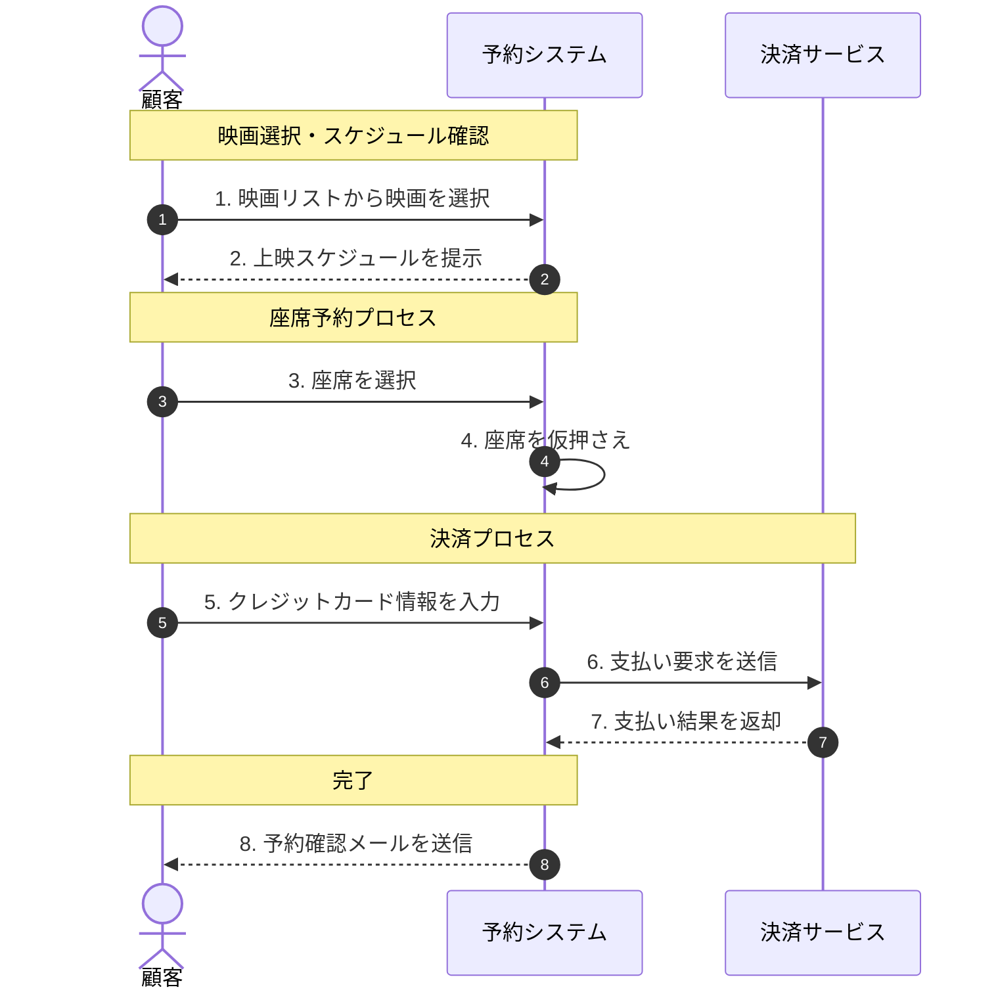

:::message
この記事は [Mavs Advent Calendar 2025](https://adventar.org/calendars/11595) の 5日目の記事です。🎅
:::

# はじめに

「業務フローが複雑すぎて、誰も全体像を把握できていない」
「ドキュメントを作ったけれど、エンジニア以外には伝わらない」（エンジニアが仕様書を作ったりも場合によってはあると思います）
「要件定義の段階で認識のズレがあり、手戻りが発生した」

システム開発の現場で、このような課題に直面したことはないでしょうか？
ドメイン知識（業務に関する知識）を、エンジニアだけでなく、ビジネスサイドの担当者（ドメインエキスパート）とも共有し、正しく理解することは非常に重要だと感じています...！

この記事では、会話を通じてドメイン知識を可視化するモデリング手法の一つである、**Domain Storytelling（ドメインストーリーテリング）** を紹介します。
ピクトグラムと矢印を使って「物語」を描くだけで、スムーズに共通認識を作ることができます。

DDD（ドメイン駆動設計）の文脈でも注目されているこの手法を、基礎から実際にAIを活用して効率的かつ手軽に可視化する方法を紹介します！！！


# 基礎となる知識

## （そもそも）ドメイン知識とは？

ドメイン知識とは、ソフトウェアが解決しようとしている特定の問題領域を理解するための知識です。
例えば、ECシステムを開発する場合、注文処理、商品管理、支払い処理など、そのシステムが解決しようとしている問題領域を含む知識がドメイン知識になります。

## （そもそも）ドメイン駆動設計とは？

ドメイン駆動設計は、ソフトウェア開発において、ドメイン知識を中心に設計を行う手法です。DDD（Domain-Driven Design）とも呼ばれることもあります。
ドメイン駆動設計では、ドメイン知識を深く理解し、それをモデル化することで、ソフトウェアが実際の業務要件を正確に反映するようにします。

私は以下の記事を読んで学習しました。
@[card](https://zenn.dev/yamachan0625/books/ddd-hands-on/viewer/chapter2_what_is_ddd)

## Domain Storytelling とは？

本題ですが
**Domain Storytelling は、ドメインエキスパートが語る「物語（ストーリー）」を、聞き手がリアルタイムに図式化していくコラボレーション型の手法**です。

「ドメイン知識 = 人々の会話の中に存在する」という考えに基づき、
具体的な業務シナリオを絵に描くことで可視化します。

## なぜ重要なのか？

### 1. プロジェクト内の共通言語化

テキストだけの仕様書は解釈のブレを生みます。表現の細かな違いによって、理解が異なる可能性があります。
また、厳密すぎる UML 図は非エンジニアにとってハードルが高いものです。

Domain Storytelling は、直感的なピクトグラム（アイコン）を使うため、誰でも理解できます。  
「このアイコンは『お客様』ですね」「この矢印は『注文メールを送る』ということですね」といった会話を通じて、自然とチーム内で言葉の定義が揃っていきます。

### 2. 誤解・確認事項の早期発見

口頭で説明しているときは「分かったつもり」になりがちです。  
しかし、目の前で図が描かれていくと、「あれ？ そのタイミングではまだ在庫確認はできないよ」といった指摘が即座に出てきます。

フィードバックループを高速に回せるのが大きなメリットだと思います！

## 構成要素（The Pictographic Language）

Domain Storytelling の図（ドメインストーリー）は、以下のシンプルな要素で構成されます。  
自然言語の「主語・述語・目的語」に対応しています。

- Actors（アクター）：行動の主体。人、グループ、またはシステム。
  - 例：顧客、店員、会計システム
- Work Objects（ワークオブジェクト）：アクターが操作するもの、情報の入れ物。
  - 例：注文票、チケット、商品、メール
- Activities（アクティビティ）：アクターがワークオブジェクトに対して行う行動。
  - 例：作成する、手渡す、送信する
- Sequence Numbers（順序）：物語の時系列を示す番号。

# Domain Storytelling の解説や使い方

では、実際にどのように進めるのか、そのステップを解説します。

## 準備するもの

- 参加者：ドメインエキスパート（業務を知っている人）、モデレーター（描く人）、開発者など。
- ツール
  - オンラインの場合：FigJamやmiroなどのコラボレーションツール
  - オフラインの場合：ホワイトボードとマーカー

## モデリングの流れ

### 1. シナリオを決める

まずは「何についての物語か」を具体的に決めます。
抽象的な「販売プロセス」ではなく、「A さんが映画のチケットをオンラインで予約し、決済を完了するまで」のように、具体的（Concrete）なシナリオを設定するのがコツです。

### 2. 物語を語ってもらう

ドメインエキスパートに、業務の流れを話してもらいます。
「まず、お客様が映画館のサイトにアクセスして、座席を選びます。すると仮予約状態になって...」

### 3. リアルタイムに描く

モデレーターは、話を聞きながらその場でアイコンを配置し、矢印で繋いでいきます。

- 主語（Actor） → 述語（Activity） → 目的語（Work Object）
- または Actor A → Activity → Work Object → Actor B

例えば、「お客様（Actor）が座席（Object）を選ぶ（Activity）」という会話なら、お客様のアイコンと座席のアイコンを置き、矢印で結んで「選ぶ」と書きます。

### 4. 番号を振る

出来事の順序通りに番号を振ります。これにより、静的な図ではなく「時間の流れ」を持ったストーリーになります。

### 5. 確認と修正

描き終わったら、番号順にストーリーを読み上げます。
「1. お客様が座席を選びます。2. システムが空席を確認します...」
ここでエキスパートから「あ、実はその前に会員ログインが必要です」といった指摘が入れば、その場で修正します。

# AI活用の例

上記は関係者全員がまとまった時間が取れる状況であれば有用だと思います。
ただ、AIを活用することで、より効率的にモデリングを行うことが可能です！

以下は、AIを活用してモデリングを行うプロンプトの例です。

https://github.com/wfukatsu/Prompt-Templates/blob/main/system-design/domain-storytelling.md

上記のプロンプトをGem化することで、AIによるモデリング生成アシスタントを構築することが可能です。
※こちらは[Scalar](https://www.scalar-labs.com/ja)社のCEOが作成したものです。


このプロンプトではシーケンス図が生成されます。

# やってみた

実際に、架空の「映画チケット予約システム」のシナリオを、実際にAI活用して可視化するところまでやってみました。

## シナリオ：映画のチケット予約

1. 顧客が映画リストから見たい映画を選ぶ。
2. 予約システムが上映スケジュールを提示する。
3. 顧客が座席を選択する。
4. 予約システムが座席を仮押さえする。
5. 顧客がクレジットカード情報を入力する。
6. 予約システムが決済サービスへ支払い要求を送る。
7. 決済サービスが支払い結果を返す。
8. 予約システムが予約確認メールを顧客に送る。


## 成果物

### プロンプト

一度Gem化しておくことで、別の物語でも再利用することができます。


### シーケンス図



### よりわかりやすく画像生成する

以下のプロンプトでNano Banana Proで画像生成することでより説明の補助となる画像を生成することができます。

```
このシーケンス図を理解し、クライアントへ説明するための補助資料として、
このシナリオの全体像を表現した画像をNano Banana Proで生成してください
```

若干AIぽさはありますが、説明の補助利用としては良い感じのクオリティです。


# まとめ

Domain Storytelling は、複雑な業務要件を解きほぐし、プロジェクト全員の共通理解を作るための強力な手段です。

実際にAIを活用して、AIとの対話で効率的にモデリングを行うことができました。

ただ、本質は関係者（人間）と会話を繰り返し、ドメイン理解を深めていくことだと思うので、
このAI活用したモデリングは、あくまでも議論を進める上の叩き台感覚で利用するのが良いと思います！！

# 参考

- [Quick-Start Guide - Domain Storytelling](https://domainstorytelling.org/quick-start-guide)


:::message
この記事のアウトラインはこちらを参考にしました！！
@[card](https://zenn.dev/nttdata_tech/articles/764fa74bbbb3c3)
:::