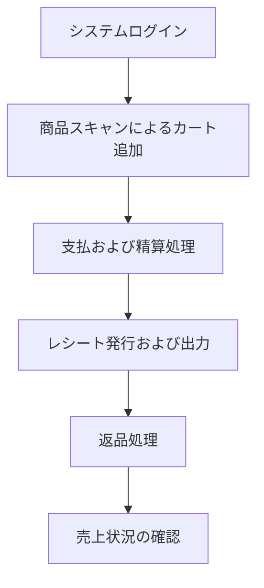

:::message
検証対象となるレガシーPOSシステムの業務機能、モノリス構造、意図的に組み込んだ技術的負債を確認します。
:::

## 検証対象システムの構築目的

前章で解説した、設計改善ツールキットである`Nexus Architect`の動作確認を行うために、あえて設計上の課題を意図的に組み込んだPOSシステムをBefore題材として用います。

実装したモノリシックなPOSシステム内部には、ビジネスロジックが集中し肥大化した巨大クラス、データベースへの不要な問い合わせを繰り返すN+1問題、例外処理の握り潰しといった典型的な技術的負債を組み込んでいます。
後ほど実際のコードとともに説明します！

これらはすべて、モダナイゼーションツールの効果とリファクタリングの妥当性を検証するための仕様に基づいた設計です。

---

## 業務フローと主要機能

レジ担当者および店舗管理者が行う主要なユースケースの全体像を以下に示します。



### 主要機能

#### 精算処理（チェックアウト）
レジ担当者が顧客から提示された商品を精算し、売上と決済を確定する処理です。

1. キャッシャーの権限を持つユーザーでログインします。
2. 商品バーコードをスキャンし、商品をカートに追加します。
   - 食品（おにぎり、飲料）
   - 日用品（シャンプー）
3. ポイント付与対象の会員IDを入力し、会員属性を紐付けます。
4. 支払方法に現金を選択し、受取金額を入力します。
5. 精算を実行し、画面上に購入明細とポイント付与結果を含むレシートが表示されることを確認します。


*決済画面イメージ*


*決済結果画面イメージ*

#### 返品処理
過去に確定した取引に対して、商品の返還と返金処理を行います。

1. マネージャーの権限を持つユーザーでログインします。
2. 注文IDを入力して過去の取引履歴を検索します。
3. 返品対象の商品と数量を指定します。
4. 返品を実行し、返品内容が反映されたレシートが表示されることを確認します。
5. 在庫管理画面において、返品された数量分だけ在庫数が自動的に復元されていることを確認します。


*返品画面イメージ*


*返品結果画面イメージ*

#### 管理者による売上・在庫確認

閉店後に店長が当日の売上状況や在庫状況を確認する機能です。

1. マネージャーの権限を持つユーザーでログインします。
2. ダッシュボード画面にて、売上サマリーや時間帯別の売上推移グラフを確認します。
3. 注文管理画面に遷移し、確定した注文履歴の一覧を確認します。
4. 在庫管理画面にて現在の在庫状況を確認します（この際、在庫数が少ない商品は強調表示されます）。
5. 在庫の受入（入庫）処理を行います。新しく入庫した数量を入力します。


*注文一覧*


*商品一覧*


#### ユーザー管理

システム管理者が新しいスタッフアカウントを作成・管理する


*ユーザー一覧*


*ユーザー追加*

---

## 技術スタックとモジュール構造

本システムは以下の技術および構成で構築されています。

| 構成要素 | 採用技術およびバージョン |
|---|---|
| 言語およびフレームワーク | Java 11 / Spring Boot 2.7.18（廃止予定の javax 名前空間を維持） |
| ビルドシステム | Maven（単一モジュールのフラット構成） |
| データベース | PostgreSQL 15（マスタ、顧客、ポイント） / MySQL 8.0（在庫、注文、決済、返品） |
| 永続化層 | JdbcTemplate による手書きSQL（ORMやLombokは不使用） |
| 認証・セキュリティ | Spring Security（古い WebSecurityConfigurerAdapter によるセッション管理） |
| ユーザーインターフェース | Thymeleaf によるサーバーサイドレンダリング、jQuery |
| トランザクション管理 | 同一DB内は @Transactional、複数DBをまたぐ処理は手書きの協調制御（Saga） |
| コンテナ環境 | Docker Compose によるアプリケーションおよび各DBのコンテナ実行 |


## ディレクトリ構造と主なコンポーネントについて

問題となっている個所を中心に、ディレクトリ構造をまとめました。

```
legacy-pos-monolith/
  ├── docker/
  ├── src/
  │   ├── main/
  │   │   ├── java/com/example/legacypos/
  │   │   │   ├── config/        # DataSource（PG / MySQL 二重設定）
  │   │   │   ├── dao/           # JdbcTemplate + 手書き SQL ※命名揺れ①
  │   │   │   ├── repository/    # 〃                  ※命名揺れ①
  │   │   │   ├── domain/        # POJO（Lombok なし・手書き getter/setter）
  │   │   │   ├── saga/          # 手書き Saga（CheckoutSaga: 500行超 God Class）
  │   │   │   ├── security/
  │   │   │   ├── service/       # OrderService: 800〜1200行 God Service
  │   │   │   ├── util/          # Utils.java + CommonUtil.java ※命名揺れ②
  │   │   │   └── web/           # Controller（画面遷移 + JSON API 混在）
  │   │   └── resources/
  │   │       ├── application.properties  # ※設定ファイル混在
  │   │       ├── application.yml         # ※設定ファイル混在
  │   │       ├── db/
  │   │       │   ├── migration-pg/       # PostgreSQL（商品・ユーザー・ポイント等）
  │   │       │   └── migration-mysql/    # MySQL（在庫・注文・支払等）
  │   │       ├── static/
  │   │       └── templates/
  │   └── test/
  └── pom.xml
```


### 実装したコンポーネント

#### ドメインおよびデータアクセス層
ドメインを表現する15個のPOJOと、データを操作する10個のDAOクラスで構成されています。

命名規則が一貫しておらず、パッケージが分散しており、データアクセスロジックが各所に散在しています。

#### サービス層
売上処理のメイン部分となっている、 `OrderService` は900行を超える巨大クラス（God Class）となっており、単一のクラスが注文処理、統計分析、バリデーション、データアクセスなどの多岐にわたる責務を抱え込んでいます。

そのため、以下のような重大なパフォーマンス上の問題（技術的負債）が意図的に組み込まれています。

##### 1. 注文明細取得における N+1 問題
注文一覧とそれぞれの明細を含む詳細情報を取得する際、全注文を取得した後にループ内で都度明細テーブルへクエリを発行しています。

これにより、注文数が $N$ 件ある場合、$1 + N$ 回のデータベース問い合わせが発生し、大量データ処理時にシステムパフォーマンスが著しく低下します。

```java
// OrderService.java より抜粋
public List<Map<String, Object>> getOrderListWithDetails() {
    List<Order> orders = findAll();
    List<Map<String, Object>> result = new ArrayList<>();

    // ！！！ 典型的な N+1 — 注文一覧ループ内で注文ごとに個別の SQL が発行される ！！！
    for (Order order : orders) {
        Map<String, Object> row = new HashMap<>();
        row.put("order", order);
        // orders.size() 回の SELECT が発行される
        List<OrderItem> items = findItemsByOrderId(order.getOrderId());
        row.put("items", items);
        row.put("itemCount", items.size());
        result.add(row);
    }

    return result;
}
```

##### 2. ループ内での連続データベース問い合わせ（N=24 のラウンドトリップ）
ダッシュボード用の時間帯別売上を集計する処理では、単一の `GROUP BY` クエリで集計するのではなく、Javaのループ処理の中で24回（0時から23時まで）連続して個別の `SELECT` クエリを発行しています。

これにより、データベースへの通信（ラウンドトリップ）が不必要に多発します。

```java
// OrderService.java より抜粋
public List<Map<String, Object>> getHourlySales(LocalDate date) {
    List<Map<String, Object>> result = new ArrayList<>();

    // ！！！ 各時間帯について個別にクエリを発行 — 24回のDBラウンドトリップ ！！！
    for (int hour = 0; hour < 24; hour++) {
        // Service 内で直接 JdbcTemplate を使用してSQLを実行
        String sql = "SELECT COUNT(*) as cnt, COALESCE(SUM(total_yen), 0) as total " +
                "FROM orders WHERE DATE(ordered_at) = ? AND HOUR(ordered_at) = ? AND status = 'COMPLETED'";

        Map<String, Object> row = mysqlJdbcTemplate.queryForMap(sql, date.toString(), hour);

        Map<String, Object> hourRow = new HashMap<>();
        hourRow.put("hour", hour);
        hourRow.put("count", row.get("cnt"));
        hourRow.put("total_yen", row.get("total"));
        hourRow.put("label", Utils.padLeft(String.valueOf(hour), 2, '0') + ":00");
        result.add(hourRow);
    }

    return result;
}
```

#### 分散トランザクション層（Saga）
PostgreSQL（マスタ、顧客、ポイント）とMySQL（在庫、注文、決済、返品）の二つの独立したデータベースを更新するため、`CheckoutSaga`（約550行）および `ReturnSaga`（約440行）という手書きのオーケストレーションクラスを用意しています。

##### 1. 手書きのオーケストレーションフロー
このシステムでは、別々のデータベースに対して手動で順番に更新をかけています。

状態管理用の永続化テーブルが存在しないため、途中でプロセスがクラッシュするとロールバックができず、データの不整合が発生するリスクを常に抱えています。

```java
// CheckoutSaga.java より抜粋
public CheckoutResult execute(CheckoutRequest request) {
    // ... 前半の処理・変数定義など ...
    boolean step1Done = false;
    boolean step2Done = false;
    boolean step3Done = false;
    boolean step4Done = false;
    boolean step5Done = false;

    try {
        // ========== Step 1: 注文ヘッダ作成 (MySQL) ==========
        orderId = Utils.generateOrderId();
        // ... (注文・明細データの保存) ...
        orderDao.save(order);
        orderDao.saveOrderItems(orderItems);
        step1Done = true;

        // ========== Step 2: 在庫引当 (MySQL) ==========
        for (CheckoutItem item : request.items) {
            Inventory inv = inventoryDao.findByProductId(item.productId);
            if (inv.getAvailableQuantity() < item.quantity) {
                throw new RuntimeException("在庫不足: " + item.productId);
            }
            inventoryDao.decreaseStock(item.productId, item.quantity);
            // ... (在庫移動履歴の保存) ...
        }
        step2Done = true;

        // ========== Step 3: 支払処理 (MySQL) ==========
        paymentDao.save(payment);
        step3Done = true;

        // ========== Step 4: ポイント加算 (PostgreSQL) ==========
        // 異なるDB（PostgreSQL）のテーブルを直接更新
        pointDao.updateBalance(memberId, pointsEarned);
        pointDao.saveTransaction(ptx);
        step4Done = true;

        // ========== Step 5: レシート発行 (PostgreSQL) ==========
        // 異なるDB（PostgreSQL）のテーブルを直接更新
        receiptDao.save(receipt);
        step5Done = true;

        // ========== Step 6: 注文確定 (MySQL) ==========
        orderDao.updateStatus(orderId, "COMPLETED");
        // ... 冪等性キーの保存など ...

        return new CheckoutResult(true, orderId, receiptId.toString(), null);

    } catch (Exception e) {
        log.error("チェックアウト失敗: " + e.getMessage(), e);
        // ... 補償処理へ ...
```

##### 2. 例外を握り潰す危険な補償トランザクション
さらに深刻な課題として、処理失敗時にそれまでの実行ステップを逆順に取り消す**補償トランザクション**において、各ステップでの例外がキャッチされたあとにログ出力するだけで握り潰され、処理自体はそのまま継続されてしまいます。

```java
// CheckoutSaga.java より抜粋
    } catch (Exception e) {
        log.error("チェックアウト失敗: " + e.getMessage(), e);

        // ========== 補償処理 (逆順) ==========
        // SMELL: すべての補償例外を握り潰す — 意図的欠陥

        if (step5Done) {
            try {
                if (receiptId != null) {
                    receiptDao.updateStatus(receiptId, "VOID");
                }
            } catch (Exception ce) {
                log.error("補償失敗 step5", ce);  // SMELL: swallow and continue
            }
        }

        if (step4Done) {
            try {
                if (memberId != null && pointsEarned > 0) {
                    pointDao.updateBalance(memberId, -pointsEarned);
                    // ... (ポイントトランザクション逆転レコードの保存) ...
                }
            } catch (Exception ce) {
                log.error("補償失敗 step4", ce);  // SMELL: swallow compensation exception
            }
        }
        // ... (以下、MySQL側の決済・在庫・注文ステータスの補償処理が続くが、同様にすべて個別 try-catch で例外が握り潰される)
```

もし補償処理の途中でデータベース接続エラーなどの問題が発生した場合、例外がログに出力されるだけで、処理は強引に次のステップへと進んでしまいます。

その結果、一部のロールバックだけが失敗したまま処理が完了し、複数の独立したデータベース間で深刻なデータの不整合が発生してしまうような設計となっています。

簡単にいうと、決済は取り消されたのに在庫が戻っていない、またはその逆の状態が発生する可能性があるということです...！

#### プレゼンテーションおよびビューテンプレート
Webコントローラーは画面遷移の制御とJSON形式のAPI提供が同一のクラスに混在した構造になっています。

ThymeleafのHTMLテンプレート内には、消費税計算やステータス表示の条件分岐といったビジネスロジックが記述されており、責務の分離ができていません。

---

## 本章のまとめ

* 検証対象のレガシーPOSシステムは、レジ販売、返品、在庫管理、売上確認、ユーザー管理などの主要業務を持つモノリスです。
* 複数DBへのデータ分散、巨大Service、N+1問題、例外を握り潰す手書きSagaなど、設計改善の題材となる技術的負債を含んでいます。
* 次章以降では、Nexus Architectを使って、これらの課題がどのように検出され、評価され、設計改善へつながるのかを確認していきます。

---

## 用語解説

### 巨大クラス（= God Class）
多すぎる責任やロジックが一つのクラスに集中し、肥大化したプログラムのことです。プログラムの全体像の把握を難しくし、一箇所の修正が広範囲に影響を与える原因となります。

### N+1問題
データベースから一覧データを取得したあと、その関連データを取得するために一覧の行数分のクエリを追加で実行してしまう非効率な処理方式です。データベースサーバーへの通信回数が急増し、システムの応答速度を大きく低下させる要因になります。

### ラウンドトリップ
アプリケーションがデータベースへリクエストを送り、結果を受け取るまでの1往復の通信です。本章の時間帯別売上集計では、24時間分の`SELECT`を個別に実行しているため、DBラウンドトリップが24回発生しています。

### Sagaパターン
マイクロサービスや複数のデータベースにまたがる分散トランザクションにおいて、各ステップの処理を順次実行し、途中でエラーが発生した場合には、それまでに完了した処理を取り消すための処理（補償トランザクション）を逆順に実行することで、システム全体の一貫性を保つ手法です。

### オーケストレーションクラス
複数の処理を順番に呼び出し、全体の進行を管理するクラスです。本章では、`CheckoutSaga`や`ReturnSaga`が、注文作成、在庫引当、支払、ポイント更新、レシート発行をまとめて進めるオーケストレーションクラスになっています。

### オーケストレーションフロー
オーケストレーションクラスが実行する一連の処理手順です。本章のチェックアウトでは、注文作成、在庫引当、支払、ポイント加算、レシート発行、注文確定という流れがオーケストレーションフローにあたります。

### 複数データベース間トランザクション
異なるデータベースに対して同時にデータの書き込みや更新を行う処理です。
一つのデータベースのように単一のトランザクションで囲むことができないため、片方のみ書き込みに成功し、もう片方が失敗するといったデータの不整合を防ぐための高度な制御が求められます。
