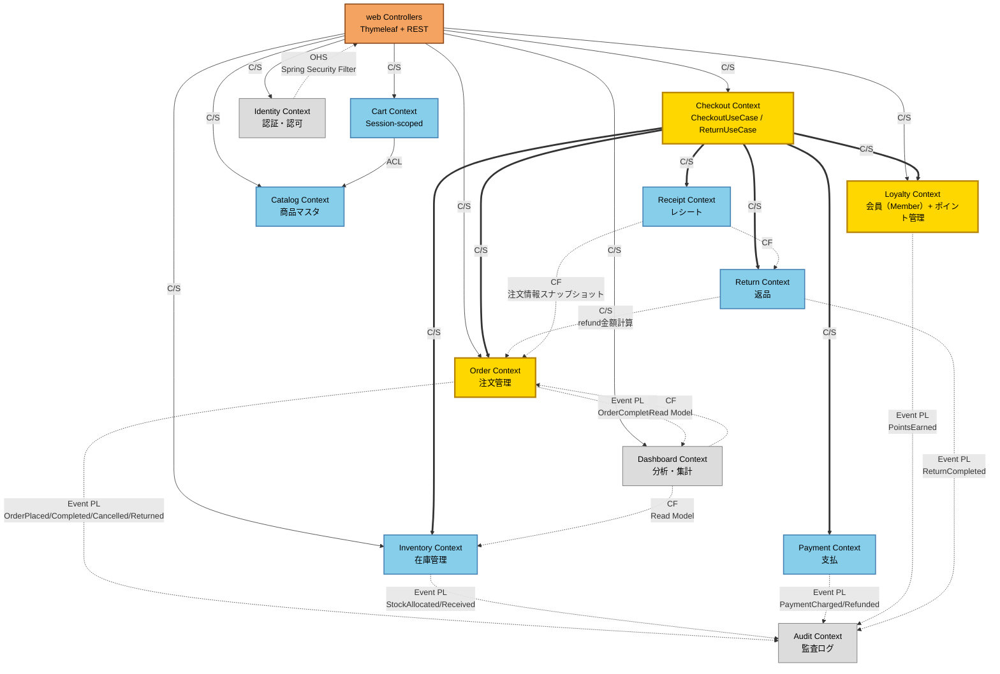
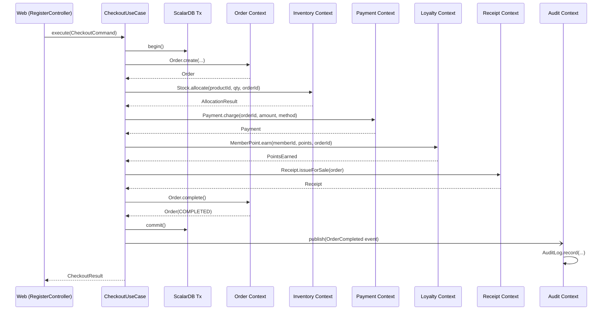
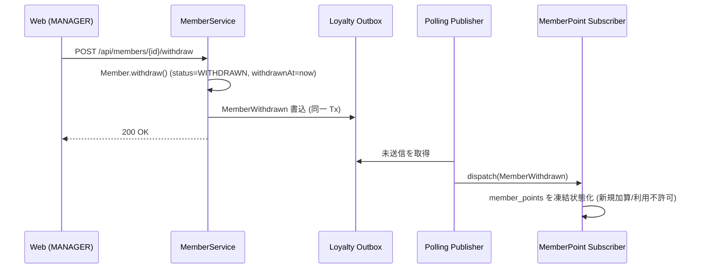
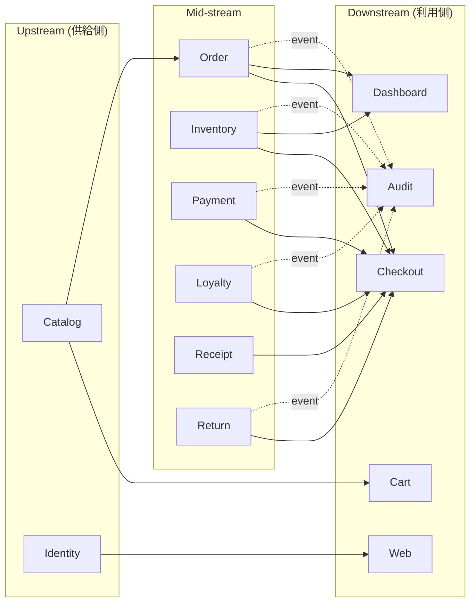
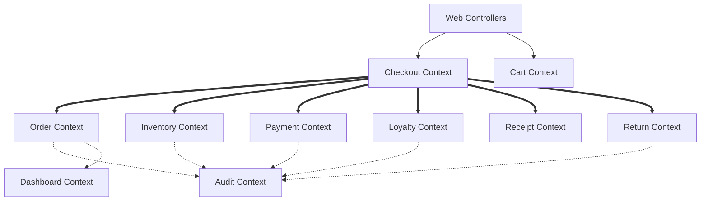
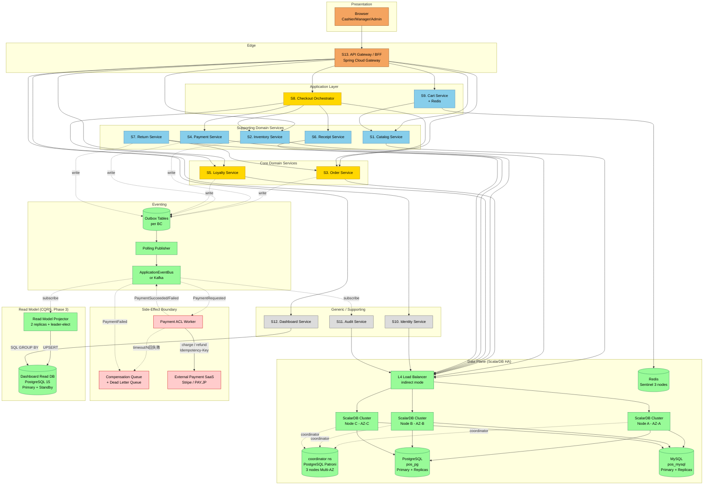
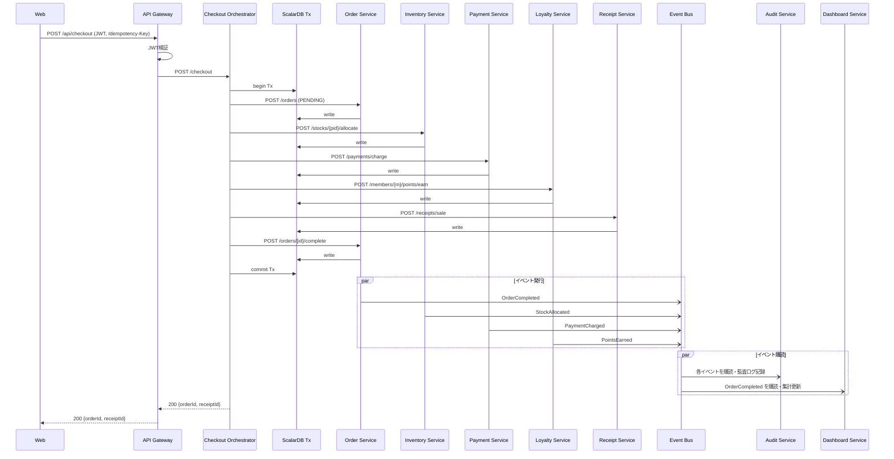
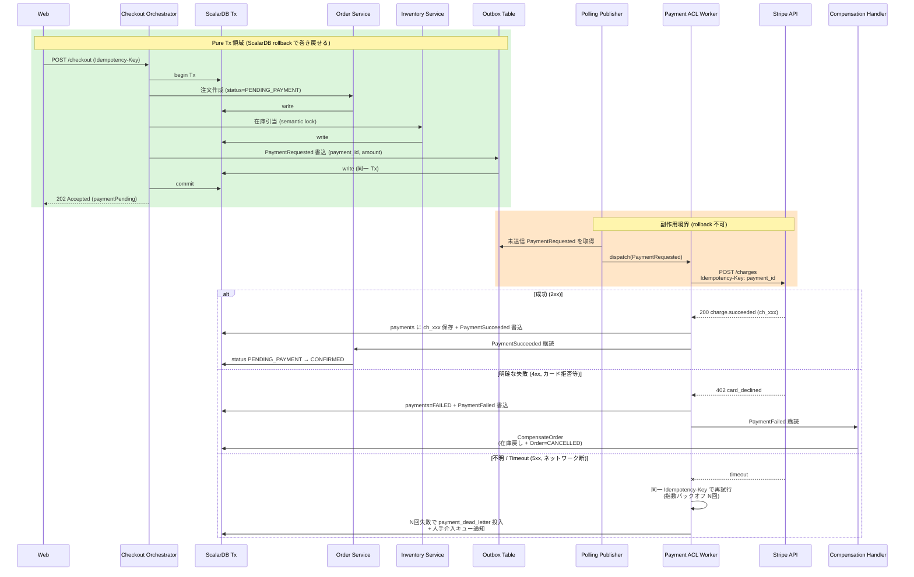
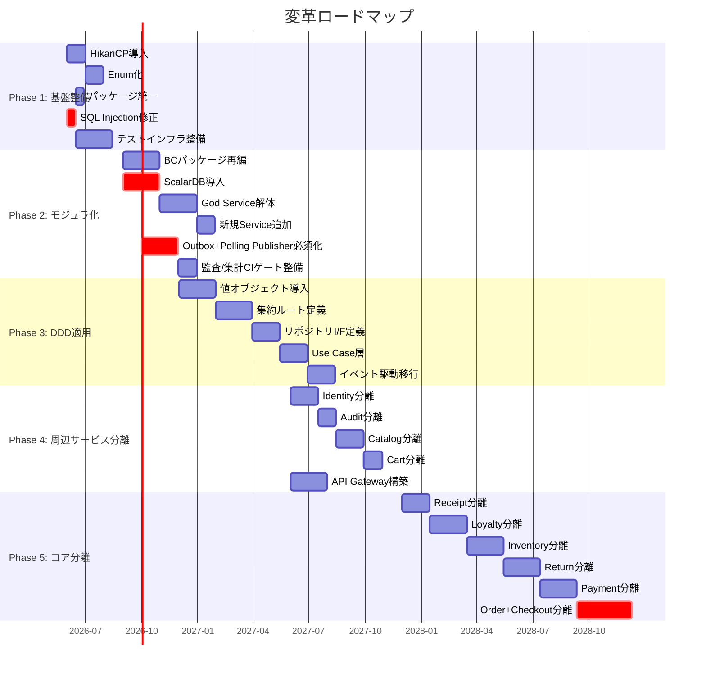

:::message
境界コンテキスト再設計、コンテキストマップ、13サービスのターゲットアーキテクチャ、段階的移行ロードマップを読み解きます。
:::

## 境界コンテキスト再設計

まず重要なのが、`bounded-contexts-redesign.md` です。


*境界コンテキストの再設計とサブドメイン分類*

::::details レポート全文
---
title: 境界コンテキスト再設計
schema_version: 1
phase: "Phase 3: Design"
skill: redesign
generated_at: 2026-05-14T00:00:00Z
input_files:
  - reports/02_evaluation/unified-improvement-plan.md
  - reports/01_analysis/ubiquitous-language.md
  - reports/01_analysis/domain-code-mapping.md
---

# 境界コンテキスト再設計 — legacy-pos-monolith

## 設計方針

1. **責務の単一化**: 現状の God Service / Saga が抱える複数 BC の責務を分離する
2. **集約境界の明確化**: 各 BC に集約ルートを定義し、トランザクション境界を集約単位に揃える
3. **サブドメイン分類**: Core / Supporting / Generic を明示し、コアドメインに投資集中する
4. **ScalarDB による分散トランザクション**: 既存の MySQL + PostgreSQL 構成を維持したまま、BC 間トランザクションは ScalarDB が保証する
5. **段階的移行**: モノリス内モジュラ構造を経由してマイクロサービスへ進化できる経路を残す

---

## サブドメイン分類

| サブドメイン | 種別 | 理由 |
|---|---|---|
| Checkout | **Core** | 競争優位の源泉（決済精度・速度・冪等性） |
| Order | **Core** | 注文ライフサイクル管理は POS の中核 |
| Pricing & Tax | **Core** | 税計算・割引・ポイント計算は業務正確性に直結 |
| Loyalty (Point) | **Core** | 顧客リテンションの中核施策 |
| Inventory | **Supporting** | 商品の販売制御に必要だが汎用的 |
| Catalog | **Supporting** | 商品マスタ。比較的安定 |
| Payment | **Supporting** | 将来的に外部決済サービスへの委譲を想定 |
| Return | **Supporting** | 注文の派生プロセス |
| Receipt | **Supporting** | 注文・返品の付随アーティファクト |
| Identity & Access | **Generic** | Spring Security 標準実装で代替可能 |
| Audit | **Generic** | 監査ログは横断的関心事 |
| Dashboard / Analytics | **Generic** | BI 製品で代替可能 |

---

## 境界コンテキスト一覧

### 1. Catalog Context（商品カタログ）

**サブドメイン**: Supporting
**責務**: 商品マスタのライフサイクル管理（登録・更新・終売・検索）

**集約**:

| 集約ルート | 含まれるエンティティ・値オブジェクト |
|---|---|
| `Product` | Product, Money（priceYen の値オブジェクト化）, TaxCategory(enum), ProductStatus(enum), Barcode(値オブジェクト) |

**主要ドメイン操作**:
- `Product.register(name, barcode, price, category, taxCategory)`
- `Product.changePrice(newPrice)`
- `Product.discontinue()`
- `ProductRepository.findByBarcode(barcode)`

**永続化**: PostgreSQL（`products` テーブル）

**公開インタフェース**:
- `CatalogService.findProductByBarcode(Barcode): Product`
- `CatalogService.findProductById(ProductId): Product`
- `CatalogService.search(keyword, sort): List<Product>`

**現状からの変更点**:
- `Product` を集約ルート化、状態遷移をドメインメソッドに集約
- `Money`, `TaxCategory`, `Barcode`, `ProductStatus` を値オブジェクト化

---

### 2. Inventory Context（在庫管理）

**サブドメイン**: Supporting
**責務**: 商品 ID 単位の在庫数量管理、在庫引当・戻し、在庫移動履歴の記録

**集約**:

| 集約ルート | 含まれるエンティティ・値オブジェクト |
|---|---|
| `Stock` | Stock(=Inventory改名), StockMovement, Quantity(値オブジェクト), StockMovementReason(enum) |

**主要ドメイン操作**:
- `Stock.receive(quantity, reason)` — 入荷
- `Stock.allocate(quantity, orderId)` — 引当（販売）
- `Stock.restock(quantity, orderId)` — 戻し（返品）
- `Stock.compensate(quantity, orderId)` — 補償処理

**不変条件**:
- `availableQuantity >= 0`（負の在庫禁止）
- 移動量がゼロでない場合は必ず `StockMovement` を生成する（履歴の一貫性）
- 引当時は `SELECT FOR UPDATE` 相当の楽観/悲観ロックで競合制御

**永続化**: MySQL（`inventory`, `stock_movements` テーブル）

**公開インタフェース**:
- `InventoryService.allocate(productId, quantity, orderId): AllocationResult`
- `InventoryService.restock(productId, quantity, orderId): void`
- `InventoryService.receive(productId, quantity, operatorId): void`
- `InventoryService.findStockoutRisk(threshold): List<StockoutRisk>` — Order からの誤配置を奪還
- `InventoryQueryService.findLowStock(threshold): List<Stock>`

**現状からの変更点**:
- `Inventory` を `Stock` に改名、集約ルート化
- `OrderService.getStockoutRisk()` を `InventoryService.findStockoutRisk()` に移管（責務の正常化）
- 在庫引当を `Stock.allocate()` のドメインメソッドに集約。Saga からの DAO 直接呼び出しを排除

---

### 3. Order Context（注文管理）

**サブドメイン**: Core
**責務**: 注文の作成・状態遷移・明細管理。冪等性キーの検証を含む

**集約**:

| 集約ルート | 含まれるエンティティ・値オブジェクト |
|---|---|
| `Order` | Order, OrderItem, OrderStatus(enum), Money, IdempotencyKey |

**主要ドメイン操作**:
- `Order.create(registerId, operatorId, memberId, items, idempotencyKey)`
- `Order.complete()` — PENDING → COMPLETED（遷移ガード付き）
- `Order.cancel()` — PENDING/COMPLETED → CANCELLED（COMPLETED の取消は権限要）
- `Order.markFailed()` — Saga 失敗時
- `Order.markReturned()` — 返品確定時（Return Context から呼ばれる）
- `Order.calculateTotal()`, `Order.calculateTax()` — 集約内に税計算を集約

**不変条件**:
- `status` の遷移は `OrderStatus` の状態機械に従う（不正遷移を IllegalStateException で拒否）
- `items` は空であってはならない
- `totalYen = sum(items.unitPrice * items.quantity)` の整合性

**永続化**: MySQL（`orders`, `order_items`, `idempotency_keys` テーブル）

**公開インタフェース**:
- `OrderCommandService.placeOrder(PlaceOrderCommand): Order` — 冪等性キーを検証
- `OrderCommandService.completeOrder(orderId)`
- `OrderCommandService.cancelOrder(orderId)`
- `OrderQueryService.findById(orderId): Order`
- `OrderQueryService.findByDateRange(from, to): List<Order>`

**現状からの変更点**:
- `OrderService`（976行）を `OrderCommandService` / `OrderQueryService` / `Dashboard*Service` / `ReturnEligibilityService` に分割
- ステータス遷移ガードを `Order.complete()` 等のドメインメソッドに移管
- 統計系メソッドを Dashboard Context へ移管

---

### 4. Cart Context（カート）

**サブドメイン**: Supporting
**責務**: 会計前のカート状態管理（セッションスコープ）

**集約**:

| 集約ルート | 含まれるエンティティ・値オブジェクト |
|---|---|
| `Cart` | Cart, CartItem, Quantity, Money |

**主要ドメイン操作**:
- `Cart.addItem(product, quantity)`
- `Cart.removeItem(productId)`
- `Cart.updateQuantity(productId, quantity)`
- `Cart.clear()`
- `Cart.totalAmount(): Money`
- `Cart.toCheckoutCommand(): PlaceOrderCommand` — 注文作成コマンドへの変換

**永続化**: HTTP セッション（メモリ）

**公開インタフェース**:
- `CartApplicationService.addToCart(productId, quantity)`
- `CartApplicationService.getCart(): CartView`

**現状からの変更点**:
- カート→注文変換ロジックを `Cart.toCheckoutCommand()` ドメインメソッドに移管（RegisterController から）
- 税計算ロジックの直書きを削除し、Pricing Context に委譲

---

### 5. Payment Context（支払）

**サブドメイン**: Supporting
**責務**: 支払処理・支払取消、および **外部決済 SaaS 連携の副作用境界管理（Saga オーケストレーション）**。
- 内製決済（CASH / CARD：自店舗内処理）は ScalarDB Tx 内で完結する Pure Tx 領域として扱う。
- 外部決済 SaaS（Stripe / PAY.JP / Square 等）連携は **副作用境界** として扱い、Outbox + Payment ACL Worker + Compensation Handler によるハイブリッド Saga で原子性のギャップを補償する。

**集約**:

| 集約ルート | 含まれるエンティティ・値オブジェクト |
|---|---|
| `Payment` | Payment, PaymentMethod(enum: CASH/CARD/STRIPE/PAYPAL), PaymentStatus(enum: PENDING/COMPLETED/FAILED/REVERSED/REFUNDED/UNKNOWN), Money, ExternalChargeId(値オブジェクト) |
| `PaymentDeadLetter` | DeadLetter, RetryCount, LastError, ManualInterventionStatus |

**主要ドメイン操作**:
- `Payment.charge(orderId, amount, method)` — 内製決済の即時 COMPLETED 化
- `Payment.requestExternal(orderId, amount, method, idempotencyKey)` — 外部 SaaS 連携の PENDING 化（Outbox にイベント書込）
- `Payment.markSucceeded(externalChargeId)` — 外部 API 成功時 PENDING → COMPLETED
- `Payment.markFailed(reason)` — 外部 API 失敗時 PENDING → FAILED
- `Payment.markUnknown(reason)` — タイムアウト等 PENDING → UNKNOWN（再試行候補）
- `Payment.reverse()` — REVERSED へ（即時取消、Authorization Hold の void 含む）
- `Payment.refund()` — REFUNDED へ（返品時、外部 API なら `RefundExternalCharge` Compensation を伴う）

**不変条件**:
- ステータス遷移: PENDING → COMPLETED / FAILED / UNKNOWN、COMPLETED → REVERSED / REFUNDED のみ許可
- `amountYen >= 0`
- 外部 API 連携時、`Idempotency-Key` と `external_charge_id` は 1:1 マッピング
- `UNKNOWN` 状態は最大 N 回（既定 5 回）まで再試行。それ以降は DLQ + 人手介入

**永続化**: MySQL（`payments`, `payment_dead_letter` テーブル）

**Outbox イベント発行**:
- `PaymentRequested`（外部呼び出し依頼）
- `PaymentSucceeded` / `PaymentFailed` / `PaymentTimeoutEscalated`
- `PaymentReversed` / `PaymentRefunded`

**Compensation コマンド一覧**:

| コマンド | トリガ | 効果 |
|---|---|---|
| `CompensateOrder` | `PaymentFailed` 受信時 | 在庫戻し + Order を `PENDING_PAYMENT` → `CANCELLED` 化 + ポイント仮加算分の取消 |
| `RefundExternalCharge` | 返品確定 + 外部 SaaS 経由の支払 | Stripe `POST /refunds` を `Idempotency-Key` 付きで発火 |
| `ReverseExternalCharge` | チャージ後の即時取消（クーリングオフ等） | Stripe `POST /refunds` または Authorization Hold の void |
| `EscalateToHumanQueue` | N 回再試行で UNKNOWN 解消できず | DLQ 投入 + Slack/PagerDuty 通知 |

**公開インタフェース**:
- `PaymentService.charge(orderId, amount, method): Payment`（内製）
- `PaymentService.requestExternalCharge(orderId, amount, method, idempotencyKey): Payment`（外部）
- `PaymentService.refund(paymentId): void`
- `PaymentService.reverse(paymentId): void`
- `PaymentService.findByOrderId(orderId): Payment`

**Saga オーケストレーション責務**:
- Payment ACL Worker（常駐ワーカ）が Outbox `PaymentRequested` を購読し、外部 SaaS API を `Idempotency-Key` 付きで呼び出す
- 結果を `PaymentSucceeded` / `PaymentFailed` / `PaymentTimeoutEscalated` として Outbox に書き戻す
- Compensation Handler が `PaymentFailed` を受けて `CompensateOrder` を Order / Inventory / Loyalty Context に発行
- 詳細は `reports/03_design/saga-design.md` を参照

**現状からの変更点**:
- **新規 Service 層を新設**（CheckoutSaga / ReturnSaga からロジックを分離）
- **副作用境界の明示化**: 外部 SaaS 連携時は ScalarDB Tx 内で外部 API を呼ばない（Outbox + Worker 構成を強制）
- 外部決済サービス連携の Anti-Corruption Layer として位置づけ、ハイブリッド Saga 設計を導入（SYN-003 対策）

---

### 6. Loyalty Context（ポイント・会員）

**サブドメイン**: Core
**責務**: 会員（Member）マスタ管理（属性・本人確認）、会員ポイント残高・取引履歴・ポイントルール管理、ポイント計算

> **SYN-017 対応**: 旧設計では会員（Member）の本人性・属性を司る集約が存在せず（actors-roles-permissions.md 記載のとおり Cashier が任意 memberId を入力するなりすまし可能性）だった。本セクションで **Member 集約** を Loyalty Context 内に新設し、MemberPoint と疎結合に共存させる。

**集約**:

| 集約ルート | 含まれるエンティティ・値オブジェクト |
|---|---|
| `Member` | Member, MemberId(UUID), MemberCode(値オブジェクト), MemberStatus(enum), VerificationLevel(enum), EmailAddress(値オブジェクト・PII), PhoneNumber(値オブジェクト・PII), PersonName(PII) |
| `MemberPoint` | MemberPoint(=PointBalance改名), Points(値オブジェクト) |
| `PointTransactionHistory` | PointTransaction, PointTransactionType(enum), ExpirationDate |
| `PointRule` | PointRule, Multiplier(値オブジェクト), DateRange |

#### Member 集約（新設、SYN-017 対応）

**集約ルート**: `Member`

**属性**:

| 属性 | 型 | PII | 必須 | 用途・備考 |
|---|---|---|---|---|
| memberId | UUID (TEXT) | — | ◯ | 内部識別子（不変、UUID v4） |
| memberCode | TEXT | — | ◯ | 人間可読 ID（例: `member-001`）。レジ入力で使用、unique |
| name | TEXT | **PII** | ◯ | 会員氏名 |
| email | TEXT | **PII** | △ | 任意。Phase 3 以降の本人確認・通知に使用、unique |
| phone | TEXT | **PII** | △ | 任意。本人確認に使用 |
| birthDate | TEXT (ISO-8601) | PII | △ | 任意。年齢制限商品の検証に使用 |
| preferredStoreId | TEXT | — | △ | お気に入り店舗 |
| registeredAt | BIGINT (epoch millis) | — | ◯ | 登録日時 |
| status | TEXT | — | ◯ | `ACTIVE` / `SUSPENDED` / `WITHDRAWN` |
| verificationLevel | TEXT | — | ◯ | `UNVERIFIED` / `EMAIL_VERIFIED` / `ID_VERIFIED` |
| withdrawnAt | BIGINT | — | △ | nullable。退会時刻 |

**不変条件**:
- `status = WITHDRAWN` の Member には新規 MemberPoint 加算不可（`MemberPoint.earn()` は `IllegalStateException`）
- `status = SUSPENDED` の Member は会計時に警告（CASHIER 確認必須、UI 上で確認モーダル）
- `email` / `phone` はシステム全体で一意（unique constraint。永続化層で重複検知し `DuplicateMemberAttributeException`）
- `verificationLevel` は単調増加（`UNVERIFIED → EMAIL_VERIFIED → ID_VERIFIED` のみ。降格不可）
- `withdrawnAt` は `status = WITHDRAWN` の場合に限り非 null

**ドメイン操作**:
- `Member.register(memberCode, name, email?, phone?, birthDate?, preferredStoreId?): Member` — 新規登録（status=ACTIVE, verificationLevel=UNVERIFIED）
- `Member.suspend(reason, by)` — ACTIVE → SUSPENDED（MANAGER 以上の操作）
- `Member.reactivate(by)` — SUSPENDED → ACTIVE
- `Member.withdraw(by)` — ACTIVE/SUSPENDED → WITHDRAWN（withdrawnAt を設定。MemberPoint も自動凍結）
- `Member.updateProfile(name?, email?, phone?, birthDate?, preferredStoreId?)` — 属性更新（PII 検証含む）
- `Member.verifyEmail(otp)` — UNVERIFIED → EMAIL_VERIFIED（OTP 検証成功時）
- `Member.promoteVerificationLevel(level, by)` — 本人確認レベル昇格（ID_VERIFIED は MANAGER 以上）

**Member 集約と MemberPoint 集約の関係**:
- **別集約として疎結合**を維持（同一 Tx で両方を更新しない。集約境界を尊重）
- `memberId` による参照整合性をアプリケーション層で保証（外部キー制約は使わず、Member 登録時に MemberPoint レコードを別 Tx で作成）
- **結果整合性**: `Member.withdraw()` が `MemberWithdrawn` ドメインイベントを発行 → MemberPoint Subscriber が受信して残高を凍結（残高は保持し、新規加算・利用を不許可化）。Outbox 経由で配信

**本人確認の段階的設計**:

| Phase | 本人性保証 | 仕組み | なりすまし耐性 |
|---|---|---|---|
| Phase 1-2 | memberCode 入力のみ（旧仕様維持） | Cashier が会員カード裏の memberCode を入力 | 低（旧仕様互換性重視、SYN-017 段階的解消） |
| Phase 3 | email 認証によるレジ会員登録 | POS 端末で email 入力 → メール OTP → verifyEmail | 中（email_verified フラグで段階表示） |
| Phase 4-5 | 外部会員管理 SaaS 連携 | ACL 経由で外部 IDP（Auth0 / Cognito 等）と連携 | 高（外部 IdP の MFA を活用） |

**責務範囲**:
- Member 集約: 会員自身の生成・属性更新・本人確認状態管理（PII を保持）
- MemberPoint 集約: ポイント残高・取引履歴（残高更新ロジックを集約）
- 両者は memberId で結合するが Tx 境界を分離する

#### MemberPoint / PointTransactionHistory / PointRule 集約

**主要ドメイン操作**:
- `MemberPoint.earn(points, orderId)` — ポイント加算（Member.status が ACTIVE のみ許可）
- `MemberPoint.reverse(points, orderId)` — 加算取消（Saga 補償）
- `MemberPoint.redeem(points)` — 利用（将来拡張）
- `MemberPoint.freeze()` — 凍結（`MemberWithdrawn` イベント受信時の状態遷移）
- `PointCalculator.calculate(orderTotal, memberId, rules): Points` — ドメインサービス
- `PointRule.applies(category, date): boolean`

**不変条件**:
- 残高は非負（`totalPoints >= 0`）
- すべての残高変動は対応する `PointTransaction` を生成する
- 加算取消は元の取引と紐づく
- WITHDRAWN な Member への加算は不可（Member 集約のステータスを参照し、`MemberAccountClosedException`）

**永続化**: PostgreSQL（`members`, `point_balances`, `point_transactions`, `point_rules` テーブル）

**公開インタフェース**:
- `MemberService.register(MemberRegistrationCommand): Member` — 会員登録（CASHIER 含む全ロール可）
- `MemberService.findById(memberId): Member`
- `MemberService.findByMemberCode(memberCode): Member`
- `MemberService.updateProfile(memberId, ProfileUpdateCommand): Member`
- `MemberService.suspend(memberId, reason)` / `MemberService.reactivate(memberId)` — MANAGER 以上
- `MemberService.withdraw(memberId)` — MANAGER 以上
- `MemberService.requestEmailVerification(memberId): VerificationToken` — OTP 発行
- `MemberService.verifyEmail(memberId, otp): Member`
- `LoyaltyService.earnPoints(memberId, orderId, orderTotal): Points`
- `LoyaltyService.reversePoints(memberId, orderId): void`
- `LoyaltyService.getBalance(memberId): MemberPoint`

**ドメインイベント**:
- `MemberRegistered` / `MemberProfileUpdated` / `MemberSuspended` / `MemberReactivated` / `MemberWithdrawn` / `MemberEmailVerified`
- `PointsEarned` / `PointsReversed`

**現状からの変更点**:
- **会員（Member）マスタ集約を新設**（SYN-017 解消）。なりすまし可能性を verificationLevel と email_verified で段階的に低減
- `PointService` をリッチドメインモデルに改修
- ポイント計算の 3 重重複（Utils / PointService / CheckoutSaga）を `PointCalculator` ドメインサービスに集約
- ポイント有効期限の設定漏れ（TD-011）を修正
- PII（name / email / phone / birthDate）はアプリケーション層で AES-256（KMS 管理鍵）で暗号化保管

---

### 7. Receipt Context（レシート）

**サブドメイン**: Supporting
**責務**: 売上・返品レシートの発行・閲覧・無効化

**集約**:

| 集約ルート | 含まれるエンティティ・値オブジェクト |
|---|---|
| `Receipt` | Receipt, ReceiptKind(enum), ReceiptStatus(enum), ReceiptBody（構造化JSON） |

**主要ドメイン操作**:
- `Receipt.issueForSale(order)` — SALE レシート発行
- `Receipt.issueForReturn(returnRecord)` — RETURN レシート発行
- `Receipt.void()` — 無効化（Saga 補償）

**永続化**: PostgreSQL（`receipts` テーブル）

**公開インタフェース**:
- `ReceiptService.issueSaleReceipt(order): Receipt`
- `ReceiptService.issueReturnReceipt(returnRecord): Receipt`
- `ReceiptService.findByOrderId(orderId, kind): Receipt`

**現状からの変更点**:
- **発行ロジックを Saga から ReceiptService へ移管**
- `bodyJson` を構造化された `ReceiptBody` 値オブジェクトに変更（手書き JSON シリアライザの廃止）

---

### 8. Return Context（返品）

**サブドメイン**: Supporting
**責務**: 返品の作成・返品可否判定・返品ライフサイクル管理

**集約**:

| 集約ルート | 含まれるエンティティ・値オブジェクト |
|---|---|
| `Return` | Return, ReturnItem, ReturnStatus(enum), Money |

**主要ドメイン操作**:
- `Return.create(orderId, items, requestedBy)` — 返品作成（PENDING）
- `Return.complete()` — PENDING → COMPLETED
- `Return.cancel()` — PENDING → CANCELLED
- `Return.calculateRefund(originalOrder): Money` — 元注文から返金額を計算（TD-012 の修正）

**不変条件**:
- 返品作成時、対象注文が COMPLETED ステータスであること（Order Context との整合性）
- 同一注文に対する COMPLETED な Return は 1 件のみ
- 返金額は元注文の対応明細から計算（refundYen=0 のバグ TD-012 を修正）

**永続化**: MySQL（`returns`, `return_items` テーブル）

**公開インタフェース**:
- `ReturnService.isReturnable(orderId): boolean` — 返品可否判定（3重重複を1箇所に統合）
- `ReturnService.createReturn(orderId, items, requestedBy): Return`
- `ReturnService.completeReturn(returnId)`
- `ReturnQueryService.findByOrderId(orderId): List<Return>`

**現状からの変更点**:
- **新規 Service 層を新設**（ReturnSaga からロジック分離）
- 返品可否ロジックの 3 重重複（OrderService.canReturn / ReturnSaga.isOrderReturnable / ReturnSaga.execute Step 0）を統合
- refundYen 計算ロジックの実装（TD-012 修正）

---

### 9. Identity & Access Context（認証・認可）

**サブドメイン**: Generic
**責務**: ユーザー認証、ロールベース認可、自パスワード変更

**集約**:

| 集約ルート | 含まれるエンティティ・値オブジェクト |
|---|---|
| `User` | User, Role(enum), Username, PasswordHash |

**主要ドメイン操作**:
- `User.authenticate(plainPassword): boolean`
- `User.changePassword(oldPassword, newPassword)`
- `User.changeRole(newRole)` — ADMIN のみ実行可

**永続化**: PostgreSQL（`users` テーブル）

**公開インタフェース**:
- Spring Security 経由（`PosUserDetailsService`）
- `UserAdminService.createUser(...)`, `UserAdminService.updateRole(userId, role)`

**現状からの変更点**:
- `Role` を String → enum に変更
- 比較的成熟しているため大規模改修は不要

---

### 10. Audit Context（監査）

**サブドメイン**: Generic
**責務**: 重要オペレーションの監査ログ記録

**集約**:

| 集約ルート | 含まれるエンティティ・値オブジェクト |
|---|---|
| `AuditLog` | AuditLog, AuditAction(enum), AuditTarget |

**主要ドメイン操作**:
- `AuditLog.record(userId, action, target, payload)`

**永続化**: PostgreSQL（`audit_logs` テーブル）

**公開インタフェース**:
- `AuditService.record(action, target, payload)`
- **イベント駆動受信**: ドメインイベント (`OrderCompleted`, `ReturnCompleted` など) を購読して自動記録

**現状からの変更点**:
- ドメインイベント購読型に転換し、呼び出し漏れ問題（TD-029）を構造的に解消
- `AuditAction` を enum 化

---

### 11. Dashboard Context（ダッシュボード・分析）

**サブドメイン**: Generic
**責務**: 売上集計・ランキング・時間帯別売上・在庫切れリスク表示

**集約**: なし（Read Model のみ。CQRS の Query 側）

**主要ドメイン操作**:
- `DashboardService.todaySalesTotal(): Money`
- `DashboardService.bestSellerRanking(days, limit): List<RankingEntry>`
- `DashboardService.hourlySales(date): List<HourlySalesEntry>`

**永続化**: 既存 DB（読み取り専用）。将来は Read Model（マテリアライズドビュー）への分離を検討

**公開インタフェース**:
- 上記 DashboardService メソッド群

**現状からの変更点**:
- `OrderService` から統計メソッドを移管（dashboard ロジックの誤配置を解消）
- `getHourlySales` の 24 回 SQL 発行を 1 本の `GROUP BY HOUR(...)` SQL に書き換え（TD-008 修正）
- ベストセラー集計を SQL の GROUP BY/ORDER BY/LIMIT で完結（TD-025 修正）

---

### 12. Checkout Context（会計）

**サブドメイン**: Core
**責務**: チェックアウトフロー全体の調整（Application Service として複数 BC を協調）

> ※ Checkout Context はApplication Service / Use Caseレイヤを抽象化する位置づけであり、独立した永続化を持たない。
> ScalarDB の分散トランザクション内で、Order / Inventory / Payment / Loyalty / Receipt の各 Context を順序立てて呼び出す。

**主要ユースケース**:
- `CheckoutUseCase.execute(CheckoutCommand): CheckoutResult`
  1. Order Context → 注文ヘッダ作成
  2. Inventory Context → 在庫引当
  3. Payment Context → 支払処理
  4. Loyalty Context → ポイント加算
  5. Receipt Context → レシート発行
  6. Order Context → 注文確定

- `ReturnUseCase.execute(ReturnCommand): ReturnResult`（返品の Use Case 版）

**現状からの変更点**:
- **手書き Saga（CheckoutSaga / ReturnSaga）を ScalarDB トランザクション内の Use Case に置き換え**
- 補償ロジックは ScalarDB のロールバックに委ねる（=不要化）
- 内部クラス（CheckoutRequest 等）はトップレベルの Command/Query クラスに格上げ

---

## 集約一覧サマリ

| BC | 集約ルート | 物理 DB |
|---|---|---|
| Catalog | Product | PostgreSQL |
| Inventory | Stock | MySQL |
| Order | Order | MySQL |
| Cart | Cart | (HTTP Session) |
| Payment | Payment | MySQL |
| Loyalty | Member, MemberPoint, PointTransactionHistory, PointRule | PostgreSQL |
| Receipt | Receipt | PostgreSQL |
| Return | Return | MySQL |
| Identity | User | PostgreSQL |
| Audit | AuditLog | PostgreSQL |
| Dashboard | (Read Model) | PostgreSQL + MySQL |
| Checkout | (Use Case Layer) | — |

---

## 物理 DB 配置

ScalarDB の導入により、物理 DB の境界は **論理的な BC 境界とは独立**して維持できる。
ScalarDB が分散トランザクションを保証するため、Order Context（MySQL）と Loyalty Context（PostgreSQL）の同期更新が原子的に行われる。

```
PostgreSQL (pos_pg):  Catalog, Loyalty, Receipt, Identity, Audit
MySQL (pos_mysql):    Inventory, Order, Payment, Return
                      ※ Checkout Use Case は ScalarDB Tx で両 DB を協調
```

---

## ドメインイベント設計

ScalarDB トランザクションの完了後、以下のドメインイベントを発行する（ApplicationEventPublisher 経由）:

| イベント | 発行タイミング | 主な購読者 |
|---|---|---|
| `OrderPlaced` | 注文作成時 | Audit |
| `OrderCompleted` | チェックアウト完了 | Audit, Dashboard（リアルタイム集計） |
| `OrderCancelled` | キャンセル時 | Audit |
| `OrderReturned` | 返品確定時 | Audit |
| `StockAllocated` | 在庫引当時 | Audit |
| `StockReceived` | 入荷時 | Audit |
| `PaymentCharged` | 支払完了 | Audit |
| `PaymentRefunded` | 返金完了 | Audit |
| `PointsEarned` | ポイント加算 | Audit, （将来）Notification Context |
| `ReturnCompleted` | 返品確定 | Audit |
| `MemberRegistered` | 会員登録 | Audit, MemberPoint Subscriber（残高レコード初期化） |
| `MemberProfileUpdated` | 会員属性更新 | Audit |
| `MemberSuspended` / `MemberReactivated` | 会員停止／再開 | Audit |
| `MemberWithdrawn` | 会員退会 | Audit, MemberPoint Subscriber（残高凍結） |
| `MemberEmailVerified` | email 本人確認完了 | Audit |

これにより監査ログの呼び出し漏れ（TD-029）が構造的に解消される。
::::


このレポートでは、既存の業務領域を以下のような境界コンテキストに再分割しています。

| コンテキスト | 種別 | 主な責務 |
| :--- | :--- | :--- |
| Checkout | Core | 会計処理全体のオーケストレーション |
| Order | Core | 注文ライフサイクル、注文明細、冪等性 |
| Loyalty | Core | 会員、ポイント、ポイント取引 |
| Inventory | Supporting | 在庫数量、在庫引当、在庫移動履歴 |
| Catalog | Supporting | 商品マスタ、バーコード検索、価格・税区分 |
| Payment | Supporting | 支払、返金、外部決済SaaS連携 |
| Return | Supporting | 返品プロセス |
| Receipt | Supporting | レシート発行、レシートスナップショット |
| Cart | Supporting | 会計前のカート状態 |
| Identity & Access | Generic | 認証・認可 |
| Audit | Generic | 監査ログ |
| Dashboard | Generic | 集計・分析 |

この分割で特に重要なのは、**Checkout/Order/LoyaltyをCore Subdomainとして扱っている点**です。

POSシステムにおいて、単に商品を登録することや在庫を表示することよりも、会計処理を正しく・速く・二重実行なく完了させることが事業上の中核になります。つまり、最も注意深く設計すべき場所は、画面やDAOではなく、Checkoutを中心とした注文・在庫・支払・ポイント・レシートの協調部分です。


この方針は、現状把握レポートで見たOrderServiceにすべてが集まっているという問題への直接的な回答になっています。

たとえば、既存の `OrderService` は注文管理だけでなく、ダッシュボード集計、返品可否判定、カート計算のような責務まで抱えていました。設計レポートでは、それらを `OrderCommandService`、`OrderQueryService`、`DashboardService`、`ReturnEligibilityService` へ分割する方針が示されています。

これは単なるクラス分割ではなく、**注文とは何か在庫とは何か会計とは何かを再定義する作業**です。


### コンテキストマップ

次に、`context-map.md` です。


*境界コンテキスト間の関係性と同期・非同期の協調*

::::details レポート全文
---
title: コンテキストマップ
schema_version: 1
phase: "Phase 3: Design"
skill: redesign
generated_at: 2026-05-14T00:00:00Z
input_files:
  - reports/03_design/bounded-contexts-redesign.md
---

# コンテキストマップ — legacy-pos-monolith

## 関係パターンの凡例

DDD のコンテキストマップで使用する標準的な関係パターン:

| パターン | 略号 | 意味 |
|---|---|---|
| Customer/Supplier | C/S | 上流→下流の供給関係。下流の要求を上流が考慮 |
| Conformist | CF | 下流が上流のモデルにそのまま従う |
| Anti-Corruption Layer | ACL | 下流が上流の汚染を防ぐ変換層を持つ |
| Open Host Service | OHS | 公開 API を持つ上流サービス |
| Published Language | PL | 公開された共通言語（DTO/イベントスキーマ） |
| Shared Kernel | SK | 複数 BC が共有する小さなドメインモデル |
| Partnership | P | 双方向の協力関係 |

---

## 全体コンテキストマップ



**凡例**:
- 🟡 Core Subdomain（黄）: Checkout, Order, Loyalty
- 🔵 Supporting Subdomain（青）: Cart, Catalog, Inventory, Payment, Return, Receipt
- ⚪ Generic Subdomain（灰）: Identity, Audit, Dashboard
- 🟠 Presentation（橙）: Web

**矢印の意味**:
- `==>` 太い実線: チェックアウトフロー内の同期協調（ScalarDB Tx 内）
- `-->` 通常の実線: 同期 API 呼び出し
- `-.->` 点線: イベント駆動の非同期通知 / Read Model

---

## 主要な統合パターン詳細

### 1. Checkout Use Case → 各 BC（Customer/Supplier）

**関係**: Customer/Supplier
**方向**: Checkout (下流) → Order, Inventory, Payment, Loyalty, Receipt (上流)

**実装**: ScalarDB の分散トランザクション内で各 BC のドメインサービスを順次呼び出す。



**ポイント**:
- 補償処理は ScalarDB の `rollback()` に一任 → 手書き補償ロジック不要
- 監査ログはイベント駆動で非同期記録 → 呼び出し漏れ防止

---

### 2. Audit ← 各 Core/Supporting BC（Published Language イベント）

**関係**: Published Language（イベント PL）
**方向**: Order/Inventory/Payment/Loyalty/Return → Audit（イベント発行・購読）

**実装**: Spring の `ApplicationEventPublisher` を使った同一プロセス内イベント。
将来のマイクロサービス化時は Kafka 等に置き換える。

**イベントスキーマ例**:
```java
public record OrderCompletedEvent(
    String orderId,
    String operatorId,
    String memberId,
    Money totalYen,
    Instant occurredAt
) {}
```

---

### 3. Cart → Catalog（Anti-Corruption Layer）

**関係**: ACL
**方向**: Cart (下流) → Catalog (上流)

**理由**: Cart は商品情報のスナップショットが必要だが、Catalog の集約モデルそのものに依存したくない。
`CartItem` には Catalog の `Product` から必要なフィールドだけをコピーして保持する。

**ACL 実装イメージ**:
```java
public class CatalogToCartTranslator {
    public CartItem translate(Product product, int quantity) {
        return new CartItem(
            product.getProductId(),
            product.getName(),         // スナップショット
            product.getPriceYen(),     // スナップショット（後で値段が変わっても影響しない）
            quantity,
            product.getTaxCategory()
        );
    }
}
```

---

### 4. Receipt ← Order / Return（Conformist）

**関係**: Conformist
**方向**: Receipt (下流) → Order, Return (上流)

**理由**: レシートは注文・返品のスナップショットを単純にコピーして保持する。
Receipt 側は Order/Return のモデルにそのまま従う。

---

### 5. Identity → Web（Open Host Service）

**関係**: OHS
**方向**: Identity (上流) → Web/全 Controller (下流)

**実装**: Spring Security のフィルターチェーンが OHS として機能。
Web 層は `Authentication` オブジェクト経由で認証情報にアクセスする。

---

### 6. Dashboard ← Order / Inventory（Conformist + Read Model）

**関係**: Conformist + Read Model
**方向**: Dashboard (下流) → Order, Inventory (上流)

**実装**:
- 短期: 既存テーブルを直接 SELECT（`GROUP BY` で集計）
- 中期: マテリアライズドビュー / Read Model テーブルへの分離
- 長期: イベント駆動で Read Model を維持（CQRS）

---

### 7. Return → Order（Customer/Supplier）

**関係**: Customer/Supplier
**方向**: Return (下流) → Order (上流)

**理由**: 返品時に元注文の明細・ステータスを参照する必要がある。
Return Context は `OrderQueryService.findById()` を呼び出し、返金額計算に使用する。

---

### 8. Member ⇄ MemberPoint（同一 Loyalty Context 内・結果整合性、SYN-017）

**関係**: 同一 BC 内の **疎結合な集約間連携**（イベント駆動 / 結果整合性）
**方向**: Member（上流：本人性・ステータスの源泉） → MemberPoint（下流：残高管理）

**設計ポイント**:
- 同一 Loyalty Context 内の **別集約**として独立した Tx 境界を持つ（集約間 Tx を跨がない原則を遵守）
- `memberId` による参照整合性は **アプリケーション層**で保証（ScalarDB は外部キーを提供しない）
- `Member.withdraw()` 実行時に `MemberWithdrawn` ドメインイベントを Outbox 経由で発行 → MemberPoint Subscriber が受信して残高凍結（既存残高は保持し、新規加算・利用を不許可化）
- 一貫性モデル: 結果整合性（P95 < 5 秒）。退会直後の数秒間に `earnPoints` が走った場合は MemberPoint 側で Member.status を再確認して `MemberAccountClosedException` を返す



**用語統一**: 本ドキュメントを含む全設計成果物でMember（会員）MemberPoint（会員ポイント）を一貫して使用する。旧称 `member_id`（カラム名）は維持するが、ドメインモデル上は `Member` 集約と `MemberPoint` 集約を明確に区別する。

---

## 上流・下流関係の整理



---

## 統合パターン適用一覧

| 関係 | 上流 | 下流 | パターン |
|---|---|---|---|
| Web → CheckoutUseCase | Checkout | Web | C/S |
| Cart → Catalog | Catalog | Cart | ACL |
| CheckoutUseCase → Order | Order | Checkout | C/S |
| CheckoutUseCase → Inventory | Inventory | Checkout | C/S |
| CheckoutUseCase → Payment | Payment | Checkout | C/S |
| CheckoutUseCase → Loyalty | Loyalty | Checkout | C/S |
| CheckoutUseCase → Receipt | Receipt | Checkout | C/S |
| Return → Order | Order | Return | C/S |
| Receipt → Order | Order | Receipt | CF |
| Dashboard → Order/Inventory | Order, Inventory | Dashboard | CF + Read Model |
| Audit ← 各 BC | 各 Core/Supporting | Audit | PL（イベント） |
| Web → Identity | Identity | Web | OHS |
| Member → MemberPoint（Loyalty 内） | Member | MemberPoint | PL（`MemberWithdrawn` イベント、結果整合性） |

---

## 段階的移行への含意

このコンテキストマップは、**モノリス内モジュラ構造を経由してマイクロサービスへ進化する**前提で設計されている。

### モノリス内モジュラ段階（短期〜中期）
- 各 BC を `com.example.legacypos.<context>` パッケージとして物理分離
- BC 間の通信は同一プロセス内のメソッド呼び出し（Application Event 含む）
- ScalarDB は 1 つ、各 BC は同じ ScalarDB Tx に参加

### マイクロサービス段階（長期）
分離順序の推奨:

| ステップ | 切り出すサービス | 理由 |
|---|---|---|
| 1 | Identity, Audit | Generic Subdomain・MMI 72%、独立性高 |
| 2 | Catalog | Read-heavy、他 BC からの書き込みなし |
| 3 | Loyalty | PG 完結、集約が独立 |
| 4 | Receipt | PG 完結、上流参照のみ |
| 5 | Inventory | MySQL 完結、Use Case 経由で同期化 |
| 6 | Order, Payment, Return | 強連携。Saga ベースの分散トランザクションへ |

各ステップでサービス間通信は OHS（REST/gRPC）+ Published Language（イベント）に置き換わる。
::::


境界コンテキストを分けるだけでは、まだ設計としては不十分です。実際の業務フローでは、CheckoutがOrder、Inventory、Payment、Loyalty、Receiptを協調させる必要がありますし、AuditやDashboardにはイベントを流す必要があります。

コンテキストマップでは、この関係が以下のように整理されています。



太い実線はチェックアウトフロー内の同期協調、点線はイベント駆動の非同期通知を表します。

ここで読み取るべきなのは、**同期と非同期の使い分け**です。

会計処理では、注文作成、在庫引当、支払、ポイント、レシート発行の整合性が重要なので、ScalarDBのトランザクション境界に乗せます。一方で、監査ログやダッシュボード集計は会計処理の成功に付随するものですが、ユーザーへの応答をブロックしてまで同期実行するべきものではありません。

そのため、AuditとDashboardはOutbox経由の非同期イベントで更新する設計になっています。

この設計判断は、あとでレビューによりさらに強化されます。


### ターゲットアーキテクチャ

`target-architecture.md` では、最終的な構成として13個のサービスが定義されています。


*13サービス構成のターゲットアーキテクチャ*

::::details レポート全文
---
title: ターゲットアーキテクチャ
schema_version: 1
phase: "Phase 3: Design"
skill: design-microservices
generated_at: 2026-05-14T00:00:00Z
input_files:
  - reports/03_design/bounded-contexts-redesign.md
  - reports/03_design/context-map.md
---

# ターゲットアーキテクチャ — legacy-pos-monolith

## アーキテクチャ概観

12 個の Bounded Context を、**まずはモノリス内モジュラ構造**で実装し、**段階的にマイクロサービス化**できる構造をターゲットとする。

ScalarDB を分散トランザクション基盤として導入し、MySQL + PostgreSQL の両 DB を引き続き活用しながら、原子性・一貫性を保証する。

---

## 設計原則

| 原則 | 内容 |
|---|---|
| Cloud-Ready | 各サービスはステートレスに設計し、水平スケール可能とする |
| Event-Driven | BC 間の弱い結合はドメインイベントで実現（Audit / Dashboard） |
| Hexagonal | リポジトリインターフェース（ポート）+ JDBC アダプタの構造を全 BC に適用 |
| API First | 各サービスは OpenAPI 3.x で公開仕様を文書化 |
| Observability | OpenTelemetry によるトレース・メトリクス基盤を全サービス共通化 |
| ScalarDB Transactional | 業務データ更新は ScalarDB トランザクション境界に揃える |

---

## サービスカタログ

| # | サービス名 | 種別 | サブドメイン | 言語/FW | 主要永続化 |
|---|---|---|---|---|---|
| S1 | Catalog Service | Master | Supporting | Java/Spring Boot 3.x | ScalarDB(PG) |
| S2 | Inventory Service | Process | Supporting | Java/Spring Boot 3.x | ScalarDB(MySQL) |
| S3 | Order Service | Process | Core | Java/Spring Boot 3.x | ScalarDB(MySQL) |
| S4 | Payment Service | Process | Supporting | Java/Spring Boot 3.x | ScalarDB(MySQL) |
| S5 | Loyalty Service | Process | Core | Java/Spring Boot 3.x | ScalarDB(PG) |
| S6 | Receipt Service | Master | Supporting | Java/Spring Boot 3.x | ScalarDB(PG) |
| S7 | Return Service | Process | Supporting | Java/Spring Boot 3.x | ScalarDB(MySQL) |
| S8 | Checkout Orchestrator | Process | Core | Java/Spring Boot 3.x | (Stateless) |
| S9 | Cart Service | Process | Supporting | Java/Spring Boot 3.x | Redis |
| S10 | Identity Service | Supporting | Generic | Java/Spring Boot 3.x | ScalarDB(PG) |
| S11 | Audit Service | Supporting | Generic | Java/Spring Boot 3.x | ScalarDB(PG) |
| S12 | Dashboard Service | Integration | Generic | Java/Spring Boot 3.x | **Dashboard Read DB（独立 PostgreSQL）— ScalarDB 非経由** |
| S13 | API Gateway / BFF | Integration | — | Spring Cloud Gateway | — |

> 種別: **Process**（状態を持つ業務処理）/ **Master**（マスタ管理 CRUD 中心）/ **Integration**（外部連携・集約）/ **Supporting**（横断的関心事）

---

## サービス詳細

### S1. Catalog Service（Master）

**責務**: 商品マスタ管理
**集約**: Product
**主要API**:
- `GET /products` — 商品一覧
- `GET /products/{id}` — 商品詳細
- `GET /products/by-barcode/{barcode}` — バーコード検索
- `POST /products` — 商品登録（MANAGER）
- `PUT /products/{id}` — 商品更新（MANAGER）
- `POST /products/{id}/discontinue` — 終売（MANAGER）

**永続化**: ScalarDB（PostgreSQL バックエンド）/ `products` テーブル

**スケーラビリティ**: Read-heavy。読み取りキャッシュ（Caffeine等）導入で大幅な性能向上が可能。

---

### S2. Inventory Service（Process）

**責務**: 在庫管理・在庫引当・在庫移動履歴
**集約**: Stock
**主要API**:
- `POST /stocks/{productId}/allocate` — 在庫引当（Checkout から）
- `POST /stocks/{productId}/restock` — 在庫戻し（Return から）
- `POST /stocks/{productId}/receive` — 入荷（MANAGER）
- `GET /stocks/{productId}` — 在庫照会
- `GET /stocks/low?threshold=N` — 低在庫一覧
- `GET /stocks/risk?threshold=N&days=N` — 在庫切れリスク

**永続化**: ScalarDB（MySQL バックエンド）/ `inventory`, `stock_movements` テーブル

**並行制御**: ScalarDB の楽観ロックで在庫引当の競合を制御（`SELECT FOR UPDATE` 不要）

**ドメインイベント発行**: `StockAllocated`, `StockReceived`, `StockRestocked`

---

### S3. Order Service（Process）

**責務**: 注文ライフサイクル管理（作成・確定・キャンセル・返品確定）、冪等性管理
**集約**: Order（OrderItem を内包）
**主要API**:
- `POST /orders` — 注文作成（PENDING、Idempotency-Key ヘッダ必須）
- `POST /orders/{id}/complete` — 注文確定
- `POST /orders/{id}/cancel` — 注文キャンセル
- `POST /orders/{id}/mark-returned` — 返品確定（Return Service から）
- `GET /orders/{id}` — 注文詳細
- `GET /orders?from=...&to=...&status=...` — 注文検索

**永続化**: ScalarDB（MySQL バックエンド）/ `orders`, `order_items`, `idempotency_keys` テーブル

**ドメインイベント発行**: `OrderPlaced`, `OrderCompleted`, `OrderCancelled`, `OrderReturned`

---

### S4. Payment Service（Process）

**責務**: 支払処理・取消・返金
**集約**: Payment
**主要API**:
- `POST /payments/charge` — 支払処理（Checkout から）
- `POST /payments/{id}/refund` — 返金（Return から）
- `POST /payments/{id}/reverse` — 取消（Saga 補償用）
- `GET /payments/{id}` — 支払詳細
- `GET /payments/by-order/{orderId}` — 注文紐付け検索

**永続化**: ScalarDB（MySQL バックエンド）/ `payments`, `payment_dead_letter` テーブル

**外部連携想定**: 将来的に外部決済代行 SaaS（Stripe / PAY.JP / Square 等）への ACL を担う。**ScalarDB Tx の内側で外部 API を呼び出してはならない**。外部呼び出しは Outbox 経由で副作用境界（Side-Effect Boundary）に隔離し、ハイブリッド Saga パターンで補償を行う（詳細は `saga-design.md` および `scalardb-transaction.md` の副作用境界ハイブリッド Saga パターンを参照）。

**主要構成要素（外部 SaaS 連携時）**:
- **Payment ACL Worker**: Outbox `PaymentRequested` を購読 → Stripe 等の外部 API を `Idempotency-Key` 付きで呼び出し、結果を `PaymentSucceeded` / `PaymentFailed` イベントとして発行する常駐ワーカ
- **Compensation Handler**: `PaymentFailed` を購読し `CompensateOrder` コマンドで在庫戻し + Order キャンセルを実行
- **Dead Letter Queue（`payment_dead_letter`）**: N 回再試行失敗した外部呼び出しを格納し、人手介入キューに通知

**ドメインイベント発行**: `PaymentRequested`, `PaymentSucceeded`, `PaymentFailed`, `PaymentCharged`, `PaymentRefunded`, `PaymentReversed`

---

### S5. Loyalty Service（Process）

**責務**: **Member 集約管理（属性・本人確認）**、会員ポイント残高・取引履歴・ポイントルール管理
**集約**: Member, MemberPoint, PointTransactionHistory, PointRule

> **SYN-017 対応**: Member（会員）マスタを Loyalty Service が保持する。CASHIER は会員登録のみ可、属性更新・停止・退会は MANAGER 以上に限定。PII は AES-256（KMS）で暗号化保管。

**主要 API（Member 関連、SYN-017 新規）**:

| メソッド | パス | 概要 | 必要ロール |
|---|---|---|---|
| `POST` | `/api/members` | 会員登録（memberCode / name / email? / phone? / birthDate?） | CASHIER 以上 |
| `GET` | `/api/members/{memberId}` | 会員参照（PII はロールに応じてマスキング） | CASHIER 以上（自店舗担当）／ MANAGER 以上（全件） |
| `GET` | `/api/members/by-code/{memberCode}` | memberCode 検索（レジ用） | CASHIER 以上 |
| `PUT` | `/api/members/{memberId}/profile` | 属性更新（name / email / phone / birthDate / preferredStoreId） | MANAGER / ADMIN |
| `POST` | `/api/members/{memberId}/suspend` | 会員停止（ACTIVE → SUSPENDED） | MANAGER / ADMIN |
| `POST` | `/api/members/{memberId}/reactivate` | 会員再開（SUSPENDED → ACTIVE） | MANAGER / ADMIN |
| `POST` | `/api/members/{memberId}/withdraw` | 退会処理（→ WITHDRAWN、`MemberWithdrawn` イベント発火） | MANAGER / ADMIN |
| `POST` | `/api/members/{memberId}/verify-email` | email OTP 認証完了処理（UNVERIFIED → EMAIL_VERIFIED） | CASHIER 以上（本人操作前提） |
| `POST` | `/api/members/{memberId}/email-verification-request` | OTP 発行とメール送信 | CASHIER 以上 |

**OpenAPI 風スキーマ抜粋**:

```yaml
paths:
  /api/members:
    post:
      summary: 会員登録
      security: [{ bearerAuth: [CASHIER, MANAGER, ADMIN] }]
      requestBody:
        content:
          application/json:
            schema:
              type: object
              required: [memberCode, name]
              properties:
                memberCode: { type: string, example: "member-011" }
                name: { type: string }
                email: { type: string, format: email, nullable: true }
                phone: { type: string, nullable: true }
                birthDate: { type: string, format: date, nullable: true }
                preferredStoreId: { type: string, nullable: true }
      responses:
        '201': { description: Created, content: { application/json: { schema: { $ref: '#/components/schemas/Member' }}}}
        '409': { description: memberCode/email duplicate }
  /api/members/{memberId}:
    get:
      summary: 会員参照
      security: [{ bearerAuth: [CASHIER, MANAGER, ADMIN] }]
      responses:
        '200': { description: OK }
        '404': { description: Not Found }
  /api/members/{memberId}/profile:
    put:
      summary: 会員属性更新
      security: [{ bearerAuth: [MANAGER, ADMIN] }]
  /api/members/{memberId}/suspend:
    post:
      summary: 会員停止
      security: [{ bearerAuth: [MANAGER, ADMIN] }]
  /api/members/{memberId}/withdraw:
    post:
      summary: 退会処理
      security: [{ bearerAuth: [MANAGER, ADMIN] }]
  /api/members/{memberId}/verify-email:
    post:
      summary: email OTP 認証
      security: [{ bearerAuth: [CASHIER, MANAGER, ADMIN] }]
      requestBody:
        content:
          application/json:
            schema:
              type: object
              required: [otp]
              properties:
                otp: { type: string }
```

**主要 API（Point 関連、既存）**:
- `POST /members/{memberId}/points/earn` — ポイント加算（Member.status=ACTIVE のみ）
- `POST /members/{memberId}/points/reverse` — ポイント取消
- `GET /members/{memberId}/points/balance` — 残高照会
- `GET /members/{memberId}/points/history` — 取引履歴
- `GET /point-rules` — ルール一覧
- `POST /point-rules` — ルール作成（MANAGER）

**ロール権限サマリ**:

| 操作カテゴリ | CASHIER | MANAGER | ADMIN |
|---|:---:|:---:|:---:|
| 会員登録 | ✅ | ✅ | ✅ |
| 会員参照（自店舗） | ✅ | ✅ | ✅ |
| 会員属性更新 | ❌ | ✅ | ✅ |
| 会員停止／再開／退会 | ❌ | ✅ | ✅ |
| email OTP 検証 | ✅ | ✅ | ✅ |
| ポイント加算（Checkout 経由） | ✅ | ✅ | ✅ |
| ポイントルール CRUD | ❌ | ✅ | ✅ |

**永続化**: ScalarDB（PostgreSQL バックエンド）/ `members`, `point_balances`, `point_transactions`, `point_rules` テーブル

**PII 取り扱い**:
- `members.name` / `email` / `phone` / `birth_date` はアプリ層で AES-256-GCM 暗号化保管（KMS 管理鍵）
- email の重複検出は HMAC ハッシュ列で照合（決定的暗号化）
- ログ出力時は自動マスキング（`AuditService` のフィルタで PII を `***` 化）

**ドメインイベント発行**: `MemberRegistered`, `MemberProfileUpdated`, `MemberSuspended`, `MemberReactivated`, `MemberWithdrawn`, `MemberEmailVerified`, `PointsEarned`, `PointsReversed`

---

### S6. Receipt Service（Master）

**責務**: レシート発行・閲覧・無効化
**集約**: Receipt
**主要API**:
- `POST /receipts/sale` — 売上レシート発行（Checkout から）
- `POST /receipts/return` — 返品レシート発行（Return から）
- `PUT /receipts/{id}/void` — レシート無効化
- `GET /receipts/{id}` — レシート詳細
- `GET /receipts/by-order/{orderId}?kind=SALE` — 注文紐付け検索

**永続化**: ScalarDB（PostgreSQL バックエンド）/ `receipts` テーブル

---

### S7. Return Service（Process）

**責務**: 返品作成・可否判定・ライフサイクル管理
**集約**: Return（ReturnItem を内包）
**主要API**:
- `GET /returns/eligibility/{orderId}` — 返品可否判定
- `POST /returns` — 返品作成（MANAGER、Idempotency-Key 必須）
- `POST /returns/{id}/complete` — 返品確定
- `GET /returns/{id}` — 返品詳細
- `GET /returns?orderId=...` — 返品検索

**永続化**: ScalarDB（MySQL バックエンド）/ `returns`, `return_items` テーブル

**外部依存**: Order Service（元注文情報の取得）

**ドメインイベント発行**: `ReturnCreated`, `ReturnCompleted`

---

### S8. Checkout Orchestrator（Process）

**責務**: チェックアウト・返品の Application Service。複数 BC を ScalarDB トランザクションで協調

**ステートレス**（注文の状態は Order Service が保持）

**主要API**:
- `POST /checkout` — チェックアウト実行（Idempotency-Key 必須）
- `POST /checkout/return` — 返品実行

**フロー（チェックアウト）**:
```
1. ScalarDB Tx 開始
2. Order Service: 注文ヘッダ作成
3. Inventory Service: 在庫引当
4. Payment Service: 支払処理
5. Loyalty Service: ポイント加算
6. Receipt Service: レシート発行
7. Order Service: 注文確定
8. ScalarDB Tx commit
9. OrderCompleted イベント発行
```

**Saga の適用範囲（SYN-003 修正）**:
- **Pure Tx 領域**: 注文・在庫・支払（内製）・ポイント・レシート・監査・Outbox 書込はすべて単一 ScalarDB Tx で原子化し、補償処理は `tx.abort()` に委ねる。**この領域では手書き Saga 不要**。
- **副作用境界（Side-Effect Boundary）**: 外部決済 SaaS（Stripe 等）連携が導入される時点で、`PaymentRequested` を Outbox 経由で発火 → Payment ACL Worker が外部 API を冪等に呼び出し → 失敗時は `CompensateOrder` を発行する **ハイブリッド Saga** が必須となる。
- 詳細は `reports/03_design/saga-design.md` および `reports/03_design/scalardb-transaction.md` の副作用境界セクションを参照。

---

### S9. Cart Service（Process）

**責務**: 会計前カート状態管理
**集約**: Cart
**主要API**:
- `GET /carts/{sessionId}` — カート取得
- `POST /carts/{sessionId}/items` — カート追加
- `PUT /carts/{sessionId}/items/{productId}` — 数量更新
- `DELETE /carts/{sessionId}/items/{productId}` — カート削除
- `DELETE /carts/{sessionId}` — カートクリア

**永続化**: Redis（セッションスコープ、TTL 24h）

**スケーラビリティ**: 完全ステートレスなアプリケーションサーバ + 分散セッション

---

### S10. Identity Service（Supporting）

**責務**: 認証・認可・ユーザー管理
**集約**: User
**主要API**:
- `POST /auth/login` — ログイン（JWT 発行）
- `POST /auth/refresh` — トークン更新
- `POST /auth/logout`
- `POST /me/password` — 自パスワード変更
- `GET /users` — ユーザー一覧（ADMIN）
- `POST /users` — ユーザー作成（ADMIN）
- `PUT /users/{id}` — ユーザー更新（ADMIN）

**永続化**: ScalarDB（PostgreSQL バックエンド）/ `users` テーブル

**移行**: Cookie セッション → JWT ベース認証へ変更（マイクロサービス化と同時）

---

### S11. Audit Service（Supporting）

**責務**: 監査ログ記録（イベント駆動 / Outbox 経由）

**主要API**:
- `GET /audit-logs?from=...&to=...&action=...` — 監査ログ検索（ADMIN）
- `POST /audit-logs` — ログ追加（内部 API、通常は Outbox 購読で記録）

**入力経路（Phase 2 から必須）**: **Outbox + Polling Publisher**
- 各 BC の `outbox_events` テーブルから Polling Publisher が `published=false` を取得して発火
- Audit Service は `EventListener` で受信し、`audit.processed_event_ids` で event_id 冪等化したうえで `audit.audit_logs` に書き込む
- これにより `@TransactionalEventListener(AFTER_COMMIT)` の commit 後ロスト問題を構造的に回避し、TD-029（監査ログ呼び出し漏れ）を規律ではなくTx 構造で解消する
- 詳細: `scalardb-transaction.md` のOutbox パターン（Phase 2 から必須）

**イベント購読**:
すべての Core/Supporting BC のドメインイベントを **Outbox 経由で** 購読し、自動的に監査ログを記録する。

| 購読イベント | 記録される action |
|---|---|
| `OrderCompleted` | `CHECKOUT` |
| `OrderCancelled` | `ORDER_CANCELLED` |
| `OrderReturned` | `RETURN` |
| `StockReceived` | `STOCK_RECEIVED` |
| `PaymentCharged` | `PAYMENT_CHARGED` |
| `PaymentRefunded` | `PAYMENT_REFUNDED` |
| `PointsEarned` | `POINTS_EARNED` |
| 商品関連 | `PRODUCT_CREATED`/`UPDATED`/`DISCONTINUED` |

**永続化**: ScalarDB（PostgreSQL バックエンド）/ `audit_logs` テーブル

---

### S12. Dashboard Service（Integration）

**責務**: 売上集計・ランキング・時間帯別売上・在庫切れリスクの提示

**主要API**:
- `GET /dashboard/today-sales` — 今日の売上
- `GET /dashboard/best-sellers?days=7&limit=10`
- `GET /dashboard/hourly-sales?date=YYYY-MM-DD`
- `GET /dashboard/stockout-risk`
- `GET /dashboard/monthly-summary?year=YYYY&month=MM`

**永続化（依存先）**: **Dashboard Read Model（独立 PostgreSQL）のみ**
（ScalarDB Cluster Standard は GROUP BY/集約関数を提供しないため、ScalarDB を **直接参照しない**）

**整合性モデル**: Eventually Consistent（P95 < 30 秒）。Outbox → Polling Publisher → Projector 経由で Read Model へ伝搬。

**SQL 最適化（Read Model 上の通常 PostgreSQL クエリで実行）**:
- 時間帯別売上は `hourly_sales_summary` に対する単一 SELECT に統合（TD-008 修正）
- ベストセラーは `product_sales_ranking` に対する `GROUP BY product_id ORDER BY SUM(...) DESC LIMIT N` で 1 クエリ化（TD-025 修正）
- 月次サマリは `monthly_sales_summary` に対する PK 検索 1 件

詳細は `read-model-design.md` を参照。

**Phase 3 で必須化**: Phase 3 完了時点で Read Model が稼働し、Dashboard Service は ScalarDB を直接参照しない構成に切替済みであること（SYN-004 解消条件）。

---

### S13. API Gateway / BFF（Integration）

**責務**: 外部公開エンドポイントの集約・認証検証・ルーティング

**実装**: Spring Cloud Gateway

**機能**:
- JWT 検証（Identity Service と連携）
- レート制限
- リクエストログ
- マイクロサービス間ルーティング
- BFF（Backend For Frontend）として、Web UI 向けに集約レスポンスを生成

**画面（Thymeleaf SSR）の扱い**:
- 移行初期: モノリス内に SSR Controller を残す
- 中期: BFF が SSR テンプレートをレンダリング、各 Service へ API 経由でアクセス
- 長期: SPA + BFF（REST/GraphQL）への完全移行を検討

---

## アーキテクチャ図

### システム全体図



---

### チェックアウトフロー（ターゲット）



**ポイント**:
- **Pure Tx 領域では手書き Saga 不要**: ScalarDB が補償処理（abort）を提供するため、上記内製決済フローでは Saga ロジックを書かない
- **副作用境界では明示的 Saga が必須**: 外部 SaaS（Stripe 等）連携の場合は次節外部決済 SaaS 連携時のハイブリッド Sagaを参照
- Audit / Dashboard は Outbox + イベント購読で疎結合
- 全サービスが ScalarDB Tx に参加することで原子性を保証（**Pure Tx 領域に限る**）

---

### 外部決済 SaaS 連携時のハイブリッド Saga フロー

外部決済 SaaS（Stripe / PAY.JP 等）連携を Payment Context に導入した場合の正規フロー。
Pure Tx 領域と副作用境界を明示的に分離し、外部副作用は Outbox + Worker + Compensation で補償する。



**設計要点**:
- ScalarDB Tx の commit が完了するまで、外部 API 呼び出しは **絶対に行わない**（commit 前に呼ぶと rollback 時に外部副作用が残存する）
- `Idempotency-Key` は内部の `payment_id` (UUID) を使用。Stripe 業界標準に準拠
- `status=PENDING_PAYMENT` は **semantic lock** として機能し、他処理から未確定として扱われる
- タイムアウト超過の `PENDING_PAYMENT` 注文は定期バッチで Stripe `GET /charges/{id}` を確認し、自動補償または `CONFIRMED` 化

---

## サービス間通信パターン

| パターン | 適用箇所 | 技術 |
|---|---|---|
| **同期 REST** | Checkout → 各 BC、API Gateway → 各 BC | Spring WebFlux + OpenAPI |
| **イベント駆動（非同期）** | 各 BC → Audit / Dashboard / 副作用 Worker | **Outbox + Polling Publisher**（Phase 2 から必須） → in-process `ApplicationEventPublisher`（Phase 2-3）→ Kafka producer（Phase 4）→ **Kafka Connect Source / Debezium**（Phase 5） |
| **分散トランザクション** | Checkout / Return の協調処理 | ScalarDB Consensus Commit（Phase 2-3）→ 2PC（Phase 5） |
| **分散セッション** | Cart 状態 | Redis |

> **Outbox 必須化（SYN-002 対応）**: BC 間イベントは Phase 2 から `outbox_events` テーブル経由のみで配信する。`@TransactionalEventListener(AFTER_COMMIT)` は採用しない（commit 後の publisher 例外でロストするため）。詳細は `scalardb-transaction.md` のOutbox パターン（Phase 2 から必須）参照。

### 段階的実装ロードマップ（Outbox の進化）

| Phase | Outbox 状態 | Publisher 実装 | 配信先 |
|---|---|---|---|
| Phase 2（モジュラ化） | **必須化** — 各 BC namespace に `outbox_events` 配置、メイン Tx と同一 Tx で書き込み | 自前 Polling Publisher（500ms 周期、バッチ 500 件） | in-process `ApplicationEventPublisher` |
| Phase 3（DDD 戦術） | 維持。Subscriber 側に `processed_event_ids` を追加して effectively exactly-once 化 | 自前 Polling Publisher | in-process + Dashboard Projector |
| Phase 4（周辺分離） | 維持。Audit / Dashboard はマイクロサービスとして独立稼働 | 自前 Polling Publisher → Kafka producer 同期送信 | Kafka Topic（BC 別） |
| Phase 5（コア分離） | 維持。Polling Publisher を **Kafka Connect Source（Debezium Outbox Event Router）** に置き換え | Debezium Outbox Connector | Kafka Topic |

> **Audit Service / Dashboard Service への入力経路は全 Phase 共通でOutbox + Polling Publisher**。テーブル構造を変えずに Publisher だけを進化させることで、後方互換性と監査ログ欠落 0% を両立する。

---

## 横断的関心事

### セキュリティ

| 関心事 | 実装 |
|---|---|
| 認証 | JWT（Identity Service が発行） |
| 認可 | API Gateway で粗粒度認可、各 Service でメソッドレベル認可（`@PreAuthorize`） |
| 監査 | Audit Service が **Outbox + Polling Publisher** 経由で全業務イベントを記録（at-least-once、消費側冪等で実質 exactly-once。TD-029 の構造的解消） |
| シークレット管理 | Spring Cloud Config + Vault（中期） |

### 可観測性

| 機能 | 実装 |
|---|---|
| ログ集約 | Logback → Fluent Bit → Loki / Elasticsearch |
| メトリクス | Micrometer → Prometheus |
| 分散トレーシング | OpenTelemetry → Jaeger |
| ダッシュボード | Grafana |

### デプロイメント

| 段階 | デプロイ単位 |
|---|---|
| 短期（モノリス内モジュラ） | 単一 JAR |
| 中期（部分マイクロサービス化） | Docker コンテナ + Docker Compose |
| 長期（完全マイクロサービス） | Kubernetes（Helm Chart） |

---

## 9. 信頼性・可用性

> 詳細は `disaster-recovery.md` を参照。本セクションは要約と RTO/RPO 目標値の提示のみ。

### 9.1 HA 構成サマリ

| レイヤ | 冗長化方式 | 配置 |
|---|---|---|
| API Gateway | Spring Cloud Gateway × N（オートスケール） | Multi-AZ、L7 LB 配下 |
| 各 BC サービス | K8s Deployment × N（最低 3 レプリカ） | Multi-AZ |
| **ScalarDB Cluster** | **3 ノード（indirect モード + L4 LB）** | **AZ-A/B/C 各 1 ノード** |
| **coordinator namespace** | **PostgreSQL Patroni 3 ノード（synchronous quorum）** | **Multi-AZ、専用クラスタ** |
| pos_pg / pos_mysql | Primary 1 + Replica 2（同期 + 非同期） | Multi-AZ |
| Redis | Master + Replica + Sentinel × 3 | Multi-AZ |
| Backup | 日次フル + WAL/binlog 連続 + Cross-Region Replication | S3 / GCS |

### 9.2 障害分離

- **サーキットブレーカ**: Resilience4j で Cluster ごとの fail-fast（OPEN 10 秒、HALF_OPEN プローブ）
- **リトライ**: jittered exponential backoff、上限 3 回、デッドライン 5 秒
- **Degraded モード**: 書き込み系は 503 でフェイルファスト、読み取り系は L1（Caffeine）/ L2（Redis）キャッシュから `X-Degraded: true` 応答
- **Cart の Redis 障害時**: 3 回リトライ → in-process fallback、ただし注文確定はブロック

### 9.3 RTO / RPO 目標

| Tier | 対象 BC | RTO | RPO |
|---|---|---|---|
| **Tier 1（クリティカル）** | Checkout / Order / Payment / Inventory / Identity / API Gateway | **5 分** | **0** |
| **Tier 2（重要）** | Loyalty / Receipt / Catalog / Cart / Return | **30 分** | **1 分** |
| **Tier 3（補助）** | Audit / Dashboard | **4 時間** | **1 時間** |

| インフラ要素 | RTO | RPO |
|---|---|---|
| ScalarDB Cluster ノード切替 | 30 秒 | 0 |
| coordinator (Patroni) フェイルオーバ | 30 秒 | 0 |
| 業務 DB Primary 切替 | 2 分 | 0 |
| AZ 全断 | 5 分（Tier1） | 0 |
| リージョン全断（DR） | 4 時間（Tier1）/ 24 時間（Tier2/3） | 15 分 |

### 9.4 DR ドリル運用

| ドリル | 頻度 |
|---|---|
| ノード／AZ 障害ドリル（ステージング） | 月次 |
| Patroni / 業務 DB フェイルオーバ | 月次 |
| PITR リハーサル（四半期リストアテスト） | 四半期 |
| リージョン DR ドリル（本番含む） | 半期 |
| Game Day（多重障害カオス） | 半期 |

### 9.5 関連ドキュメント

- `disaster-recovery.md` — HA 構成・サーキットブレーカ・degraded モード・RTO/RPO・バックアップ・DR ドリルの詳細
- `scalardb-transaction.md` — リトライ戦略・OCC 衝突対策
- `scalardb-schema.md` — coordinator namespace 設計
- `review-synthesis.md` — SYN-001 / SYN-007 / SYN-014 / SYN-016 / SYN-038

---

## ターゲットアーキテクチャの数値目標

| 指標 | 現状 | ターゲット |
|---|---|---|
| システム平均 MMI | 46% | **75%+** |
| DDD スコア | 24.5% | **65%+** |
| デプロイ頻度 | （計測不能） | サービス毎に独立、日次以上 |
| MTTR | （計測不能） | 30 分以内 |
| 単体テストカバレッジ | （極めて低） | 各サービス 70%+ |
| API 公開仕様 | なし | OpenAPI 3.x で全 API 文書化 |
::::


| # | サービス名 | 種別 | 主な責務 | 主要永続化 |
| :--- | :--- | :--- | :--- | :--- |
| S1 | Catalog Service | Master | 商品マスタ管理 | ScalarDB(PostgreSQL) |
| S2 | Inventory Service | Process | 在庫管理・在庫引当 | ScalarDB(MySQL) |
| S3 | Order Service | Process | 注文作成・確定・キャンセル | ScalarDB(MySQL) |
| S4 | Payment Service | Process | 支払処理・返金・外部決済連携 | ScalarDB(MySQL) |
| S5 | Loyalty Service | Process | 会員・ポイント管理 | ScalarDB(PostgreSQL) |
| S6 | Receipt Service | Master | レシート発行 | ScalarDB(PostgreSQL) |
| S7 | Return Service | Process | 返品プロセス | ScalarDB(MySQL) |
| S8 | Checkout Orchestrator | Process | 複数サービスを跨ぐ会計処理 | ステートレス |
| S9 | Cart Service | Process | カート一時保持 | Redis |
| S10 | Identity Service | Supporting | 認証・認可 | ScalarDB(PostgreSQL) |
| S11 | Audit Service | Supporting | 監査ログ | ScalarDB(PostgreSQL) |
| S12 | Dashboard Service | Integration | 集計・分析 | 独立PostgreSQL |
| S13 | API Gateway/BFF | Integration | ルーティング・JWT検証・レート制限 | なし |

ここで面白いのは、**最終構成はマイクロサービスだが、最初からマイクロサービス化しない**と明記されている点です。

レポートでは、まずモノリス内で以下のようなパッケージ構造へ再編することを推奨しています。

```text
com.example.legacypos.<context>/
├── domain/           # エンティティ・値オブジェクト・集約・ドメインサービス
├── application/      # ユースケース
├── infrastructure/   # Repository実装、外部アダプタ
└── presentation/     # Controller
```

これにより、プロセスはまだ1つのSpring Bootアプリケーションでも、内部構造としては境界コンテキスト単位に分離できます。

いわゆる **モジュラモノリス** です。

評価レポートでは、このシステムのMMI（Microservice Maturity Index）が46%、DDD準備度が24.5%という低い状態でした。その状態でいきなり13サービスへ分割すると、分散システムの複雑さだけが先に増え、業務ロジックの混乱は残ったままになります。

そのため、まずはコードの境界を整え、依存方向を制御し、テスト可能な構造にしてから、段階的にサービスとして抽出する方針が取られています。


### 変革ロードマップ

`transformation-plan.md` では、移行を5段階に分けています。


*段階的移行ロードマップ*

::::details レポート全文
---
title: 変革ロードマップ
schema_version: 1
phase: "Phase 3: Design"
skill: design-microservices
generated_at: 2026-05-14T00:00:00Z
input_files:
  - reports/03_design/target-architecture.md
  - reports/02_evaluation/unified-improvement-plan.md
---

# 変革ロードマップ — legacy-pos-monolith

## 移行戦略の全体方針

このシステムは現状 **MMI 46% / DDD 24.5%** であり、**マイクロサービス化を一度に行うのは極めて危険**である。

採用する戦略: **段階的モジュラ化 → 機能ごとの抽出（Strangler Fig パターン）**

```
Phase 0: 現状（モノリス、God Service / 手書き Saga、MMI 46%）
   ↓
Phase 1: 基盤整備 + クイックウィン（モノリス維持）
   ↓
Phase 2: モノリス内モジュラ化 + ScalarDB 導入
   ↓
Phase 3: DDD 戦術パターン適用（モノリス内）
   ↓
Phase 4: 周辺サービスから順次マイクロサービス化
   ↓
Phase 5: コアサービスのマイクロサービス化（Strangler Fig 完了）
```

---

## Phase 0: 現状（Baseline）

| 項目 | 状態 |
|---|---|
| 構成 | 単一 Spring Boot 2.7 JAR |
| DB | PostgreSQL + MySQL（手書き Saga で協調） |
| MMI | 46% |
| DDD | 24.5% |
| デプロイ | docker-compose（手動） |

---

## Phase 1: 基盤整備・クイックウィン（1〜3ヶ月）

### ゴール
- 本番運用可能な品質に底上げする
- セキュリティ脆弱性を解消する
- DDD 移行のベース整備（Enum 化など）

### 実施項目

| ID | 項目 | 担当 | 対象期間 |
|---|---|---|---|
| P1-1 | HikariCP 接続プール導入（CRITICAL） | バックエンド | Week 1 |
| P1-2 | ステータス値の Enum 化 | バックエンド | Week 2-4 |
| P1-3 | dao/repository パッケージ統一 | バックエンド | Week 2 |
| P1-4 | OrderDao の SQL injection 修正（CRITICAL） | バックエンド | Week 1 |
| P1-5 | application.properties / yml の一元化 | バックエンド | Week 2 |
| P1-6 | System.out.println / 例外握り潰しの段階的修正 | バックエンド | Week 2-8 |
| P1-7 | テストインフラ整備（Testcontainers, Spring Boot Test の拡充） | QA | Week 3-8 |

### 成果物
- Enum 定義一式（OrderStatus, PaymentMethod, TaxCategory 等）
- 統一されたパッケージ構造
- 改善された CI（テスト + 静的解析）

### 期待効果
- MMI: 46% → **50%**
- DDD: 24.5% → **28%**
- CRITICAL 技術的負債: 4 件 → 1 件（残: TD-002 のみ、Phase 2 で解消）

### リスク
- 既存仕様との互換性維持。E2E テスト（CheckoutSagaTest, OperationVerificationTest）の拡充が前提。

---

## Phase 2: モジュラ化 + ScalarDB 導入（3〜6ヶ月）

### ゴール
- BC ごとのパッケージ分離を達成する
- ScalarDB を導入し、手書き Saga を撤廃する
- God Service / God Class を解体する

### 実施項目

#### P2-1. パッケージ再編（BC ごと）

```
旧: com.example.legacypos.{web,service,saga,dao,repository,domain,util}/
新: com.example.legacypos.{
       catalog,    // S1
       inventory,  // S2
       order,      // S3
       payment,    // S4
       loyalty,    // S5（旧 Point）
       receipt,    // S6
       return,     // S7
       checkout,   // S8（Application Service 層）
       cart,       // S9
       identity,   // S10（旧 Identity + Security）
       audit,      // S11
       dashboard,  // S12
       shared      // 共通ユーティリティ・値オブジェクト
   }/
```

各 BC パッケージの内部構造（ヘキサゴナルアーキテクチャ）:
```
com.example.legacypos.<context>/
├── domain/           # エンティティ・値オブジェクト・集約・ドメインサービス
│   ├── model/
│   ├── service/
│   └── event/        # ドメインイベント
├── application/      # ユースケース（Application Service）
├── infrastructure/   # JDBC リポジトリ実装、外部アダプタ
└── presentation/     # コントローラ（REST + Thymeleaf）
```

#### P2-2. ScalarDB 導入

| ステップ | 内容 |
|---|---|
| 1 | ScalarDB Cluster の Docker Compose 追加 |
| 2 | `scalar.db.storage`, `scalar.db.transaction_manager` の設定 |
| 3 | スキーマローダーで既存テーブルを ScalarDB 管理下に登録 |
| 4 | 全 DAO を `JdbcDatabaseClient` から `DistributedTransactionManager` ベースに書き換え |
| 5 | `CheckoutSaga.execute()` を ScalarDB トランザクション内のシーケンシャル呼び出しに置き換え |
| 6 | `ReturnSaga.execute()` を同様に置き換え |
| 7 | 補償処理（catch ブロック）を削除、`abort()` に統一 |

#### P2-3. God Service / Saga の解体

| 解体対象 | 分割後 |
|---|---|
| OrderService（976行） | OrderCommandService / OrderQueryService / DashboardService / ReturnEligibilityService |
| CheckoutSaga（557行） | CheckoutUseCase + 各ステップは各 BC のサービスへ |
| ReturnSaga（448行） | ReturnUseCase + 各ステップは各 BC のサービスへ |
| RegisterController（303行） | RegisterViewController / RegisterApiController（HTML/REST 分離） |
| Utils.java | TaxCalculator / PointCalculator / IdGenerator / HashUtil（責務別） |

#### P2-4. 新規 Service の追加

| 新規 | 内容 |
|---|---|
| PaymentService | Saga から支払処理ロジックを奪還 |
| ReturnService | Saga から返品ロジックを奪還、返品可否判定を統合 |

#### P2-5. Outbox + Polling Publisher 必須化（SYN-002 対応）

> **重要**: Phase 2 の同時必須項目。`@TransactionalEventListener` は採用せず、Phase 2 から Outbox を BC 間イベント配信の唯一の入口とする。

| ステップ | 内容 |
|---|---|
| 1 | 各 BC namespace（catalog / inventory / order / payment / loyalty / receipt / return / audit）に `outbox_events` テーブルを ScalarDB schema-loader で作成 |
| 2 | 同様に `outbox_dlq` テーブルを各 BC に作成 |
| 3 | 消費側（audit / dashboard / loyalty / order / payment）に `processed_event_ids` テーブルを TTL 設計付きで作成 |
| 4 | `OutboxRepository` 実装（`append(tx, event)` / `scanUnpublished` / `markPublished` / `incrementRetry` / `moveToDlq`） |
| 5 | `CheckoutUseCase` / `ReturnUseCase` 等のメイン Tx 内で `outboxRepo.append(tx, event)` を呼び、ドメイン更新と原子的に commit |
| 6 | `OutboxPollingPublisher`（`@Scheduled(fixedDelay=500)`）を実装し、各 namespace を順次スキャン → in-process `ApplicationEventPublisher` に発火 → `published=true` 更新 |
| 7 | DLQ ロジック（3 回連続失敗で `outbox_dlq` に退避 + `status='DEAD'` に遷移） + 運用 Runbook |
| 8 | Audit Service / Dashboard Projector の Subscriber を Outbox 経由に切替（`processed_event_ids` で冪等化） |
| 9 | 期限切れ `processed_event_ids` を日次バッチで物理削除（`expires_at < now()`） |
| 10 | CI 統合テスト: Checkout 1,000 件 → 全 OrderCompleted イベントが Audit 監査ログに記録されること（欠落 0%） |

### 成果物
- BC ごとに分離されたパッケージ構造
- ScalarDB ベースのチェックアウト・返品処理（手書き Saga 廃止）
- PaymentService / ReturnService / DashboardService の新設
- **Outbox + Polling Publisher 一式（テーブル / Repository / Publisher / DLQ / 冪等化 Subscriber）が稼働**
- **CI で監査ログ欠落 0% / Dashboard 集計欠落 0%を強制する E2E テスト**

### 期待効果
- MMI: 50% → **62%**
  - CheckoutSaga 26% → **55%+**
  - OrderService 32% → **60%+**
  - Payment 32% → **55%+**
- DDD: 28% → **40%**
- 残技術的負債: TD-002, TD-003, TD-009 すべて解消

### リスク
- ScalarDB 学習コスト（チーム研修必要）
- データマイグレーション（ScalarDB 形式への変換）
- 全 DAO の書き換えによる回帰リスク → 段階的・機能フラグ制御
- **Outbox Polling Publisher の単一障害点化** → スケジューラを別 Pod として最低 2 レプリカ + `coordinator.state` ベースのリーダー選出で分散実行

### Phase 2 成功基準（詳細）

| カテゴリ | 基準 | 検証方法 |
|---|---|---|
| God Service / Saga 解体 | OrderService 行数 < 300、CheckoutSaga / ReturnSaga 削除 | LOC 測定 + 静的解析 |
| ScalarDB 移行 | 全 DAO が `DistributedTransactionManager` ベース、`tx.abort()` で補償 | Architecture Decision Test（ArchUnit） |
| **Outbox 必須化（SYN-002）** | **すべてのメイン Tx で `outboxRepo.append(tx, event)` が呼ばれていること** | ArchUnit + メソッド呼び出し静的解析 |
| **監査ログ欠落 0%（CI）** | **Checkout / Return / 在庫操作 1,000 件試行 → Audit `audit_logs` 件数 = 期待件数（欠落 0%）** | E2E 統合テスト（Testcontainers + ScalarDB Cluster） |
| **Dashboard 集計欠落 0%（CI）** | **OrderCompleted 1,000 件 → Read Model `daily_sales_summary.order_count` が 1,000** | E2E 統合テスト |
| **Outbox publish lag** | P95 < 5 秒 / P99 < 15 秒（CI で計測） | Micrometer メトリクス + PromQL アサート |
| **Outbox DLQ 投入レート** | 0 件 / 5 分（正常系 CI） | `outbox_dlq` の SELECT COUNT |
| **冪等化検証** | 同一 event_id を 2 回流しても監査ログ・Read Model が 1 件のみ | E2E テスト |
| **障害注入テスト** | Polling Publisher を Checkout 直後に kill → 再起動後にイベントが発火される | Chaos Engineering（簡易） |

> 上記 CI 基準は Phase 2 完了の **必須ゲート** とする。1 件でもイベントが欠落した場合、Phase 3 に進めない。

---

## Phase 3: DDD 戦術パターン適用（6〜12ヶ月）

### ゴール
- ドメインモデルを Anemic から Rich に進化させる
- リポジトリの DIP 適用、Application Service 層の確立

### 実施項目

#### P3-1. 値オブジェクトの導入

| 値オブジェクト | 適用範囲 |
|---|---|
| `Money` | 全金額フィールド（priceYen, totalYen, taxYen, amountYen, refundYen） |
| `Quantity` | 数量フィールド（in/out delta） |
| `TaxCategory(enum)` | tax_category（既に Phase 1 で対応） |
| `Barcode` | Product.barcode |
| `Points` | Loyalty 系 |
| `OrderId / ProductId / MemberId` | 各 ID（タイプセーフ ID） |

#### P3-2. 集約ルートの定義

| 集約ルート | 内包エンティティ | 主要ドメインメソッド |
|---|---|---|
| Order | OrderItem | addItem, complete, cancel, markReturned |
| Stock | StockMovement | allocate, restock, receive |
| MemberPoint | (PointTransactionHistory は別集約) | earn, reverse |
| Cart | CartItem | addItem, removeItem, toCheckoutCommand |

#### P3-3. リポジトリインターフェースの定義（DIP 適用）

```java
// 各 BC の domain パッケージにインタフェース
public interface OrderRepository {
    Optional<Order> findById(OrderId id);
    void save(Order order);
}

// infrastructure パッケージに実装
public class ScalarDbOrderRepository implements OrderRepository { ... }
```

#### P3-4. Application Service / Use Case 層の確立

| Use Case | 担当 |
|---|---|
| CheckoutUseCase | チェックアウト全体協調 |
| ReturnUseCase | 返品全体協調 |
| ReceiveStockUseCase | 入荷登録 |
| CreateProductUseCase | 商品登録 |
| ChangeOrderStatusUseCase | 注文ステータス変更 |
| EarnPointsUseCase | ポイント加算（イベント駆動でも代替可） |

各 Use Case は ScalarDB トランザクションの境界を保持し、ドメインサービスを呼び出す。

#### P3-5. ドメインイベント駆動への移行

- `ApplicationEventPublisher` を導入
- Audit Service をイベント購読型に転換
- Dashboard Service の集計ロジックをイベント購読で更新（CQRS Read Model の準備）

#### P3-6. **Dashboard Read Model（CQRS）構築 — SYN-004 解消・必須**

ScalarDB Cluster Standard は GROUP BY/集約関数を提供しないため、Dashboard 集計を ScalarDB 上で実行することは不可能。
Phase 3 で **CQRS Read Model を必須構築**する（詳細は `read-model-design.md`）。

| ステップ | 内容 |
|---|---|
| 1 | 独立 PostgreSQL（`pos_dashboard_read`）の構築（Primary + Standby × 2） |
| 2 | Read Model テーブル作成（`daily_sales_summary`/`hourly_sales_summary`/`monthly_sales_summary`/`product_sales_ranking`/`member_purchase_summary`/`projector_offset`/`projector_dlq`） |
| 3 | **Phase 2 で稼働済みの Outbox + Polling Publisher** に Dashboard Projector を Subscriber として追加（SYN-002 と統合） |
| 4 | Read Model Projector の実装（イベント別 UPSERT、event_id ベース冪等化） |
| 5 | Dashboard Service の集計クエリを Read Model に向け直す（**ScalarDB 直接参照を削除**） |
| 6 | Read Model リプレイ用バッチ（`read-model-replayer`）整備 |
| 7 | 伝搬遅延 SLO（P95 < 30 秒）の監視・アラート（Prometheus + Grafana） |

**TD-008 / TD-025 の解消経路**:
- TD-008（時間帯別売上の N 回ループクエリ）→ Read Model `hourly_sales_summary` を **PostgreSQL の単一 SELECT** で取得
- TD-025（ベストセラーの全件 fetch + アプリ集約）→ Read Model `product_sales_ranking` を **PostgreSQL の `GROUP BY product_id ORDER BY SUM(...) DESC LIMIT N`** で 1 クエリ化

これにより、ScalarDB の Scan 制約と GROUP BY 非対応を回避しつつ、旧 OrderService のホットなパフォーマンス課題を解消する。

### 成果物
- リッチドメインモデル（値オブジェクト + 集約ルート）
- Use Case 層
- ドメインイベント駆動のクロスコンテキスト通信
- **Dashboard Read Model（独立 PostgreSQL）+ Projector + Polling Publisher の稼働**
- **Dashboard Service が ScalarDB を直接参照しない構成への切替完了**
- Read Model リプレイ手順書（Runbook）

### 期待効果
- MMI: 62% → **72%**
- DDD: 40% → **58%**
- **TD-008 / TD-025 完全解消**（Read Model 経由の SQL 1 クエリ化）
- **SYN-004 解消**（Dashboard 集計を ScalarDB の Tx 経路から分離）

---

## Phase 4: 周辺サービスのマイクロサービス化（12〜18ヶ月）

### ゴール
- Generic / Supporting Subdomain の独立サービス化
- マイクロサービス基盤（API Gateway, 監視, デプロイ）の確立

### 切り出す順序とサービス

| Wave | サービス | 切り出し可能性の根拠 |
|---|---|---|
| Wave 1 | Identity Service (S10) | Generic、MMI 72%、Spring Security 経由で疎結合 |
| Wave 2 | Audit Service (S11) | Generic、イベント駆動で自律、MMI 72% |
| Wave 3 | Catalog Service (S1) | Master、Read-heavy、書き込み少ない |
| Wave 4 | Cart Service (S9) | Process だが既にステートレス候補（Redis 化） |

### 各 Wave の典型的な手順
1. 該当 BC のテーブルだけを別 ScalarDB Cluster に分離
2. 該当 BC を別 Spring Boot プロジェクトに切り出し
3. モノリス内の該当 BC コードを HTTP クライアントに置き換え（Strangler Fig）
4. API Gateway にルーティング追加
5. CI/CD パイプライン整備
6. 監視ダッシュボード追加

### 並行作業
- API Gateway / BFF（S13）の構築
- JWT 認証への移行（Identity Service 切り出し後）
- Kubernetes / Helm Chart の整備
- OpenTelemetry / Prometheus / Grafana の本格導入

### 期待効果
- MMI: 72% → **78%**
- DDD: 58% → **65%**
- 切り出された 4 サービスは独立デプロイ可能

---

## Phase 5: コアサービスのマイクロサービス化（18〜24ヶ月）

### ゴール
- Order / Payment / Inventory / Loyalty / Return / Receipt / Checkout の独立化
- Strangler Fig 完了

### 切り出す順序

| Wave | サービス | リスク |
|---|---|---|
| Wave 5 | Receipt Service (S6) | Read-heavy、上流参照のみ。比較的低リスク |
| Wave 6 | Loyalty Service (S5) | PG 完結、Audit イベント駆動で疎結合 |
| Wave 7 | Inventory Service (S2) | MySQL 完結、Checkout からの同期呼び出しは ScalarDB が保証 |
| Wave 8 | Return Service (S7) | Order との依存が強いため Order 切り出し前 |
| Wave 9 | Payment Service (S4) | 将来の外部決済 SaaS 連携時にアダプタ層として機能 |
| Wave 10 | Order Service (S3) + Checkout Orchestrator (S8) | 最後。最も依存関係が複雑 |

### 重要な技術判断
- **ScalarDB Cluster は分散構成へ**: 各サービスが独立した ScalarDB Cluster を持ちつつ、Checkout Orchestrator はマルチクラスタ分散トランザクションを実行
- **イベントバスは Kafka へ**: モノリス内 ApplicationEventPublisher → Kafka に置き換え
- **API Gateway 経由のルーティング**: フロントエンドからは常に API Gateway にアクセスし、ルーティングを Gateway が制御

### 期待効果
- MMI: 78% → **82%**（ターゲット達成）
- DDD: 65% → **70%**

---

## Phase 別 マイルストーン



---

## 各 Phase での KPI

| Phase | 期間目安 | 平均 MMI | DDD スコア | マイクロサービス数 |
|---|---|---|---|---|
| Phase 0 | — | 46% | 24.5% | 0（モノリス） |
| Phase 1 | 〜3ヶ月 | 50% | 28% | 0 |
| Phase 2 | 〜6ヶ月 | 62% | 40% | 0（内部モジュラ） |
| Phase 3 | 〜12ヶ月 | 72% | 58% | 0（内部モジュラ） |
| Phase 4 | 〜18ヶ月 | 78% | 65% | 4（周辺） |
| Phase 5 | 〜24ヶ月 | 82% | 70% | **13**（全サービス独立） |

---

## リスク管理

| リスク | 影響度 | 対策 |
|---|---|---|
| 既存仕様との非互換性 | 高 | E2E テストの先行整備、機能フラグでカナリアリリース |
| ScalarDB 性能・運用問題 | 高 | Phase 2 開始前に POC、ScalarDB チームとの連携確保 |
| 移行中のデータ不整合 | 高 | データ二重書き込み期間の設定、整合性検証バッチ |
| チームのスキル不足 | 中 | DDD・ScalarDB の研修、外部アドバイザー活用 |
| ビジネス機能凍結 | 中 | 各 Phase は機能追加と並行可能な単位に分解 |
| マイクロサービス過剰分離 | 中 | Phase 4 開始前に分離して効果がある単位を再評価 |

---

## 成功判定基準

各 Phase 終了時に以下を満たすこと:

| Phase | 基準 |
|---|---|
| Phase 1 | CRITICAL 技術的負債 4件 → 1件、テストカバレッジ 30%以上 |
| Phase 2 | 手書き Saga 0件、God Service 0件、CheckoutSagaTest が ScalarDB Tx で動作、**Outbox 経路を通った監査ログ／Dashboard 集計データの欠落 0% を CI で検証**（後述 Phase 2 詳細基準参照）、Outbox publish lag P95 < 5 秒、DLQ 投入レート 0 件/5 分 |
| Phase 3 | 全 BC パッケージで Hexagonal 構造、値オブジェクト導入数 6件以上 |
| Phase 4 | 4 サービスが独立 CI/CD で日次デプロイ可能、API Gateway 経由のトラフィック 100% |
| Phase 5 | 全 13 サービスが独立稼働、Strangler Fig 完了、平均 MMI 80%以上 |
::::


| Phase | 内容 | 狙い |
| :--- | :--- | :--- |
| Phase0 | 現状 | God Service / 手書きSaga/MMI 46% |
| Phase1 | 基盤整備・クイックウィン | セキュリティ、Enum化、DAO統一、テスト基盤 |
| Phase2 | モジュラ化 + ScalarDB導入 | BC分離、God Service解体、手書きSaga廃止 |
| Phase3 | DDD戦術パターン適用 | 値オブジェクト、集約、Repositoryインターフェース |
| Phase4 | 周辺サービスの抽出 | Identity、Catalog、Receiptなどから分離 |
| Phase5 | コアサービスの抽出 | Checkout、Order、Payment、Inventoryなどを分離 |

特に重要なのはPhase2です。

ここで、既存の大きな負債に直接手を入れます。

| 解体対象 | 分割後 |
| :--- | :--- |
| `OrderService`（976行） | `OrderCommandService` / `OrderQueryService` / `DashboardService` / `ReturnEligibilityService` |
| `CheckoutSaga`（557行） | `CheckoutUseCase` + 各BCのサービス |
| `ReturnSaga`（448行） | `ReturnUseCase` + 各BCのサービス |
| `RegisterController`（303行） | `RegisterViewController` / `RegisterApiController` |
| `Utils.java` | `TaxCalculator` / `PointCalculator` / `IdGenerator` / `HashUtil` |

ここでまず周辺サービスを切り出しましょうではなく、**モノリス内部でGod Serviceと手書きSagaを解体する**のがポイントです。

サービス分割は、責務が整理された後に行うからこそ意味があります。責務が混ざったままサービスを分けると、ネットワーク越しのGod Serviceが生まれるだけです。

## 本章のまとめ

* レガシーPOSの業務領域を12の境界コンテキストに再設計し、サブドメイン分類とコンテキスト間の関係を整理しました。
* ターゲットアーキテクチャでは、13サービス、API Gateway、Outbox、Saga、Dashboard Read Modelまで含む構成が示されました。
* 移行ロードマップでは、いきなりサービス分割するのではなく、まずモノリス内部でGod Serviceと手書きSagaを解体する方針が重要でした。

## 用語解説

### コンテキストマップ
境界コンテキスト同士の関係を示す図や整理表です。どの領域が上流か、どこに変換や依存があるかを把握できます。

### サブドメイン
業務領域を重要度や性質で分類したものです。Core、Supporting、Genericなどに分けることで、投資すべき領域を判断しやすくなります。

### Core Subdomain
事業や業務の強みにつながる中核領域です。本章では、Checkout、Order、Loyaltyのように、POSの正確性や顧客体験に直結する領域をCore Subdomainとして扱っています。

### Anti-Corruption Layer
外部や他コンテキストのモデルをそのまま取り込まず、自分たちのモデルへ変換する層です。境界の汚染を防ぐために使います。

### 段階的移行ロードマップ
現状から目標アーキテクチャへ進むための段階的な計画です。リスクを抑えながら、構造改善とサービス分割を進めるための道筋になります。
