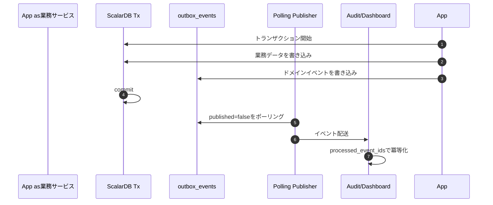

:::message
ScalarDBのnamespace・テーブル・キー設計と、Outbox/Processed Eventでイベント連携を安全にする方法を読み解きます。
:::

## ScalarDBスキーマ設計

今回の設計の中核にあるのが、ScalarDBです。


*ScalarDBのNamespace・テーブル・キー設計*

::::details レポート全文
---
title: ScalarDB スキーマ設計
schema_version: 1
phase: "Phase 3: Design"
skill: design-scalardb
generated_at: 2026-05-14T00:00:00Z
input_files:
  - reports/03_design/target-architecture.md
  - reports/03_design/bounded-contexts-redesign.md
---

# ScalarDB スキーマ設計 — legacy-pos-monolith

## 設計方針

1. **既存 RDB 構造を最大限維持**: PostgreSQL（pos_pg）+ MySQL（pos_mysql）の構成を維持
2. **ScalarDB JDBC アダプタ採用**: 既存テーブルを ScalarDB 管理下に配置
3. **Partition Key 設計**: テーブルアクセス頻度の高い ID をパーティションキーに
4. **OCC 衝突率 5% 以下**: ホットスポット（在庫レコード等）はパーティション粒度を細かくする
5. **DB 固有機能の不使用**: ScalarDB 管理テーブルに対しては `ON UPDATE CURRENT_TIMESTAMP`、Foreign Key、Default 値の Trigger 等を使わない

---

## ScalarDB Edition 選定

| 観点 | 結論 |
|---|---|
| **採用エディション** | **ScalarDB Cluster Enterprise Standard** |
| 主な決め手 | MySQL + PostgreSQL の異種混在分散トランザクション、複数サービスからの並行アクセス、認証統合 |
| Premium 検討 | Phase 5 以降、HTAP 分析（ScalarDB Analytics）を導入する場合に再検討 |

**選定理由**:
- OSS 版では 1 アプリケーションに限定されるため、マイクロサービス化を見越した Cluster 採用が必要
- Standard で十分（ScalarDB Analytics は Phase 5 で再検討）
- ScalarDB が提供する `Consensus Commit` プロトコルにより、MySQL/PostgreSQL 跨ぎの ACID トランザクションを実現

### Standard の機能制約と本設計での扱い（SYN-004 対応）

ScalarDB Cluster Standard には以下の **SQL 機能制約** がある。これは Standard を選定する上で受容する。

| 機能 | Standard | 本設計での代替手段 |
|---|---|---|
| GROUP BY / 集約関数（SUM/COUNT/AVG） | **未提供** | Dashboard 用 **Read Model（独立 PostgreSQL）** で対応（read-model-design.md） |
| 任意の JOIN | **未提供** | アプリ層で Get を組み合わせる、または Read Model で非正規化済み |
| 任意のレンジ Scan（複合条件） | **制約あり**（Partition Key 内のみ） | Secondary Index または Read Model |
| HTAP 分析（Apache Spark 連携） | **Premium 限定**（ScalarDB Analytics） | 採用しない（Phase 5 で再評価） |

#### Premium（ScalarDB Analytics）採用案との比較

| 案 | 利点 | 欠点 | 採否 |
|---|---|---|---|
| **本案: Standard + Read Model（独立 PG）** | エディション据え置きでコスト最小、SQL の GROUP BY が Read DB 上で自然に使える | 結果整合（P95 < 30 秒）、Projector の運用が必要 | **採用** |
| Premium + ScalarDB Analytics | HTAP 一体型、追加 Read Model 不要 | ライセンス費用増、Spark クラスタ運用、現時点で過剰 | 不採用（Phase 5 で再評価） |
| Standard + Scan + アプリ集約 | 追加コンポーネント不要 | 全件 Scan の I/O 暴発、TD-008/025 が **未解消** | 不採用（SYN-004 そのもの） |

> **明確化**: 本リポジトリの ScalarDB スキーマでは **GROUP BY や集約クエリを発行しない**。
> Dashboard が必要とする集計は **すべて Read Model（独立 PostgreSQL）側で実行**する。
> Read Model の詳細は `read-model-design.md` を参照。

---

## ストレージバックエンド構成

```yaml
scalar.db.transaction_manager: cluster
scalar.db.contact_points: indirect:scalardb-cluster-node:60053

# Storage 1: PostgreSQL
scalar.db.multi_storage.storages.postgres.storage: jdbc
scalar.db.multi_storage.storages.postgres.contact_points: jdbc:postgresql://postgres:5432/pos_pg
scalar.db.multi_storage.storages.postgres.username: pos_user
scalar.db.multi_storage.storages.postgres.password: pos_password

# Storage 2: MySQL
scalar.db.multi_storage.storages.mysql.storage: jdbc
scalar.db.multi_storage.storages.mysql.contact_points: jdbc:mysql://mysql:3306/pos_mysql
scalar.db.multi_storage.storages.mysql.username: pos_user
scalar.db.multi_storage.storages.mysql.password: pos_password

# Multi-storage routing
scalar.db.storage: multi-storage
scalar.db.multi_storage.namespace_mapping: \
  catalog:postgres,loyalty:postgres,receipt:postgres,identity:postgres,audit:postgres,\
  inventory:mysql,order:mysql,payment:mysql,return:mysql
scalar.db.multi_storage.default_storage: postgres
```

**Namespace 設計**: BC ごとに ScalarDB Namespace を分離する。これにより将来的にサービス分割した際の DB 分離が容易になる。

---

## テーブル設計（ScalarDB スキーマ定義）

### Catalog Namespace（postgres）

#### `catalog.products`

| カラム | 型 | キー種別 | 用途 |
|---|---|---|---|
| product_id | INT | **Partition Key** | 商品ID |
| name | TEXT | — | 商品名 |
| barcode | TEXT | — | バーコード（Secondary Index 候補） |
| category | TEXT | — | カテゴリ |
| price_yen | INT | — | 価格 |
| tax_category | INT | — | 税カテゴリ |
| status | TEXT | — | ACTIVE / DISCONTINUED |
| created_at | BIGINT | — | 作成時刻（epoch millis） |
| updated_at | BIGINT | — | 更新時刻 |

**Secondary Index**: `barcode`（バーコードスキャン高速化）

**ScalarDB schema (JSON)**:
```json
{
  "catalog.products": {
    "transaction": true,
    "partition-key": ["product_id"],
    "clustering-key": [],
    "columns": {
      "product_id": "INT",
      "name": "TEXT",
      "barcode": "TEXT",
      "category": "TEXT",
      "price_yen": "INT",
      "tax_category": "INT",
      "status": "TEXT",
      "created_at": "BIGINT",
      "updated_at": "BIGINT"
    },
    "secondary-index": ["barcode"]
  }
}
```

---

### Inventory Namespace（mysql）

#### `inventory.stocks`（旧 inventory）

| カラム | 型 | キー種別 | 用途 |
|---|---|---|---|
| product_id | INT | **Partition Key** | 商品ID |
| available_quantity | INT | — | 利用可能数 |
| reserved_quantity | INT | — | 引当済数 |
| updated_at | BIGINT | — | 更新時刻 |

**ホットスポット対策**: `product_id` をパーティションキーにすることで、商品単位で OCC 衝突を限定。
OCC 衝突率予測: 通常運用で 1〜2%（同一商品の同時購入は限定的）。

#### `inventory.stock_movements`

| カラム | 型 | キー種別 | 用途 |
|---|---|---|---|
| product_id | INT | **Partition Key** | 商品ID（同一商品の履歴を集約） |
| movement_id | BIGINT | **Clustering Key** | 履歴ID（時系列） |
| delta | INT | — | 増減量 |
| reason | TEXT | — | 理由（enum 化された値） |
| order_id | TEXT | — | 関連注文ID |
| occurred_at | BIGINT | — | 発生時刻 |

**Clustering Order**: `movement_id ASC`（時系列）

```json
{
  "inventory.stocks": {
    "transaction": true,
    "partition-key": ["product_id"],
    "clustering-key": [],
    "columns": {
      "product_id": "INT",
      "available_quantity": "INT",
      "reserved_quantity": "INT",
      "updated_at": "BIGINT"
    }
  },
  "inventory.stock_movements": {
    "transaction": true,
    "partition-key": ["product_id"],
    "clustering-key": ["movement_id"],
    "columns": {
      "product_id": "INT",
      "movement_id": "BIGINT",
      "delta": "INT",
      "reason": "TEXT",
      "order_id": "TEXT",
      "occurred_at": "BIGINT"
    }
  }
}
```

---

### Order Namespace（mysql）

#### `order.orders`

| カラム | 型 | キー種別 | 用途 |
|---|---|---|---|
| order_id | TEXT | **Partition Key** | 注文ID（"ORD-..."） |
| register_id | TEXT | — | レジID |
| operator_id | TEXT | — | オペレータID |
| member_id | TEXT | — | 会員ID（Secondary Index） |
| total_yen | INT | — | 合計金額 |
| tax_yen | INT | — | 税額 |
| status | TEXT | — | OrderStatus |
| idempotency_key | TEXT | — | 冪等性キー（Secondary Index） |
| ordered_at | BIGINT | — | 注文時刻 |
| updated_at | BIGINT | — | 更新時刻 |

**Secondary Index**: `member_id`, `idempotency_key`, `status`

#### `order.order_items`

| カラム | 型 | キー種別 | 用途 |
|---|---|---|---|
| order_id | TEXT | **Partition Key** | 親注文ID（明細を集約配置） |
| line_no | INT | **Clustering Key** | 明細番号 |
| product_id | INT | — | 商品ID |
| name_snapshot | TEXT | — | 商品名スナップショット |
| unit_price_yen | INT | — | 単価 |
| quantity | INT | — | 数量 |
| tax_category | INT | — | 税カテゴリ |

**設計上のポイント**: `order_id` をパーティションキーにすることで、注文と明細が同一パーティションに配置される。集約境界に一致した自然な分散配置。

#### `order.idempotency_keys`

| カラム | 型 | キー種別 | 用途 |
|---|---|---|---|
| key | TEXT | **Partition Key** | 冪等性キー |
| purpose | TEXT | — | 用途（CHECKOUT 等） |
| request_hash | TEXT | — | リクエストハッシュ |
| result_status | TEXT | — | SUCCESS/FAILED |
| result_payload | TEXT | — | 結果ペイロード（JSON 化） |
| created_at | BIGINT | — | 作成時刻 |

```json
{
  "order.orders": {
    "transaction": true,
    "partition-key": ["order_id"],
    "clustering-key": [],
    "columns": {
      "order_id": "TEXT", "register_id": "TEXT", "operator_id": "TEXT",
      "member_id": "TEXT", "total_yen": "INT", "tax_yen": "INT",
      "status": "TEXT", "idempotency_key": "TEXT",
      "ordered_at": "BIGINT", "updated_at": "BIGINT"
    },
    "secondary-index": ["member_id", "idempotency_key", "status"]
  },
  "order.order_items": {
    "transaction": true,
    "partition-key": ["order_id"],
    "clustering-key": ["line_no"],
    "columns": {
      "order_id": "TEXT", "line_no": "INT",
      "product_id": "INT", "name_snapshot": "TEXT",
      "unit_price_yen": "INT", "quantity": "INT", "tax_category": "INT"
    }
  },
  "order.idempotency_keys": {
    "transaction": true,
    "partition-key": ["key"],
    "clustering-key": [],
    "columns": {
      "key": "TEXT", "purpose": "TEXT", "request_hash": "TEXT",
      "result_status": "TEXT", "result_payload": "TEXT", "created_at": "BIGINT"
    }
  }
}
```

---

### Payment Namespace（mysql）

#### `payment.payments`

| カラム | 型 | キー種別 |
|---|---|---|
| payment_id | TEXT | **Partition Key** |
| order_id | TEXT | — (Secondary Index) |
| method | TEXT | — |
| amount_yen | INT | — |
| status | TEXT | — |
| paid_at | BIGINT | — |

```json
{
  "payment.payments": {
    "transaction": true,
    "partition-key": ["payment_id"],
    "clustering-key": [],
    "columns": {
      "payment_id": "TEXT", "order_id": "TEXT", "method": "TEXT",
      "amount_yen": "INT", "status": "TEXT", "paid_at": "BIGINT"
    },
    "secondary-index": ["order_id"]
  }
}
```

---

### Loyalty Namespace（postgres）

#### `loyalty.members`（新規、SYN-017 対応）

会員（Member）マスタ。Member 集約の永続化先。

| カラム | 型 | キー種別 | PII | 用途 |
|---|---|---|---|---|
| member_id | TEXT | **Partition Key** | — | UUID v4。内部識別子（不変） |
| member_code | TEXT | — (Secondary Index) | — | 人間可読 ID（例: `member-001`）。レジ入力用、unique |
| name | TEXT | — | **PII** | 会員氏名（AES-256 暗号化保管） |
| email | TEXT | — (Secondary Index) | **PII** | email アドレス。unique（AES-256 暗号化保管、検索は決定的暗号化または HMAC ハッシュ列を別途持つ）、nullable |
| phone | TEXT | — | **PII** | 電話番号（AES-256 暗号化保管）、nullable |
| birth_date | TEXT | — | PII | ISO-8601 日付（AES-256 暗号化保管）、nullable |
| preferred_store_id | TEXT | — | — | お気に入り店舗 ID、nullable |
| registered_at | BIGINT | — | — | 登録時刻（epoch millis） |
| status | TEXT | — | — | `ACTIVE` / `SUSPENDED` / `WITHDRAWN` |
| verification_level | TEXT | — | — | `UNVERIFIED` / `EMAIL_VERIFIED` / `ID_VERIFIED` |
| withdrawn_at | BIGINT | — | — | 退会時刻、nullable |
| updated_at | BIGINT | — | — | 更新時刻 |

**Secondary Index**: `member_code`（レジでの会員入力用）, `email`（重複チェック・本人確認）

> **SYN-005 配慮**: ScalarDB の Secondary Index 制約に従い 2 本まで。`phone` での検索が必要となった場合は Read Model 側で対応する。

**PII 暗号化方針**:
- `name` / `email` / `phone` / `birth_date` はアプリケーション層で **AES-256-GCM**（KMS 管理鍵、年次ローテーション）で暗号化して保管
- `email` の重複検出と Secondary Index 検索が両立するように、**決定的暗号化（AES-SIV）** または **HMAC-SHA256 のハッシュ列**を別途持たせる方式を採用（`email_hash` 等。本テーブルでは `email` 列を HMAC ハッシュ化して格納し、平文は別暗号化列に保持する設計を運用ガイドで規定）
- 復号鍵へのアクセスは Loyalty Service のサービスアカウントに限定し、Audit ログから自動的にマスキング

**参照整合性**:
- `loyalty.member_points.member_id` ↔ `loyalty.members.member_id` の参照は **アプリケーション層で保証**（ScalarDB は外部キー制約を提供しない）
- Member 登録時に MemberPoint レコードを作成（同一 ScalarDB Tx で両 namespace を更新可能）
- `MemberWithdrawn` イベントを Outbox 経由で発行 → MemberPoint Subscriber が `member_points` を凍結状態（status 列を将来追加予定）にして残高を保持

#### `loyalty.member_points`（旧 point_balances）

| カラム | 型 | キー種別 |
|---|---|---|
| member_id | TEXT | **Partition Key** |
| total_points | INT | — |
| updated_at | BIGINT | — |

#### `loyalty.point_transactions`

| カラム | 型 | キー種別 |
|---|---|---|
| member_id | TEXT | **Partition Key**（会員ごとに集約） |
| transaction_id | BIGINT | **Clustering Key**（時系列） |
| order_id | TEXT | — (Secondary Index) |
| type | TEXT | — |
| points | INT | — |
| expires_at | BIGINT | — |
| created_at | BIGINT | — |

#### `loyalty.point_rules`

| カラム | 型 | キー種別 |
|---|---|---|
| rule_id | INT | **Partition Key** |
| rule_type | TEXT | — |
| condition_json | TEXT | — |
| multiplier | DOUBLE | — |
| valid_from | BIGINT | — |
| valid_to | BIGINT | — |
| enabled | BOOLEAN | — |

```json
{
  "loyalty.members": {
    "transaction": true,
    "partition-key": ["member_id"],
    "clustering-key": [],
    "columns": {
      "member_id": "TEXT",
      "member_code": "TEXT",
      "name": "TEXT",
      "email": "TEXT",
      "phone": "TEXT",
      "birth_date": "TEXT",
      "preferred_store_id": "TEXT",
      "registered_at": "BIGINT",
      "status": "TEXT",
      "verification_level": "TEXT",
      "withdrawn_at": "BIGINT",
      "updated_at": "BIGINT"
    },
    "secondary-index": ["member_code", "email"]
  },
  "loyalty.member_points": {
    "transaction": true,
    "partition-key": ["member_id"],
    "columns": {
      "member_id": "TEXT", "total_points": "INT", "updated_at": "BIGINT"
    }
  },
  "loyalty.point_transactions": {
    "transaction": true,
    "partition-key": ["member_id"],
    "clustering-key": ["transaction_id"],
    "columns": {
      "member_id": "TEXT", "transaction_id": "BIGINT", "order_id": "TEXT",
      "type": "TEXT", "points": "INT", "expires_at": "BIGINT", "created_at": "BIGINT"
    },
    "secondary-index": ["order_id"]
  },
  "loyalty.point_rules": {
    "transaction": true,
    "partition-key": ["rule_id"],
    "columns": {
      "rule_id": "INT", "rule_type": "TEXT", "condition_json": "TEXT",
      "multiplier": "DOUBLE", "valid_from": "BIGINT", "valid_to": "BIGINT",
      "enabled": "BOOLEAN"
    }
  }
}
```

---

### Receipt Namespace（postgres）

#### `receipt.receipts`

| カラム | 型 | キー種別 |
|---|---|---|
| receipt_id | BIGINT | **Partition Key** |
| order_id | TEXT | — (Secondary Index) |
| total_yen | INT | — |
| tax_yen | INT | — |
| issued_at | BIGINT | — |
| kind | TEXT | — (Secondary Index) |
| body_json | TEXT | — |
| status | TEXT | — |

---

### Return Namespace（mysql）

#### `return.returns`

| カラム | 型 | キー種別 |
|---|---|---|
| return_id | TEXT | **Partition Key** |
| order_id | TEXT | — (Secondary Index) |
| status | TEXT | — |
| requested_by | TEXT | — |
| requested_at | BIGINT | — |
| completed_at | BIGINT | — |

#### `return.return_items`

| カラム | 型 | キー種別 |
|---|---|---|
| return_id | TEXT | **Partition Key** |
| line_no | INT | **Clustering Key** |
| product_id | INT | — |
| quantity | INT | — |
| refund_yen | INT | — |

---

### Identity Namespace（postgres）

#### `identity.users`

| カラム | 型 | キー種別 |
|---|---|---|
| user_id | INT | **Partition Key** |
| username | TEXT | — (Secondary Index, UNIQUE 制約はアプリで保証) |
| password_hash | TEXT | — |
| role | TEXT | — |
| enabled | BOOLEAN | — |
| created_at | BIGINT | — |

---

### Audit Namespace（postgres）

#### `audit.audit_logs`

| カラム | 型 | キー種別 |
|---|---|---|
| audit_id | BIGINT | **Partition Key** |
| user_id | TEXT | — (Secondary Index) |
| action | TEXT | — (Secondary Index) |
| target | TEXT | — |
| payload | TEXT | — |
| occurred_at | BIGINT | — |

**注意**: ScalarDB ではタイムスタンプ系のレンジクエリは `Scan` API + Clustering Key + 適切なフィルタで行う。
監査ログのような時系列クエリ要件が強いテーブルは、必要に応じて `(date_partition, audit_id)` のような複合パーティション設計を検討する。

---

## Outbox / Processed Event スキーマ（Phase 2 から必須）

> **SYN-002 対応**: 各 BC namespace に `outbox_events` テーブルを必ず配置する。Audit / Dashboard / 副作用 Worker / 将来の Kafka 連携の唯一の入口として機能する。
> 消費側の冪等化のため、Subscriber を持つ namespace（audit / dashboard / loyalty / order / payment）に `processed_event_ids` テーブルを配置する。
> Outbox は **`@TransactionalEventListener` とは別の独立した Polling 機構** であり、両者は併用しない（詳細は `scalardb-transaction.md` のOutbox パターン参照）。

### `outbox_events` テーブル（全 BC namespace 共通スキーマ）

各 namespace（catalog / inventory / order / payment / loyalty / receipt / return / audit）に同一スキーマで配置する。

| カラム | 型 | キー種別 | 用途 |
|---|---|---|---|
| event_id | TEXT | **Partition Key** | UUID v4。グローバル冪等化キー（消費側の `processed_event_ids` と一致） |
| aggregate_type | TEXT | — | 集約タイプ（"Order" / "Stock" / "Payment" / "Receipt" / "MemberPoint" / "Return" / "Product" / "AuditLog"） |
| aggregate_id | TEXT | — (Secondary Index) | 集約 ID（order_id, product_id 等） |
| event_type | TEXT | — | "OrderCompleted" / "StockAllocated" / "PaymentCharged" / "PointsEarned" 等のイベント名 |
| payload | TEXT | — | JSON ペイロード（イベント本体） |
| created_at | BIGINT | — | ScalarDB epoch millis（Outbox に書かれた時刻） |
| published | BOOLEAN | — (**Secondary Index**) | 既定 false。Polling Publisher が `published=false` のみスキャンする |
| published_at | BIGINT | — | 発行成功時刻（nullable） |
| retry_count | INT | — | 失敗回数（DLQ 判定用、既定 0） |
| last_error | TEXT | — | 直近エラーメッセージ（nullable） |
| status | TEXT | — | "PENDING" / "PUBLISHED" / "DEAD"（既定 PENDING） |

**Partition Key 設計の根拠**:
- `event_id`（UUID v4）をパーティションキーにすることで、Outbox 書込・発行のホットスポットを完全分散
- `aggregate_id` をパーティションキーにしないのは、同一注文への高頻度イベントでホットスポット化するため
- Clustering Key は不要（時系列順スキャンは行わず、`published=false` を Secondary Index で取得し `created_at` でアプリ層ソート）

**Secondary Index**: `published`（最優先）

> SYN-005（複数 Secondary Index 制約）に従い、本テーブルでは Secondary Index を 1 つ（`published`）のみとする。
> `aggregate_id` / `event_type` での検索は、原則として Outbox 経由ではなく Read Model（Dashboard / Audit）側で対応する。

```json
{
  "<namespace>.outbox_events": {
    "transaction": true,
    "partition-key": ["event_id"],
    "clustering-key": [],
    "columns": {
      "event_id": "TEXT",
      "aggregate_type": "TEXT",
      "aggregate_id": "TEXT",
      "event_type": "TEXT",
      "payload": "TEXT",
      "created_at": "BIGINT",
      "published": "BOOLEAN",
      "published_at": "BIGINT",
      "retry_count": "INT",
      "last_error": "TEXT",
      "status": "TEXT"
    },
    "secondary-index": ["published"]
  }
}
```

**配置先 namespace**:

| Namespace | バックエンド | 配置 |
|---|---|---|
| catalog.outbox_events | postgres | 必須（ProductCreated / Updated / Discontinued） |
| inventory.outbox_events | mysql | 必須（StockAllocated / Restocked / Received） |
| order.outbox_events | mysql | 必須（OrderPlaced / Completed / Cancelled / Returned） |
| payment.outbox_events | mysql | 必須（PaymentCharged / Refunded / Reversed、副作用 Worker 連携の入口） |
| loyalty.outbox_events | postgres | 必須（PointsEarned / Reversed） |
| receipt.outbox_events | postgres | 必須（ReceiptIssued / Voided） |
| return.outbox_events | mysql | 必須（ReturnCreated / Completed） |
| audit.outbox_events | postgres | 必須（audit から下流に派生イベントを発行する場合） |

### `outbox_dlq` テーブル（各 BC namespace に配置）

3 回連続でリトライ失敗した Outbox イベントを退避する DLQ テーブル。

| カラム | 型 | キー種別 | 用途 |
|---|---|---|---|
| event_id | TEXT | **Partition Key** | DLQ 投入された event_id |
| original_namespace | TEXT | — | 元の namespace |
| aggregate_type | TEXT | — | |
| aggregate_id | TEXT | — | |
| event_type | TEXT | — (Secondary Index) | |
| payload | TEXT | — | |
| failed_at | BIGINT | — | DLQ 投入時刻 |
| retry_count | INT | — | 失敗回数（既定 3） |
| last_error | TEXT | — | 最後のエラー |
| reviewed | BOOLEAN | — | 人手レビュー済みフラグ（既定 false） |

```json
{
  "<namespace>.outbox_dlq": {
    "transaction": true,
    "partition-key": ["event_id"],
    "clustering-key": [],
    "columns": {
      "event_id": "TEXT", "original_namespace": "TEXT",
      "aggregate_type": "TEXT", "aggregate_id": "TEXT",
      "event_type": "TEXT", "payload": "TEXT",
      "failed_at": "BIGINT", "retry_count": "INT",
      "last_error": "TEXT", "reviewed": "BOOLEAN"
    },
    "secondary-index": ["event_type"]
  }
}
```

### `processed_event_ids` テーブル（消費側 namespace に配置、TTL 設計あり）

消費側の冪等化（at-least-once → effectively exactly-once 変換）のためのテーブル。Subscriber を持つ namespace に配置する。

| カラム | 型 | キー種別 | 用途 |
|---|---|---|---|
| event_id | TEXT | **Partition Key** | 消費した event_id（Outbox の event_id と同一値） |
| consumer_name | TEXT | — | 消費した Subscriber 名（"audit" / "dashboard" / "loyalty-projector" 等） |
| processed_at | BIGINT | — | 処理時刻（ScalarDB epoch millis） |
| expires_at | BIGINT | — (**Secondary Index**) | TTL 失効時刻（既定: processed_at + 30 日） |

**TTL 設計**:
- ScalarDB Cluster Standard は DB ネイティブの TTL を直接サポートしないため、**`expires_at` を Secondary Index 化し、別バッチ（既定: 日次）で `expires_at < now()` のレコードを物理削除**する
- 30 日は Outbox 側の保持期間（既定 7 日）の倍以上を確保し、Outbox 再送の可能性を完全にカバー
- サイズ目安: 1 日 100 万イベント × 30 日 = 約 3,000 万行 / consumer。各 namespace で別テーブルとし、肥大時は consumer 別にパーティション分離

```json
{
  "<consumer-namespace>.processed_event_ids": {
    "transaction": true,
    "partition-key": ["event_id"],
    "clustering-key": [],
    "columns": {
      "event_id": "TEXT",
      "consumer_name": "TEXT",
      "processed_at": "BIGINT",
      "expires_at": "BIGINT"
    },
    "secondary-index": ["expires_at"]
  }
}
```

**配置先 namespace**:

| Namespace | バックエンド | 配置理由 |
|---|---|---|
| audit.processed_event_ids | postgres | 全 BC からのイベントを購読し監査ログ化（TD-029 構造的解消） |
| dashboard.processed_event_ids | postgres | OrderCompleted / PaymentCharged 等を購読し Read Model 更新（SYN-004 連携） |
| loyalty.processed_event_ids | postgres | OrderCompleted を購読してポイント加算（イベント駆動移行後） |
| order.processed_event_ids | mysql | PaymentSucceeded / PaymentFailed を購読しステータス遷移（SYN-003 連携） |
| payment.processed_event_ids | mysql | 副作用 Worker からの結果イベント受信に使用 |

### Outbox / Processed Event の総テーブル数

| カテゴリ | 配置数 |
|---|---|
| `outbox_events` | 8 namespace × 1 = **8** |
| `outbox_dlq` | 8 namespace × 1 = **8** |
| `processed_event_ids` | 5 namespace × 1 = **5** |
| **合計（Outbox 関連）** | **21** |

---

## 全 namespace 概要

| Namespace | バックエンド | 業務テーブル | Outbox / Processed | 合計 |
|---|---|---|---|---|
| catalog | postgres | 1 | outbox_events, outbox_dlq | 3 |
| inventory | mysql | 2 | outbox_events, outbox_dlq | 4 |
| order | mysql | 3 | outbox_events, outbox_dlq, processed_event_ids | 6 |
| payment | mysql | 1 | outbox_events, outbox_dlq, processed_event_ids | 4 |
| loyalty | postgres | 4 | outbox_events, outbox_dlq, processed_event_ids | 7 |
| receipt | postgres | 1 | outbox_events, outbox_dlq | 3 |
| return | mysql | 2 | outbox_events, outbox_dlq | 4 |
| identity | postgres | 1 | — | 1 |
| audit | postgres | 1 | outbox_events, outbox_dlq, processed_event_ids | 4 |
| dashboard | postgres（Read Model 別 DB と並列） | — | processed_event_ids | 1 |
| **合計** | — | **16** | **21** | **37** |

---

## キー設計のポイント

### Partition Key の選定根拠

| テーブル | Partition Key | 根拠 |
|---|---|---|
| products | product_id | 主アクセス。バーコード検索は Secondary Index |
| stocks | product_id | 在庫操作の主キー。OCC 衝突を商品単位に限定 |
| orders | order_id | 注文 CRUD の主キー。ホットスポット化しない（UUID 由来） |
| order_items | order_id | 親注文と同一パーティションに配置（集約境界） |
| payments | payment_id | UUID 由来でホットスポットなし |
| members | member_id | 会員マスタの主アクセス。memberCode / email は Secondary Index |
| member_points | member_id | 会員ポイント操作の主キー |
| point_transactions | member_id | 会員ごとの履歴を同一パーティション化 |

### OCC 衝突対策

| ホットスポット候補 | 対策 |
|---|---|
| `stocks`（人気商品の在庫） | パーティションキーが商品単位なので衝突は商品ごとに限定。さらに ScalarDB の `consensus-commit.coordinator.namespace` を分離 |
| `member_points`（同一会員の連続購入） | 通常は問題にならない。会員 ID 単位のパーティション |
| `idempotency_keys` | 1 リクエストあたり 1 キーなので衝突なし |

### Secondary Index の設計判断

ScalarDB では Secondary Index は限定的な用途（単一 = 検索）でのみ使用可能。
レンジ検索や複合条件は Application 側で対応するか、専用 Read Model を設計する。

| 用途 | 対応 |
|---|---|
| バーコード検索 | `products.barcode` Secondary Index |
| 注文の冪等性キー検索 | `orders.idempotency_key` Secondary Index |
| 注文の会員別検索 | `orders.member_id` Secondary Index |
| 日付範囲検索（ダッシュボード） | **Dashboard Read Model（独立 PostgreSQL）で対応**（`read-model-design.md`） |
| ベストセラー集計（TD-025） | **Dashboard Read Model の `product_sales_ranking` で `GROUP BY product_id` SQL 実行** |
| 時間帯別売上集計（TD-008） | **Dashboard Read Model の `hourly_sales_summary` を 1 クエリで取得** |
| 月次サマリ | **Dashboard Read Model の `monthly_sales_summary`** |

> ScalarDB Standard は GROUP BY/集約関数を提供しない。Dashboard 集計は ScalarDB の Tx 経路ではなく、
> Outbox → Projector → 独立 PostgreSQL Read DB 経由で算出する（CQRS Read Model）。詳細は `read-model-design.md` を参照。

---

## ScalarDB 管理外のデータ

| データ | 配置 | 理由 |
|---|---|---|
| Cart | Redis | セッションスコープ、ACID 不要 |
| 認証セッション（JWT） | ステートレス | ScalarDB 管理不要 |
| **Dashboard Read Model** | **独立 PostgreSQL（pos_dashboard_read）** | **ScalarDB Standard の GROUP BY/集約非対応を補う CQRS Read DB。詳細は `read-model-design.md`** |

### Scan の制約（明記）

ScalarDB Cluster Standard の Scan API は以下の制約を持つ。設計上はこれを前提とする。

- **同一 Partition Key 配下のみ走査可能**（複数パーティション跨ぎの Scan は提供されない）
- **集約は不可**（GROUP BY / SUM / COUNT 相当はクライアント実装になり、件数次第で I/O 暴発）
- **Clustering Key の不等号フィルタは可**だが、ソート順は Clustering Order に従う

→ これらに合致しない要件（日付範囲集計、ランキング、月次集計など）は **すべて Read Model 経由**で解く。
ScalarDB 上で全件 Scan + アプリ集約は **禁止パターン**として扱う（旧 OrderService の TD-008/025 と同等の問題が再発するため）。

---

## スキーマローダー実行手順

```bash
# ScalarDB schema-loader CLI
java -jar scalardb-schema-loader.jar \
  --config scalardb.properties \
  --schema-file pos-schema.json \
  --create-coordinator-tables
```

`--create-coordinator-tables` で `coordinator.state` テーブルが作成され、Consensus Commit のコーディネーション情報が保存される。
::::


既存システムはPostgreSQLとMySQLの2つのデータベースを利用していました。問題は、チェックアウトや返品のような業務処理が、この2つのDBをまたいで更新することです。

既存実装では、これを手書きSagaでなんとか協調していました。

設計レポートでは、これをScalarDB Cluster Enterprise Standardのマルチストレージ構成で解決する方針を取っています。

```yaml
scalar.db.transaction_manager: cluster
scalar.db.contact_points: indirect:scalardb-cluster-node:60053

scalar.db.multi_storage.storages.postgres.storage: jdbc
scalar.db.multi_storage.storages.postgres.contact_points: jdbc:postgresql://postgres:5432/pos_pg

scalar.db.multi_storage.storages.mysql.storage: jdbc
scalar.db.multi_storage.storages.mysql.contact_points: jdbc:mysql://mysql:3306/pos_mysql

scalar.db.storage: multi-storage
scalar.db.multi_storage.namespace_mapping: \
  catalog:postgres,loyalty:postgres,receipt:postgres,identity:postgres,audit:postgres,\
  inventory:mysql,order:mysql,payment:mysql,return:mysql
```

Namespaceを境界コンテキスト単位に分け、それぞれをPostgreSQLまたはMySQLへルーティングします。

| Namespace | バックエンド | 主なテーブル |
| :--- | :--- | :--- |
| `catalog` | PostgreSQL | products |
| `inventory` | MySQL | stocks, stock_movements |
| `order` | MySQL | orders, order_items, idempotency_keys |
| `payment` | MySQL | payments |
| `loyalty` | PostgreSQL | members, member_points, point_transactions, point_rules |
| `receipt` | PostgreSQL | receipts |
| `return` | MySQL | returns, return_items |
| `identity` | PostgreSQL | users |
| `audit` | PostgreSQL | audit_logs |

さらに、ScalarDBの楽観並行制御を前提に、Partition Keyの選定も業務集約に合わせています。

| テーブル | Partition Key | 意図 |
| :--- | :--- | :--- |
| `inventory.stocks` | `product_id` | 在庫引当の競合を商品単位に限定 |
| `order.orders` | `order_id` | 注文単位でホットスポットを避ける |
| `order.order_items` | `order_id` | 注文明細を親注文と同一パーティションへ配置 |
| `loyalty.member_points` | `member_id` | 会員単位のポイント操作を集約 |
| `outbox_events` | `event_id` | イベント書き込みのホットスポットを分散 |

このように、スキーマ設計が単なるテーブル一覧ではなく、**ドメイン境界・トランザクション境界・性能特性を合わせ込む設計**になっている点が重要です。


### Outboxパターン

レビューを通じて最も重要な設計判断になったのが、Outboxパターンです。

初回設計では、OutboxがPhase4〜5で導入されるオプションのように扱われていました。しかしレビューでは、これがP0 Blockerとして指摘されています。

理由は明確です。

監査ログやダッシュボード集計のイベントが、メインの業務トランザクションとは別に送信される場合、プロセス停止や例外によってイベントが失われる可能性があります。特に `@TransactionalEventListener(AFTER_COMMIT)` のような仕組みでは、メインのcommit後にプロセスが落ちるとイベントは再送されません。

そこでv2以降では、OutboxがPhase2から必須化されました。



Outboxの設計では、以下のようなテーブルが各Namespaceに追加されます。

| テーブル | 役割 |
| :--- | :--- |
| `outbox_events` | 業務Txと同一Txで書き込むイベント本体 |
| `outbox_dlq` | 3回連続で失敗したイベントの退避先 |
| `processed_event_ids` | 消費側の冪等化。重複配送を吸収 |


この一文はかなり重要です。

呼び忘れないように気をつけるではなく、**呼び忘れても構造上欠落しないようにする**のが設計です。

監査ログや集計のような横断的関心事は、開発者の注意力に依存させると必ず抜け漏れが出ます。Outboxを業務トランザクションの一部に入れることで、イベント発行は後処理ではなく業務更新の一部になります。

## 本章のまとめ

* ScalarDBスキーマ設計では、境界コンテキストごとにnamespaceとテーブルを分け、既存の複数DB構成を一貫性のある形へ整理しました。
* キー設計やOCC衝突対策は、性能だけでなく業務上の競合やトランザクション境界と結びついています。
* Outbox/Processed Eventを導入することで、監査ログやDashboard連携などのイベント発行を開発者の注意力ではなく構造で保証する設計になりました。

## 用語解説

### namespace
ScalarDB上でテーブルを論理的にまとめる単位です。本書では、Catalog、Inventory、Orderなどの境界コンテキストに対応させています。

### Partition Key
データの配置や検索単位を決めるキーです。アクセスパターンや競合の起きやすさに影響するため、業務単位に合わせて設計します。

### OCC
Optimistic Concurrency Controlの略で、楽観的同時実行制御を意味します。更新時に競合を検出し、必要に応じてリトライします。

### Outbox
業務データの更新と同じトランザクションでイベントを保存し、あとから安全に配送するパターンです。Dual-Writeによるイベント欠落を防ぎます。
