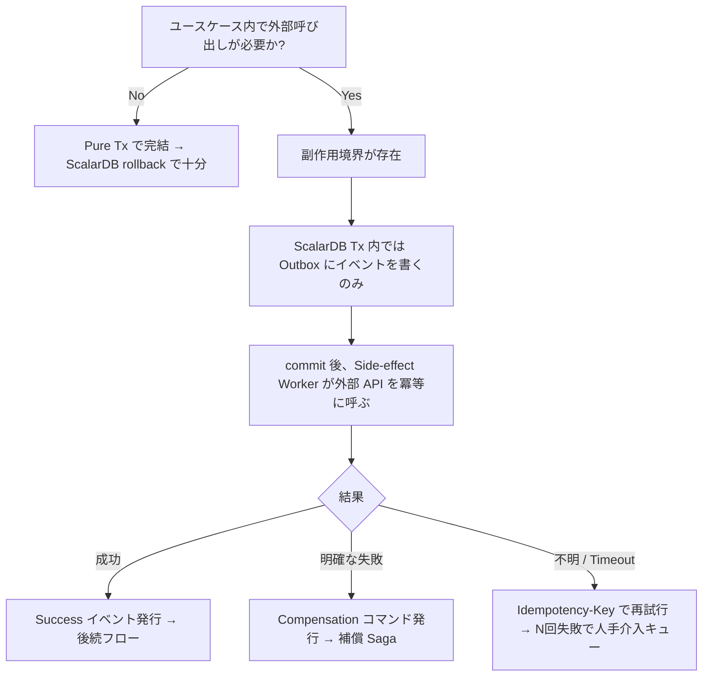
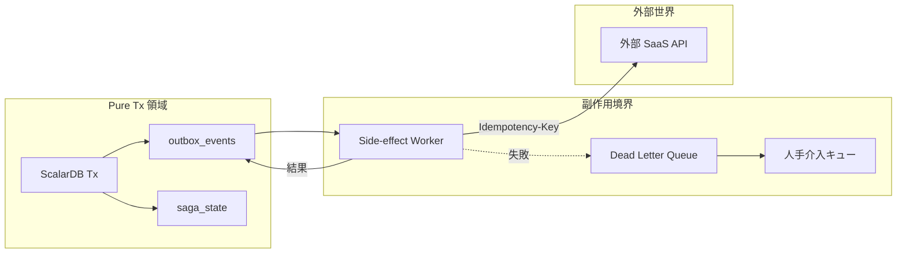
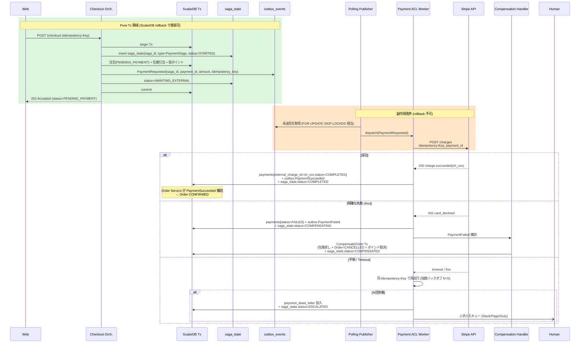
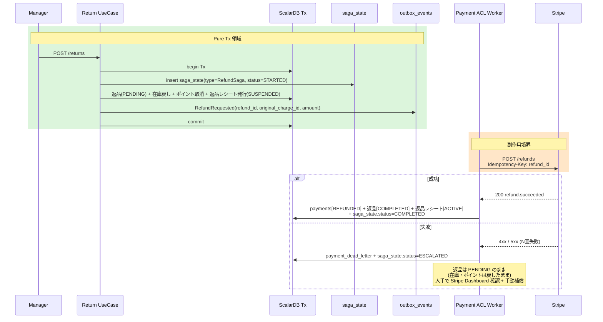
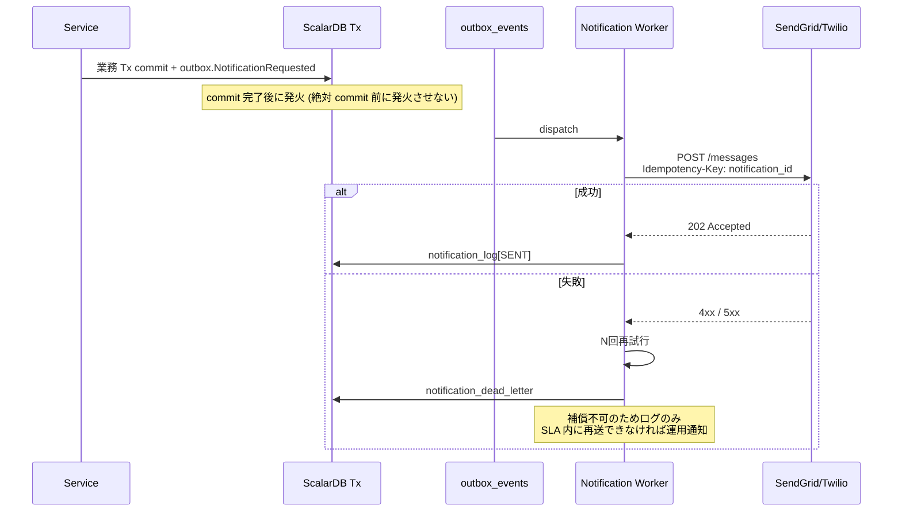
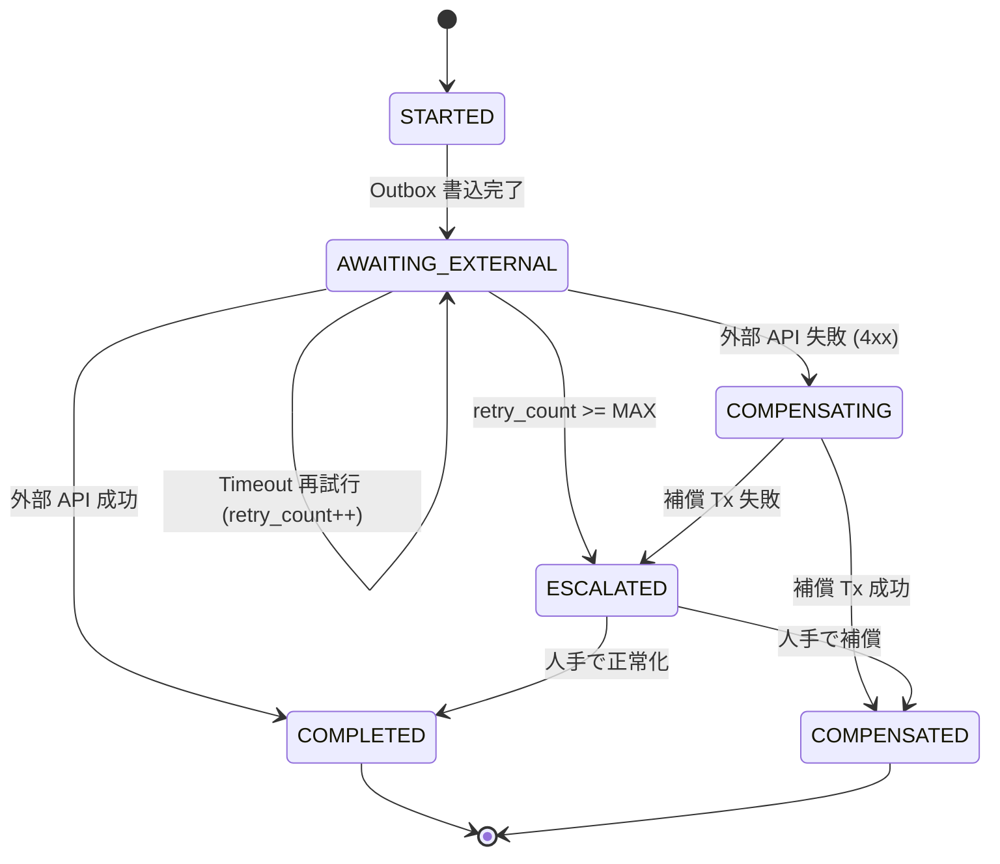
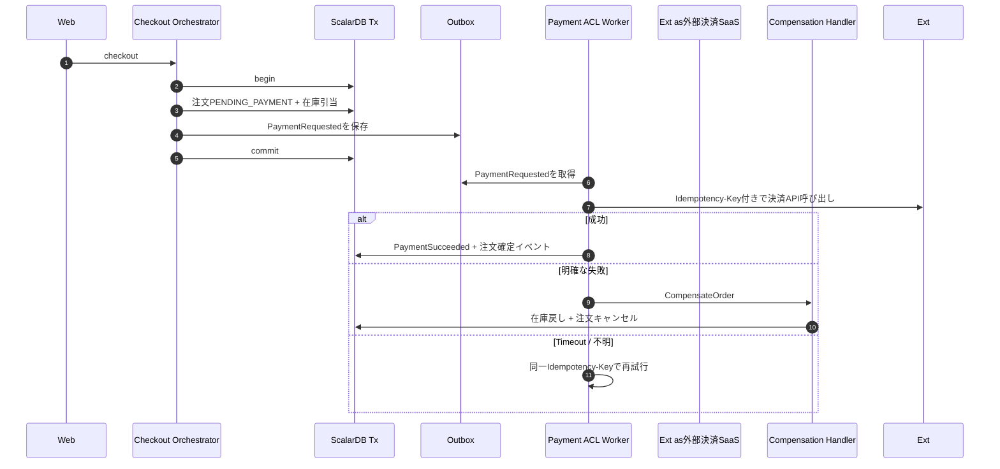
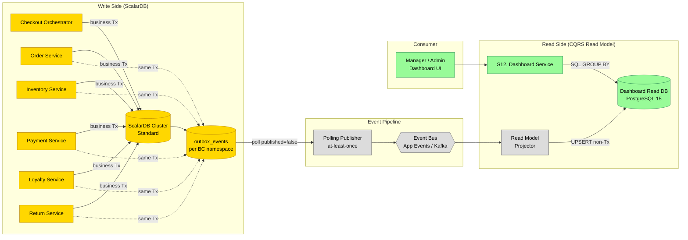
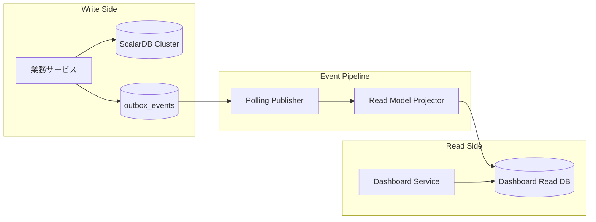

:::message
ScalarDBトランザクション、外部副作用を扱うハイブリッドSaga、CQRS Read Modelの設計をまとめて読み解きます。
:::

## ScalarDBトランザクション設計

`scalardb-transaction.md` では、どの業務にどのトランザクションパターンを使うかが整理されています。


*ScalarDBトランザクションとOutbox設計*

::::details レポート全文
---
title: ScalarDB トランザクション設計
schema_version: 1
phase: "Phase 3: Design"
skill: design-scalardb
generated_at: 2026-05-14T00:00:00Z
input_files:
  - reports/03_design/scalardb-schema.md
  - reports/03_design/target-architecture.md
---

# ScalarDB トランザクション設計 — legacy-pos-monolith

## 設計方針

1. **Consensus Commit を主に採用**: 単一プロセスから複数 namespace を更新する場合は Consensus Commit
2. **2PC は必要最小限**: マイクロサービス分離後の Checkout Orchestrator が複数サービスを協調する場合のみ
3. **Pure Tx 領域では手書き Saga を廃止**: ScalarDB 内のみで完結する処理（既存 `CheckoutSaga` / `ReturnSaga` の DB 更新部分）の補償は ScalarDB の `abort()` に置き換える
4. **副作用境界（Side-Effect Boundary）では明示的 Saga を必須**: 外部 SaaS（決済・配送・通知等）への副作用呼び出しは ScalarDB rollback で取り消せないため、Outbox + Side-effect Worker + Compensation コマンド構成のハイブリッド Saga を必ず導入する（SYN-003 対策、後述）
5. **冪等性は ScalarDB の上に Idempotency Key パターンで実装**: ScalarDB のリトライと併用、外部 API 呼び出しには `Idempotency-Key` ヘッダを必須化
6. **Outbox パターンを Phase 2 から必須採用**: BC 間イベント（Audit / Dashboard 含む）の at-least-once 配信を構造的に保証する。`@TransactionalEventListener(AFTER_COMMIT)` は採用しない（後述Outbox パターン参照）

> **重要**: Saga 不要は **ScalarDB のみで完結する Pure Tx 領域** に限定された主張である。Saga パターン全体を否定するわけではなく、**副作用境界の有無で適用範囲を切り分ける**（後述副作用境界（Side-Effect Boundary）参照）。

---

## トランザクションパターン選定マトリクス

| ユースケース | パターン | 理由 |
|---|---|---|
| チェックアウト（モノリス内） | **Consensus Commit** | 単一プロセスから複数 namespace 更新 |
| チェックアウト（マイクロサービス分離後） | **2PC（Two-phase Commit）** | 複数サービス間で分散トランザクション |
| 返品 | **Consensus Commit / 2PC**（移行段階による） | チェックアウトと同様 |
| 商品マスタ更新 | **Consensus Commit**（単一 namespace） | catalog 内 1 テーブル更新 |
| 在庫入荷 | **Consensus Commit**（単一 namespace） | inventory 内のみ |
| ポイント残高照会 | **Read-only Tx** | 副作用なし |
| 監査ログ記録 | **Outbox + Polling Publisher**（メイン Tx と同一 Tx で `outbox_events` を書く） | イベント駆動・at-least-once を構造的に保証（TD-029 構造的解消） |
| Dashboard 集計更新 | **Outbox + Polling Publisher**（Subscriber が Read Model 更新） | メインフローを阻害せず欠落も発生させない |
| 外部決済 SaaS 呼び出し | **Outbox + Side-effect Worker**（commit 後ワーカで外部 API 発火） | ScalarDB rollback では取り消せない副作用を Outbox 経由で隔離（SYN-003 参照） |

---

## 副作用境界（Side-Effect Boundary）

> SYN-003 への対策。外部 SaaS の副作用は ScalarDB rollback では取り消せない事実を設計に明文化する。

### 概念定義

| 領域 | 性質 | 補償戦略 | 例 |
|---|---|---|---|
| **Pure Tx 領域** | ScalarDB のみで完結。すべての更新は `tx.abort()` で原子的に巻き戻せる。 | ScalarDB rollback | 注文ヘッダ作成・在庫引当・ポイント加算・レシート発行・監査ログ書込・Outbox 書込 |
| **Side-Effect Boundary（副作用境界）** | 外部 API 呼び出しを伴い、副作用は不可逆。`tx.abort()` では巻き戻らない。 | 明示的な Saga + 補償コマンド + 冪等性キー | Stripe charge、PayPal capture、配送手配 SaaS、メール/SMS 通知 SaaS、会員管理 SaaS の更新 |

**ルール**:
- Pure Tx 領域と副作用境界を **同一 ScalarDB Tx 内で混在させてはならない**。混在させた瞬間、commit 前の外部 API 失敗は ScalarDB ロールバックされても外部世界に影響が残り、commit 後の外部 API 失敗は DB 状態と外部状態が乖離する。
- 副作用境界の前後では **必ず Outbox を介して非同期化**し、ScalarDB Tx は副作用要求の記録までで終わる。
- 副作用呼び出しは **必ず冪等**（Idempotency-Key 必須）でなければならない。

### 副作用境界の識別フロー



### Pure Tx と副作用境界の対応表（本プロジェクト）

| ユースケース | Pure Tx 領域 | 副作用境界 |
|---|---|---|
| チェックアウト（現状: 内製決済） | 注文・在庫・支払・ポイント・レシート・Outbox 書込 | （現状なし。将来 Stripe 連携導入時に Payment が境界になる） |
| チェックアウト（将来: 外部 SaaS 決済） | 注文（PENDING_PAYMENT）・在庫引当・Outbox（PaymentRequested）書込 | Stripe charge → PaymentSucceeded / PaymentFailed |
| 返品（現状: 内製） | 返品・在庫戻し・支払取消・ポイント取消・レシート発行 | （現状なし） |
| 返品（将来: 外部 SaaS） | 返品作成・在庫戻し・Outbox（RefundRequested）書込 | Stripe refund |
| 入荷時の在庫アラート通知（将来） | Stock 更新 + Outbox（StockReceived）書込 | Email/SMS SaaS への通知送信 |
| 配送手配（将来拡張） | Order 更新 + Outbox（ShipmentRequested）書込 | 配送 SaaS への手配リクエスト |

詳細な Saga 設計（シーケンス図、補償フロー、状態管理）は **`reports/03_design/saga-design.md`** を参照。

---

## ハイブリッド Saga パターン（外部決済 SaaS 連携）

> Payment Context が将来 Stripe / PayPal / PAY.JP / Square 等の外部決済 SaaS への ACL を担う場合のリファレンス設計。

### フロー概要

| Step | 主体 | 処理 | Tx 境界 |
|---|---|---|---|
| 1 | Checkout Orchestrator | ScalarDB Tx 開始 → 注文作成（status=`PENDING_PAYMENT`）・在庫引当・**Outbox に `PaymentRequested(payment_id, idempotency_key, amount)` 書込** → commit | Pure Tx |
| 2 | Polling Publisher | Outbox から `PaymentRequested` を取得し、Side-effect Queue（または Kafka）に配信 | 独立 Tx（Outbox の `published=true` 更新） |
| 3 | Payment ACL Worker | キューから取得 → Stripe へ `POST /charges`（`Idempotency-Key: <payment_id>` 必須） | 副作用境界 |
| 4a | Payment ACL Worker（成功時） | Stripe charge ID を `payments` に保存 + Outbox に `PaymentSucceeded` を書込 | Pure Tx |
| 4b | Order Service | `PaymentSucceeded` を購読 → Order を `PENDING_PAYMENT` → `CONFIRMED` 遷移 | Pure Tx |
| 5a | Payment ACL Worker（明確な失敗時） | Stripe からの 4xx エラー（カード拒否等）を `payments` に保存 + Outbox に `PaymentFailed` 書込 | Pure Tx |
| 5b | Compensation Handler | `PaymentFailed` を購読 → `CompensateOrder` コマンド発行（在庫戻し + Order を `CANCELLED`） | Pure Tx（複数 namespace を ScalarDB Tx で巻き戻す） |
| 6 | Payment ACL Worker（不明 / Timeout） | `Idempotency-Key` を保持したまま N 回再試行（指数バックオフ） | 副作用境界 |
| 7 | Payment ACL Worker（N 回失敗） | DLQ（`payment_dead_letter`）に投入 → 人手介入キューに通知 | 独立 Tx |

### Semantic Lock パターン

注文の `status=PENDING_PAYMENT` は **論理的なロック状態**として扱う:

- 他の業務処理（返品作成、注文一覧での確定済みフィルタ等）は `PENDING_PAYMENT` の注文を **未確定として扱い、編集・キャンセル・返品を禁止**する。
- タイムアウト（例: 30 分）を超えても `CONFIRMED` / `CANCELLED` に遷移していない注文は、定期バッチで自動的に補償フローへ送る（外部 SaaS の状態を `GET /charges/{id}` で確認 → 成功なら `CONFIRMED` 化、失敗 / 不明なら補償）。
- これにより、Stripe charge が成功したのにアプリ側が DB 更新失敗で `PENDING_PAYMENT` のまま残るケースを救出できる。

### 冪等性キーの設計（外部 API 連携）

| 項目 | 値 |
|---|---|
| **内部側の冪等性キー** | `payment_id`（UUID v4、Outbox 書込時に確定） |
| **外部 API ヘッダ** | `Idempotency-Key: <payment_id>` を必ず付与（Stripe / PayPal の業界標準） |
| **マッピング** | `payments` テーブルに `external_charge_id`（Stripe `ch_xxx` 等）と `internal_payment_id` を 1:1 で記録 |
| **再試行の安全性** | 同じ `Idempotency-Key` で再送しても、Stripe 側は既存 charge を返すのみで二重課金しない |
| **キーの保持期間** | Stripe 標準は 24 時間。本設計でも 24 時間以上のリトライは Compensation 経由（新しい charge 試行ではない）にする |

### 不明状態の取り扱い（Stripe API timeout）

- HTTP timeout / 5xx / ネットワーク断: 状態が **不明** なため `payments` を `UNKNOWN` で記録 + 同じ `Idempotency-Key` で再試行
- N 回（既定: 5 回、指数バックオフ）失敗 → DLQ + 人手介入キュー（Slack/PagerDuty 通知）
- 人手介入: Stripe Dashboard で実際の charge 状態を確認 → `CONFIRMED` 化または `CompensateOrder` を手動発火

### Compensation コマンド一覧（Payment 関連）

| コマンド | トリガ | 効果 |
|---|---|---|
| `CompensateOrder` | `PaymentFailed` 受信時 | 在庫戻し + Order `PENDING_PAYMENT` → `CANCELLED` + ポイント仮加算分の取消 |
| `RefundExternalCharge` | 返品確定時 | Stripe `POST /refunds` を発火（Idempotency-Key=`refund_id`） |
| `ReverseExternalCharge` | チャージ後の即時取消（決済後すぐの注文キャンセル） | Stripe `POST /refunds` または Authorization Hold の `void` |

---

## Phase 別トランザクション境界

### Phase 2 — モノリス内モジュラ化（Consensus Commit + Outbox 必須）

すべての BC が同一プロセスに同居するため、Consensus Commit のみで完結する。
**ただし BC 間イベント（監査・集計・将来の Kafka 連携）は Phase 2 から Outbox 経由を必須とする**。
`@TransactionalEventListener(AFTER_COMMIT)` を Audit / Dashboard 連携に使ってはならない（理由: 後述Outbox パターン参照）。

#### Checkout フロー（Phase 2）

```java
@Service
public class CheckoutUseCase {

    private final DistributedTransactionManager txManager;
    private final OrderRepository orderRepo;
    private final StockRepository stockRepo;
    private final PaymentRepository paymentRepo;
    private final MemberPointRepository pointRepo;
    private final ReceiptRepository receiptRepo;
    private final IdempotencyKeyRepository idempRepo;
    private final OutboxRepository outboxRepo; // Outbox 書き込み（Phase 2 から必須）

    public CheckoutResult execute(CheckoutCommand cmd) {
        // 冪等性チェック（独立した小さな Tx）
        Optional<IdempotencyKey> existing = checkIdempotency(cmd.idempotencyKey());
        if (existing.isPresent()) {
            return resultFromCache(existing.get());
        }

        DistributedTransaction tx = txManager.start();
        try {
            // 1. 注文作成
            Order order = Order.create(cmd);
            orderRepo.save(tx, order);

            // 2. 在庫引当
            for (OrderItem item : order.items()) {
                Stock stock = stockRepo.find(tx, item.productId())
                    .orElseThrow(() -> new RuntimeException("在庫レコードなし"));
                stock.allocate(item.quantity(), order.id());
                stockRepo.save(tx, stock);
                stockRepo.appendMovement(tx, StockMovement.allocated(stock, item, order.id()));
            }

            // 3. 支払処理
            Payment payment = Payment.charge(order.id(), order.total(), cmd.paymentMethod());
            paymentRepo.save(tx, payment);

            // 4. ポイント加算
            if (order.hasMember()) {
                MemberPoint mp = pointRepo.find(tx, order.memberId())
                    .orElse(MemberPoint.zero(order.memberId()));
                Points earned = pointCalculator.calculate(order.total(), order.memberId());
                mp.earn(earned, order.id());
                pointRepo.save(tx, mp);
                pointRepo.appendTransaction(tx, PointTransaction.earned(mp, earned, order.id()));
            }

            // 5. レシート発行
            Receipt receipt = Receipt.issueForSale(order);
            receiptRepo.save(tx, receipt);

            // 6. 注文確定
            order.complete();
            orderRepo.save(tx, order);

            // 7. 冪等性キー保存
            idempRepo.save(tx, IdempotencyKey.success(cmd.idempotencyKey(), order.id(), receipt.id()));

            // 8. ドメインイベントを Outbox に書き込む（メイン Tx と同一 Tx）
            //    Audit Service / Dashboard Service / 将来の Kafka 連携の唯一の入口
            outboxRepo.append(tx, OutboxEvent.of("Order", order.id(), "OrderCompleted", orderCompletedPayload(order)));
            outboxRepo.append(tx, OutboxEvent.of("Inventory", order.id(), "StockAllocated", stockAllocatedPayload(order)));
            outboxRepo.append(tx, OutboxEvent.of("Payment", payment.id(), "PaymentCharged", paymentChargedPayload(payment)));
            if (order.hasMember()) {
                outboxRepo.append(tx, OutboxEvent.of("Loyalty", order.memberId(), "PointsEarned", pointsEarnedPayload(order)));
            }
            outboxRepo.append(tx, OutboxEvent.of("Receipt", receipt.id(), "ReceiptIssued", receiptIssuedPayload(receipt)));

            tx.commit();

            return CheckoutResult.success(order.id(), receipt.id());

        } catch (Exception e) {
            try { tx.abort(); } catch (Exception ae) { /* abort 失敗のログのみ */ }
            // 冪等性キーは独立 Tx で FAILED を保存
            recordFailedIdempotencyKey(cmd.idempotencyKey(), e.getMessage());
            throw new CheckoutFailedException(e);
        }
    }
}
```

**ポイント**:
- 補償処理（旧 catch ブロック群）を完全に削除し、`tx.abort()` 1 行に置き換え
- ScalarDB が MySQL（orders, stocks, payments）と PostgreSQL（receipts, member_points, point_transactions）の両方を原子的にロールバック
- 冪等性キーは独立した別 Tx で記録（メイン Tx が abort してもキーが残る）

---

#### Return フロー（Phase 2）

```java
@Service
public class ReturnUseCase {

    public ReturnResult execute(ReturnCommand cmd) {
        DistributedTransaction tx = txManager.start();
        try {
            // 0. 元注文の取得 + 返品可否チェック
            Order order = orderRepo.find(tx, cmd.orderId())
                .orElseThrow(() -> new OrderNotFoundException());
            if (!order.isReturnable()) {
                throw new IllegalStateException("返品不可: " + order.status());
            }

            // 1. 返品作成
            Return ret = Return.create(cmd, order);
            returnRepo.save(tx, ret);

            // 2. 在庫戻し
            for (ReturnItem rItem : ret.items()) {
                Stock stock = stockRepo.find(tx, rItem.productId())
                    .orElseThrow();
                stock.restock(rItem.quantity(), ret.orderId());
                stockRepo.save(tx, stock);
                stockRepo.appendMovement(tx, StockMovement.restocked(stock, rItem, ret.orderId()));
            }

            // 3. 支払取消
            Payment payment = paymentRepo.findByOrderId(tx, ret.orderId())
                .orElseThrow();
            payment.refund();
            paymentRepo.save(tx, payment);

            // 4. ポイント取消
            if (order.hasMember()) {
                PointTransaction earnTx = pointRepo.findEarnByOrderId(tx, order.memberId(), order.id());
                MemberPoint mp = pointRepo.find(tx, order.memberId()).orElseThrow();
                mp.reverse(earnTx.points(), ret.orderId());
                pointRepo.save(tx, mp);
                pointRepo.appendTransaction(tx, PointTransaction.reversed(mp, earnTx.points(), ret.orderId()));
            }

            // 5. 返品レシート発行
            Receipt returnReceipt = Receipt.issueForReturn(ret, order);
            receiptRepo.save(tx, returnReceipt);

            // 6. 返品確定 + 元注文ステータス更新
            ret.complete();
            order.markReturned();
            returnRepo.save(tx, ret);
            orderRepo.save(tx, order);

            tx.commit();
            return ReturnResult.success(ret.id(), returnReceipt.id());

        } catch (Exception e) {
            try { tx.abort(); } catch (Exception ae) { /* swallow */ }
            throw new ReturnFailedException(e);
        }
    }
}
```

---

### Phase 5 — マイクロサービス分離後（2PC）

各 BC が独立サービスになると、Checkout Orchestrator は **複数の ScalarDB Cluster をまたぐ 2PC** を実行する。

#### 2PC の参加者制限

ScalarDB の 2PC で **同時に協調できる参加者は 2-3 サービス** が推奨。これ以上はパフォーマンスが急激に劣化するため、設計時に注意する。

**Checkout フローの 2PC 設計**:

| 段階 | 2PC 参加者 | 理由 |
|---|---|---|
| メイン Tx | Order Service + Inventory Service + Payment Service | 在庫引当・支払成立は同一 Tx で原子化が必須 |
| 派生 Tx | Loyalty Service（独立 Tx） | ポイント加算は失敗してもメインフローを阻害しない（補償可能） |
| 派生 Tx | Receipt Service（独立 Tx） | レシート発行はメイン成功後に確定 |

**または**: 全サービスを単一の 2PC に巻き込む（最大 6 参加者）— 性能要件次第で判断。

```java
// Phase 5: 2PC 版
public CheckoutResult execute(CheckoutCommand cmd) {
    TwoPhaseCommitTransactionManager tx2pc = ...;

    TwoPhaseCommitTransaction tx = tx2pc.start();
    String txId = tx.getId();

    // Order Service にも同 txId を伝播
    orderClient.placeOrder(txId, cmd);
    inventoryClient.allocate(txId, cmd.items());
    paymentClient.charge(txId, cmd);

    // Prepare phase
    orderClient.prepare(txId);
    inventoryClient.prepare(txId);
    paymentClient.prepare(txId);

    // Validate phase
    orderClient.validate(txId);
    inventoryClient.validate(txId);
    paymentClient.validate(txId);

    // Commit phase
    orderClient.commit(txId);
    inventoryClient.commit(txId);
    paymentClient.commit(txId);

    // Loyalty / Receipt は別 Tx（イベント駆動）
    loyaltyClient.earnPoints(orderId, total);
    receiptClient.issueReceipt(orderId);

    return CheckoutResult.success(orderId, receiptId);
}
```

---

## 冪等性キーの取り扱い

### 設計
- 冪等性キーは **メイン Tx とは別の独立 Tx** で記録する
- 理由: メイン Tx が abort した場合でも、FAILED 状態を記録できる
- 同一キーで再試行された場合、キャッシュ済みの結果を返すかリトライを許可するかをポリシーで決定

### 実装パターン

```java
public CheckoutResult execute(CheckoutCommand cmd) {
    // 別 Tx で冪等性キー検証
    Optional<IdempotencyKey> existing = idempRepo.find(cmd.idempotencyKey());
    if (existing.isPresent()) {
        if (existing.get().isSuccess()) {
            return resultFromCache(existing.get());
        }
        // FAILED の場合はリトライ可能（ポリシー判断）
        idempRepo.delete(cmd.idempotencyKey());
    }

    // メイン Tx 実行
    try {
        CheckoutResult result = doCheckout(cmd);
        idempRepo.recordSuccess(cmd.idempotencyKey(), result);
        return result;
    } catch (Exception e) {
        idempRepo.recordFailure(cmd.idempotencyKey(), e.getMessage());
        throw e;
    }
}
```

---

## トランザクション失敗時の動作

| 失敗パターン | 動作 |
|---|---|
| ScalarDB CRUD 例外 | `tx.abort()` を呼ぶ。すべての変更がロールバック |
| 業務例外（在庫不足等） | 同上 |
| `tx.commit()` 中の Conflict | ScalarDB が `CommitConflictException` をスロー。アプリでリトライ判断 |
| `tx.commit()` 中の Unknown Tx Status | `coordinator.state` テーブルで状態を確認可能 |

### リトライ戦略

```java
@Retryable(
    retryFor = { CommitConflictException.class },
    maxAttempts = 3,
    backoff = @Backoff(delay = 100, multiplier = 2)
)
public CheckoutResult execute(CheckoutCommand cmd) { ... }
```

OCC 衝突率が 5% を越える場合は、Partition Key 設計を見直す。

---

## ドメインイベントとトランザクション境界

### Outbox パターン（Phase 2 から必須）

> **方針転換 (SYN-002 対応)**: Outbox は Phase 2-3 でも **必須**。Phase 4-5 で初めて導入するオプション扱いではない。
> Audit Service・Dashboard Service・Side-effect Worker・将来の Kafka 連携など **すべての BC 間イベント配信は Outbox を唯一の入口とする**。
> これにより TD-029（監査ログの呼び出し漏れ）をアプリケーションコードの規律ではなくTx 構造で構造的に解消する。

#### なぜ `@TransactionalEventListener(AFTER_COMMIT)` を採用しないか

| 観点 | `@TransactionalEventListener(AFTER_COMMIT)` の問題 |
|---|---|
| **イベントロスト** | メイン Tx の commit は成功したが publisher が例外を投げる／プロセスが落ちる／GC 停止する場合、リスナーが起動できずイベントが完全にロストする。再送機構が一切ない。 |
| **at-least-once すら保証されない** | 上記理由により at-least-once 配信のいかなる保証もない。 |
| **構造的欠陥** | Audit ログ・Dashboard 集計の欠落が黙って発生し、検知も困難。TD-029 が新アーキテクチャでも構造的に温存される。 |
| **トランザクション一貫性なし** | リスナー内で別 RDB に書く場合、メイン Tx と異なる Tx になり commit/rollback の整合が取れない。 |
| **代替性なし** | Spring の `ApplicationEventPublisher` は同一プロセス内の補助通知として利用可だが、**BC 間契約イベントの配信経路としては禁止**。 |

> ScalarDB の Tx ベースの Outbox は **`@TransactionalEventListener` とは別の独立した Polling 機構** である。アプリ側は同期トランザクションで Outbox に書き、別プロセスのワーカが非同期に発火する。両者は同居せず、置き換え関係にある。

#### Outbox 設計の中核要素

| 要素 | 設計 |
|---|---|
| **配置** | 各 BC の ScalarDB namespace に `outbox_events` テーブルを配置（catalog / inventory / order / payment / loyalty / receipt / return / audit） |
| **書き込み** | メイン Tx 内で同一 ScalarDB Consensus Commit Tx として `outboxRepo.append(tx, event)` を呼ぶ。ドメイン更新と Outbox は原子的に commit される |
| **読み取り** | 別プロセス（または別スレッドプール）の **Polling Publisher** が `published=false` のレコードを定期スキャンし、in-process `ApplicationEventPublisher`（Phase 2-3）または Kafka producer（Phase 4-5）へ発火 |
| **冪等化** | 消費側の各 Subscriber は `processed_event_ids` テーブル（PK = event_id）で重複処理を排除。Outbox 自体は at-least-once、消費は effectively exactly-once |
| **ID 採番** | `event_id` は **UUID v4**（衝突しない・分散採番可・グローバル冪等化キーとしてそのまま使える）。BIGINT 連番は使用しない |
| **DLQ** | 3 回連続でリトライ失敗したイベントは `outbox_events.status='DEAD'` に遷移させ、`outbox_dlq` テーブルにコピー。運用 Runbook で人手レビュー |
| **削除ポリシー** | `published=true` のレコードは保持期間（既定: 7 日）経過後に物理削除（バッチ）。`processed_event_ids` は `expires_at`（既定: 30 日）に基づきクリーンアップ |

#### パブリッシュレイテンシ目標

| 指標 | 目標値 |
|---|---|
| Outbox → Subscriber publish P50 | < 1 秒 |
| Outbox → Subscriber publish **P95** | **< 5 秒** |
| Outbox → Subscriber publish P99 | < 15 秒 |
| Polling Publisher 周期 | 500ms（負荷に応じて 200ms〜2s で調整） |
| 1 ポーリング・1 namespace あたり処理上限 | 500 件 |

#### Polling Publisher 実装イメージ（Phase 2-3）

```java
@Component
public class OutboxPollingPublisher {

    private static final int BATCH_SIZE = 500;
    private static final int MAX_RETRY = 3;
    private static final List<String> NAMESPACES = List.of(
        "catalog", "inventory", "order", "payment",
        "loyalty", "receipt", "return", "audit");

    private final DistributedTransactionManager txManager;
    private final OutboxRepository outboxRepo;
    private final ApplicationEventPublisher localBus; // Phase 2-3: モノリス内
    // private final KafkaTemplate<String, byte[]> kafka; // Phase 4-5: 切替

    @Scheduled(fixedDelay = 500)
    public void pollAndPublish() {
        for (String ns : NAMESPACES) {
            DistributedTransaction tx = txManager.start();
            try {
                List<OutboxEvent> batch = outboxRepo.scanUnpublished(tx, ns, BATCH_SIZE);
                for (OutboxEvent ev : batch) {
                    try {
                        localBus.publishEvent(ev.toApplicationEvent());
                        outboxRepo.markPublished(tx, ns, ev.id(),
                                                 Instant.now().toEpochMilli());
                    } catch (Exception e) {
                        outboxRepo.incrementRetry(tx, ns, ev.id());
                        if (ev.retryCount() + 1 >= MAX_RETRY) {
                            outboxRepo.moveToDlq(tx, ns, ev.id(), e.getMessage());
                        }
                    }
                }
                tx.commit();
            } catch (Exception e) {
                try { tx.abort(); } catch (Exception ae) { /* metric only */ }
                log.warn("outbox polling tx failed ns={}", ns, e);
            }
        }
    }
}
```

#### 消費側の冪等化（Subscriber 例: Audit Service）

```java
@Component
public class AuditEventSubscriber {

    private final DistributedTransactionManager txManager;
    private final ProcessedEventRepository processedRepo;
    private final AuditLogRepository auditRepo;

    @EventListener
    public void on(OrderCompletedEvent ev) {
        DistributedTransaction tx = txManager.start();
        try {
            // 冪等化: 既に処理済みなら何もしない
            if (processedRepo.exists(tx, "audit", ev.eventId())) {
                tx.abort();
                return;
            }
            auditRepo.save(tx, AuditLog.of("CHECKOUT", ev));
            processedRepo.markProcessed(tx, "audit", ev.eventId(),
                                        Instant.now().toEpochMilli(),
                                        Instant.now().plus(30, ChronoUnit.DAYS).toEpochMilli());
            tx.commit();
        } catch (Exception e) {
            try { tx.abort(); } catch (Exception ae) { /* swallow */ }
            throw e; // Polling Publisher 側でリトライ → 3 回失敗で DLQ
        }
    }
}
```

#### Phase 5（Kafka 移行）への進化パス

Phase 5 でモノリス内 `ApplicationEventPublisher` を Kafka に置き換える際、Outbox 構造を保ったまま段階的に Connector ベースへ進化させる:

| 段階 | 構成 |
|---|---|
| Phase 2-3 | Outbox + 自前 Polling Publisher → in-process `ApplicationEventPublisher` |
| Phase 4 | Outbox + 自前 Polling Publisher → Kafka producer（同期送信） |
| Phase 5 | Outbox + **Kafka Connect Source（Debezium / Confluent JDBC Source など）** → Kafka Topic |

進化のポイント:
- Outbox テーブル構造は変えない。`published` フラグの管理者を Polling Publisher から Debezium に移譲（Debezium Outbox Event Router を利用）
- ScalarDB JDBC バックエンド（PostgreSQL/MySQL）の論理レプリケーション or CDC を Debezium が読む
- 消費側の冪等化（`processed_event_ids`）は Phase 5 でもそのまま流用可能
- イベントスキーマを Avro / JSON Schema 化し、Schema Registry を併用して破壊的変更を防止

---

### Outbox vs `@TransactionalEventListener` 比較

| 比較軸 | Outbox（**採用**） | `@TransactionalEventListener(AFTER_COMMIT)`（**不採用**） |
|---|---|---|
| commit 後の publisher 例外 | Polling Publisher が再送 | イベント完全ロスト |
| プロセス再起動 | 未発行レコードは再起動後に発火 | 失われる |
| 配信保証 | at-least-once（消費側冪等で実質 exactly-once） | best-effort（保証なし） |
| Audit / Dashboard 欠落 | 構造的に発生し得ない | 黙って発生（TD-029 を温存） |
| Phase 5 Kafka 移行 | Connect Source に切替で連続性 | 全面再設計 |
| 実装コスト | テーブル + Publisher + Subscriber 冪等化（中） | アノテーション（低） |
| 採用判断 | **必須（BC 間配信の唯一の経路）** | **禁止（BC 間配信用途として）** |

---

## トランザクション一覧

| Tx ID | ユースケース | 参加 namespace / サービス | パターン | 想定 OCC 衝突率 |
|---|---|---|---|---|
| TX-CO-1 | チェックアウト | order, inventory, payment, loyalty, receipt | Consensus Commit (Phase 2-3) → 2PC (Phase 5) | <2% |
| TX-RT-1 | 返品 | order, inventory, payment, loyalty, receipt, return | Consensus Commit → 2PC | <1% |
| TX-CT-1 | 商品登録・更新 | catalog | 単一 namespace Tx | <0.1% |
| TX-IN-1 | 入荷登録 | inventory | 単一 namespace Tx | <1% |
| TX-IM-1 | 冪等性キー保存（独立 Tx） | order | 単一 namespace Tx | 0% |
| TX-AU-1 | 監査ログ記録 | audit | 単一 namespace Tx（Outbox Subscriber 経由） | <0.1% |
| TX-OB-1 | Outbox 書込（イベント生成） | 各 BC | メイン Tx と同一（Phase 2 から必須） | — |
| TX-OB-2 | Outbox Polling Publisher（発行） | 各 BC | 独立 Tx（500ms 周期、batch 500 件） | <0.1% |
| TX-OB-3 | Outbox DLQ 移送 | 各 BC + outbox_dlq | 独立 Tx（3 回失敗時） | — |

---

## ScalarDB 設定推奨値

```properties
# Phase 2-3（モノリス）
scalar.db.transaction_manager=consensus-commit
scalar.db.consensus_commit.isolation_level=SNAPSHOT
scalar.db.consensus_commit.serializable_strategy=EXTRA_READ
scalar.db.consensus_commit.async_commit_enabled=true

# Phase 5（マイクロサービス）
scalar.db.transaction_manager=cluster
scalar.db.contact_points=indirect:scalardb-cluster:60053
scalar.db.contact_port=60053
```

**Isolation**: `SNAPSHOT`（読み取りの一貫性は保つが、書き込み衝突のみ検出）。
**Serializable Strategy**: `EXTRA_READ`（必要に応じて。デフォルトは SNAPSHOT のみで十分なケースが多い）。

---

## モニタリング

### 重要メトリクス

| メトリクス | アラート閾値 |
|---|---|
| Tx Commit Conflict Rate | > 5% で警告 |
| Tx Avg Duration | > 500ms で警告 |
| Coordinator Table Size | > 1M レコードで警告（古い Tx の整理） |
| Abort Rate | > 1% で警告 |
| **Outbox publish lag P95** | **> 5 秒で警告（SLO 違反）** |
| **Outbox publish lag P99** | > 15 秒で警告 |
| **Outbox unpublished backlog（namespace 別）** | > 10,000 件で警告 |
| **Outbox DLQ 投入レート** | > 0 件 / 5 分で警告（人手介入トリガ） |
| **processed_event_ids 重複検出率** | > 0.1% で情報通知（再送発生の指標） |

### 観測ツール
- ScalarDB が公開する Micrometer メトリクス → Prometheus → Grafana
- `coordinator.state` テーブルの定期スキャンで未完了 Tx を検出
::::


| ユースケース | パターン | 理由 |
| :--- | :--- | :--- |
| チェックアウト（モノリス内） | Consensus Commit | 単一プロセスから複数Namespaceを更新 |
| チェックアウト（サービス分離後） | 2PC | 複数サービス間の分散トランザクション |
| 返品 | Consensus Commit/2PC | 移行段階により変化 |
| 監査ログ記録 | Outbox + Polling Publisher | at-least-onceを構造的に保証 |
| Dashboard集計更新 | Outbox + Projector | メインフローを阻害せず集計反映 |
| 外部決済SaaS呼び出し | Outbox + Side-effect Worker | rollback不能な副作用を隔離 |

ここで最も大事なのは、**Saga不要と言える範囲を限定していること**です。

ScalarDB内で完結する更新であれば、`tx.abort()` によって原子的にロールバックできます。つまり、注文作成、在庫引当、支払レコード作成、ポイント加算、レシート保存などがすべてScalarDB管理下にあるなら、手書きSagaの補償処理は不要になります。

一方で、外部決済SaaSのような外部API呼び出しは、ScalarDBのrollbackでは取り消せません。

この境界をレポートでは **Pure Tx領域** と **Side-Effect Boundary（副作用境界）** として分けています。

| 領域 | 性質 | 補償戦略 |
| :--- | :--- | :--- |
| Pure Tx領域 | ScalarDBのみで完結し、`tx.abort()` で戻せる | ScalarDB rollback |
| 副作用境界 | 外部APIや物理出力など、rollback不能な副作用を持つ | Outbox + Worker + Saga補償 |

この整理がないままScalarDBを入れたのでSaga不要と言ってしまうと、将来StripeやPAY.JPなどの外部決済を導入した瞬間に設計が破綻します。

レビューではまさにこの点がP0として指摘され、`saga-design.md` が追加されました。


### ハイブリッドSaga設計

`saga-design.md` は、外部決済SaaSのような副作用境界を扱うための設計です。


*副作用境界とハイブリッドSaga設計*

::::details レポート全文
---
title: Saga 設計（副作用境界とハイブリッド Saga）
schema_version: 1
phase: "Phase 3: Design"
skill: design-microservices
generated_at: 2026-05-14T00:00:00Z
input_files:
  - reports/03_design/target-architecture.md
  - reports/03_design/scalardb-transaction.md
  - reports/03_design/bounded-contexts-redesign.md
  - reports/review/review-synthesis.md
related_findings:
  - SYN-003
---

# Saga 設計 — legacy-pos-monolith

## 1. 設計の背景と方針

### 1.1 背景（SYN-003）

レビュー統合（`review-synthesis.md`）で **CRITICAL（P0 Blocker）** と判定された SYN-003:

> 外部決済 SaaS 連携で ScalarDB rollback だけの補償は破綻する。
> Payment Context は外部決済 SaaS（Stripe 等）への ACL を担う想定だが、
> 外部 API の charge は ScalarDB Tx の rollback では取り消せない。
> ScalarDB rollback と副作用ある外部呼び出しを同一 Tx に混在させた瞬間、原子性の幻想が崩れる。

### 1.2 方針

- **Pure Tx 領域**（ScalarDB のみで完結する処理）と **Side-Effect Boundary（副作用境界）** を厳密に分離する。
- Pure Tx 領域では `tx.abort()` で十分なため、手書き Saga を導入しない。
- 副作用境界では **Outbox + Side-effect Worker + Compensation コマンド** によるハイブリッド Saga を必ず導入する。
- すべての副作用呼び出しは **冪等**（`Idempotency-Key` 必須）でなければならない。
- Saga 状態は永続化する（プロセス再起動で進行中 Saga がロストしない）。

> **元設計のSaga 不要は ScalarDB 内の Pure Tx に限定された主張**であり、副作用境界の存在を否定するものではない。本ドキュメントは元設計を補完し、境界を明文化する。

---

## 2. 副作用境界の網羅的識別

### 2.1 識別基準

以下のいずれかに該当する処理は **副作用境界** として扱う:

| 基準 | 説明 |
|---|---|
| **外部 SaaS への HTTP 呼び出し** | Stripe / PAY.JP / Square / SendGrid / Twilio / 配送 SaaS 等 |
| **取り消しが別 API で必要** | charge → refund、send → recall（不可な場合あり） |
| **ScalarDB が管理しないストレージへの書き込み** | S3 オブジェクト作成、外部 KVS、外部 RDB 直接書込 |
| **副作用が観測者に到達する** | Email/SMS の送信、外部 webhook 発火、物理デバイス制御（プリンタ等） |

### 2.2 本プロジェクトでの副作用境界一覧

| ID | 副作用境界 | サブドメイン | 現在 / 将来 | 補償可能性 | リスク優先度 |
|---|---|---|---|---|---|
| **SE-PAY-1** | 外部決済 SaaS（Stripe / PayPal）への charge | Payment | 将来 | ⚪ refund で取消可 | **高** |
| **SE-PAY-2** | 外部決済 SaaS への refund | Payment | 将来 | △ 取消不可（再 charge 必要） | **高** |
| **SE-PAY-3** | 外部決済 SaaS への authorization void | Payment | 将来 | ⚪ 期限内なら可 | 中 |
| **SE-SHIP-1** | 配送手配 SaaS（ヤマトB2 / Shippo / EasyPost）への手配リクエスト | Shipping (将来) | 将来 | △ キャンセル API あり、ただし時間制約 | 中 |
| **SE-NOTIF-1** | Email SaaS（SendGrid / SES）への送信 | Notification (将来) | 将来 | ❌ 取消不可（送信済みは戻せない） | 中 |
| **SE-NOTIF-2** | SMS SaaS（Twilio）への送信 | Notification (将来) | 将来 | ❌ 取消不可 | 中 |
| **SE-MEMBER-1** | 外部会員管理 SaaS への会員情報更新 | Identity (将来) | 将来 | △ 補償 API による上書き | 中 |
| **SE-RECEIPT-1** | レシートプリンタへの印字命令 | Receipt | 現在 | ❌ 物理印字は取消不可（VOID 印字で対応） | 中 |
| **SE-AUDIT-1** | 監査ログの外部 SIEM への送信 | Audit (将来) | 将来 | ❌ 補償不要（追記のみ） | 低 |

> **重要**: SE-NOTIF-1/2、SE-RECEIPT-1 は **物理的に取消不可**な副作用なので、**ScalarDB Tx commit 後にしか発火させない**。commit 前に発火させて、Tx が失敗したら取り消す設計は禁止。

### 2.3 副作用境界の設計原則



---

## 3. ハイブリッド Saga カタログ

各 Saga は以下の構造を持つ:
- **Trigger**: 開始イベント / コマンド
- **Steps**: Pure Tx ステップと副作用境界ステップを区別
- **Compensation**: 失敗時の補償手順
- **Idempotency**: 冪等性キーの設計
- **Saga state**: `saga_state` テーブルへの状態遷移

### 3.1 PaymentSaga（外部決済 SaaS チェックアウト）

#### 3.1.1 シーケンス図



#### 3.1.2 ステップ表

| # | ステップ | 種別 | 補償ステップ | 備考 |
|---|---|---|---|---|
| 1 | 注文 PENDING_PAYMENT 作成 | Pure Tx | step1c: Order=CANCELLED | semantic lock として機能 |
| 2 | 在庫引当 | Pure Tx | step2c: Stock 戻し | |
| 3 | 仮ポイント加算（Loyalty） | Pure Tx | step3c: ポイント取消 | |
| 4 | Outbox に PaymentRequested 書込 | Pure Tx | （補償不要、Outbox 行を published=ABORTED に更新） | |
| 5 | （commit 後）外部 charge 実行 | **副作用境界** | step5c: RefundExternalCharge（成功後の補償用） | Idempotency-Key=payment_id |
| 6 | payments + saga_state 更新 | Pure Tx | — | |

#### 3.1.3 Idempotency 設計

| 項目 | 値 |
|---|---|
| 内部冪等性キー（リクエスト全体） | クライアントが送る `Idempotency-Key` ヘッダ（Order レベル） |
| 外部 API ヘッダ | `Idempotency-Key: <payment_id>`（UUID v4、Outbox 書込時に確定） |
| マッピング | `payments(payment_id, external_charge_id)` で 1:1 |
| Stripe の保持期間 | 24 時間。それ以降の再試行は新キーで Compensation 経由 |

### 3.2 RefundSaga（返品時の外部 SaaS 返金）



**設計判断**: 返品は **ユーザー視点では先に在庫・ポイント取消が成立し、返金は遅延しても許容される** ためこの順序で良い。返品レシートは外部 refund 成功後に ACTIVE 化。

### 3.3 NotificationSaga（送信 SaaS の取消不能副作用）



**重要**: 送信済み Email/SMS は **取り消せない**。よって ScalarDB Tx commit が完全に成功した後にしか発火させない。先に送信して Tx が失敗したら謝罪メールで補償は禁止（ユーザー体験が破綻する）。

### 3.4 Saga 一覧

| Saga ID | 適用ユースケース | 副作用境界 | 補償方法 | DLQ あり |
|---|---|---|---|---|
| `PaymentSaga` | 外部決済 SaaS チェックアウト | Stripe charge | `CompensateOrder`（在庫戻し + 注文キャンセル） | ⚪ |
| `RefundSaga` | 返品時の外部返金 | Stripe refund | DB 状態は先に巻戻済 / 失敗時は人手 | ⚪ |
| `ReverseSaga` | 決済直後のキャンセル（authorization void） | Stripe refund / void | `CompensateOrder` | ⚪ |
| `ShipmentSaga` | 配送手配（将来） | 配送 SaaS | `CancelShipment` API | ⚪ |
| `NotificationSaga` | 通知送信（将来） | Email/SMS SaaS | 補償不可 → ログのみ | ⚪ |
| `MemberSyncSaga` | 外部会員 SaaS 同期（将来） | 会員 SaaS | 補償 API による上書き | ⚪ |

---

## 4. Saga 状態管理

### 4.1 saga_state テーブル設計

ScalarDB の `coordinator` 用 namespace と同列の `saga` namespace に配置する。
プロセス再起動による進行中 Saga のロストを防ぐ。

| カラム | 型 | 役割 |
|---|---|---|
| `saga_id` | TEXT | partition-key、UUID v4 |
| `saga_type` | TEXT | `PaymentSaga` / `RefundSaga` / ... |
| `aggregate_id` | TEXT | 関連集約（order_id 等） |
| `status` | TEXT | `STARTED` / `AWAITING_EXTERNAL` / `COMPLETED` / `COMPENSATING` / `COMPENSATED` / `ESCALATED` |
| `current_step` | INT | 現在ステップ番号 |
| `completed_steps` | TEXT | JSON 配列（["step1","step2"...]） |
| `idempotency_key` | TEXT | 外部 API 用キー |
| `external_id` | TEXT | Stripe charge_id 等（成功時に確定） |
| `retry_count` | INT | 再試行回数 |
| `last_error` | TEXT | 直近のエラーメッセージ |
| `created_at` | BIGINT | 開始時刻 |
| `updated_at` | BIGINT | 最終更新時刻 |
| `escalated_at` | BIGINT | 人手介入キュー投入時刻（NULL 可） |

### 4.2 状態機械



### 4.3 タイムアウト監視

定期バッチ（1 分間隔）が以下を実行:
- `status=AWAITING_EXTERNAL AND updated_at < now - 30min` → 外部 API の状態を `GET /charges/{id}` で確認
  - 成功なら `COMPLETED` 化
  - 失敗 / 不明なら `ESCALATED` に遷移
- `status=COMPENSATING AND updated_at < now - 5min` → 補償が進行していない場合 `ESCALATED` に遷移

---

## 5. 補償処理の失敗時運用

### 5.1 Dead Letter Queue（DLQ）

| 項目 | 値 |
|---|---|
| 配置 | ScalarDB MySQL namespace に `payment_dead_letter`, `notification_dead_letter`, `shipment_dead_letter` |
| カラム | `dlq_id` / `saga_id` / `payload` / `last_error` / `retry_count` / `created_at` / `resolved_at` / `resolved_by` |
| 投入条件 | Saga の `retry_count >= MAX_RETRY (=5)` |
| 通知 | Slack `#ops-incident` + PagerDuty（重大度: HIGH） |
| 解決ワークフロー | オペレータが原因調査 → 手動で `CompensateOrder` または `CONFIRMED` 化 → `resolved_at`/`resolved_by` 記録 |

### 5.2 人手介入キューの SLA

| Saga 種別 | 検知 SLA | 対応開始 SLA | 解決 SLA |
|---|---|---|---|
| PaymentSaga | 5 分以内 | 30 分以内 | 4 時間以内 |
| RefundSaga | 30 分以内 | 4 時間以内 | 1 営業日以内 |
| NotificationSaga | 1 時間以内 | 1 営業日以内 | best-effort |
| ShipmentSaga | 30 分以内 | 4 時間以内 | 当日中 |

### 5.3 Runbook（Payment ESCALATED の例）

1. PagerDuty で通知を受ける
2. `saga_state` から該当 `saga_id` を取得し `last_error`/`external_id`/`idempotency_key` を確認
3. Stripe Dashboard で `external_charge_id` の実際の状態を確認
4. ケース A: Stripe 側 `succeeded` → DB を手動で `COMPLETED` 化（専用 Admin API）+ `Order=CONFIRMED`
5. ケース B: Stripe 側 `failed` / 存在しない → `CompensateOrder` を手動発火
6. ケース C: 不明 → Stripe サポートに問い合わせ + 該当注文を保留状態でユーザー連絡
7. `saga_state.resolved_at`/`resolved_by` を記録

### 5.4 メトリクス（SYN-008 Observability に連携）

| メトリクス名 | 説明 | アラート閾値 |
|---|---|---|
| `saga.status.awaiting_external.count` | 外部 API 結果待ち数 | > 50 で警告 |
| `saga.escalated.count` | 人手介入キュー件数 | > 0 で即時通知 |
| `saga.retry_count.p99` | 再試行回数の P99 | > 3 で警告 |
| `saga.duration.p95` | Saga 開始から完了までの P95 | > 10 秒で警告 |
| `external.api.error_rate` | 外部 SaaS API のエラー率 | > 5% で警告 |
| `dlq.size.payment` | Payment DLQ サイズ | > 0 で即時通知 |

---

## 6. 冪等性キーのベストプラクティス

業界標準（Stripe / PayPal / AWS）の慣習に従う:

| 原則 | 実装 |
|---|---|
| キーは UUID v4（推測不能） | `payment_id = UUID.randomUUID()` |
| 1 回の論理操作に 1 キー | charge と refund は別キー（refund 用は `refund_id`） |
| 同じキーで再送 → 同じ結果 | Stripe 側が保証。当方は同じ `payment_id` でしか再送しない |
| キーは Outbox 書込時に確定 | Tx 内で生成 → DB に永続化 → ワーカが利用 |
| 24 時間以上のリトライ禁止 | Stripe の保持期間。それ以降は新規 charge ではなく Compensation 経路 |
| キー衝突検知 | 同じキーで異なる payload が送られた場合は 409 Conflict（SYN-013 に関連） |

---

## 7. テスト戦略

### 7.1 シナリオテスト

| シナリオ | 期待結果 |
|---|---|
| 外部 API 即時成功 | Saga `COMPLETED`、Order `CONFIRMED` |
| 外部 API 4xx 即時失敗 | Saga `COMPENSATED`、Order `CANCELLED`、在庫戻し完了 |
| 外部 API 5xx → 再試行成功 | retry_count が増加して最終 `COMPLETED` |
| 外部 API timeout × N 回 | Saga `ESCALATED`、DLQ 投入、人手介入通知発火 |
| 外部 API 成功後 DB 更新失敗 | タイムアウト監視バッチが Stripe `GET /charges/{id}` で成功確認 → `COMPLETED` 化 |
| プロセス再起動（Saga 進行中） | 新プロセスが `saga_state` から `AWAITING_EXTERNAL` を発見 → 再試行継続 |
| 同一 `Idempotency-Key` 二重送信 | Stripe 側で重複検知、当方は同じ結果を取得 |

### 7.2 カオステスト（中期）

- ネットワーク遮断中の Saga 動作
- ScalarDB Cluster ノード障害中の Saga 動作（SYN-001 連動）
- Polling Publisher 停止中の Outbox 蓄積と再開時の捌き

---

## 8. 関連ドキュメント

- `reports/03_design/scalardb-transaction.md` — 副作用境界の概念定義、ハイブリッド Saga パターンの詳細
- `reports/03_design/target-architecture.md` — Payment Service の責務とシーケンス図
- `reports/03_design/bounded-contexts-redesign.md` — Payment Context の集約・公開インタフェース
- `reports/03_design/scalardb-schema.md` — `outbox_events` / `saga_state` / `payment_dead_letter` のスキーマ
- `reports/review/review-synthesis.md` — SYN-003 の原文と対策

---

## 9. 未解決事項（次のスキルに送る）

| # | 項目 | 推奨スキル |
|---|---|---|
| OPEN-1 | Polling Publisher の HA 構成（リーダ選出 / 重複防止） | `/architect:design-infrastructure` |
| OPEN-2 | DLQ 監視ダッシュボードと PagerDuty 連携の具体実装 | `/architect:design-observability` |
| OPEN-3 | 人手介入用 Admin API（手動補償発火）の認可設計 | `/architect:design-security` |
| OPEN-4 | Saga タイムアウト値の業務適合性検証（Stripe 30 分 vs 業務要件） | `/architect:review-business` 再実行時 |
::::


たとえば、外部決済を伴うチェックアウトでは、以下のような流れになります。



ここでポイントになるのは、注文をいきなり確定状態にしないことです。

外部決済の結果が返るまでは、`PENDING_PAYMENT` というSemantic Lock状態に置きます。これにより、決済結果が不明な注文に対して返品やキャンセルなどの後続業務が進まないようにします。

さらに、Sagaの状態は `saga_state` テーブルに永続化されます。

| カラム | 役割 |
| :--- | :--- |
| `saga_id` | Saga識別子 |
| `saga_type` | `PaymentSaga` / `RefundSaga` など |
| `status` | `STARTED` / `AWAITING_EXTERNAL` / `COMPLETED` / `COMPENSATING` / `ESCALATED` |
| `idempotency_key` | 外部API用の冪等性キー |
| `external_id` | Stripe charge IDなど |
| `retry_count` | 再試行回数 |
| `last_error` | 直近エラー |

既存の `CheckoutSaga` / `ReturnSaga` では、Sagaの進行状態がプロセス内のローカル変数に近い形で扱われていました。新しい設計では、進行中のSagaを永続化し、プロセス再起動や外部APIタイムアウトから復旧できるようにしています。

これは、単にSagaをきれいに書き直すという話ではなく、**障害から復旧可能な業務プロセスとして再設計する**という話です。


### CQRS Read Model設計

もうひとつレビューで大きく修正されたのが、Dashboard集計です。

初回設計では、ScalarDB上で `GROUP BY` や集計関数を使ってDashboardを改善するような前提がありました。しかし、ScalarDB Cluster Standardでは、任意の `GROUP BY` や `SUM`、`COUNT`、複雑なJOINをそのまま使うことはできません。

このため、レビューではSYN-004としてP0 Blockerになりました。

v2以降では、Dashboard用に独立PostgreSQLのRead Modelを持つCQRS設計へ変更されています。


*Dashboard集計をCQRS Read Modelへ分離する設計*

::::details レポート全文
---
title: Read Model 設計（CQRS / Dashboard 集計基盤）
schema_version: 1
phase: "Phase 3: Design"
skill: design-microservices
generated_at: 2026-05-14T00:00:00Z
input_files:
  - reports/03_design/scalardb-schema.md
  - reports/03_design/scalardb-transaction.md
  - reports/03_design/target-architecture.md
  - reports/review/review-synthesis.md
addresses:
  - SYN-004
  - TD-008
  - TD-025
related:
  - SYN-002 (Outbox 必須化)
---

# Read Model 設計 — Dashboard 集計の CQRS 化

## 1. 背景・目的

レビュー統合（review-synthesis.md）で **SYN-004（CRITICAL）** として指摘された通り、
ScalarDB Cluster Enterprise **Standard** には以下の制約がある。

- ScalarDB Core / Cluster は **GROUP BY / 集約関数（SUM, COUNT, AVG）/ JOIN を提供しない**
- ScalarDB Analytics（Apache Spark 連携で SQL 集計を提供）は **Premium 限定**
- 旧 OrderService の TD-008（時間帯別売上：ループで N 回クエリ）/ TD-025（ベストセラー：全件 fetch + アプリ集約）をScalarDB の SQL で GROUP BY して 1 クエリ化と主張するのは **技術的に成立しない**

本書では、エディションを **Standard のまま維持**しつつ、Dashboard の集計要件を満たすために
**CQRS (Command Query Responsibility Segregation) Read Model** を導入する設計を定義する。

### 1.1 採用方針

| 項目 | 結論 |
|---|---|
| Write Side | ScalarDB Cluster Standard（Consensus Commit / 2PC で原子性保証） |
| Read Side | **独立 PostgreSQL（Dashboard Read DB）**、直接 SQL で `GROUP BY` / 集約関数を発行 |
| イベント伝搬 | **Outbox（SYN-002）→ Polling Publisher → Read Model Projector** |
| 整合性 | Eventually Consistent（**P95 < 30 秒** の伝搬遅延 SLO） |
| Read Model の所有者 | Dashboard Service (S12) のみ（他サービスは触らない） |
| Tx 経路 | Read Model は ScalarDB Tx 経路に **載せない**（読み取り専用、別 PG への単純 upsert） |

### 1.2 代替案比較（ADR）

| 案 | 利点 | 欠点 | 採否 |
|---|---|---|---|
| A. ScalarDB Standard + Read Model（PostgreSQL）＝**本案** | エディション据え置き、SQL の GROUP BY が自然に使える、Outbox 流用で SYN-002 と同時解消 | 結果整合（最大 30 秒遅延）、Projector の運用が必要 | **採用** |
| B. ScalarDB Premium + ScalarDB Analytics (Apache Spark) | HTAP 一体型、追加の Read Model 不要 | ライセンス費用が大幅増、Spark クラスタ運用、Phase 5 まで検討対象、現時点で過剰 | 不採用（Phase 5 で再評価） |
| C. ScalarDB の Scan + アプリケーション集約（現状方式の踏襲） | 追加コンポーネント不要 | 全件 Scan による高 RPS の I/O 暴発、ScalarDB の Scan 制約（複合 partition 跨ぎ非対応）、TD-008/025 が**未解消** | 不採用（SYN-004 そのもの） |
| D. CDC（Debezium）→ Kafka → Read Model | 汎用的、ストリーミング対応 | Kafka 必須化（禁止スタック範囲を拡大）、運用コスト増、現時点で過剰 | 不採用（Phase 5 以降で要再評価） |

---

## 2. アーキテクチャ概観



### 2.1 構成要素の役割

| コンポーネント | 役割 | 配置 |
|---|---|---|
| Outbox（`outbox_events`） | Write Side の各 BC namespace に同居。メイン Tx と同一 ScalarDB Tx で書き込み | ScalarDB（namespace ごと） |
| Polling Publisher | `published=false` の行を一定間隔（既定 1 秒）で取得し、Event Bus へ at-least-once で発火 | 専用ワーカ Pod |
| Event Bus | Phase 3: Spring `ApplicationEventPublisher` / Phase 5: Kafka | アプリ内 / クラスタ |
| Projector | Event Bus を購読し、Read Model に UPSERT。冪等化キー（event_id）で重複処理を吸収 | 専用ワーカ Pod |
| Dashboard Read DB | PostgreSQL 15。ScalarDB 管理外、**通常の SQL（GROUP BY / SUM / 集約）が利用可** | 独立 PostgreSQL インスタンス |
| Dashboard Service (S12) | Read Model にのみ依存。ScalarDB を直接参照しない | サービス Pod |

---

## 3. Read Model のテーブル設計

Dashboard Read DB は集計クエリ最適化のため **意図的に非正規化** する。
Read Model は事実上のマテリアライズドビュー相当であり、クエリ要件から逆算してスキーマを定義する。

### 3.1 `daily_sales_summary` — 日次売上サマリ

| カラム | 型 | キー | 用途 |
|---|---|---|---|
| sale_date | DATE | **PK** | 集計日（店舗側 TZ） |
| store_id | TEXT | **PK** | 店舗 ID（複店舗対応の予約。当面 `'default'`） |
| total_orders | BIGINT |  | 注文件数（OrderCompleted - OrderCancelled） |
| total_amount_yen | BIGINT |  | 売上合計 |
| total_tax_yen | BIGINT |  | 税合計 |
| total_returns | BIGINT |  | 返品件数 |
| total_refund_yen | BIGINT |  | 返金合計 |
| net_sales_yen | BIGINT |  | 純売上（total_amount - total_refund） |
| updated_at | TIMESTAMPTZ |  | 最終更新時刻（観測性） |

```sql
CREATE TABLE daily_sales_summary (
  sale_date DATE NOT NULL,
  store_id TEXT NOT NULL DEFAULT 'default',
  total_orders BIGINT NOT NULL DEFAULT 0,
  total_amount_yen BIGINT NOT NULL DEFAULT 0,
  total_tax_yen BIGINT NOT NULL DEFAULT 0,
  total_returns BIGINT NOT NULL DEFAULT 0,
  total_refund_yen BIGINT NOT NULL DEFAULT 0,
  net_sales_yen BIGINT NOT NULL DEFAULT 0,
  updated_at TIMESTAMPTZ NOT NULL DEFAULT now(),
  PRIMARY KEY (sale_date, store_id)
);
```

**サポートする Dashboard クエリ**:
- `GET /dashboard/today-sales` → `WHERE sale_date = CURRENT_DATE`
- 前日比 → `JOIN` 自身の前日行
- TD-008 の時間帯別売上は `hourly_sales_summary` で別テーブル化（後述）

### 3.2 `hourly_sales_summary` — 時間帯別売上（TD-008 解消）

| カラム | 型 | キー | 用途 |
|---|---|---|---|
| sale_date | DATE | **PK** | 集計日 |
| hour | SMALLINT | **PK** | 時間帯（0–23） |
| store_id | TEXT | **PK** | 店舗 ID |
| order_count | BIGINT |  | 注文件数 |
| total_yen | BIGINT |  | 売上 |

```sql
CREATE TABLE hourly_sales_summary (
  sale_date DATE NOT NULL,
  hour SMALLINT NOT NULL CHECK (hour BETWEEN 0 AND 23),
  store_id TEXT NOT NULL DEFAULT 'default',
  order_count BIGINT NOT NULL DEFAULT 0,
  total_yen BIGINT NOT NULL DEFAULT 0,
  PRIMARY KEY (sale_date, hour, store_id)
);
```

**Dashboard クエリ（GET /dashboard/hourly-sales）**:
```sql
SELECT hour, order_count, total_yen
FROM hourly_sales_summary
WHERE sale_date = $1 AND store_id = $2
ORDER BY hour;
```

旧 OrderService の TD-008（24 回ループで count を取る N+1）を **Read Model 側で 1 クエリ**に置き換える。

### 3.3 `monthly_sales_summary` — 月次売上サマリ

| カラム | 型 | キー | 用途 |
|---|---|---|---|
| year_month | CHAR(7) | **PK** | `'2026-05'` |
| store_id | TEXT | **PK** | 店舗 ID |
| total_orders | BIGINT |  | 注文件数 |
| total_amount_yen | BIGINT |  | 売上 |
| total_tax_yen | BIGINT |  | 税 |
| total_refund_yen | BIGINT |  | 返金 |
| net_sales_yen | BIGINT |  | 純売上 |

```sql
CREATE TABLE monthly_sales_summary (
  year_month CHAR(7) NOT NULL,
  store_id TEXT NOT NULL DEFAULT 'default',
  total_orders BIGINT NOT NULL DEFAULT 0,
  total_amount_yen BIGINT NOT NULL DEFAULT 0,
  total_tax_yen BIGINT NOT NULL DEFAULT 0,
  total_refund_yen BIGINT NOT NULL DEFAULT 0,
  net_sales_yen BIGINT NOT NULL DEFAULT 0,
  PRIMARY KEY (year_month, store_id)
);
```

### 3.4 `product_sales_ranking` — 商品売上ランキング（TD-025 解消）

| カラム | 型 | キー | 用途 |
|---|---|---|---|
| sale_date | DATE | **PK** | 集計日（日次粒度） |
| product_id | INT | **PK** | 商品 ID |
| product_name_snapshot | TEXT |  | 集計時点の商品名 |
| sales_count | BIGINT |  | 販売数（returnsで減算） |
| sales_amount_yen | BIGINT |  | 売上金額（returnsで減算） |

```sql
CREATE TABLE product_sales_ranking (
  sale_date DATE NOT NULL,
  product_id INT NOT NULL,
  product_name_snapshot TEXT NOT NULL,
  sales_count BIGINT NOT NULL DEFAULT 0,
  sales_amount_yen BIGINT NOT NULL DEFAULT 0,
  PRIMARY KEY (sale_date, product_id)
);

CREATE INDEX idx_psr_date_amount ON product_sales_ranking (sale_date, sales_amount_yen DESC);
CREATE INDEX idx_psr_date_count ON product_sales_ranking (sale_date, sales_count DESC);
```

**Dashboard クエリ（GET /dashboard/best-sellers?days=7&limit=10）**:
```sql
SELECT product_id,
       MAX(product_name_snapshot) AS product_name,
       SUM(sales_count) AS total_quantity,
       SUM(sales_amount_yen) AS total_yen
FROM product_sales_ranking
WHERE sale_date >= CURRENT_DATE - INTERVAL '7 days'
GROUP BY product_id
ORDER BY total_yen DESC
LIMIT 10;
```

旧 OrderService の TD-025（全注文 fetch → アプリ側で HashMap 集計）を **Read Model 側で 1 クエリ**に置き換える。

### 3.5 `member_purchase_summary` — 会員別購買サマリ

| カラム | 型 | キー | 用途 |
|---|---|---|---|
| member_id | TEXT | **PK** | 会員 ID |
| lifetime_value_yen | BIGINT |  | 累計購入額 |
| last_purchase_date | DATE |  | 最終購入日 |
| purchase_count | BIGINT |  | 累計購入回数 |
| total_points_earned | BIGINT |  | 累計獲得ポイント |
| updated_at | TIMESTAMPTZ |  | 最終更新時刻 |

```sql
CREATE TABLE member_purchase_summary (
  member_id TEXT PRIMARY KEY,
  lifetime_value_yen BIGINT NOT NULL DEFAULT 0,
  last_purchase_date DATE,
  purchase_count BIGINT NOT NULL DEFAULT 0,
  total_points_earned BIGINT NOT NULL DEFAULT 0,
  updated_at TIMESTAMPTZ NOT NULL DEFAULT now()
);
```

### 3.6 補助テーブル

| テーブル | 用途 |
|---|---|
| `projector_offset` | Projector の処理済み event_id を持つ。冪等化に使用。 |
| `projector_dlq` | 処理に N 回失敗したイベントを退避。運用で再投入。 |

```sql
CREATE TABLE projector_offset (
  projector_name TEXT PRIMARY KEY,
  last_event_id BIGINT NOT NULL,
  updated_at TIMESTAMPTZ NOT NULL DEFAULT now()
);

CREATE TABLE projector_dlq (
  event_id BIGINT PRIMARY KEY,
  event_type TEXT NOT NULL,
  payload JSONB NOT NULL,
  failure_reason TEXT,
  retry_count INT NOT NULL DEFAULT 0,
  created_at TIMESTAMPTZ NOT NULL DEFAULT now()
);
```

---

## 4. Outbox スキーマ（再掲・SYN-002 と統合）

各 Write Side BC namespace に同一スキーマで配置する。Projector はこれを直接参照しない（Polling Publisher を介す）。

```sql
-- ScalarDB schema-loader 用 (例: order.outbox_events)
{
  "<namespace>.outbox_events": {
    "transaction": true,
    "partition-key": ["event_id"],
    "columns": {
      "event_id": "BIGINT",
      "event_type": "TEXT",
      "aggregate_id": "TEXT",
      "payload": "TEXT",
      "occurred_at": "BIGINT",
      "published": "BOOLEAN"
    },
    "secondary-index": ["published"]
  }
}
```

---

## 5. Projector 実装方針

### 5.1 イベント → Read Model のマッピング表

| イベント | 影響テーブル | 操作 |
|---|---|---|
| `OrderCompleted` | `daily_sales_summary` | `total_orders += 1`, `total_amount_yen += order.total`, `total_tax_yen += order.tax`, `net_sales_yen += order.total` |
| `OrderCompleted` | `hourly_sales_summary` | `order_count += 1`, `total_yen += order.total`（hour = 注文時刻 hour） |
| `OrderCompleted` | `monthly_sales_summary` | 同上、月次粒度 |
| `OrderCompleted` (per item) | `product_sales_ranking` | `sales_count += qty`, `sales_amount_yen += subtotal` |
| `OrderCompleted` | `member_purchase_summary` | `lifetime_value_yen += order.total`, `purchase_count += 1`, `last_purchase_date = sale_date` |
| `OrderCancelled` | `daily_sales_summary` | 該当日の `total_orders -= 1` ほか減算（取消は同日内のみ想定。日跨ぎは補正バッチ） |
| `ReturnCompleted` | `daily_sales_summary` | `total_returns += 1`, `total_refund_yen += refund`, `net_sales_yen -= refund` |
| `ReturnCompleted` (per item) | `product_sales_ranking` | `sales_count -= qty`, `sales_amount_yen -= refund_subtotal` |
| `PointsEarned` | `member_purchase_summary` | `total_points_earned += points` |

### 5.2 冪等化（Exactly-once Effect）

Outbox は at-least-once 配送。Projector は `event_id` で重複処理を吸収する。

```java
@Component
public class DailySalesProjector {
  private final JdbcTemplate readDb; // Dashboard Read DB
  private final ProjectorOffsetRepository offsetRepo;

  @EventListener
  @Transactional("readDbTxManager") // PostgreSQL の標準 Tx
  public void on(OrderCompletedEvent ev) {
    if (offsetRepo.alreadyProcessed("daily_sales_projector", ev.eventId())) {
      return; // 冪等化
    }
    LocalDate d = toLocalDate(ev.completedAt());
    readDb.update("""
      INSERT INTO daily_sales_summary
        (sale_date, store_id, total_orders, total_amount_yen, total_tax_yen, net_sales_yen)
      VALUES (?, 'default', 1, ?, ?, ?)
      ON CONFLICT (sale_date, store_id) DO UPDATE SET
        total_orders = daily_sales_summary.total_orders + 1,
        total_amount_yen = daily_sales_summary.total_amount_yen + EXCLUDED.total_amount_yen,
        total_tax_yen = daily_sales_summary.total_tax_yen + EXCLUDED.total_tax_yen,
        net_sales_yen = daily_sales_summary.net_sales_yen + EXCLUDED.net_sales_yen,
        updated_at = now()
      """, d, ev.totalYen(), ev.taxYen(), ev.totalYen());
    offsetRepo.markProcessed("daily_sales_projector", ev.eventId());
  }
}
```

**重要**:
- Projector の Tx は **Read DB のローカル PostgreSQL Tx**（ScalarDB の Tx 経路には乗せない）
- 同一 Read DB Tx 内で `UPSERT` と `projector_offset` 更新を行うことで適用と処理済記録を原子化
- 例外時は Tx ロールバック → Polling Publisher の retry によって再配送される
- N 回失敗で `projector_dlq` に退避し、運用が手動再投入

### 5.3 障害対応

| 障害 | 振る舞い |
|---|---|
| Projector ダウン | Outbox に未処理イベントが滞留。復旧後にキャッチアップ。Dashboard は古いデータを返す（grafana で SLO 監視） |
| Read DB ダウン | Projector も Tx を commit できない → at-least-once retry。Dashboard は **503** を返す（縮退モード） |
| Event 順序逆転 | UPSERT の冪等性で吸収可能な操作のみ採用（`+=` 形式）。**順序依存（前値置換）の操作は禁止** |
| Read Model 破損 | 後述のリプレイ手順で再構築 |

---

## 6. 整合性モデルと SLO

| 指標 | 目標 |
|---|---|
| 整合性モデル | Eventually Consistent |
| 伝搬遅延 P50 | < 5 秒 |
| 伝搬遅延 P95 | **< 30 秒** |
| 伝搬遅延 P99 | < 2 分 |
| イベントロス率 | 0%（Outbox + at-least-once + DLQ） |
| 二重適用 | 0%（event_id による Projector 冪等化） |

**ユーザ向け表記**: Dashboard 画面に最終更新: HH:MM:SSを表示し、結果整合であることを明示する。
今日の売上が今この瞬間の正確な値ではないことをロール（CASHIER/MANAGER）に共有する。

**Tx 経路に載せない**: Read Model は ScalarDB のトランザクション境界に参加しない。
業務 Tx の commit から Read Model への反映までは非同期である（Eventually Consistent を容認する設計判断）。

---

## 7. Read Model 再構築（イベントリプレイ）

Read Model は派生データであり、**いつでも再構築可能**でなければならない。

### 7.1 リプレイの起点

| 起点 | 用途 |
|---|---|
| 全 Outbox を最古から再処理 | スキーマ大改修・Projector ロジック変更時 |
| 特定期間の Outbox を再処理 | 部分破損の復旧 |
| Write Side のドメインデータから再構築 | Outbox 喪失時の最終手段（Order/Return から SUM で再生成） |

### 7.2 リプレイ手順

```bash
# 1. Dashboard Service を縮退モード（503 返却）に切替
kubectl set env deploy/dashboard-service DEGRADED=true

# 2. Read DB の対象テーブルを TRUNCATE
psql -d dashboard_read -c "TRUNCATE daily_sales_summary, hourly_sales_summary,
                                    monthly_sales_summary, product_sales_ranking,
                                    member_purchase_summary, projector_offset;"

# 3. Replayer バッチを起動（Outbox を全件 published=false にリセットせず、
#    別経路で event_id 範囲を指定して Projector に流し込む）
java -jar read-model-replayer.jar \
  --from-event-id 1 --to-event-id LATEST --batch-size 1000

# 4. Projector の lag メトリクスが 0 に収束することを確認
# 5. Dashboard Service を通常モードに戻す
kubectl set env deploy/dashboard-service DEGRADED-
```

**所要時間目安**（参考）:
- 1 年分（注文 100 万件相当）の再構築: 約 30〜60 分（バッチサイズ・並列度で短縮可）

### 7.3 Outbox の保持期間

- Outbox イベントは **最低 90 日**保持（リプレイ用）
- それ以降は別ストレージ（S3 / Glacier）にアーカイブ

---

## 8. フェイルオーバ・バックアップ戦略

### 8.1 Read Model の HA

| レイヤ | 構成 |
|---|---|
| Dashboard Read DB | PostgreSQL Streaming Replication（Primary + Standby × 2） |
| Projector | 2 レプリカ + リーダー選出（Spring Integration Lock or DB ベース Advisory Lock） |
| Polling Publisher | 2 レプリカ + リーダー選出（同上） |
| Dashboard Service | 2 レプリカ以上（ステートレス、API Gateway 経由） |

### 8.2 バックアップ

| 対象 | 方式 | RPO | RTO |
|---|---|---|---|
| Dashboard Read DB | pg_basebackup + WAL アーカイブ（24h） | 5 分 | 30 分 |
| Outbox（ScalarDB） | ScalarDB バックエンド DB のバックアップに準ずる | （SYN-007 の DR 設計に従う） | 同左 |

**重要**: Read Model は **派生データ**なので、最悪のケースでもイベントリプレイで再構築可能。
バックアップはリプレイより短時間で復旧したいという性能要件のためであり、
**Read Model の喪失は業務継続不可ではない**（Dashboard が一時的に縮退するのみ）。

### 8.3 縮退モード（Dashboard 単独障害時）

- Dashboard が利用不能でも、レジ業務（Checkout / Return）は継続可能
- API Gateway は `/dashboard/**` のみ 503 を返し、`/api/checkout` などは通常稼働
- これは Dashboard を Tx 経路から切り離す設計の最大の利点

---

## 9. Phase 別の段階的導入

| Phase | 状態 |
|---|---|
| Phase 2 | Outbox 必須化（SYN-002 と統合）。Projector はモノリス内 `@EventListener` で実装。Read DB は同一 PostgreSQL の別スキーマでも可 |
| Phase 3 | **Read Model 必須化**。Read DB を独立 PostgreSQL に分離。Dashboard Service の SQL を Read Model 側に切替（TD-008/025 解消） |
| Phase 4 | Dashboard Service を独立サービスとして切り出し、Read DB との接続のみを依存に絞る |
| Phase 5 | （オプション）Premium へ移行する場合は ScalarDB Analytics で Read Model を置換可能か再評価 |

---

## 10. 依存と前提

| 依存先 | 内容 |
|---|---|
| SYN-002（Outbox 必須化） | 本設計の前提。Outbox がなければ Read Model に流せない |
| SYN-001（HA 設計） | Read DB / Projector の HA 戦略は DR 全体設計と整合させる |
| target-architecture.md | S12 Dashboard Service の依存先を Read Model に差し替え |
| transformation-plan.md | Phase 3 成果物にRead Model 構築を追加 |

---

## 11. オープンクエスチョン

| # | 内容 | 担当 |
|---|---|---|
| OQ-1 | 複店舗対応は Phase 5 以降か。`store_id` の発生源は？ | ビジネス要件確認 |
| OQ-2 | TZ は店舗 TZ か UTC か（`sale_date` 切替の境界） | プロダクト判断 |
| OQ-3 | DLQ 監視・再投入の Runbook 策定 | SRE / SYN-027 と統合 |
| OQ-4 | Projector 並列度のチューニング指標（イベント種別ごとの分割） | 性能テストで決定 |
::::




Read Model側には、以下のような集計専用テーブルが定義されます。

| テーブル | 用途 |
| :--- | :--- |
| `daily_sales_summary` | 日次売上サマリ |
| `hourly_sales_summary` | 時間帯別売上 |
| `monthly_sales_summary` | 月次売上 |
| `product_sales_ranking` | 商品別売上ランキング |
| `member_purchase_summary` | 会員別購買サマリ |

Write SideはScalarDBで一貫性を守り、Read SideはPostgreSQLで集計クエリに最適化する。

この設計により、ScalarDB Standardの制約を受け入れながら、既存のDashboard課題である時間帯別売上やベストセラー集計を解決できます。

ただし、これは結果整合の設計です。

レポートでは、伝搬遅延のSLOも定義されています。

| 指標 | 目標 |
| :--- | :--- |
| 伝搬遅延P50 | 5秒未満 |
| 伝搬遅延P95 | 30秒未満 |
| 伝搬遅延P99 | 2分未満 |
| イベントロス率 | 0% |
| 二重適用 | 0% |

Dashboardは今この瞬間の完全な真実ではなく、少し遅れて反映される分析用ビューとして扱う。ここを明確にしているのが良い設計だと思いました。

## 本章のまとめ

* ScalarDBトランザクション設計では、どの業務処理を強い一貫性で扱い、どこからを副作用として分離するかを整理しました。
* 外部決済や通知のような取り消しが難しい処理は、ハイブリッドSagaとして状態管理、補償、タイムアウト監視を明示しました。
* DashboardはCQRS Read Modelとして切り出し、Write Sideの一貫性とRead Sideの集計性能を分けて扱う設計になりました。

## 用語解説

### Pure Tx
ScalarDBトランザクション内で完結し、外部API呼び出しなどの副作用を含まない更新処理です。強い一貫性を守りやすい領域です。

### 副作用境界
DB更新の外側で発生する、外部決済、通知、メール送信などの副作用を識別する境界です。トランザクションと分けて設計する必要があります。

### ハイブリッドSaga
ScalarDBで守れる一貫性と、外部副作用を扱うSagaを組み合わせる設計です。外部システムとの連携で不明状態や補償を扱うために使います。

### CQRS Read Model
更新用モデルと参照用モデルを分け、参照側を集計や検索に最適化したモデルです。Dashboardのような分析系画面で効果があります。
