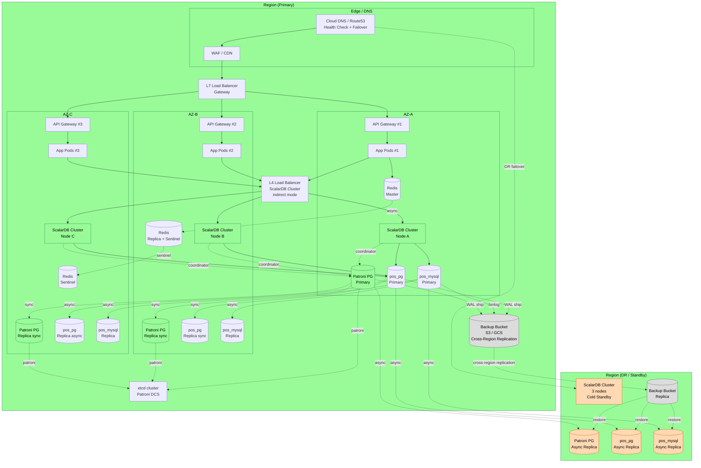

:::message
API Gateway/BFFのルーティング・認証・障害制御と、HA/DR・可観測性・バックアップを含む運用設計を読み解きます。
:::

## API Gateway/BFF設計

`api-gateway-design.md` では、API Gateway/BFFの役割も定義されています。


*API Gateway/BFFの設計*

::::details レポート全文
---
title: API Gateway 設計
schema_version: 1
phase: "Phase 3: Design"
skill: design-api
generated_at: 2026-05-14T00:00:00Z
input_files:
  - reports/03_design/target-architecture.md
---

# API Gateway 設計 — legacy-pos-monolith

## 設計方針

1. **Spring Cloud Gateway を採用**: 同じ Java/Spring エコシステム内で完結
2. **BFF（Backend For Frontend）を兼ねる**: Web UI 向けに集約レスポンスを返却
3. **JWT 認証検証を集約**: 各サービスは認証検証ロジックを持たない
4. **Phase 4 開始時に導入**: モノリス段階では Gateway は不要、マイクロサービス分離開始時に導入

---

## ルーティング設計

### 公開エンドポイント

| 公開パス | ルーティング先 | 認証 |
|---|---|---|
| `POST /api/auth/login` | Identity Service | 不要 |
| `POST /api/auth/refresh` | Identity Service | JWT |
| `POST /api/auth/logout` | Identity Service | JWT |
| `GET /api/products/**` | Catalog Service | JWT (CASHIER+) |
| `POST /api/checkout` | Checkout Orchestrator | JWT (CASHIER+) |
| `POST /api/checkout/return` | Checkout Orchestrator | JWT (MANAGER+) |
| `*** /api/cart/**` | Cart Service | JWT (CASHIER+) |
| `GET /api/orders/**` | Order Service | JWT (MANAGER+) |
| `*** /api/admin/orders/**` | Order Service | JWT (MANAGER+) |
| `*** /api/admin/inventory/**` | Inventory Service | JWT (MANAGER+) |
| `GET /api/members/{id}/points/**` | Loyalty Service | JWT (CASHIER+) |
| `*** /api/admin/point-rules/**` | Loyalty Service | JWT (MANAGER+) |
| `GET /api/receipts/**` | Receipt Service | JWT (CASHIER+) |
| `*** /api/admin/returns/**` | Return Service | JWT (MANAGER+) |
| `GET /api/dashboard/**` | Dashboard Service | JWT (MANAGER+) |
| `*** /api/admin/users/**` | Identity Service | JWT (ADMIN) |
| `GET /api/admin/audit-logs` | Audit Service | JWT (ADMIN) |

### Web 用 BFF エンドポイント

UI が複数サービスを横断する場合、BFF が集約する:

| BFF エンドポイント | 集約 |
|---|---|
| `GET /bff/dashboard-summary` | Dashboard + 在庫切れリスク + 直近注文 |
| `GET /bff/order-detail/{orderId}` | Order + Payment + Receipt + Member 情報 |
| `GET /bff/return-search?orderId=X` | Order + Payment + Return 履歴 |

---

## 機能設計

### JWT 検証

```yaml
spring:
  cloud:
    gateway:
      filter:
        secure-headers:
          enabled: true
      default-filters:
        - name: TokenRelay
        - name: AuthFilter
          args:
            jwk-uri: http://identity-service:8080/.well-known/jwks.json
```

各リクエストで JWT を検証し、`X-User-Id`, `X-User-Role` ヘッダを下流サービスに付与する。

### レート制限

```yaml
- id: checkout-route
  uri: lb://checkout-orchestrator
  predicates:
    - Path=/api/checkout
  filters:
    - name: RequestRateLimiter
      args:
        redis-rate-limiter.replenishRate: 10  # 10 req/sec
        redis-rate-limiter.burstCapacity: 20
        key-resolver: "#{@userIdKeyResolver}"
```

### Circuit Breaker

```yaml
- id: payment-route
  uri: lb://payment-service
  predicates:
    - Path=/api/payments/**
  filters:
    - name: CircuitBreaker
      args:
        name: paymentCB
        fallbackUri: forward:/fallback/payment
```

### リクエストログ

`X-Trace-Id` を OpenTelemetry が生成し、すべてのサービスを通じて伝播。

---

## エラーレスポンス標準化

すべてのサービスは RFC 7807 (Problem Details) 準拠のエラーレスポンスを返す:

```json
{
  "type": "https://api.legacypos.example/errors/insufficient-stock",
  "title": "Insufficient Stock",
  "status": 422,
  "detail": "Product 12345 has 2 in stock, but requested 5",
  "instance": "/api/checkout",
  "traceId": "00-abcd1234-..."
}
```

---

## API バージョニング戦略

| 戦略 | 理由 |
|---|---|
| URL パスバージョニング `/v1/...`, `/v2/...` | 公開 API として明示的 |
| 後方互換は最低 6 ヶ月維持 | クライアント側の移行猶予 |
| Deprecation ヘッダ `Sunset: ...` | 廃止予定 API の通知 |
::::


主な責務は以下です。

- JWT検証
- ロールベースのルーティング制御
- レート制限
- Circuit Breaker
- リクエストログ
- エラーレスポンス標準化
- APIバージョニング

既存システムでは、画面遷移とREST APIが同じControllerに混ざっていました。特に `RegisterController` はレジ画面と `/api/register/**` を同時に抱えており、プレゼンテーション層の境界が曖昧でした。

ターゲット設計では、Gateway/BFFが外部公開面を集約し、内部サービスは明確なAPI契約に従って公開されます。

ここでも重要なのは、単にGatewayを置くことではありません。

認証・認可、レート制限、障害時のCircuit Breaker、エラー形式の標準化をGatewayで統一することで、各サービスが個別に同じ横断処理を実装しなくて済むようにしています。


### HA/DR・セキュリティ・可観測性・コスト

v3設計では、さらに本番運用に必要な設計が追加されています。


*HA/DR・縮退運用・RTO/RPO設計*

::::details レポート全文
---
title: 災害復旧 (DR) / 高可用性 (HA) 設計
schema_version: 1
phase: "Phase 3: Design"
skill: design-disaster-recovery
generated_at: 2026-05-14T00:00:00Z
input_files:
  - reports/03_design/target-architecture.md
  - reports/03_design/scalardb-schema.md
  - reports/03_design/scalardb-transaction.md
  - reports/review/review-synthesis.md
related_findings:
  - SYN-001 (P0 Blocker — ScalarDB Cluster の HA 構成が未定義)
  - SYN-007 (P1 — DR 戦略・RPO/RTO・バックアップ手順の欠如)
  - SYN-014 (P1 — ScalarDB Tx タイムアウト・OCC ストーム時の挙動)
  - SYN-016 (P1 — Cart Service の Redis 障害時のフォールバック)
  - SYN-038 (P3 — API Gateway のフェイルオーバ・冗長構成)
---

# 災害復旧 (DR) / 高可用性 (HA) 設計 — legacy-pos-monolith

## 設計目的

レビュー指摘 **SYN-001（P0 Blocker）** を解消するために、以下を一貫した設計として明文化する。

1. ScalarDB Cluster 単一障害点（SPOF）の排除
2. coordinator namespace（Consensus Commit のメタデータ）の HA 配置
3. サーキットブレーカと degraded（縮退）モードの定義
4. リトライポリシーの統一
5. BC ごとの **RTO（Recovery Time Objective）** と **RPO（Recovery Point Objective）** の明示
6. マルチ AZ 配置とバックアップ・リストア・DR ドリル運用

---

## 設計原則

| 原則 | 内容 |
|---|---|
| No SPOF | すべてのコントロールプレーン／データプレーンを冗長化（最低 N+1） |
| Multi-AZ | 1 リージョン内最低 3 AZ に分散配置（quorum を成立させるため奇数 AZ） |
| Fail-Fast Writes | 書き込み系は劣化時に即 503 を返し、ユーザに早期フィードバック |
| Read-Through Cache | 読み取り系は短時間ならキャッシュで継続応答（degraded mode） |
| Bulkhead | サービス／DB／Cluster 間でリソースを隔離し、障害伝播を抑制 |
| Tested Recovery | リストアできる前提を四半期テストで実証 |

---

## 1. ScalarDB Cluster HA 構成

### 1.1 構成要件

| 項目 | 設計 |
|---|---|
| ノード数 | **最低 3 ノード**（推奨 3、高負荷時 5） |
| 配置 | **マルチ AZ（AZ 当たり 1 ノード）**、AZ-A/B/C |
| 接続モード | **indirect モード**（クライアント → ロードバランサ → 任意ノード） |
| ロードバランサ | クラウド L4 LB（AWS NLB / GCP TCP LB / Azure Standard LB）+ ヘルスチェック |
| ヘルスチェック | TCP 60053 ポート + gRPC `Health.Check` を 5 秒間隔 |
| セッション固着 | 不要（ScalarDB Cluster は stateless） |
| 認証 | 全ノードで同一の signing key（Cluster Auth）を使用 |
| メトリクス | Micrometer → Prometheus（`/metrics`）、ノード単位とクラスタ集約両方を監視 |

### 1.2 indirect モードを採用する理由

- **direct モード**: クライアントが各ノードに対して個別に接続。クライアント側でメンバーシップを把握する必要があり、ノード追加／削除時にクライアント設定変更が必要。HA・スケールアウトには不向き。
- **indirect モード**: クライアントは LB に対してのみ接続し、LB が任意の正常ノードへ振り分ける。**HA 用途では indirect が必須**。本設計では indirect を採用する。

```yaml
# 全 BC 共通の ScalarDB クライアント設定（Phase 2-5）
scalar.db.transaction_manager: cluster
scalar.db.contact_points: indirect:scalardb-cluster-lb.internal:60053
scalar.db.contact_port: 60053
scalar.db.cluster.grpc.deadline_duration_millis: 5000
```

### 1.3 ノード障害時の挙動

| 障害ケース | LB／Cluster の挙動 | クライアント影響 |
|---|---|---|
| 1 ノード故障 | LB が unhealthy 検知（最大 5 秒）→ 残 2 ノードに振り分け | 進行中 Tx は CommitConflict / Unknown でリトライ。新規 Tx は影響なし |
| 1 AZ 全断 | 残 2 AZ で quorum 維持（3 ノードのうち 2 が生存） | 同上 |
| 2 ノード以上同時故障 | quorum 喪失 → 書き込み停止（read-only mode）→ 復旧オペレーション発動 | 書き込み系 API は 503 でフェイルファスト、読み取り系は cache から degraded 応答 |

### 1.4 Phase 別構成

| Phase | ScalarDB Cluster ノード数 | コーディネータ DB | 想定環境 |
|---|---|---|---|
| Phase 2（モノリス内モジュラ） | 3 ノード（同一 K8s 名前空間） | PostgreSQL Patroni 3 ノード | ステージング相当 |
| Phase 3 | 3 ノード | PostgreSQL Patroni 3 ノード | 本番投入 |
| Phase 4（部分マイクロサービス化） | 3 ノード（同一 Cluster 共有） | 同上 | 本番、サービス毎にクライアント認証分離 |
| Phase 5（完全マイクロサービス化） | **5 ノード**（負荷増を見込み）または BC 別 Cluster 分離 | PostgreSQL Patroni 5 ノード | 本番、2PC 参加者数増を見込んだ拡張 |

---

## 2. coordinator namespace の HA RDB 配置

### 2.1 役割と重要性

`coordinator.state` テーブルは **Consensus Commit が Tx の最終状態（COMMITTED / ABORTED）を記録する真実の単一源**。ここがロストすると、進行中 Tx の状態を判定できなくなり、データの一貫性が破綻する。

### 2.2 配置先選定

| 候補 | 結論 | 理由 |
|---|---|---|
| PostgreSQL（Patroni 構成） | **採用（第 1 候補）** | 既存 pos_pg と同種、PITR・WAL レプリケーション・自動フェイルオーバが Patroni で標準化 |
| MySQL（Galera Cluster） | 代替案 | MySQL 偏重スタック時に検討。Galera は writer 衝突に注意 |
| 既存 pos_pg / pos_mysql 同居 | 不採用 | 業務 DB と coordinator が同時障害になるリスクを回避するため、**物理的に分離した RDB クラスタ**に配置 |

### 2.3 Patroni 構成

| 項目 | 設計 |
|---|---|
| クラスタ規模 | **PostgreSQL 3 ノード（Primary 1 + Replica 2）** |
| 配置 | 各 AZ に 1 ノード |
| レプリケーション | Streaming Replication（synchronous_commit=remote_apply、quorum-based） |
| フェイルオーバ | Patroni + etcd（DCS）による自動フェイルオーバ |
| バックアップ | pgBackRest（毎時 WAL 退避 + 日次フルバックアップ） |
| RPO | **0**（synchronous quorum レプリケーション） |
| RTO | **30 秒以内**（Patroni 切替 5〜30 秒） |

### 2.4 ScalarDB 設定

```yaml
# coordinator namespace を専用クラスタに向ける
scalar.db.consensus_commit.coordinator.namespace: coordinator
scalar.db.multi_storage.storages.coordinator.storage: jdbc
scalar.db.multi_storage.storages.coordinator.contact_points: \
  jdbc:postgresql://coordinator-patroni-leader:5432/coordinator?targetServerType=primary&loadBalanceHosts=true
scalar.db.multi_storage.storages.coordinator.username: coord_user
scalar.db.multi_storage.storages.coordinator.password: ${COORD_PASSWORD}

# namespace_mapping に coordinator を追加
scalar.db.multi_storage.namespace_mapping: \
  catalog:postgres,loyalty:postgres,receipt:postgres,identity:postgres,audit:postgres,\
  inventory:mysql,order:mysql,payment:mysql,return:mysql,\
  coordinator:coordinator
```

> 注: ScalarDB の `targetServerType=primary` は libpq の標準パラメータで、Patroni HAProxy などのフロントが Primary 切替を反映してくれる前提。

---

## 3. サーキットブレーカ（Resilience4j）

### 3.1 全体方針

各 BC のクライアント側（特に Checkout Orchestrator → Order/Inventory/Payment 等）にサーキットブレーカを実装。Cluster 全体の可用性を守るため、**呼び出し側で fail-fast** する。

### 3.2 設定値（Resilience4j）

```yaml
resilience4j.circuitbreaker:
  instances:
    scalardb-cluster:
      slidingWindowType: COUNT_BASED
      slidingWindowSize: 50
      minimumNumberOfCalls: 20
      failureRateThreshold: 50          # 50% 失敗で OPEN
      slowCallRateThreshold: 80         # 80% が slow call で OPEN
      slowCallDurationThreshold: 2s
      waitDurationInOpenState: 10s
      permittedNumberOfCallsInHalfOpenState: 5
      automaticTransitionFromOpenToHalfOpenEnabled: true
      recordExceptions:
        - com.scalar.db.exception.transaction.CommitException
        - com.scalar.db.exception.transaction.UnknownTransactionStatusException
        - io.grpc.StatusRuntimeException
      ignoreExceptions:
        - com.example.legacypos.exception.BusinessRuleViolationException
```

### 3.3 状態遷移と挙動

| 状態 | 挙動 | UI への影響 |
|---|---|---|
| CLOSED（正常） | すべての呼び出しを通過 | 通常 |
| OPEN（遮断） | 即 `CallNotPermittedException` を投げる | 書き込み系: 503、読み取り系: degraded（後述） |
| HALF_OPEN | 5 件試行 → 半数以上成功で CLOSED へ復帰 | プローブ中、ユーザには通常応答 |

### 3.4 サービス別の Bulkhead

| サービス | サーキットブレーカ名 | 並列度上限 |
|---|---|---|
| Checkout Orchestrator | `scalardb-cluster-checkout` | 50 並列 |
| Inventory Service | `scalardb-cluster-inventory` | 30 並列 |
| Catalog Service（読み） | `scalardb-cluster-catalog-read` | 100 並列 |
| Dashboard Service | `scalardb-cluster-dashboard` | 20 並列（影響範囲限定） |

---

## 4. Degraded（縮退）モード設計

### 4.1 ポリシー

| API 種別 | Cluster 障害時の挙動 |
|---|---|
| **書き込み系**（`POST /checkout`, `POST /returns`, `POST /products` 等） | **503 Service Unavailable で即フェイルファスト**。Idempotency-Key を返却し、再試行を促す |
| **読み取り系（クリティカル）**（`GET /products/{id}`, `GET /stocks/{id}`） | Caffeine ローカルキャッシュ + Redis 共有キャッシュから返却。`X-Degraded: true` ヘッダ付与 |
| **読み取り系（非クリティカル）**（`GET /dashboard/*`） | Read Model（CQRS Read DB）から返却（後述）。Cluster 経由しないため影響を受けない |
| **認証系**（`POST /auth/login`） | Identity Service の JWT 発行は ScalarDB 依存だが、既発行 JWT の検証は公開鍵で完結（影響なし） |

### 4.2 読み取りキャッシュ階層

```
[Client]
   ↓
[API Gateway]
   ↓ (X-Cache-Control)
[Service]
   ↓
[L1: Caffeine (in-process, TTL 60s)]
   ↓ miss
[L2: Redis (shared, TTL 5min)]
   ↓ miss
[ScalarDB Cluster]  ← Circuit OPEN なら L1/L2 のみで応答（stale-while-error）
```

**stale-while-error**: 通常 TTL を超えていても、Cluster が OPEN 状態のときに限り **最大 1 時間** キャッシュを返す。`X-Degraded: true` ヘッダで明示。

### 4.3 書き込み系のフェイルファスト実装

```java
@PostMapping("/checkout")
public ResponseEntity<CheckoutResponse> checkout(@RequestBody CheckoutRequest req) {
    if (clusterCircuit.getState() == OPEN) {
        return ResponseEntity.status(503)
            .header("Retry-After", "30")
            .header("X-Degraded", "true")
            .body(CheckoutResponse.unavailable(req.idempotencyKey()));
    }
    // ... 通常フロー
}
```

### 4.4 Cart Service（Redis）の degraded（SYN-016 対応）

| Redis 状態 | 挙動 |
|---|---|
| 通常 | 通常 R/W |
| Redis Sentinel フェイルオーバ中（10 秒以下） | クライアント側で 3 回リトライ（jittered backoff） |
| Redis 全断 | Cart 操作は **メモリ内 Map（in-process fallback、TTL 5min）** に切替。**注文確定はブロック**（カート不一致のリスクを回避） |

---

## 5. リトライポリシー（統一）

### 5.1 共通仕様

すべての ScalarDB Tx 起点・サービス間呼び出しで **以下のリトライポリシーに統一**する。

| 項目 | 値 |
|---|---|
| **戦略** | jittered exponential backoff（フルジッタ） |
| **初期遅延** | 100ms |
| **倍率** | 2.0 |
| **最大遅延** | 2000ms |
| **最大試行回数** | **3 回**（初回 + リトライ 2 回） |
| **デッドライン（合計）** | **5 秒**（超過時は即座に呼び出し元へエラー伝搬） |
| **対象例外** | `CommitConflictException`, `UnknownTransactionStatusException`（読み取り再確認後）, gRPC `UNAVAILABLE` |
| **対象外例外** | `IllegalArgumentException`, ビジネス例外（在庫不足等） |

### 5.2 Resilience4j 設定

```yaml
resilience4j.retry:
  instances:
    scalardb-tx:
      maxAttempts: 3
      waitDuration: 100ms
      exponentialBackoffMultiplier: 2.0
      randomizedWaitFactor: 0.5      # full jitter
      retryExceptions:
        - com.scalar.db.exception.transaction.CommitConflictException
        - io.grpc.StatusRuntimeException
      ignoreExceptions:
        - com.example.legacypos.exception.BusinessRuleViolationException
```

### 5.3 デッドライン伝播

API Gateway が `X-Request-Deadline: 2026-05-14T10:30:05Z` ヘッダで全体デッドラインを下流に伝播。各サービスは残り時間を計算してリトライ可否を判断する。

### 5.4 OCC ストーム対策（SYN-014 対応）

- 5 秒のデッドラインを越えるホットスポットが検出された場合、Adaptive Concurrency Control（クライアント側 token bucket）で同時 Tx 数を絞る
- Prometheus アラート: 1 分間で `CommitConflictRate > 5%` が継続したら Slack ページャ

---

## 6. RTO / RPO テーブル

### 6.1 BC（Tier）ごとの目標

| Tier | BC | RTO | RPO | 根拠 |
|---|---|---|---|---|
| **Tier 1（クリティカル）** | Checkout Orchestrator (S8) | **5 分** | **0** | 売上停止 = 直接的な機会損失。レジ業務継続必須 |
| Tier 1 | Order Service (S3) | **5 分** | **0** | 注文ロストは会計責任問題に直結 |
| Tier 1 | Payment Service (S4) | **5 分** | **0** | 二重課金・取りこぼしは法的リスク |
| Tier 1 | Inventory Service (S2) | **5 分** | **0** | 在庫整合性が崩れると返品・棚卸不能 |
| Tier 1 | Identity Service (S10) | **5 分** | **0** | 認証停止 = 全サービス利用不可 |
| Tier 1 | API Gateway (S13) | **5 分** | **0** | 全 API の入口 |
| **Tier 2（重要）** | Loyalty Service (S5) | **30 分** | **1 分** | ポイント加算は事後追跡可能。短期欠落は補償可能 |
| Tier 2 | Receipt Service (S6) | **30 分** | **1 分** | レシート再発行は事後的に対応可能 |
| Tier 2 | Catalog Service (S1) | **30 分** | **1 分** | キャッシュで継続可能（degraded） |
| Tier 2 | Cart Service (S9) | **30 分** | **1 分** | セッション再構築でユーザ影響を限定 |
| Tier 2 | Return Service (S7) | **30 分** | **1 分** | 返品は時間的猶予がある |
| **Tier 3（補助）** | Audit Service (S11) | **4 時間** | **1 時間** | 監査ログは事後再構成可能（イベントを Outbox から再リプレイ） |
| Tier 3 | Dashboard Service (S12) | **4 時間** | **1 時間** | KPI 集計は遅延可（Read Model 再構築可） |

### 6.2 インフラ要素ごとの目標

| 要素 | RTO | RPO | 復旧手段 |
|---|---|---|---|
| ScalarDB Cluster ノード | **30 秒** | 0 | LB ヘルスチェックで自動切替 |
| coordinator (Patroni Primary) | **30 秒** | 0 | Patroni 自動フェイルオーバ |
| pos_pg / pos_mysql Primary | **2 分** | 0 | Patroni / MySQL Group Replication 自動切替 |
| AZ 全断 | **5 分** | 0（Tier1）/ 1 分（Tier2） | 残 2 AZ で継続、新規ノードを別 AZ に再配置 |
| リージョン全断 | **4 時間**（Tier1）/ **24 時間**（Tier2/3） | **15 分** | DR リージョンへ手動フェイルオーバ（後述） |

### 6.3 検証方法

| 目標 | 検証方法 | 頻度 |
|---|---|---|
| RTO（コンポーネント） | カオスエンジニアリング（ノード kill）+ メトリクスで復旧時間計測 | **月次** |
| RTO（リージョン） | DR ドリル（手動フェイルオーバ） | **半期** |
| RPO | バックアップ restore + 最終 commit との時間差を計測 | **四半期** |

---

## 7. マルチ AZ デプロイ図



---

## 8. バックアップ・リストア設計

### 8.1 バックアップ戦略

| データ | 方式 | 頻度 | 保管期間 | 保管場所 |
|---|---|---|---|---|
| pos_pg（PostgreSQL） | **論理（pg_dump）** + **物理（pgBackRest）** | 論理: 日次 / 物理: フル日次 + WAL 連続 | フル: 35 日 / WAL: 35 日 / 月次保管: 1 年 | S3（cross-region replication 有効） |
| pos_mysql（MySQL） | **論理（mysqldump）** + **物理（XtraBackup）** + **binlog** | 論理: 日次 / 物理: フル日次 + binlog 連続 | 同上 | 同上 |
| coordinator（Patroni PG） | pgBackRest（同上） | フル日次 + WAL 連続 | 35 日 | 同上 |
| ScalarDB schema 定義 | Git 管理（IaC） | 変更時 | 永続 | Git |
| 設定（K8s manifests, Terraform） | Git 管理 | 変更時 | 永続 | Git |

### 8.2 バックアップ整合性

- ScalarDB の Tx 整合性を保つため、**論理バックアップは静止点（Snapshot Isolation での `pg_dump --serializable`）で取得**
- 物理バックアップは pos_pg / pos_mysql / coordinator の **3 系統を同一の wall-clock 時刻でスナップショット**（クラウドベンダのインスタンススナップショット同時実行）
- バックアップジョブ完了後にチェックサム検証

### 8.3 リストア手順（要約）

```
[Tier1 障害（業務 DB Primary 喪失）]
1. Patroni / GroupReplication が新 Primary を昇格（自動、30秒〜2分）
2. ScalarDB Cluster の接続文字列が新 Primary を解決
3. アプリは circuit breaker が CLOSED に戻るまで degraded 動作
4. 復旧後、pgBackRest で旧 Primary を replica として再構築

[業務 DB 全断（PITR が必要）]
1. インシデントコマンダ（オンコール）が DR 宣言
2. S3 から最新フルバックアップを restore（pos_pg, pos_mysql, coordinator）
3. WAL / binlog を任意時点まで適用（PITR）
4. ScalarDB schema-loader で coordinator namespace を検証
5. 進行中だった可能性のある Tx を `coordinator.state` で照合し、ABORTED の Tx を確認
6. アプリを再起動し、circuit breaker reset
7. オンライン化（DNS 切替）

[リージョン全断 — DR ドリル相当]
1. Route53 Health Check が unhealthy 検知 → DR リージョンへ DNS フェイルオーバ
2. DR リージョンの async replica を Primary 昇格
3. 失われた最大 15 分間の binlog/WAL を best-effort で適用（RPO 15 分）
4. Outbox から未処理イベントをリプレイ
5. オンライン化告知 + 顧客通知
```

### 8.4 リストアテスト（必須）

| テスト種別 | 頻度 | 検証項目 |
|---|---|---|
| 論理バックアップからの完全 restore | **四半期** | 復旧時間、データ整合性チェックサム、ScalarDB Tx の再現 |
| PITR テスト | **四半期** | 任意時点（過去 24 時間以内）への復旧成功 |
| coordinator namespace 単独 restore | **四半期** | 進行中 Tx の状態判定が成立すること |
| DR リージョンフェイルオーバ | **半期** | 全 BC が DR で起動し、E2E シナリオがパスすること |

> **リストアテストしないバックアップは存在しないバックアップ**を原則とし、テスト失敗時は即修正タスクを起票する。

---

## 9. DR ドリル運用設計

### 9.1 ドリル種別と頻度

| ドリル | 内容 | 頻度 | 所要時間 | 影響範囲 |
|---|---|---|---|---|
| **ノード障害ドリル** | ScalarDB Cluster 1 ノードを kill し、LB 切替・circuit breaker 動作を確認 | **月次** | 30 分 | ステージング |
| **AZ 障害ドリル** | 1 AZ をネットワーク分離し、quorum 維持を確認 | **月次** | 1 時間 | ステージング |
| **Patroni フェイルオーバドリル** | coordinator Primary を kill し、自動昇格時間を計測 | **月次** | 30 分 | ステージング |
| **業務 DB フェイルオーバドリル** | pos_pg / pos_mysql Primary を順番に切替 | **月次** | 1 時間 | ステージング |
| **PITR リハーサル** | 任意時点までのリストアを sandbox で実施 | **四半期** | 4 時間 | sandbox（本番影響なし） |
| **リージョン DR ドリル** | DR リージョンへ完全切替し、E2E シナリオ実行 | **半期** | 8 時間 | DR リージョン |
| **Game Day（カオス）** | 複数障害を同時注入（ScalarDB ノード + Redis Sentinel + ネットワーク分割） | **半期** | 4 時間 | ステージング |

### 9.2 ドリル運用ルール

- **必ずシナリオ事前共有**: ドリル 1 週間前に Runbook と期待結果を SRE / オンコールへ周知
- **観測可能性必須**: メトリクス・ログ・トレースを記録し、事後レビューで可視化
- **フィードバックループ**: ドリル後 2 営業日以内にポストモーテムを作成し、Runbook を更新
- **本番ドリル**: 半期の DR ドリルは本番環境で実施（事前告知 + メンテナンスウィンドウ）

### 9.3 ドリル成否の判定基準

| 指標 | しきい値 |
|---|---|
| RTO 達成 | Tier1: 5 分以内、Tier2: 30 分以内、Tier3: 4 時間以内 |
| RPO 達成 | Tier1: 0、Tier2: 1 分以内、Tier3: 1 時間以内 |
| degraded mode 動作 | 書き込み 503・読み取りキャッシュ応答が想定通り |
| サーキットブレーカ | OPEN → HALF_OPEN → CLOSED の遷移が観測される |
| 監査ログ | ドリル中のすべての操作が Audit Service に記録される |

---

## 10. Phase 別ロードマップ

| Phase | 必須対応 | オプション |
|---|---|---|
| Phase 2 | ScalarDB Cluster 3 ノード（indirect）+ Patroni 3 ノード + サーキットブレーカ + リトライポリシー + 月次ノード障害ドリル | DR リージョンは未構築 |
| Phase 3 | 上記 + 四半期リストアテスト + Read Model（Dashboard） | DR リージョン構築開始（async replica のみ） |
| Phase 4 | 上記 + 半期 DR ドリル開始 + Game Day | BC 別 Cluster 分離検討 |
| Phase 5 | ScalarDB Cluster 5 ノード（または BC 別 Cluster）+ DR リージョン本格運用 | Active-Active 化（要件次第） |

---

## 11. 関連ドキュメント

- `target-architecture.md` — システム全体図と9. 信頼性・可用性セクション
- `scalardb-schema.md` — coordinator namespace 設計
- `scalardb-transaction.md` — リトライ戦略・OCC 衝突率
- `review-synthesis.md` — SYN-001 / SYN-007 / SYN-014 / SYN-016 / SYN-038
- 後続ドキュメント（別スキルで作成予定）:
  - `observability.md` — メトリクス／SLI／SLO／アラート閾値
  - `security.md` — シークレット管理、JWT 鍵ローテーション
  - `infrastructure.md` — K8s manifests、Terraform、IaC
::::


最初の設計レビューでは、マイクロサービスの形は描かれていたものの、以下が不足していました。

- ScalarDB ClusterのHA構成
- Dashboard Read DBのDR戦略
- Polling Publisher/ProjectorのHAとリーダー選出
- JWT失効・鍵ローテーション
- 監査ログのWORM保管
- SLI/SLO、アラート、Runbook
- 独立CI/CD
- キャパシティ計画とコスト

これらを補う形で、`08_infrastructure/` と `05_estimate/` の文書が追加されています。

たとえばインフラ設計では、AWS EKSを前提に、東京リージョンをPrimary、大阪リージョンをDRとする構成が示されています。

| 項目 | 設計 |
| :--- | :--- |
| クラウド | AWS |
| Primary | ap-northeast-1（東京） |
| DR | ap-northeast-3（大阪） |
| Kubernetes | EKS |
| DB | RDS PostgreSQL/Aurora MySQL/ScalarDB Cluster |
| Secret | AWS Secrets Manager + Vault |
| GitOps | Argo CD |
| Observability | Prometheus/Loki/Tempo/Grafana/OpenTelemetry |

可観測性設計では、全サービス共通のSLI/SLOも定義されています。

| サービス | Availability | Latency P95 | Error Rate |
| :--- | :---: | :---: | :---: |
| Checkout Orchestrator | 99.9% | 1.5s | 0.1%未満 |
| Payment Service | 99.9% | 1.5s | 0.1%未満 |
| Inventory Service | 99.95% | 500ms | 0.05%未満 |

セキュリティ設計では、JWTを短命化し、重要操作ではIntrospectionを必須化し、ロール変更や権限剥奪が5〜10分以内に反映されるようにしています。

また、コスト見積では、本番・開発・ステージング・DR-testの4環境を前提に、月額約1,100万円、3年TCO約3.96億円という概算まで出しています。

ここまでくると、単なるリファクタリング設計ではなく、**本番運用できるアーキテクチャ案**に近づいています。

## 本章のまとめ

* API Gateway/BFF設計では、認証、ルーティング、レート制限、Circuit Breaker、エラーレスポンス標準化を整理しました。
* 運用設計では、ScalarDB ClusterのHA構成、DR、バックアップ、縮退モード、リトライ、可観測性まで扱っています。
* コスト見積やSLI/SLOまで含めることで、単なる設計図ではなく本番運用を前提にしたアーキテクチャ案へ近づきました。

## 用語解説

### API Gateway
外部クライアントからの入口となり、認証、ルーティング、レート制限、レスポンス整形などを担うコンポーネントです。

### BFF
Backend for Frontendの略で、特定のフロントエンドに合わせてAPIを集約・変換する層です。画面ごとの使いやすいAPIを提供できます。

### Circuit Breaker
障害が起きている下流サービスへの呼び出しを一時的に止め、連鎖障害を防ぐ仕組みです。

### RTO/RPO
RTOは復旧までに許容できる時間、RPOは失ってよいデータ量や時間を表します。DR設計やバックアップ設計の基準になります。

### SLI/SLO
SLIは可用性や遅延などのサービス指標、SLOはその目標値です。運用時に品質を測定するための基準になります。
