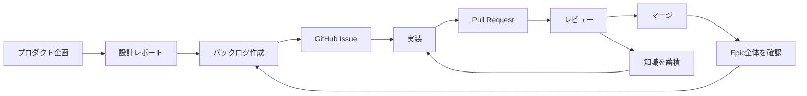

## はじめに

AIを使ったコード生成は、開発現場でも珍しくなくなりました。

実際のプロダクト開発では、コードを書く前後にも多くの作業があります。設計をバックログへ分解し、GitHub Issueへ登録する。Issueごとに実装してPull Requestを作り、レビューを通してからマージする。レビューで見つかった課題は、次のIssueにも反映しなければなりません。

この記事では、Claude Codeプラグインの **Nexus Architect** を使い、企画、設計、GitHub Issueの作成、実装、レビュー、マージをつなげた流れを紹介します。

### 対象の読者

- Claude CodeやCodexを使った実装を、Issue作成やレビューまで広げたい方
- 設計書からGitHubのバックログを作る流れを知りたい方
- AIによる実装でも、人の承認とマージ条件を残したい方
- Nexus Architectのバックログ関連コマンドを整理したい方

### この記事でわかること

- AI駆動開発とNexus Architectの概要
- `reports/`の設計情報がGitHub Issueへ変わる流れ
- Epic、Sub-Epic、IssueをGitHub上で管理する方法
- `export-backlog`、`deliver-backlog`、`implement-backlog`の役割
- 実装、レビュー、Pull Request、マージの進み方
- レビュー結果を次のIssueへ引き継ぐ仕組み
- GitLabで実行する場合の違い


*企画から設計、Issue、実装、レビュー、マージまでをつなぐ流れ*

## AI駆動開発とは

AI駆動開発は、AIをコード生成だけに使うのではなく、企画、設計、タスク分解、実装、レビューまで開発全体に組み込む進め方です。Claude CodeやCodexなどのコーディングエージェントを、各工程の支援に活用します。

AIは設計案の作成、Issueへの分解、コードの実装、レビューを支援します。一方で、開発範囲、バックログ、Pull Request、マージなど、プロダクトに影響する判断は人が確認します。

この進め方では、作業の完全な自動化よりも、各工程の判断を次へ渡すことを重視します。企画で決めた内容を設計へ渡し、設計をIssueへ落とし込み、実装とレビューの結果を次のIssueへ戻します。工程が分断されると、AIが個々のコードを正しく書いても、プロダクト全体との整合性を保てません。

## Nexus Architectとは

Nexus Architectは、Claude Code向けのアーキテクチャ設計・開発支援プラグインです。企画、設計、バックログ作成、実装、レビュー、マージを個別のスキルとして提供し、それらを順番につなぎます。

### 3つの領域

役割は大きく3つに分かれています。

| 領域 | 主な役割 |
| :--- | :--- |
| `product` | 構想、仮説検証、ペルソナ、UI、機能、データモデル、API、非機能要件を設計する |
| `architect` | システム設計、バックログ作成、実装、レビュー、マージを進める |
| `scalardb` | ScalarDB・ScalarDL向けの設計、コード生成、トラブルシューティングを支援する |

### 開発の流れ

今回の流れは次のとおりです。



### 設計情報の保存

Nexus Architectは、設計結果を`reports/`へ保存します。後続のスキルは同じファイル群を読むため、工程が変わっても設計上の判断を引き継げます。

```text
reports/
  00_core/       # 構想、開発範囲、成功指標、仮説
  01_ux/         # ペルソナ、ジャーニー、ドメインストーリー
  02_spec/       # UIモック、機能一覧、データモデル
  03_domain/     # 境界コンテキスト、API、アーキテクチャ
  04_quality/    # SLA、非機能要件
  backlog/       # 計画、管理情報、レビュー、実装ログ
```

設計の各項目には、種類を表す接頭辞と連番を組み合わせたIDが発行されます。

| ID | 名前 | 内容 |
| :--- | :--- | :--- |
| `VIS-001` | Vision | プロダクトが実現したい状態や、解決する課題 |
| `FEAT-001` | Feature | ユーザーへ提供する機能 |
| `ENT-001` | Entity | データモデルで扱う顧客や案件などの業務概念 |
| `API-001` | API | 機能を実現するためのAPIやエンドポイント |

末尾の`001`は、その種類の中で発行された順番です。たとえばIssueに`FEAT-001`と`API-001`が記載されていれば、実装対象の機能と参照すべきAPI設計をたどれます。これらの関連は`work/traceability.json`へ記録されるため、企画で決めた内容が、どの設計やIssueへ反映されたのかを後から確認できます。

## GitHub/GitLabでの開発（バックログ）

:::message alert
以降はGitHubを使った実行例です。GitLabでも同じ流れを実行できます。GitLabではPull Requestの代わりにMerge Requestを使い、`glab` CLIからIssueを操作します。native Epicを利用できない環境では、Epic、Sub-Epic、IssueをすべてIssueとして登録し、ラベルとタスクリストで階層を表現します。
:::

### バックログベース開発

バックログベース開発では、設計内容をEpic、Sub-Epic、Issueへ分解し、Issueを実装の単位として扱います。各Issueには実装内容、受入基準、参照する設計書を記載します。AIはIssueを起点に実装とレビューを進め、人は計画やPull Requestを確認します。

バックログは単なる作業一覧ではありません。設計と実装をつなぎ、完了条件を共有するための開発上の契約として機能します。

| 特徴 | メリット |
| :--- | :--- |
| 設計をEpic、Sub-Epic、Issueへ段階的に分解する | 企画や設計と、実装するコードの対応を追跡しやすい |
| Issueごとに受入基準と参照資料を持たせる | AIと人が同じ完了条件を確認できる |
| 実装、レビュー、Pull Request、マージをIssue単位で進める | 変更範囲が小さくなり、問題が起きた箇所を特定しやすい |
| Issueと管理ファイルの両方に進捗を残す | 処理を中断しても、未完了の段階から再開できる |
| レビューで得た知識を次のIssueへ引き継ぐ | 同じ指摘の繰り返しを減らし、実装を重ねるほど判断の精度を上げられる |
| Pull RequestまたはMerge Requestで承認を待つ | AIに実装を任せながら、マージの判断は人が管理できる |


*EpicをSub-EpicとIssueへ分解し、Issue単位で実装する構造*

### 準備

GitHubへIssueやPull Requestを作るには、次の準備が必要です。

- 対象プロジェクトをGitリポジトリにする
- GitHubのremoteを設定する
- `gh` CLIをインストールして認証する
- `main`を最初にpushし、default branchに設定する
- Nexus Architectで`reports/`を作成する

認証状態は次のコマンドで確認できます。

```bash
gh auth status
```

`main`をpushする前にfeature branchをpushすると、そのfeature branchがdefault branchになる場合があります。後続のPull Requestで差分が空になる原因となるため、最初に`main`を用意しておくことが大切です。

### Issue作成

#### 出力

設計がそろったら、次のスラッシュコマンドをClaude Codeで実行します。

```text
/architect:export-backlog
```

このコマンドは`reports/`を読み、次の3種類の成果物を作ります。

最初に計画を作ります。

- `backlog-plan.md`: 人が確認するためのバックログ計画
- `backlog-manifest.json`: スキルが処理するための管理情報
- GitHub上のEpic、Sub-Epic、Issue

`backlog-manifest.json`には、各ノードの階層、参照した設計書、GitHub IssueのURL、実装状態などがJSON配列で保存されます。

:::details backlog-manifest.jsonの抜粋

実際のファイルは22ノード・約1,000行あります。ここではEpicとIssueを1件ずつ残し、長い`body`、ほかのノード、実装ファイルの一部を省略しています。プロダクト名とURLも匿名化しました。

```json
[
  {
    "local_id": "E1",
    "level": "epic",
    "title": "プロダクトMVP",
    "labels": [
      "type::epic",
      "status::todo"
    ],
    "parent_local_id": null,
    "source_reports": [
      "reports/00_core/vision-mission-value.md",
      "reports/00_core/scope-definition.md",
      "reports/00_core/success-metrics.md"
    ],
    "traceability": [
      "VIS-001",
      "NSM-001"
    ],
    "remote_github": {
      "number": 1,
      "url": "https://github.com/example/project/issues/1",
      "created_at": "2026-07-31"
    },
    "impl": {
      "status": "done",
      "updated_at": "2026-07-31"
    }
  },
  {
    "local_id": "I1.1.1",
    "level": "issue",
    "title": "案件を新規作成する",
    "labels": [
      "type::issue",
      "domain::deal-management",
      "status::todo"
    ],
    "parent_local_id": "SE1.1",
    "source_reports": [
      "reports/02_spec/feature-list.md",
      "reports/03_domain/api-design.md",
      "reports/02_spec/data-model.md"
    ],
    "traceability": [
      "FEAT-001",
      "API-001",
      "API-004",
      "API-008",
      "ENT-001"
    ],
    "remote_github": {
      "number": 6,
      "url": "https://github.com/example/project/issues/6",
      "created_at": "2026-07-31"
    },
    "impl": {
      "status": "done",
      "files": [
        "backend/src/main/java/example/CreateDealService.java",
        "backend/src/main/java/example/DealController.java"
      ],
      "decisions": [],
      "updated_at": "2026-07-31"
    }
  }
]
```

`local_id`と`parent_local_id`がEpic、Sub-Epic、Issueの親子関係を表します。`traceability`は設計ID、`remote_github`は登録先のIssue、`impl`は実装の進捗と変更ファイルを保持します。

:::

今回のGitHub出力では、Epic 1件、Sub-Epic 4件、Issue 17件の合計22件がGitHub Issueとして登録されました。


*GitHub Issueとして登録されたEpic。Sub-Epicがタスクリストで関連付けられている*

#### GitHub上の階層

GitHub上では、3つの階層をラベルで区別します。

| 階層 | ラベル | 内容 |
| :--- | :--- | :--- |
| Epic | `type::epic` | プロダクト全体の目的と背景 |
| Sub-Epic | `type::sub-epic` | 境界コンテキストや機能領域 |
| Issue | `type::issue` | 実装できる大きさの作業 |

親Issueの本文には、子Issueへのタスクリストが入ります。

```markdown
## Sub-Epics
- [ ] #2 Deal Management
- [ ] #3 Team Visibility
- [ ] #4 Identity & Team
- [ ] #5 Identity & Access Management
```

#### Issueの内容

各Issueには実装内容、受入基準、参照した設計書、作業規模が記載されます。

```markdown
## How
`POST /deals`を実装し、案件を新規作成する。

## Acceptance Criteria
- [ ] 案件名と担当者を指定すると201が返る
- [ ] 存在しない担当者を指定した場合は作成を拒否する
- [ ] 初期ステータスを履歴へ記録する

## References
reports/02_spec/feature-list.md
reports/03_domain/api-design.md

size: M
```

<!-- TODO: 受入基準とReferencesが表示されたGitHub Issue詳細画面のスクリーンショットを追加 -->

#### バックログ計画

計画が先、登録は後です。

:::details backlog-plan.mdの要約

`backlog-plan.md`には、GitHubへ登録する前の計画がまとまっています。

##### 入力

- 構想と開発範囲
- 成功指標
- 境界コンテキスト
- 機能一覧
- API設計
- データモデル
- SLAと非機能要件

##### 階層

```text
Epic
├── Sub-Epic: Deal Management
│   ├── Issue: 案件を新規作成する
│   ├── Issue: 担当案件を一覧表示する
│   ├── Issue: 案件詳細を表示する
│   └── Issue: 進捗ステータスを更新する
├── Sub-Epic: Team Visibility
│   ├── Issue: チーム全体の案件を一覧表示する
│   └── Issue: 更新が滞った案件を強調する
├── Sub-Epic: Identity & Team
│   ├── Issue: TeamとUserのAPIを実装する
│   └── Issue: TeamMembershipのAPIを実装する
└── Sub-Epic: Identity & Access Management
    ├── Issue: Spring Securityを導入する
    ├── Issue: 認証情報から担当者を決定する
    ├── Issue: roleの変更を制限する
    └── Issue: オブジェクト単位の認可を追加する
```

##### 各Issueの内容

各Issueには、次の情報が入ります。

- 実装するAPIと画面
- 検証できる受入基準
- 関連する機能ID、API ID、エンティティID
- 参照元の設計書
- `S`、`M`、`L`による作業規模
- 実装時に注意する既知の問題

##### 未確定事項

目標値が決まっていない指標は`TBD`として残ります。仮説検証を通過していても、需要や採算性が実証されたことにはなりません。未確定の情報を事実として埋めず、検証方法が決まっているかを確認して次へ進みます。

:::

GitHub Issueを作る前に、この計画を人が確認します。再実行時は、すでにGitHubのURLが記録されている項目をスキップするため、同じIssueが重複して作られることも防げます。

### 実装


*Issueごとに実装、レビュー、マージを進め、得た知識を次のIssueへ引き継ぐ*

#### Epic単位

Epic配下のIssueを順番に進める場合は、`deliver-backlog`を使います。

```text
/architect:deliver-backlog
```

`deliver-backlog`は、Issueごとに`implement-backlog`、`review-issue`、`merge-issue`を順番に実行する上位のオーケストレーターです。コードを実装してレビューを行い、Pull Requestを作成した時点で人の承認を待ちます。承認後にマージし、次のIssueへ進みます。

進捗は`backlog-manifest.json`とGitHubのステータスから読み取ります。途中で停止しても、再実行すれば未完了の段階から再開できます。レビューが収束しない場合や人の判断が必要な場合は、そのIssueで処理を止めます。

```text
/architect:deliver-backlog --epic=E1
```

実行内容だけを確認したい場合は、`--dry-run`を指定します。

```text
/architect:deliver-backlog --epic=E1 --dry-run
```

#### Issue単位

個別のIssueだけを実装する場合は、`implement-backlog`を直接実行します。

```text
/architect:implement-backlog
```

`implement-backlog`は`status::doing`のIssueを優先し、なければ`status::todo`から次のIssueを選びます。

#### 共有情報

実装前には、`reports/backlog/shared-context/`へ共有情報を作成します。

| ファイル | 内容 |
| :--- | :--- |
| `architecture-guardrails.md` | パッケージ境界や技術選定の制約 |
| `coding-standards.md` | 命名規則、例外処理、テスト方針 |
| `data-contracts.md` | テーブル定義やデータ変換の規則 |
| `nfr-budgets.md` | SLAと非機能要件の目標 |
| `decisions.md` | 実装中に決めたこと |
| `review-knowledge.md` | レビューで得た教訓 |

#### ブランチとステータス

ブランチ名は、各スキルが同じIssueを特定できるように統一されています。

```text
feature/<issue-id>-<slug>
```

たとえば、次のような名前です。

```text
feature/I1.1.1-create-deal
```

実装が完了すると、Issueのステータスは`status::review`になります。実装しただけでは`status::done`になりません。

<!-- TODO: feature branchとstatus::reviewが確認できるGitHub Issueのスクリーンショットを追加 -->

未マージは未完了です。

### レビュー

レビューは次のコマンドで始めます。

```text
/architect:review-issue
```

`review-issue`は変更差分に加えて、親Epic、Sub-Epic、兄弟Issue、共有情報も確認します。指摘は次の3種類です。

差分だけでは足りません。

- `[B]` 修正必須
- `[S]` 要確認
- `[Q]` 質問

修正必須の指摘がある場合は、修正と再レビューを行います。問題が解消するとGitHubにPull Requestを作成し、Issueを`status::review`へ進めます。


*レビュー完了後に作成されたPull Request。変更内容、関連Issue、テスト結果を確認できる*

レビューで得た教訓は`review-knowledge.md`へ残ります。たとえば、クライアントから渡された`ownerId`をそのまま信用しない、多対多の中間テーブルへ一意性制約を置く、といった内容です。次のIssueを実装する際は、このファイルも前提として読み込まれます。

### マージ

マージは次のコマンドで実行します。

```text
/architect:merge-issue
```

Pull Requestがopenであること、レビューの修正必須項目が0件であること、CIが成功していること、コンフリクトがないことを確認してからマージします。

マージ後は、次の順に状態が更新されます。

1. Issueをcloseして`status::done`にする
2. Sub-Epicのタスクリストを更新する
3. Sub-Epicが完了したらEpicのタスクリストを更新する
4. `backlog-manifest.json`の状態を`done`にする

<!-- TODO: マージ後にIssueがclosedとなり、親Issueのタスクリストが更新された画面のスクリーンショットを追加 -->

Sub-Epicが完了した時点では、Epic全体を改めて確認します。個別Issueでは見つからなかった非対称な実装や、統合テストの不足が見つかれば、新しいSub-EpicやIssueとして次のバックログへ追加します。

## まとめ

今回の流れを通して、AI駆動開発ではコードを生成する速さ以上に、工程をまたいで判断を引き継ぐことが大切だと感じました。企画で決めた開発範囲が設計に残り、その設計がIssueの受入基準になれば、実装に入ってから目的を見失いにくくなります。

Nexus Architectは、`reports/`に残した設計をGitHubまたはGitLabのIssueへ変換し、実装、レビュー、Pull RequestまたはMerge Request、マージまでつなぎます。Epicから個別のIssueへ作業を分解することで、AIが一度に抱える範囲を小さくしながら、プロダクト全体との関係を保てました。

レビューで得た知識が次のIssueへ渡る点も、この進め方の良さです。設計上の制約や過去の指摘を共有情報として蓄積するため、実装のたびに前提を説明し直す手間が減ります。途中で処理を止めても、Issueと`backlog-manifest.json`を確認すれば、続きから再開できます。

AIに任せる作業が増えても、バックログの承認、Pull Requestの確認、マージといった節目には人の判断を残せます。AIが進めやすい単位を用意し、人が確認すべき場所を明確にする。その積み重ねが、企画から実装までをつなぐAI駆動開発になると考えています。
