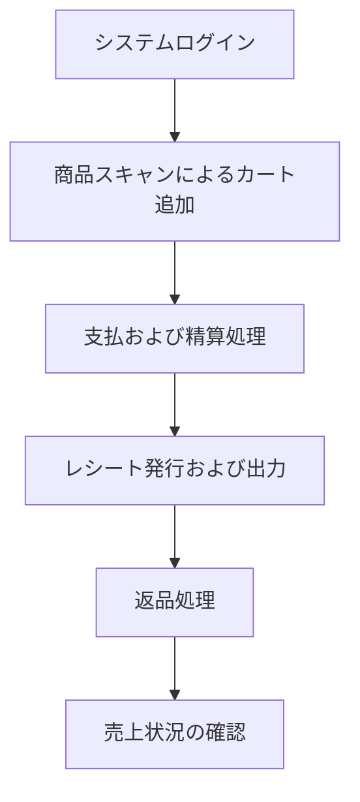

## はじめに

この連載を通して解説する、ScalarDBや分散トランザクション、マイクロサービス、AIを活用した開発などの関連情報は、Scalar Solution Blogでも発信されています。この連載とあわせて参照いただくことで、個別トピックの理解も深めやすくなると思います！！

@[card](https://zenn.dev/p/scalar_sol_blog)

### はじめに

開発の現場において、システムが成長するにつれてソースコードは肥大化し、設計の崩れや密結合といった問題が深刻化していきます。    

保守性や拡張性の低下だけではなく、セキュリティや信頼性といった観点からも既存の課題を放置することはできませんが、目の前のタスクに追われ気づけば何年も放置してしまうなんてこともあると思います。

そこでこの連載では、以下のツールを組み合わせて、安全で高速にモダナイゼーションを実現する体験をお伝えします！

* Nexus Architect（AIエージェント）
  * レガシーシステムのリファクタリングや新規システム設計、DB移行やScalarDBアプリケーション開発を支援する、統合システムアーキテクチャに特化したAIエージェント
* ScalarDB（ミドルウェア）
  * 複数・異種のデータベースを移行することなく仮想的に統合し、データ一貫性を保ったトランザクションやリアルタイムな分析・AI活用を実現するユニバーサルHTAPエンジン
* Compound Engineering（AI開発ワークフロー）
  * 設計書を実装計画へ分解し、実装、レビュー、デバッグ、学習の蓄積を繰り返しながら、AIエージェントによる開発を継続的に改善していくための開発ワークフロー

この三つの技術を組み合わせることで、これまでの膨大な時間とコストを要したリファクタリングから脱却し、確かな事実に基づいた安全なモダナイゼーションを体験できると考えています！


*この連載の全体像*

### この連載の構成

この連載は、Nexus ArchitectとScalarDBを使ってレガシーPOSシステムを分析し、設計し、実装へつなげる流れを6回で追えるように構成しています。

| 回 | 記事 | 主な内容 |
| :--- | :--- | :--- |
| 第1回 | [AI駆動POSリファクタリングの全体像](https://zenn.dev/scalar_sol_blog/articles/nexus-architect-scalardb-01) | Nexus Architect、ScalarDB、題材POSシステム、連載全体の流れ |
| 第2回 | 分析から設計レビューまで実行する | Claude Codeへの導入、調査、分析、評価、再設計、設計レビュー |
| 第3回 | 現状・ドメイン・評価レポートを読む | 現状把握、ドメイン分析、MMI・DDD評価、統合改善計画 |
| 第4回 | ScalarDB設計とレビュー結果を読み解く | 境界コンテキスト、ScalarDBスキーマ、Outbox、Saga、Read Model、運用設計、レビュー結果 |
| 第5回 | Compound Engineeringで実装へつなげる | 実装入力、リファクタリング計画、13サービス構成、インフラ、フロントエンド移行、実装中の学習 |
| 第6回 | 効果測定と実務への活かし方 | リファクタリング前後比較、効果測定、Nexus ArchitectとScalarDBの役割、実務での始め方 |

---

## アーキテクチャ設計支援ツールキット（Nexus Architect） とは？？

:::message
Nexus Architectが、レガシーシステムの調査・分析・再設計・ScalarDB移行をどう支援するツールキットなのかを整理します。
:::

### なぜモダナイゼーションが必要なのか

モダナイゼーションが必要な理由は、簡単にいうと、古いシステムのまま運用をしていくと、事業変化に追いつけなくなるからです。

主に以下の要因があると思います。

1. 変更に時間がかかる
    → 構造が複雑化しやすく、少し機能を直すだけでも影響範囲の確認やテストに時間がかかってしまいます
2. 保守できる人が減る
    → 古めの開発言語や独自仕様に詳しい人が退職・異動すると、属人化が進み、保守が困難になります
3. 障害やセキュリティリスクが高まる
    → 古いライブラリやフレームワークを使っていると、セキュリティパッチが提供されなくなったりして、障害やセキュリティインシデントが発生するリスクが高まります
4. 新しい技術やビジネスに対応しづらい
    → クラウド活用やAI連携、データ分析といった場面で外部サービスとの連携をやりたくても、古い構造だと対応が難しい場合もあります

**モダナイゼーション**は古いものを新しくすること自体が目的ではなく、
**変化に強く、安全で継続的に価値を発揮し続けられるシステムにするために行うこと**が目的です。

そこで今回は、モダナイゼーションを含む統合的なシステムアーキテクチャ設計を支援するAIエージェントである`Nexus Architect`について解説します。

### `Nexus Architect`とは何か？

`Nexus Architect`とは、Claude CodeやCodex上で使うことができる、システムアーキテクチャ設計支援のためのツールキットです。

https://github.com/wfukatsu/nexus-architect

もう少し具体的な表現であらわすと、
**既存システムの調査・再設計や新規システム設計を、DDD/マイクロサービス/ScalarDB観点で設計・レビュー・レポート化するためのAIエージェント用スキル集**です。


*Nexus Architectの概要*

主に以下4つの用途に応じて使い分けることができます。

* レガシーシステムの分析・設計
* 新規システム設計
* ScalarDBを使用したアプリケーション開発
* 既存DBからScalarDBへの移行の設計・実装支援

それぞれ詳しく説明します。

#### レガシーシステムの分析・設計

役割：古いシステムを診断して、改善・刷新計画を作る

ワークフローは以下です。
```
調査
→ 分析
→ 評価
→ 再設計
→ 実装
→ レビュー
→ レポート
```

最終的には以下のレポート群が出力されます。
* API仕様書
* 実装仕様書
* テスト仕様
* インフラ構成
* セキュリティ設計
* 監視・運用設計
* 統合設計レポート

レガシーシステムでは、コードやDB構造を読めばすぐに全体像が分かるとは限りません。
業務ロジックが画面、バッチ、ストアドプロシージャなどに分散していたり、
どの機能がどのデータを更新しているのかが見えづらくなっている場合もあります。

Nexus Architectでは、まず現在の構造や依存関係、責務の偏りを整理し、
そのうえでDDDやマイクロサービスの観点から境界を見直していきます。
既存システムをただ置き換えるのではなく、何を残し、何を分け、どこから段階的に改善するかを考えるための支援として使うことができます。

#### 新規システム設計

役割：これから作るシステムの全体像を、業務・設計・運用の観点から固める

ワークフローは以下です。

```
要求・業務の整理
→ ドメイン分析
→ 境界コンテキスト設計
→ アーキテクチャ設計
→ データ/API/インフラ設計
→ レビュー
→ レポート
```

新規開発では、いきなり実装や技術選定から入るのではなく、
まず業務の言葉、ユースケース、データの一貫性、非機能要件を整理します。
そのうえで、どこを同じ境界として扱い、どこを別のサービスやコンポーネントとして分けるかを設計していく流れになります。

初期段階でアーキテクチャの論点を揃えておくことで、
あとから境界の見直しやデータ配置の変更が大きくなりすぎることを防ぎやすくなります。

#### ScalarDBを使用したアプリケーション開発

役割：ScalarDBを使ったアプリを正しい形で作る

ワークフローは以下です。

```
データモデル決定
→ 設定ファイル生成
→ アプリケーション雛形生成
→ アプリケーション実装
→ コードレビュー
```

まずデータモデル（エンティティ、属性、アクセスパターン、パーティションキー、クラスタリングキー、セカンダリインデックスを整理し、schema.json や schema.sql を生成）を決め、
次に Core/Cluster、CRUD/JDBC、1PC/2PCなどの構成を決め、
そして雛形プロジェクトを生成、実装、レビューを行うワークフローになっています。

#### 既存DBからScalarDBへの移行の設計・実装支援

役割：今あるDBをScalarDB向けの構成へ移す

ワークフローは以下です。

```
今のDBを調べる
→ ScalarDBに移せる形に分析する
→ 移行計画を作る
→ DB内ロジックをJava側に移す
→ レビュー
→ レポート作成
```

特に重要なのは、単なるテーブル移行ではない点です。
Oracle/MySQL/PostgreSQLに入っているストアドプロシージャやトリガーも対象になり、それらをJavaサービスクラスへ変換する支援が含まれています。


ここまでで、4つの活用方法を簡単に説明しました。

今回の本では、1つ目の`レガシーシステムの分析・設計`のワークフローを実践し、
実際にレガシーアプリケーションをモダナイゼーションしていく体験をお伝えしようと思います！


---

## 解析対象とするレガシーPOSシステムの機能と現状の構造

:::message
検証対象となるレガシーPOSシステムの業務機能、モノリス構造、意図的に組み込んだ技術的負債を確認します。
:::

### 検証対象システムの構築目的

前回で解説した、設計改善ツールキットである`Nexus Architect`の動作確認を行うために、あえて設計上の課題を意図的に組み込んだPOSシステムをBefore題材として用います。

実装したモノリシックなPOSシステム内部には、ビジネスロジックが集中し肥大化した巨大クラス、データベースへの不要な問い合わせを繰り返すN+1問題、例外処理の握り潰しといった典型的な技術的負債を組み込んでいます。
後ほど実際のコードとともに説明します！

これらはすべて、モダナイゼーションツールの効果とリファクタリングの妥当性を検証するための仕様に基づいた設計です。

---

### 業務フローと主要機能

レジ担当者および店舗管理者が行う主要なユースケースの全体像を以下に示します。



#### 主要機能

##### 精算処理（チェックアウト）
レジ担当者が顧客から提示された商品を精算し、売上と決済を確定する処理です。

1. キャッシャーの権限を持つユーザーでログインします。
2. 商品バーコードをスキャンし、商品をカートに追加します。
   - 食品（おにぎり、飲料）
   - 日用品（シャンプー）
3. ポイント付与対象の会員IDを入力し、会員属性を紐付けます。
4. 支払方法に現金を選択し、受取金額を入力します。
5. 精算を実行し、画面上に購入明細とポイント付与結果を含むレシートが表示されることを確認します。


*決済画面イメージ*


*決済結果画面イメージ*

##### 返品処理
過去に確定した取引に対して、商品の返還と返金処理を行います。

1. マネージャーの権限を持つユーザーでログインします。
2. 注文IDを入力して過去の取引履歴を検索します。
3. 返品対象の商品と数量を指定します。
4. 返品を実行し、返品内容が反映されたレシートが表示されることを確認します。
5. 在庫管理画面において、返品された数量分だけ在庫数が自動的に復元されていることを確認します。


*返品画面イメージ*


*返品結果画面イメージ*

##### 管理者による売上・在庫確認

閉店後に店長が当日の売上状況や在庫状況を確認する機能です。

1. マネージャーの権限を持つユーザーでログインします。
2. ダッシュボード画面にて、売上サマリーや時間帯別の売上推移グラフを確認します。
3. 注文管理画面に遷移し、確定した注文履歴の一覧を確認します。
4. 在庫管理画面にて現在の在庫状況を確認します（この際、在庫数が少ない商品は強調表示されます）。
5. 在庫の受入（入庫）処理を行います。新しく入庫した数量を入力します。


*注文一覧*


*商品一覧*


##### ユーザー管理

システム管理者が新しいスタッフアカウントを作成・管理する


*ユーザー一覧*


*ユーザー追加*

---

### 技術スタックとモジュール構造

本システムは以下の技術および構成で構築されています。

| 構成要素 | 採用技術およびバージョン |
|---|---|
| 言語およびフレームワーク | Java 11 / Spring Boot 2.7.18（廃止予定の javax 名前空間を維持） |
| ビルドシステム | Maven（単一モジュールのフラット構成） |
| データベース | PostgreSQL 15（マスタ、顧客、ポイント） / MySQL 8.0（在庫、注文、決済、返品） |
| 永続化層 | JdbcTemplate による手書きSQL（ORMやLombokは不使用） |
| 認証・セキュリティ | Spring Security（古い WebSecurityConfigurerAdapter によるセッション管理） |
| ユーザーインターフェース | Thymeleaf によるサーバーサイドレンダリング、jQuery |
| トランザクション管理 | 同一DB内は @Transactional、複数DBをまたぐ処理は手書きの協調制御（Saga） |
| コンテナ環境 | Docker Compose によるアプリケーションおよび各DBのコンテナ実行 |


### ディレクトリ構造と主なコンポーネントについて

問題となっている箇所を中心に、ディレクトリ構造をまとめました。

```
legacy-pos-monolith/
  ├── docker/
  ├── src/
  │   ├── main/
  │   │   ├── java/com/example/legacypos/
  │   │   │   ├── config/        # DataSource（PG / MySQL 二重設定）
  │   │   │   ├── dao/           # JdbcTemplate + 手書き SQL ※命名揺れ①
  │   │   │   ├── repository/    # 〃                  ※命名揺れ①
  │   │   │   ├── domain/        # POJO（Lombok なし・手書き getter/setter）
  │   │   │   ├── saga/          # 手書き Saga（CheckoutSaga: 500行超 God Class）
  │   │   │   ├── security/
  │   │   │   ├── service/       # OrderService: 800〜1200行 God Service
  │   │   │   ├── util/          # Utils.java + CommonUtil.java ※命名揺れ②
  │   │   │   └── web/           # Controller（画面遷移 + JSON API 混在）
  │   │   └── resources/
  │   │       ├── application.properties  # ※設定ファイル混在
  │   │       ├── application.yml         # ※設定ファイル混在
  │   │       ├── db/
  │   │       │   ├── migration-pg/       # PostgreSQL（商品・ユーザー・ポイント等）
  │   │       │   └── migration-mysql/    # MySQL（在庫・注文・支払等）
  │   │       ├── static/
  │   │       └── templates/
  │   └── test/
  └── pom.xml
```


#### 実装したコンポーネント

##### ドメインおよびデータアクセス層
ドメインを表現する15個のPOJOと、データを操作する10個のDAOクラスで構成されています。

命名規則が一貫しておらず、パッケージが分散しており、データアクセスロジックが各所に散在しています。

##### サービス層
売上処理のメイン部分となっている、 `OrderService` は900行を超える巨大クラス（God Class）となっており、単一のクラスが注文処理、統計分析、バリデーション、データアクセスなどの多岐にわたる責務を抱え込んでいます。

そのため、以下のような重大なパフォーマンス上の問題（技術的負債）が意図的に組み込まれています。

###### 1. 注文明細取得におけるN+1問題
注文一覧とそれぞれの明細を含む詳細情報を取得する際、全注文を取得した後にループ内で都度明細テーブルへクエリを発行しています。

これにより、注文数が`N`件ある場合、`N+1`回のデータベース問い合わせが発生し、大量データ処理時にシステムパフォーマンスが著しく低下します。

```java
// OrderService.java より抜粋
public List<Map<String, Object>> getOrderListWithDetails() {
    List<Order> orders = findAll();
    List<Map<String, Object>> result = new ArrayList<>();

    // ！！！ 典型的な N+1 — 注文一覧ループ内で注文ごとに個別の SQL が発行される ！！！
    for (Order order : orders) {
        Map<String, Object> row = new HashMap<>();
        row.put("order", order);
        // orders.size() 回の SELECT が発行される
        List<OrderItem> items = findItemsByOrderId(order.getOrderId());
        row.put("items", items);
        row.put("itemCount", items.size());
        result.add(row);
    }

    return result;
}
```

###### 2. ループ内での連続データベース問い合わせ（N=24 のラウンドトリップ）
ダッシュボード用の時間帯別売上を集計する処理では、単一の `GROUP BY` クエリで集計するのではなく、Javaのループ処理の中で24回（0時から23時まで）連続して個別の `SELECT` クエリを発行しています。

これにより、データベースへの通信（ラウンドトリップ）が不必要に多発します。

```java
// OrderService.java より抜粋
public List<Map<String, Object>> getHourlySales(LocalDate date) {
    List<Map<String, Object>> result = new ArrayList<>();

    // ！！！ 各時間帯について個別にクエリを発行 — 24回のDBラウンドトリップ ！！！
    for (int hour = 0; hour < 24; hour++) {
        // Service 内で直接 JdbcTemplate を使用してSQLを実行
        // ※ DATE() や HOUR() は MySQL 依存の構文です（PostgreSQL 等では別構文が必要になります）
        String sql = "SELECT COUNT(*) as cnt, COALESCE(SUM(total_yen), 0) as total " +
                "FROM orders WHERE DATE(ordered_at) = ? AND HOUR(ordered_at) = ? AND status = 'COMPLETED'";

        Map<String, Object> row = mysqlJdbcTemplate.queryForMap(sql, date.toString(), hour);

        Map<String, Object> hourRow = new HashMap<>();
        hourRow.put("hour", hour);
        hourRow.put("count", row.get("cnt"));
        hourRow.put("total_yen", row.get("total"));
        hourRow.put("label", Utils.padLeft(String.valueOf(hour), 2, '0') + ":00");
        result.add(hourRow);
    }

    return result;
}
```

##### 分散トランザクション層（Saga）
PostgreSQL（マスタ、顧客、ポイント）とMySQL（在庫、注文、決済、返品）の二つの独立したデータベースを更新するため、`CheckoutSaga`（約550行）および `ReturnSaga`（約440行）という手書きのオーケストレーションクラスを用意しています。

###### 1. 手書きのオーケストレーションフロー
このシステムでは、別々のデータベースに対して手動で順番に更新をかけています。

状態管理用の永続化テーブルが存在しないため、途中でプロセスがクラッシュするとロールバックができず、データの不整合が発生するリスクを常に抱えています。

```java
// CheckoutSaga.java より抜粋
public CheckoutResult execute(CheckoutRequest request) {
    // ... 前半の処理・変数定義など ...
    boolean step1Done = false;
    boolean step2Done = false;
    boolean step3Done = false;
    boolean step4Done = false;
    boolean step5Done = false;

    try {
        // ========== Step 1: 注文ヘッダ作成 (MySQL) ==========
        orderId = Utils.generateOrderId();
        // ... (注文・明細データの保存) ...
        orderDao.save(order);
        orderDao.saveOrderItems(orderItems);
        step1Done = true;

        // ========== Step 2: 在庫引当 (MySQL) ==========
        for (CheckoutItem item : request.items) {
            Inventory inv = inventoryDao.findByProductId(item.productId);
            if (inv.getAvailableQuantity() < item.quantity) {
                throw new RuntimeException("在庫不足: " + item.productId);
            }
            inventoryDao.decreaseStock(item.productId, item.quantity);
            // ... (在庫移動履歴の保存) ...
        }
        step2Done = true;

        // ========== Step 3: 支払処理 (MySQL) ==========
        paymentDao.save(payment);
        step3Done = true;

        // ========== Step 4: ポイント加算 (PostgreSQL) ==========
        // 異なるDB（PostgreSQL）のテーブルを直接更新
        pointDao.updateBalance(memberId, pointsEarned);
        pointDao.saveTransaction(ptx);
        step4Done = true;

        // ========== Step 5: レシート発行 (PostgreSQL) ==========
        // 異なるDB（PostgreSQL）のテーブルを直接更新
        receiptDao.save(receipt);
        step5Done = true;

        // ========== Step 6: 注文確定 (MySQL) ==========
        orderDao.updateStatus(orderId, "COMPLETED");
        // ... 冪等性キーの保存など ...

        return new CheckoutResult(true, orderId, receiptId.toString(), null);

    } catch (Exception e) {
        log.error("チェックアウト失敗: " + e.getMessage(), e);
        // ... 補償処理へ ...
```

###### 2. 例外を握り潰す危険な補償トランザクション
さらに深刻な課題として、処理失敗時にそれまでの実行ステップを逆順に取り消す**補償トランザクション**において、各ステップでの例外がキャッチされたあとにログ出力するだけで握り潰され、処理自体はそのまま継続されてしまいます。

```java
// CheckoutSaga.java より抜粋
    } catch (Exception e) {
        log.error("チェックアウト失敗: " + e.getMessage(), e);

        // ========== 補償処理 (逆順) ==========
        // SMELL: すべての補償例外を握り潰す — 意図的欠陥

        if (step5Done) {
            try {
                if (receiptId != null) {
                    receiptDao.updateStatus(receiptId, "VOID");
                }
            } catch (Exception ce) {
                log.error("補償失敗 step5", ce);  // SMELL: swallow and continue
            }
        }

        if (step4Done) {
            try {
                if (memberId != null && pointsEarned > 0) {
                    pointDao.updateBalance(memberId, -pointsEarned);
                    // ... (ポイントトランザクション逆転レコードの保存) ...
                }
            } catch (Exception ce) {
                log.error("補償失敗 step4", ce);  // SMELL: swallow compensation exception
            }
        }
        // 以下、MySQL側の決済・在庫・注文ステータスの補償処理が続くが、同様にすべて個別 try-catch で例外が握り潰される
```

もし補償処理の途中でデータベース接続エラーなどの問題が発生した場合、例外がログに出力されるだけで、処理は強引に次のステップへと進んでしまいます。

その結果、一部のロールバックだけが失敗したまま処理が完了し、複数の独立したデータベース間で深刻なデータの不整合が発生してしまうような設計となっています。

簡単にいうと、決済は取り消されたのに在庫が戻っていない、またはその逆の状態が発生する可能性があるということです...！

##### プレゼンテーションおよびビューテンプレート
Webコントローラーは画面遷移の制御とJSON形式のAPI提供が同一のクラスに混在した構造になっています。

ThymeleafのHTMLテンプレート内には、消費税計算やステータス表示の条件分岐といったビジネスロジックが記述されており、責務の分離ができていません。

---

---

---

## この記事のまとめ

- Nexus Architect、ScalarDB、Compound Engineeringを組み合わせることで、AI駆動開発を単なるコード生成ではなく、分析・設計・レビュー・実装へつながる流れとして扱えることを整理しました。
- 題材となるレガシーPOSシステムには、巨大Service、手書きSaga、複数DB更新、N+1、画面とAPIの混在など、実務でも起きやすい構造的な課題があります。
- この連載では、レガシーPOSの現状把握からScalarDBを使った設計、実装、効果測定までを6回で追い、各回を単体記事としても読める構成にしています。

## 用語解説

### Nexus Architect
Claude CodeやCodex上で使える、システムアーキテクチャ設計支援のためのAIエージェント用スキル集です。既存システムの調査、分析、評価、設計、レビューを一連の流れで支援します。

### ScalarDB
複数・異種データベースをまたいだACIDトランザクションや一貫性制御を扱うミドルウェアです。POSのように注文、在庫、支払、ポイントが複数DBに分かれるシステムで重要になります。

### Compound Engineering
設計、計画、実装、レビュー、学習を積み上げながら、AIエージェントで大きな開発を段階的に進める考え方です。

### God Service / God Class
多すぎる責務が一つのServiceやClassに集中した状態です。変更影響が広がりやすく、テストや分割を難しくします。

### Sagaパターン
複数の処理を順番に実行し、失敗時には完了済み処理を補償トランザクションで取り消す分散トランザクション管理手法です。
