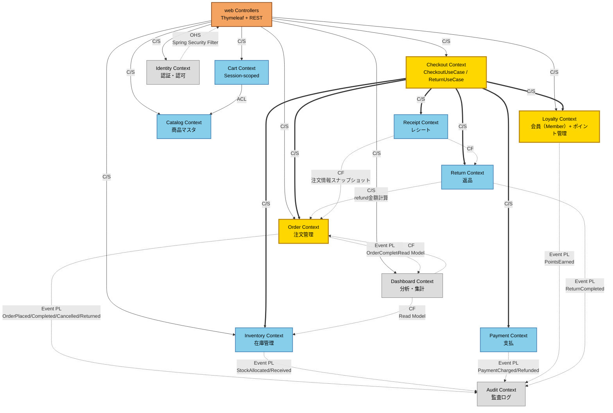
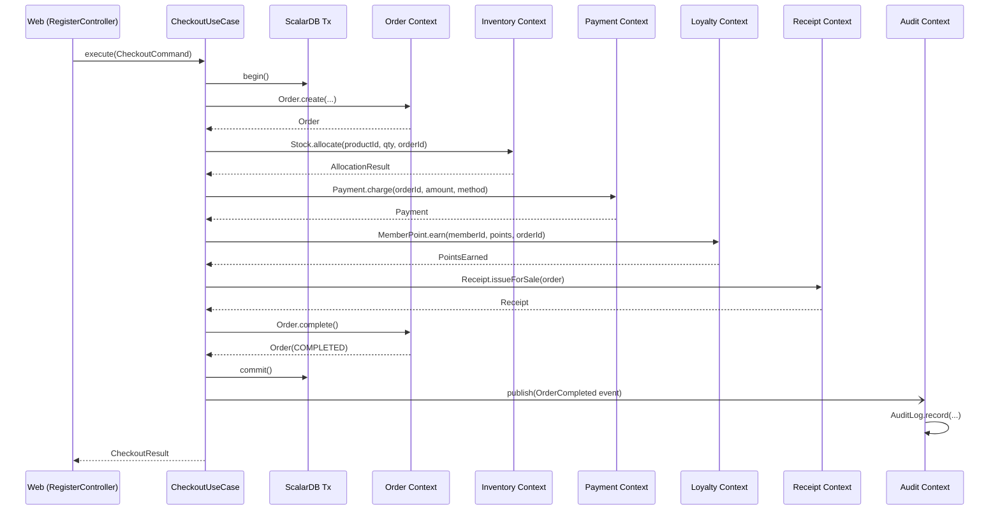

## Claude CodeにNexus Architectを導入する

:::message
Nexus ArchitectをClaude Codeに導入し、/architect系・/scalardb系コマンドを使える状態にする手順を確認します。
:::

### プラグインのインストールと初期設定

nexus-architect は、Claude Code および Codex で動作するシステムアーキテクチャ設計支援のためのプラグインです。静的解析の実行プログラムを単体で起動するのではなく、Claude Code の対話的なコンテキストにおいて、AIエージェントのスキルとして呼び出して利用します。

#### インストール手順

ターミナルにおいて、以下のコマンドを実行し、プラグインを Claude Code の環境に追加します。

```bash
# プラグインマーケットプレイスを追加する
claude plugin marketplace add ./nexus-architect

# アーキテクト向けおよび ScalarDB 向けの両プラグインをインストールする
claude plugin install architect@nexus-architect --scope user
claude plugin install scalardb@nexus-architect --scope user
```

実行すると、以下のようにマーケットプレイスおよびプラグインが正常にインストールされた旨が表示されます。

```text
✔ Successfully added marketplace: nexus-architect (declared in user settings)
✔ Successfully installed plugin: architect@nexus-architect (scope: user)
✔ Successfully installed plugin: scalardb@nexus-architect (scope: user)
```

これにより、Claude Code のセッション内で `/architect:コマンド名` や `/scalardb:コマンド名` という形式で、アーキテクチャ設計および検証のための様々なスキルが実行可能になります。

---

## Nexus Architectで調査と分析を実行する

:::message
Claude Code上でNexus Architectの調査・分析パイプラインを起動し、生成される初期レポートまでの流れを追います。
:::

### 解析コマンドの実行手順とインタラクティブな対話

プラグインが準備できたら、Claude Code のチャットセッションをレガシーPOSモノリスのディレクトリで開始し、以下のコマンドを入力して自動解析パイプラインを起動します。

```bash
/architect:start
```

コマンドを入力すると、AIエージェントは対話を開始し、アウトプット言語と言律設定（ScalarDBを適用するかどうか）について質問を投げかけてきます。

```text
I have a clear picture of the project. This is a legacy refactoring path — an existing Java monolith POS system.

  Before I initialize the pipeline, two quick questions:

  1. Output language?
  - English (default)
  - Japanese

  2. ScalarDB?
  The codebase uses PostgreSQL + MySQL with hand-written Saga coordination — no ScalarDB. Should I:
  - A) Keep no ScalarDB — use design-data-layer path (matches the current architecture)
  - B) Include ScalarDB — design the target architecture with ScalarDB handling cross-DB distributed transactions (the Saga pain
  points would be eliminated)

  Option B is the more interesting refactoring target given the cross-DB Saga complexity in CheckoutSaga and ReturnSaga. Which do
  you prefer?
```

ここでは、日本語での出力と、今回のリファクタリングの主眼である **Option B（ScalarDBを採用してクロスDB分散トランザクションのSaga複雑性を解消する設計）** を選択して進めます。

対話を終えると、AIエージェントはまず `/architect:init-output` を呼び出してパイプラインを初期化します。

```text
まず /architect:init-output でパイプラインを初期化します。
⏺ 初期化完了しました。次は /architect:investigate でコードベース調査を開始します。
```

#### 1. 調査フェーズ（/architect:investigate）

初期化が完了すると、自動的に調査（investigate）フェーズへと進みます。
このフェーズでは、プロジェクトのコードベース全体の静的解析と技術的負債の洗い出しが行われます。

```text
⏺ investigate フェーズが完了しました。

  ---
  調査サマリ

  4つのレポートを生成しました：
```

| レポート | 主要発見 |
| :--- | :--- |
| テクノロジースタック | Spring Boot 2.7.18 (EOL), Java 11 (EOL), DriverManagerDataSource（接続プールなし） |
| コードベース構造 | 56 Java ファイル、OrderService（976行）God Service、CheckoutSaga（557行）God Class、dao/+repository/ パッケージ命名揺れ |
| 技術的負債 | CRITICAL 4件・High 8件・Medium 13件・Low 5件、計30件。最重大は DB 跨ぎ原子性未保証 |
| DDD 準備度 | 総合 29/100。潜在的 BC（8個）は識別可能だが God Service/Saga が境界を崩壊。ScalarDB で手書き Saga を置き換えると TD-002/003/009 が根本解決 |

#### 2. 分析フェーズ（/architect:analyze）

続いて、`/architect:analyze` を実行し、システム全体の機能概要、ユビキタス言語、アクター/ロール、およびコードとドメインの対応関係のドキュメント化を行います。

```text
⏺ analyze フェーズが完了しました。

  ---
  analyze 完了サマリ

  4つのドキュメントを生成しました：
```

| ドキュメント | 主要発見 |
| :--- | :--- |
| system-overview | 10 機能カテゴリ、主要フロー: CheckoutSaga（6ステップ） / ReturnSaga（6ステップ）。決済は System.out.println モック |
| ubiquitous-language | 60+ ドメイン用語。不統一: dao/repository 並存、ポイント type 文字列の混乱、User vs Member の概念分離 |
| actors-roles-permissions | 3 ロール（CASHIER/MANAGER/ADMIN）+ Member。SecurityConfig の URL パターン認可のみ。メソッドレベル認可なし |
| domain-code-mapping | 10 BC 候補、税計算 4 重・ポイント計算 4 重・返品可否 3 重、PaymentService/ReturnService 欠如、DB 境界が BC 境界と不一致 |

##### レポート出力例

###### システム概要 - system-overview.md


*ビジネスコンテキストや主要機能*


*ビジネス制約や主要なビジネスフロー*

###### ユビキタス言語辞書 - ubiquitous-language.md


*ドメイン用語辞書*


*用語の不統一・重複レビュー結果*

###### アクター・ロール・パーミッション - actors-roles-permissions.md


*アクターやロールの定義状況*


*認証認可の実装分析*

###### ドメインコードマッピング - domain-code-mapping.md


*ドメイン概念とコード対応のマトリクス表*


*ビジネスルールの実装箇所トレース一覧*


*ドメイン概念とコードのギャップレビュー結果*


---

この分析結果を受けて、AIエージェントは次のステップとしてモジュラリティ成熟度（MMI）とDDD適合度（DDD）の並列評価、およびドメイン分類・BCマッピングなどのステップを提案します。

---

## MMI・DDD評価と統合評価を実行する

:::message
MMI評価、DDD評価、統合評価を実行し、レガシーPOSの移行準備度と改善優先度を数値で確認します。
:::

### モジュラリティ成熟度（MMI）とDDD適合度の並列評価（evaluate-mmi & evaluate-ddd）

次に、モジュラリティ成熟度（MMI）とドメイン駆動設計（DDD）適合度の並列評価を実行します。

```text
⏺ evaluate-mmi と evaluate-ddd を並列実行します。
...
⏺ evaluate-mmi 完了。次に evaluate-ddd を実行します。
⏺ Skill(architect:evaluate-ddd)
  ⎿  Successfully loaded skill · jp.anthropic.claude-sonnet-4-6

⏺ 3つの DDD 評価エージェントを並列起動します。

⏺ 3 agents finished (ctrl+o to expand)
   ├ DDD strategic design layer evaluation · 3 tool uses · 10.2k tokens
   │ ⎿  Done
   ├ DDD tactical design layer evaluation · 2 tool uses · 10.6k tokens
   │ ⎿  Done
   └ DDD architecture layer evaluation · 1 tool use · 10.3k tokens
     ⎿  Done

⏺ 3軸スコアが揃いました。DDD スコアを計算してレポートを生成します。

  - Strategic: avg 1.3 × 0.30 = 0.39
  - Tactical: avg 1.3 × 0.45 = 0.59
  - Architecture: avg 1.0 × 0.25 = 0.25
  - DDD Score = (0.39 + 0.59 + 0.25) / 5 × 100 = 24.6%（Minimal DDD adoption）
```

##### レポート出力例

###### DDD戦略的設計評価


*基準ごとのスコア、詳細内容*


*改善提言（戦略的設計）*


評価が完了すると、AIエージェントは結果を要約して出力します。MMI平均は46%（Needs Improvement）、DDDスコアは24.5%（Minimal DDD Adoption）であり、両評価とも根本的な再設計が必要という結論で一致しました。

### 統合評価フェーズ（/architect:integrate-evaluations）

次に、MMIとDDDの個別評価を統合し、システム全体の4大横断的課題をあぶり出した上で、目標スコアを含むロードマップを自動策定します。

```text
⏺ integrate-evaluations フェーズが完了しました。

  ---
  統合評価完了サマリ
```

スコアサマリ

| 評価 | スコア |
| :--- | :--- |
| システム平均 MMI | 46%（Needs Improvement） |
| DDD スコア | 24.5%（Minimal DDD Adoption） |

```text
  横断的課題（両評価で一致）
  1. 手書き Saga の構造的欠陥 ─ CheckoutSaga/ReturnSaga が MMI・DDD 双方で最低評価
  2. God Service の崩壊 ─ OrderService(976行)＋PaymentService/ReturnService の欠落
  3. Anemic Domain Model ─ 値オブジェクト・集約ルート・ドメインロジックが皆無
  4. Architecture 層の欠落 ─ Application Service 層の完全欠如、DIP 未適用
```


##### レポート出力例

###### 総合評価レポート


*総合評価、MMIとDDDの統合マトリクス*


*数値サマリなど*

---

## 再設計とScalarDB設計を生成する

:::message
現状分析の結果をもとに、境界コンテキスト再設計、マイクロサービス設計、ScalarDB/API設計を生成する流れを追います。
:::

### 業務境界とシステム構成の再設計（/architect:redesign & /architect:design-microservices）

現状が可視化されたため、ここから本格的な設計フェーズへと移行します。
まず、モノリスを12個の境界づけられたコンテキスト（Bounded Context）に再設計し、統合パターンを自動生成します。

```text
⏺ redesign フェーズ完了しました。

  ---
  再設計完了サマリ

  12 個の Bounded Context

  Core Subdomain（黄）:
  - Order ─ 注文管理（集約ルート: Order + OrderItem）
  - Loyalty ─ ポイント管理（集約: MemberPoint, PointTransactionHistory, PointRule）
  - Checkout ─ Application Service / Use Case 層

  Supporting Subdomain（青）: Catalog / Inventory / Cart / Payment / Return / Receipt
  Generic Subdomain（灰）: Identity & Access / Audit / Dashboard / Analytics
```

##### レポート出力例

###### コンテキストマップ


以下のようなコンテキストマップがMermaid形式で出力されます。



---


*主要な統合パターン*

決済時のシーケンス図



さらに、これに基づき、ターゲットアーキテクチャとして**13個の独立したマイクロサービス**に切り出す変革計画と、切り出し順序を策定します。

```text
⏺ design-microservices フェーズが完了しました。

  ---
  設計完了サマリ
```

ターゲットアーキテクチャ（13 サービス）

| 種別 | サービス |
| :--- | :--- |
| Process（業務処理） | Order, Inventory, Payment, Loyalty, Return, Checkout Orchestrator, Cart |
| Master（マスタ管理） | Catalog, Receipt |
| Supporting（横断的） | Identity, Audit |
| Integration（連携） | Dashboard, API Gateway/BFF |


*アーキテクチャ概観、設計原則、サービスカタログ(全13サービス)*


*各サービスの詳細（責務、エンドポイント、永続化、並行制御、ドメインイベント発行など）*


*システム全体のアーキテクチャ図*

### ScalarDB設計とAPI設計（/architect:design-scalardb & /architect:design-api）

ターゲットアーキテクチャに基づき、データベースレイヤ（ScalarDBスキーマ、トランザクション境界、マイグレーション設計）と、APIインターフェース（OpenAPI 3.x、AsyncAPI、gRPC、BFF向けGraphQL、API Gateway）を並列で自動設計します。

```text
⏺ design-scalardb と design-api を並列実行します。
...
⏺ 両フェーズが完了しました。

  ---
  design-scalardb + design-api 完了サマリ

  ScalarDB 設計（3 ドキュメント）
  - スキーマ: Multi-storage（PostgreSQL + MySQL）構成、9 namespace × 15 テーブル
  - トランザクション: モノリス内（Consensus Commit）から将来的な 2PC（参加者最大3）へ
  - 補償処理は tx.abort() 1 行に集約 ─ 例外握り潰し問題が完全に消滅

  API 設計
  - OpenAPI 3.x: 11 サービス（checkout, order, inventory, payment 等）
  - AsyncAPI: 11 種のドメインイベント（OrderCompleted, StockAllocated 等、Outbox パターン）
  - gRPC（.proto）: サービス間通信用 5 サービス（transaction_id を全 RPC に伝播）
```

##### レポート出力例

###### ScalarDB設計


*ScalarDB スキーマ設計*


*ScalarDB トランザクション設計*

###### API設計


*design-api実行時にOpenAPIのyamlファイルなど生成される*

---

## 設計レビューと再レビューで設計を固める

:::message
5つの観点による設計レビュー、HTMLレポート生成、P0指摘の修正と再レビュー承認までの流れを確認します。
:::

### 5大観点による設計レビューと統合レビュー結果（/architect:review-synthesizer）

設計がひと通り完了したところで、AIエージェントはConsistency（一貫性）ScalarDB（DB制約）Operations（運用）Risk（分散システムリスク）Business（ビジネス要件）の5つの異なる観点から個別のレビューエージェントを並列起動し、それらを `review-synthesizer`エージェントで統合評価します。

設計用のエージェントとは別に、レビュー用のエージェントも実行することで**客観的な評価**が可能になります。

```text
⏺ 5 つのレビュー観点を並列実行します。
⏺ 5 agents finished
   ├ review-consistency: design consistency review
   ├ review-scalardb: ScalarDB-specific constraints review
   ├ review-operations: operational readiness review
   ├ review-risk: distributed system risk review
   └ review-business: business requirements review

⏺ review-synthesizer 完了しました。

  ---
  統合レビュー結果

  総合判定: ❌ FAIL（aggregate 2.625、CRITICAL 4 件で CONDITIONAL_PASS 上限超過）
```

P0 Blockers（設計進行不可・解消必須）

| ID | タイトル | 影響 |
| :--- | :--- | :--- |
| SYN-001 | ScalarDB Cluster の HA 構成が未定義 | Phase 2-4 全体の SPOF |
| SYN-002 | Outbox を Phase 2-3 でオプション化 → at-least-once 保証なし | Audit/Dashboard イベントがサイレントにロスト |
| SYN-003 | 外部決済 SaaS 連携で ScalarDB rollback だけの補償は破綻する | Saga 廃止の前提条件が崩れる |
| SYN-004 | Dashboard の GROUP BY が ScalarDB Standard では実現不可 | TD-008/025 の SQL 最適化主張が技術的に成立しない |

システムリスクやScalarDB固有の制約に関するレビューで致命的課題が4件指摘され、総合判定は **❌ FAIL** となりました。

設計を修正する前に、ここまでの成果物（全35ドキュメントに及ぶ膨大なマークダウン）をすべて統合したHTMLレポートを生成します。

### HTMLレポートの統合生成（/architect:report）

`/architect:report` スキルを実行し、全Markdown成果物を見やすく統合したHTMLレポートを生成します。

```text
⏺ Skill(architect:report)
⏺ ✅ HTML レポート生成完了

  - 出力先:
  /Users/mavs022/Desktop/work/scalar/ai-driven-devops/refactoring-agents/nexus-architect/work/reports/00_summary/full-report.html
  - 統合セクション: 23 個
  - 機能: Mermaid 図ダイアグラム対応、自動 TOC 生成、フェーズ別構成、ダーク/ライトテーマ対応など
```

これで、初回実行セッションにおける全設計のインプットと現状診断、初期レビューでFAILとなりHTMLレポートを生成するまでの全プロセスが完了しました。

ここまでで、Nexus Architectの実行が完了しました。

次回では、これらの生成されたレポート群を読み解き、レガシーPOSシステムが抱える構造的な弱点について深掘りしていきたいと思います。


### 設計レビューの修正と再レビューの承認プロセス

初期設計レビュー（`/architect:review-synthesizer`）による厳格な品質チェックの結果、分散システムにおける4つの致命的な課題が特定され、総合判定は **❌ FAIL** という結果となりました。

ここからは、AIエージェントと対話し、指摘されたP0課題を1つずつ修正して品質ゲートを突破（PASS）するまでの、設計修正プロセスを辿ります。

---

#### 設計レビュー指摘事項（P0 ブロッカー）の修正プロセス

初回レビューで指摘された4つのP0ブロッカー（SYN-001〜SYN-004）は、分散アーキテクチャを構築する上でいずれも本番運用に致命的な影響を及ぼす内容でした。
これらに対し、AIエージェントの専門設計スキル（DR設計、Security設計など）を追加で起動し、対話を繰り返し1つずつ設計をアップデートしました。

##### ① SYN-001：ScalarDB ClusterのHA（高可用性）構成の定義
* **課題**：システム全体の分散トランザクションを管理する ScalarDB Cluster の冗長化方針や障害時の耐障害性（HA）が未定義であり、単一障害点（SPOF）となっていた。
* **解消策**：追加スキル `/architect:design-disaster-recovery` を実行し、3ノード構成の ScalarDB Cluster、調整役としての Patroni coordinator、およびクライアント側に Resilience4j サーキットブレーカを配備する構成を決定。さらに、RTO（目標復旧時間）/ RPO（目標復旧時点）のサービス別目標（Tier 1〜3）を定義した災害復旧設計書（`disaster-recovery.md`）を新規作成しました。


*災害復旧/高可用性設計*

##### ② SYN-002：Outboxパターンの必須化によるメッセージの到達保証
* **課題**：会員ポイント更新や監査ログ、ダッシュボードへのイベント通知について、Outbox パターンがオプション扱いとなっていたため、イベント送信の at-least-once（最低1回配信）が保証されず、イベントがサイレントにロストする懸念があった。
* **解消策**：トランザクション設計を全面的に修正し、Phase 2 からの Outbox パターン適用を必須化。ScalarDBトランザクションとアトミックに書き込まれる `outbox_events` テーブルおよび重複排除用の `processed_event_ids` の DDL を定義し、ポーリングPublisherが安全にイベントをパブリッシュする仕組みを確立しました。

##### ③ SYN-003：外部決済SaaS連携における整合性破綻の解消
* **課題**：Spring 側で例外が発生した際、ScalarDBのトランザクションロールバック（`tx.abort()`）のみで外部決済APIの処理もキャンセルできると想定していたが、既に決済ゲートウェイ側で実行されたクレジットカード課金等はDBロールバックだけでは取り消せない。
* **解消策**：アーキテクチャ内に「副作用境界（Side-Effect Boundary）」を導入。決済処理を非同期の決済ACL Workerおよび `PaymentDEADLETTER` 集約に分離し、エラー発生時には `Compensation Queue`（補償処理キュー）を介して明示的な返金API（返金トランザクション）を呼び出すハイブリッドSagaパターン（`saga-design.md`）を新たに設計しました。


*副作用境界の設計*

##### ④ SYN-004：Dashboardの集計におけるScalarDB Standard機能制約の回避
* **課題**：ダッシュボードの売上集計等で SQL の `GROUP BY` によるスキャン集計を前提としていたが、分散キー/ストレージである ScalarDB Standard では GROUP BY スキャンが使用不可であるため、設計が成立していなかった。
* **解消策**：徹底した CQRS（コマンド・クエリ責務分離）を採用。更新系データベースとは完全に物理分離された PostgreSQL を読み取り専用のダッシュボード用 DB（Read Model）として新設し、注文や在庫のドメインイベントをトリガーに Projector（プロジェクター）が非同期（最終一貫性：P95 < 30秒）で集計済みデータを事前生成して保持する設計（`read-model-design.md`）を構築しました。

これらの設計変更により、3つの新規設計書が追加され、既存の5つの設計ドキュメントがアップデートされました。

| 課題 ID | 課題内容 | 主な解消手段 | 関連ドキュメント |
| :--- | :--- | :--- | :--- |
| **SYN-001** | ScalarDB Cluster HA構成未定義 | 3ノードHA構成 + Patroni + サーキットブレーカ採用 | `disaster-recovery.md` |
| **SYN-002** | Outboxがオプションで配信保証なし | Phase 2よりOutbox必須化、ポーリングPublisher導入 | `scalardb-schema.md` |
| **SYN-003** | 外部決済SaaS連携時の補償破綻 | 副作用境界の概念導入、明示的ハイブリッドSaga設計 | `saga-design.md` |
| **SYN-004** | DashboardでGROUP BYが使用不可 | CQRSリードモデルの導入、分析用独立DBとProjector定義 | `read-model-design.md` |

---

#### 修正（v2）後の再レビュー

P0ブロッカーを解消した状態（v2設計）で再度、統合レビューコマンド `/architect:review-synthesizer` を実行しました。結果、判定は **⚠️ CONDITIONAL_PASS（条件付き合格）** へと劇的に改善され、品質ゲート通過が見える段階に到達しました。

✅ P0 ブロッカー対応後のレビューサマリ (v2)

| 評価 | スコア |
| :--- | :--- |
| 総合判定 | ⚠️ CONDITIONAL_PASS |
| 総合評価スコア | 3.65 / 5.0 (v1: 2.625) |
| CRITICAL (P0) | 0 件 (v1: 4 件) |
| Risk スコア | 4.0 / 5.0 (v1: 1.5) |

##### 設計完了

ここからさらに、本番適用承認となるPASSへと引き上げるため、AIエージェントのガイドに従って残る12件の P1（HIGH）課題（可観測性のSLI/SLOアラート、シークレット管理、Argo CDを用いたGitOpsパイプライン、3年間のインフラTCOコスト見積もり等）の追加設計を完了させました。

この設計の継続的改善を経て、最終レビューでは総合スコア **4.275 / 5.0** というスコアになり、主要な課題がすべて解消されたためここでは完了としました。

🎉 設計・評価ロードマップの最終推移 (v1 → v3)

| 段階 | 判定 | aggregate | CRITICAL | HIGH | 主な作業 |
| :--- | :--- | :--- | :--- | :--- | :--- |
| v1 | ❌ FAIL | 2.625 | 4 件 | 15 件 | 初回設計レビュー（SPOF、Outbox、決済、集計の欠陥） |
| v2 | ⚠️ CONDITIONAL_PASS | 3.65 | 0 件 | 8 件 | P0課題解消（DR/Saga/CQRS新規設計、Outbox必須化） |
| v3 | ✅ PASS (完全承認) | 4.275 | 0 件 | 0 件 | P1/P2課題完全解消（可観測性・インフラ・コスト詳細） |

---

## この記事のまとめ

- Claude CodeへNexus Architectを導入し、調査、分析、MMI・DDD評価、統合評価、再設計、設計レビューまでを実行する流れを整理しました。
- 調査・分析では、コード構造、ドメイン、DB、用語、責務集中を洗い出し、設計生成の前提となる情報を作ります。
- 設計レビューでは、ScalarDB ClusterのHA、Outbox、外部決済の補償、Dashboard集計など、実装前に潰すべき設計リスクが見つかりました。

## 用語解説

### MMI
Modularity Maturity Index（モジュール成熟度指標）の略で、既存モジュールがマイクロサービスとして独立しやすい状態かを評価する指標です。

詳しくは以下の記事を参照ください。

@[card](https://zenn.dev/wfukatsu/articles/467a817fafce6e)


### DDD評価
境界コンテキスト、ユビキタス言語、集約、リポジトリ、依存方向などを通じて、ドメイン設計の成熟度を確認する評価です。

### 設計レビュー
生成された設計を、整合性、運用性、リスク、ScalarDB適用、ビジネス観点などから検証する工程です。

### P0 Blocker
そのまま進めると設計や実装が成立しない重大な指摘です。実装前に必ず解消すべき問題として扱います。

### Outboxパターン
業務データ更新と同じトランザクションでイベントを保存し、あとから非同期に配信することで、イベント欠落を防ぐ設計です。
