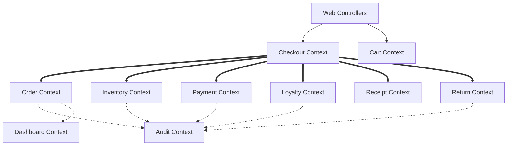
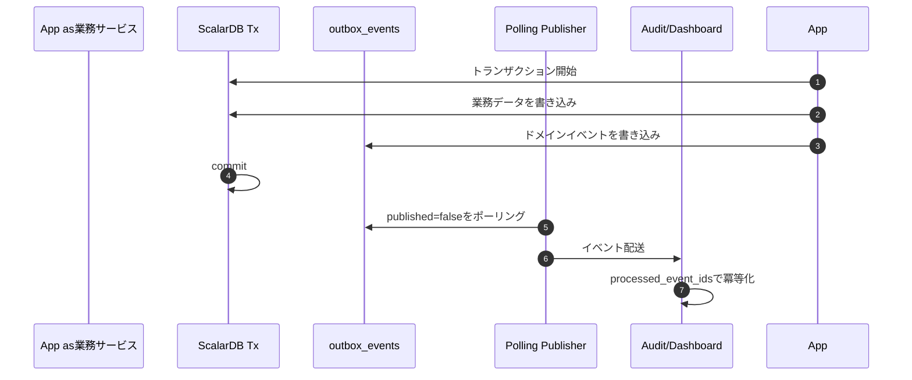
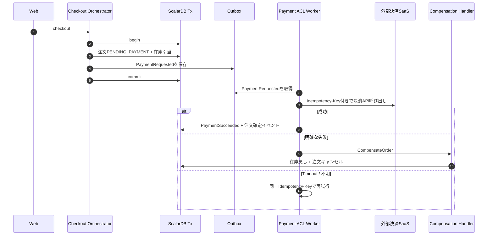
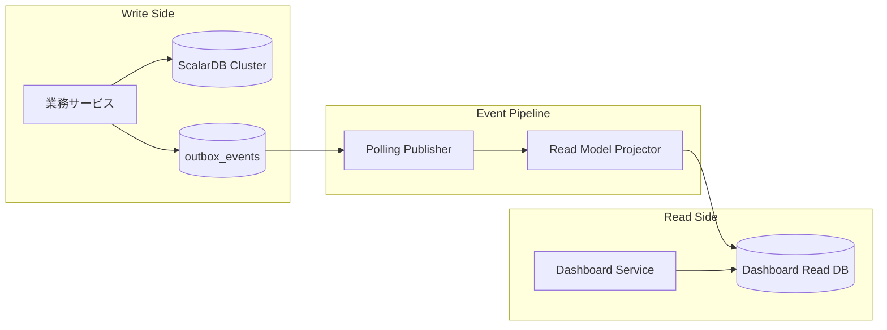

## リファクタリング設計レポートの全体像を読み解く

:::message
設計レポート全体を俯瞰し、境界コンテキスト、ターゲットアーキテクチャ、ScalarDB設計、レビュー結果のつながりを把握します。
:::


ここまでのページでは、Nexus Architectを実行して生成されたレポートのうち、主に以下の流れを見てきました。

```
現状把握（00_summary/） → ドメイン分析（01_analysis） → 評価（02_evaluation）
```

ここからは、その後段にあたる設計・レビューのレポートを数ページに分けて深掘りします。

```
現状把握（00_summary/） → ドメイン分析（01_analysis） → 評価（02_evaluation） → 設計（03_design） → レビュー（review/）
```

この設計・レビュー編では、特に以下の2つにフォーカスします。

- `03_design/` に出力されたリファクタリング後の設計方針
- `review/` に出力された設計レビューと、その指摘を受けた改善の軌跡

この一連のレポートで重要なのは、単にAIがきれいな設計書を出してくれたという話ではありません。

むしろ重要なのは、**初回の設計がレビューで明確にFAILし、その指摘をもとに設計が段階的に強くなっていく過程**です。

レガシーシステムのリファクタリングでは、最初から完璧なターゲットアーキテクチャを描くことはほとんどできません。現状分析、ドメイン分割、技術制約、運用要件、コスト制約、そしてレビューからのフィードバックを何度も往復しながら、ようやく実装に移してよい設計に近づいていきます。

今回のレポート群には、その往復がかなり具体的に現れています。


### 設計・レビュー

#### 各レポート内容の概要

設計フェーズでは、以下のようなMarkdown文書が生成されています。

```text
reports/
  ├── 03_design/
  │   ├── bounded-contexts-redesign.md  # 境界コンテキスト再設計
  │   ├── context-map.md                # 境界コンテキスト間の関係性
  │   ├── target-architecture.md        # 13サービス構成のターゲットアーキテクチャ
  │   ├── transformation-plan.md        # Phase0〜5の段階的移行ロードマップ
  │   ├── scalardb-schema.md            # Namespace・テーブル・キー・Outboxスキーマ
  │   ├── scalardb-transaction.md       # 分散トランザクション・Outbox・Saga境界
  │   ├── saga-design.md                # 外部副作用を扱うハイブリッドSaga
  │   ├── read-model-design.md          # Dashboard集計のCQRS Read Model
  │   ├── api-gateway-design.md         # API Gateway/BFF
  │   └── disaster-recovery.md          # HA/DR・縮退運用・RTO/RPO
  ├── review/
  │   ├── review-synthesis.md           # 初回レビュー（FAIL）
  │   ├── review-synthesis-v2.md        # P0解消後レビュー（CONDITIONAL_PASS）
  │   └── review-synthesis-v3.md        # P1解消後レビュー（4.275点）
  ├── 08_infrastructure/
  │   ├── infrastructure-architecture.md
  │   ├── deployment-guide.md
  │   ├── disaster-recovery-design.md
  │   ├── observability-design.md
  │   └── security-design.md
  └── 05_estimate/
      ├── cost-summary.md
      ├── infrastructure-detail.md
      └── scalardb-sizing.md
```

この中で中心になるのは、`03_design/` と `review/` です。

現状把握・ドメイン分析・評価レポートで見た通り、既存システムには以下のような問題がありました。

- `OrderService` が976行のGod Serviceになっている
- `CheckoutSaga` / `ReturnSaga` が複数DB更新と補償処理を1クラスで抱えている
- MySQLとPostgreSQLを跨ぐ一貫性が手書きSagaに依存している
- DAO/repositoryの命名が混在し、レイヤ境界が曖昧
- Dashboard集計がアプリケーション側のループや全件取得に寄っている
- 監査ログやイベント通知の欠落を構造的に防げていない

設計レポートでは、これらの課題に対して、いきなりマイクロサービス化するのではなく、**モノリス内モジュラ化 → ScalarDB導入 → DDD戦術パターン適用 → 周辺サービス抽出 → コアサービス抽出** という段階的な道筋を描いています。

---

## 境界コンテキスト再設計とターゲットアーキテクチャを読み解く

:::message
境界コンテキスト再設計、コンテキストマップ、13サービスのターゲットアーキテクチャ、段階的移行ロードマップを読み解きます。
:::

### 境界コンテキスト再設計

まず重要なのが、`bounded-contexts-redesign.md` です。


*境界コンテキストの再設計とサブドメイン分類*

::::details レポート要約
このレポートでは、既存のPOSモノリスを境界コンテキスト単位に再分割しています。

**設計の要点**

- `Checkout`、`Order`、`Loyalty` を Core Subdomain として扱う
- `Catalog`、`Inventory`、`Payment`、`Return`、`Receipt`、`Cart` は Supporting Subdomain として整理する
- `Identity & Access`、`Audit`、`Dashboard` は Generic Subdomain として扱う
- `OrderService` に集中していた責務を、注文、会計、在庫、返品、集計などの文脈へ分離する
- 各コンテキストに集約ルート、主要ドメイン操作、永続化先、公開インタフェースを定義する

**読みどころ**

単なるクラス分割ではなく、業務上の言葉と責務を再定義している点が重要です。特に、既存の `OrderService` が抱えていたダッシュボード集計、返品可否判定、カート計算などを別コンテキストへ移すことで、注文管理そのものの境界を明確にしています。

**設計上の含意**

この分割により、まずはモジュラモノリスとして境界を整え、その後にサービス単位で抽出できる土台ができます。ScalarDBのトランザクション境界も、コンテキストと集約を基準に考えやすくなります。
::::


このレポートでは、既存の業務領域を以下のような境界コンテキストに再分割しています。

| コンテキスト | 種別 | 主な責務 |
| :--- | :--- | :--- |
| Checkout | Core | 会計処理全体のオーケストレーション |
| Order | Core | 注文ライフサイクル、注文明細、冪等性 |
| Loyalty | Core | 会員、ポイント、ポイント取引 |
| Inventory | Supporting | 在庫数量、在庫引当、在庫移動履歴 |
| Catalog | Supporting | 商品マスタ、バーコード検索、価格・税区分 |
| Payment | Supporting | 支払、返金、外部決済SaaS連携 |
| Return | Supporting | 返品プロセス |
| Receipt | Supporting | レシート発行、レシートスナップショット |
| Cart | Supporting | 会計前のカート状態 |
| Identity & Access | Generic | 認証・認可 |
| Audit | Generic | 監査ログ |
| Dashboard | Generic | 集計・分析 |

この分割で特に重要なのは、**Checkout/Order/LoyaltyをCore Subdomainとして扱っている点**です。

POSシステムにおいて、単に商品を登録することや在庫を表示することよりも、会計処理を正しく・速く・二重実行なく完了させることが事業上の中核になります。つまり、最も注意深く設計すべき場所は、画面やDAOではなく、Checkoutを中心とした注文・在庫・支払・ポイント・レシートの協調部分です。


この方針は、現状把握レポートで見たOrderServiceにすべてが集まっているという問題への直接的な回答になっています。

たとえば、既存の `OrderService` は注文管理だけでなく、ダッシュボード集計、返品可否判定、カート計算のような責務まで抱えていました。設計レポートでは、それらを `OrderCommandService`、`OrderQueryService`、`DashboardService`、`ReturnEligibilityService` へ分割する方針が示されています。

これは単なるクラス分割ではなく、**注文とは何か在庫とは何か会計とは何かを再定義する作業**です。


#### コンテキストマップ

次に、`context-map.md` です。


*境界コンテキスト間の関係性と同期・非同期の協調*

::::details レポート要約
このレポートでは、分割した境界コンテキスト同士の関係をコンテキストマップとして整理しています。

**設計の要点**

- Web層は `Checkout`、`Cart`、`Catalog`、`Order` などのコンテキストを利用する
- `Checkout` は `Order`、`Inventory`、`Payment`、`Loyalty`、`Receipt`、`Return` を同期的に協調させる
- `Audit` と `Dashboard` はOutbox経由の非同期イベントで更新する
- `Cart` から `Catalog` への参照にはACLを置き、カート側のモデルを汚染しない
- 上流・下流関係、Published Language、Open Host Service、ACLの使い分けを明示する

**読みどころ**

境界コンテキストを分けるだけでは業務フローは完成しません。会計処理では複数のコンテキストを一貫して進める必要がある一方、監査や集計はユーザー応答を止めずに反映したい。この同期・非同期の使い分けが、このレポートの中心です。

**設計上の含意**

Checkoutを同期協調の中心に置き、AuditとDashboardを非同期更新へ逃がすことで、整合性が必要な処理と遅延を許容できる処理を分離できます。後続のOutbox設計やRead Model設計の前提にもなっています。
::::


境界コンテキストを分けるだけでは、まだ設計としては不十分です。実際の業務フローでは、CheckoutがOrder、Inventory、Payment、Loyalty、Receiptを協調させる必要がありますし、AuditやDashboardにはイベントを流す必要があります。

コンテキストマップでは、この関係が以下のように整理されています。



太い実線はチェックアウトフロー内の同期協調、点線はイベント駆動の非同期通知を表します。

ここで読み取るべきなのは、**同期と非同期の使い分け**です。

会計処理では、注文作成、在庫引当、支払、ポイント、レシート発行の整合性が重要なので、ScalarDBのトランザクション境界に乗せます。一方で、監査ログやダッシュボード集計は会計処理の成功に付随するものですが、ユーザーへの応答をブロックしてまで同期実行するべきものではありません。

そのため、AuditとDashboardはOutbox経由の非同期イベントで更新する設計になっています。

この設計判断は、あとでレビューによりさらに強化されます。


#### ターゲットアーキテクチャ

`target-architecture.md` では、最終的な構成として13個のサービスが定義されています。


*13サービス構成のターゲットアーキテクチャ*

::::details レポート要約
このレポートでは、最終的なターゲットアーキテクチャとして13個のサービス候補を定義しています。

**設計の要点**

- まずはモノリス内モジュラ構造を作り、その後に段階的にマイクロサービス化する
- `Catalog`、`Inventory`、`Order`、`Payment`、`Loyalty`、`Receipt`、`Return`、`Checkout Orchestrator` などをサービス候補として定義する
- 業務データ更新はScalarDBのトランザクション境界に揃える
- `Dashboard Service` は独立PostgreSQLのRead Modelを所有し、ScalarDBの集計制約を回避する
- API Gateway/BFF、認証、監査、可観測性などの横断要素もターゲット構成に含める

**読みどころ**

重要なのは、最終像が13サービスだからといって、すぐに13サービスへ分割しない点です。まずパッケージ構造と依存方向を整え、テスト可能なモジュラモノリスを作る。そのうえで、独立性の高い周辺領域からサービス化します。

**設計上の含意**

MMIやDDD準備度が低い状態で一気に分散化すると、ネットワーク越しの複雑さだけが増えます。このレポートは、ターゲット像を示しつつも、移行リスクを抑えるために段階的な抽出を前提にしています。
::::


| # | サービス名 | 種別 | 主な責務 | 主要永続化 |
| :--- | :--- | :--- | :--- | :--- |
| S1 | Catalog Service | Master | 商品マスタ管理 | ScalarDB(PostgreSQL) |
| S2 | Inventory Service | Process | 在庫管理・在庫引当 | ScalarDB(MySQL) |
| S3 | Order Service | Process | 注文作成・確定・キャンセル | ScalarDB(MySQL) |
| S4 | Payment Service | Process | 支払処理・返金・外部決済連携 | ScalarDB(MySQL) |
| S5 | Loyalty Service | Process | 会員・ポイント管理 | ScalarDB(PostgreSQL) |
| S6 | Receipt Service | Master | レシート発行 | ScalarDB(PostgreSQL) |
| S7 | Return Service | Process | 返品プロセス | ScalarDB(MySQL) |
| S8 | Checkout Orchestrator | Process | 複数サービスを跨ぐ会計処理 | ステートレス |
| S9 | Cart Service | Process | カート一時保持 | Redis |
| S10 | Identity Service | Supporting | 認証・認可 | ScalarDB(PostgreSQL) |
| S11 | Audit Service | Supporting | 監査ログ | ScalarDB(PostgreSQL) |
| S12 | Dashboard Service | Integration | 集計・分析 | 独立PostgreSQL |
| S13 | API Gateway/BFF | Integration | ルーティング・JWT検証・レート制限 | なし |

ここで面白いのは、**最終構成はマイクロサービスだが、最初からマイクロサービス化しない**と明記されている点です。

レポートでは、まずモノリス内で以下のようなパッケージ構造へ再編することを推奨しています。

```text
com.example.legacypos.<context>/
├── domain/           # エンティティ・値オブジェクト・集約・ドメインサービス
├── application/      # ユースケース
├── infrastructure/   # Repository実装、外部アダプタ
└── presentation/     # Controller
```

これにより、プロセスはまだ1つのSpring Bootアプリケーションでも、内部構造としては境界コンテキスト単位に分離できます。

いわゆる **モジュラモノリス** です。

評価レポートでは、このシステムのMMI（Modularity Maturity Index：モジュール成熟度指標）が46%、DDD準備度が24.5%という低い状態でした。その状態でいきなり13サービスへ分割すると、分散システムの複雑さだけが先に増え、業務ロジックの混乱は残ったままになります。

そのため、まずはコードの境界を整え、依存方向を制御し、テスト可能な構造にしてから、段階的にサービスとして抽出する方針が取られています。


#### 変革ロードマップ

`transformation-plan.md` では、移行を5段階に分けています。


*段階的移行ロードマップ*

::::details レポート要約
このレポートでは、現状のモノリスからターゲットアーキテクチャへ移行するロードマップを5段階で整理しています。

**設計の要点**

- Phase 1ではセキュリティ、テスト、Enum化などのクイックウィンで土台を整える
- Phase 2ではモノリス内モジュラ化とScalarDB導入を進める
- Phase 3では集約、値オブジェクト、ドメインイベントなどDDD戦術パターンを適用する
- Phase 4ではCatalog、Identity、Dashboardなど周辺サービスから抽出する
- Phase 5でCheckout、Order、Payment、Loyaltyなどコア領域を段階的にサービス化する

**読みどころ**

このロードマップは、Strangler Figパターンを前提にしています。既存システムを一度に置き換えるのではなく、境界を作り、外側から少しずつ抽出し、最後にコアの会計処理を切り出す順序です。

**設計上の含意**

早すぎるマイクロサービス化を避け、品質改善、境界整理、トランザクション基盤、運用監視を順に整える計画になっています。移行の成否は、各Phaseで測定可能なKPIを置き、段階ごとにリスクを潰せるかにかかっています。
::::


| Phase | 内容 | 狙い |
| :--- | :--- | :--- |
| Phase0 | 現状 | God Service / 手書きSaga/MMI 46% |
| Phase1 | 基盤整備・クイックウィン | セキュリティ、Enum化、DAO統一、テスト基盤 |
| Phase2 | モジュラ化 + ScalarDB導入 | BC分離、God Service解体、手書きSaga廃止 |
| Phase3 | DDD戦術パターン適用 | 値オブジェクト、集約、Repositoryインターフェース |
| Phase4 | 周辺サービスの抽出 | Identity、Catalog、Receiptなどから分離 |
| Phase5 | コアサービスの抽出 | Checkout、Order、Payment、Inventoryなどを分離 |

特に重要なのはPhase2です。

ここで、既存の大きな負債に直接手を入れます。

| 解体対象 | 分割後 |
| :--- | :--- |
| `OrderService`（976行） | `OrderCommandService` / `OrderQueryService` / `DashboardService` / `ReturnEligibilityService` |
| `CheckoutSaga`（557行） | `CheckoutUseCase` + 各BCのサービス |
| `ReturnSaga`（448行） | `ReturnUseCase` + 各BCのサービス |
| `RegisterController`（303行） | `RegisterViewController` / `RegisterApiController` |
| `Utils.java` | `TaxCalculator` / `PointCalculator` / `IdGenerator` / `HashUtil` |

ここでまず周辺サービスを切り出しましょうではなく、**モノリス内部でGod Serviceと手書きSagaを解体する**のがポイントです。

サービス分割は、責務が整理された後に行うからこそ意味があります。責務が混ざったままサービスを分けると、ネットワーク越しのGod Serviceが生まれるだけです。

---

## ScalarDBスキーマ設計とOutboxパターンを読み解く

:::message
ScalarDBのnamespace・テーブル・キー設計と、Outbox/Processed Eventでイベント連携を安全にする方法を読み解きます。
:::

### ScalarDBスキーマ設計

今回の設計の中核にあるのが、ScalarDBです。


*ScalarDBのNamespace・テーブル・キー設計*

::::details レポート要約
このレポートでは、**ScalarDB スキーマ設計 — legacy-pos-monolith** を中心に確認します。全文の代わりに、記事内で読み解くための要点を整理します。

**主な確認観点**

- 設計方針
- ScalarDB Edition 選定
- Standard の機能制約と本設計での扱い（SYN-004 対応）
- ストレージバックエンド構成
- テーブル設計（ScalarDB スキーマ定義）
- Catalog Namespace（postgres）
- Inventory Namespace（mysql）
- Order Namespace（mysql）

**代表的な表**

| 観点 | 結論 |
|---|---|
| **採用エディション** | **ScalarDB Cluster Enterprise Standard** |
| 主な決め手 | MySQL + PostgreSQL の異種混在分散トランザクション、複数サービスからの並行アクセス、認証統合 |
| Premium 検討 | Phase 5 以降、HTAP 分析（ScalarDB Analytics）を導入する場合に再検討 |

**読み取りポイント**

※ 以降の各レポート要約についても、共通して以下の観点で読み解きます。

- レポートの詳細項目を一つずつ追うより、後続の本文で扱う設計判断とのつながりを重視します。
- 責務集中、境界の崩れ、複数DB更新、副作用処理、運用リスクがどのように設計課題へ変換されるかを確認します。
::::


既存システムはPostgreSQLとMySQLの2つのデータベースを利用していました。問題は、チェックアウトや返品のような業務処理が、この2つのDBをまたいで更新することです。

既存実装では、これを手書きSagaでなんとか協調していました。

設計レポートでは、これをScalarDB Cluster Enterprise Standardのマルチストレージ構成で解決する方針を取っています。

```yaml
scalar.db.transaction_manager: cluster
scalar.db.contact_points: indirect:scalardb-cluster-node:60053

scalar.db.multi_storage.storages.postgres.storage: jdbc
scalar.db.multi_storage.storages.postgres.contact_points: jdbc:postgresql://postgres:5432/pos_pg

scalar.db.multi_storage.storages.mysql.storage: jdbc
scalar.db.multi_storage.storages.mysql.contact_points: jdbc:mysql://mysql:3306/pos_mysql

scalar.db.storage: multi-storage
scalar.db.multi_storage.namespace_mapping: catalog:postgres,loyalty:postgres,receipt:postgres,identity:postgres,audit:postgres,inventory:mysql,order:mysql,payment:mysql,return:mysql
```

Namespaceを境界コンテキスト単位に分け、それぞれをPostgreSQLまたはMySQLへルーティングします。

| Namespace | バックエンド | 主なテーブル |
| :--- | :--- | :--- |
| `catalog` | PostgreSQL | products |
| `inventory` | MySQL | stocks, stock_movements |
| `order` | MySQL | orders, order_items, idempotency_keys |
| `payment` | MySQL | payments |
| `loyalty` | PostgreSQL | members, member_points, point_transactions, point_rules |
| `receipt` | PostgreSQL | receipts |
| `return` | MySQL | returns, return_items |
| `identity` | PostgreSQL | users |
| `audit` | PostgreSQL | audit_logs |

さらに、ScalarDBの楽観並行制御を前提に、Partition Keyの選定も業務集約に合わせています。

| テーブル | Partition Key | 意図 |
| :--- | :--- | :--- |
| `inventory.stocks` | `product_id` | 在庫引当の競合を商品単位に限定 |
| `order.orders` | `order_id` | 注文単位でホットスポットを避ける |
| `order.order_items` | `order_id` | 注文明細を親注文と同一パーティションへ配置 |
| `loyalty.member_points` | `member_id` | 会員単位のポイント操作を集約 |
| `outbox_events` | `event_id` | イベント書き込みのホットスポットを分散 |

このように、スキーマ設計が単なるテーブル一覧ではなく、**ドメイン境界・トランザクション境界・性能特性を合わせ込む設計**になっている点が重要です。


#### Outboxパターン

レビューを通じて最も重要な設計判断になったのが、Outboxパターンです。

初回設計では、OutboxがPhase4〜5で導入されるオプションのように扱われていました。しかしレビューでは、これがP0 Blockerとして指摘されています。

理由は明確です。

監査ログやダッシュボード集計のイベントが、メインの業務トランザクションとは別に送信される場合、プロセス停止や例外によってイベントが失われる可能性があります。特に `@TransactionalEventListener(AFTER_COMMIT)` のような仕組みでは、メインのcommit後にプロセスが落ちるとイベントは再送されません。

そこでv2以降では、OutboxがPhase2から必須化されました。



Outboxの設計では、以下のようなテーブルが各Namespaceに追加されます。

| テーブル | 役割 |
| :--- | :--- |
| `outbox_events` | 業務Txと同一Txで書き込むイベント本体 |
| `outbox_dlq` | 3回連続で失敗したイベントの退避先 |
| `processed_event_ids` | 消費側の冪等化。重複配送を吸収 |


この一文はかなり重要です。

呼び忘れないように気をつけるではなく、**呼び忘れても構造上欠落しないようにする**のが設計です。

監査ログや集計のような横断的関心事は、開発者の注意力に依存させると必ず抜け漏れが出ます。Outboxを業務トランザクションの一部に入れることで、イベント発行は後処理ではなく業務更新の一部になります。

---

## トランザクション・Saga・Read Model設計を読み解く

:::message
ScalarDBトランザクション、外部副作用を扱うハイブリッドSaga、CQRS Read Modelの設計をまとめて読み解きます。
:::

### ScalarDBトランザクション設計

`scalardb-transaction.md` では、どの業務にどのトランザクションパターンを使うかが整理されています。


*ScalarDBトランザクションとOutbox設計*

::::details レポート要約
このレポートでは、ScalarDB導入後にどの業務処理をどのトランザクションパターンで扱うかを整理しています。

**設計の要点**

- モノリス内で複数namespaceを更新する処理はConsensus Commitを基本にする
- サービス分離後のCheckoutなど、複数サービスをまたぐ処理では2PCを検討する
- ScalarDB内で完結するPure Tx領域では、手書きSagaの補償処理をScalarDB rollbackに置き換える
- 外部決済SaaSなどrollback不能な副作用は、Outbox + Side-effect Worker + Saga補償で扱う
- AuditやDashboard更新はOutbox + Polling Publisherでat-least-once配信にする

**読みどころ**

重要なのは「ScalarDBを入れたからSagaが不要」ではなく、「Sagaが不要になる範囲はScalarDB内で完結する更新に限られる」と明確にしている点です。外部APIや通知のような副作用は、トランザクションとは別の設計問題として扱います。

**設計上の含意**

Pure Tx領域と副作用境界を分けることで、DB整合性と外部世界の副作用を混同せずに済みます。この整理が、後続のハイブリッドSaga設計とRead Model設計の前提になります。
::::


| ユースケース | パターン | 理由 |
| :--- | :--- | :--- |
| チェックアウト（モノリス内） | Consensus Commit | 単一プロセスから複数Namespaceを更新 |
| チェックアウト（サービス分離後） | 2PC | 複数サービス間の分散トランザクション |
| 返品 | Consensus Commit/2PC | 移行段階により変化 |
| 監査ログ記録 | Outbox + Polling Publisher | at-least-onceを構造的に保証 |
| Dashboard集計更新 | Outbox + Projector | メインフローを阻害せず集計反映 |
| 外部決済SaaS呼び出し | Outbox + Side-effect Worker | rollback不能な副作用を隔離 |

ここで最も大事なのは、**Saga不要と言える範囲を限定していること**です。

ScalarDB内で完結する更新であれば、`tx.abort()` によって原子的にロールバックできます。つまり、注文作成、在庫引当、支払レコード作成、ポイント加算、レシート保存などがすべてScalarDB管理下にあるなら、手書きSagaの補償処理は不要になります。

一方で、外部決済SaaSのような外部API呼び出しは、ScalarDBのrollbackでは取り消せません。

この境界をレポートでは **Pure Tx領域** と **副作用境界（Side-Effect Boundary）** として分けています。

| 領域 | 性質 | 補償戦略 |
| :--- | :--- | :--- |
| Pure Tx領域 | ScalarDBのみで完結し、`tx.abort()` で戻せる | ScalarDB rollback |
| 副作用境界 | 外部APIや物理出力など、rollback不能な副作用を持つ | Outbox + Worker + Saga補償 |

この整理がないままScalarDBを入れたのでSaga不要と言ってしまうと、将来StripeやPAY.JPなどの外部決済を導入した瞬間に設計が破綻します。

レビューではまさにこの点がP0として指摘され、`saga-design.md` が追加されました。


#### ハイブリッドSaga設計

`saga-design.md` は、外部決済SaaSのような副作用境界を扱うための設計です。


*副作用境界とハイブリッドSaga設計*

::::details レポート要約
このレポートでは、外部決済SaaSなどの副作用境界を扱うためのハイブリッドSagaを設計しています。

**設計の要点**

- 外部API呼び出しはScalarDB Tx内で直接実行せず、Outboxに要求を記録してcommit後にWorkerが処理する
- 外部決済の結果が確定するまでは、注文を `PENDING_PAYMENT` のようなSemantic Lock状態に置く
- Sagaの進行状態は `saga_state` テーブルに永続化し、プロセス再起動やタイムアウトから復旧できるようにする
- 外部API呼び出しには必ず冪等性キーを付与する
- 失敗時は補償コマンドを発行し、再試行不能な場合は人手介入キューへ送る

**読みどころ**

既存の手書きSagaを単にきれいに書き換える話ではなく、障害から復旧できる業務プロセスとしてSagaを再設計している点が重要です。特に、外部決済の成功・失敗・結果不明を明示的に状態として扱う設計になっています。

**設計上の含意**

副作用をOutboxの外側に隔離することで、DB commitと外部API呼び出しの順序問題を制御しやすくなります。これにより、二重決済、在庫戻し漏れ、決済結果不明の放置といった運用事故を減らせます。
::::


たとえば、外部決済を伴うチェックアウトでは、以下のような流れになります。



ここでポイントになるのは、注文をいきなり確定状態にしないことです。

外部決済の結果が返るまでは、`PENDING_PAYMENT` というSemantic Lock状態に置きます。これにより、決済結果が不明な注文に対して返品やキャンセルなどの後続業務が進まないようにします。

さらに、Sagaの状態は `saga_state` テーブルに永続化されます。

| カラム | 役割 |
| :--- | :--- |
| `saga_id` | Saga識別子 |
| `saga_type` | `PaymentSaga` / `RefundSaga` など |
| `status` | `STARTED` / `AWAITING_EXTERNAL` / `COMPLETED` / `COMPENSATING` / `ESCALATED` |
| `idempotency_key` | 外部API用の冪等性キー |
| `external_id` | Stripe charge IDなど |
| `retry_count` | 再試行回数 |
| `last_error` | 直近エラー |

既存の `CheckoutSaga` / `ReturnSaga` では、Sagaの進行状態がプロセス内のローカル変数に近い形で扱われていました。新しい設計では、進行中のSagaを永続化し、プロセス再起動や外部APIタイムアウトから復旧できるようにしています。

これは、単にSagaをきれいに書き直すという話ではなく、**障害から復旧可能な業務プロセスとして再設計する**という話です。


#### CQRS Read Model設計

もうひとつレビューで大きく修正されたのが、Dashboard集計です。

初回設計では、ScalarDB上で `GROUP BY` や集計関数を使ってDashboardを改善するような前提がありました。しかし、ScalarDB Cluster Standardでは、任意の `GROUP BY` や `SUM`、`COUNT`、複雑なJOINをそのまま使うことはできません。

このため、レビューではSYN-004としてP0 Blockerになりました。

v2以降では、Dashboard用に独立PostgreSQLのRead Modelを持つCQRS設計へ変更されています。


*Dashboard集計をCQRS Read Modelへ分離する設計*

::::details レポート要約
このレポートでは、Dashboard集計をScalarDB上で直接行うのではなく、CQRS Read Modelとして独立PostgreSQLへ分離する設計を定義しています。

**設計の要点**

- Write SideはScalarDB Cluster Standardで一貫性を保つ
- Read SideはDashboard Service専用の独立PostgreSQLに置く
- OutboxイベントをPolling Publisherが配信し、ProjectorがRead Modelへupsertする
- DashboardはRead Modelに対して `GROUP BY` や集計関数を使う
- 整合性はEventually Consistentとし、P95 30秒以内の反映をSLOにする

**読みどころ**

ScalarDB Standardでは任意の `GROUP BY`、`SUM`、`COUNT`、複雑なJOINを前提にした集計改善は成立しません。その制約を受け入れたうえで、集計専用のRead Modelを作る判断がこのレポートの中心です。

**設計上の含意**

更新系の整合性と参照系の集計性能を分離できます。DashboardのためにWrite Sideのトランザクション設計を歪めず、集計要件はPostgreSQL側で自然に満たす構成になります。
::::




Read Model側には、以下のような集計専用テーブルが定義されます。

| テーブル | 用途 |
| :--- | :--- |
| `daily_sales_summary` | 日次売上サマリ |
| `hourly_sales_summary` | 時間帯別売上 |
| `monthly_sales_summary` | 月次売上 |
| `product_sales_ranking` | 商品別売上ランキング |
| `member_purchase_summary` | 会員別購買サマリ |

Write SideはScalarDBで一貫性を守り、Read SideはPostgreSQLで集計クエリに最適化する。

この設計により、ScalarDB Standardの制約を受け入れながら、既存のDashboard課題である時間帯別売上やベストセラー集計を解決できます。

ただし、これは結果整合の設計です。

レポートでは、伝搬遅延のSLOも定義されています。

| 指標 | 目標 |
| :--- | :--- |
| 伝搬遅延P50 | 5秒未満 |
| 伝搬遅延P95 | 30秒未満 |
| 伝搬遅延P99 | 2分未満 |
| イベントロス率 | 0% |
| 二重適用 | 0% |

Dashboardは今この瞬間の完全な真実ではなく、少し遅れて反映される分析用ビューとして扱う。ここを明確にしているのが良い設計だと思いました。

---

## API Gatewayと運用設計を読み解く

:::message
API Gateway/BFFのルーティング・認証・障害制御と、HA/DR・可観測性・バックアップを含む運用設計を読み解きます。
:::

### API Gateway/BFF設計

`api-gateway-design.md` では、API Gateway/BFFの役割も定義されています。


*API Gateway/BFFの設計*

::::details レポート要約
このレポートでは、**API Gateway 設計 — legacy-pos-monolith** を中心に確認します。全文の代わりに、記事内で読み解くための要点を整理します。

**主な確認観点**

- 設計方針
- ルーティング設計
- 公開エンドポイント
- Web 用 BFF エンドポイント
- 機能設計
- JWT 検証
- レート制限
- Circuit Breaker

**代表的な表**

| 公開パス | ルーティング先 | 認証 |
|---|---|---|
| `POST /api/auth/login` | Identity Service | 不要 |
| `POST /api/auth/refresh` | Identity Service | JWT |
| `POST /api/auth/logout` | Identity Service | JWT |
| `GET /api/products/**` | Catalog Service | JWT (CASHIER+) |
| `POST /api/checkout` | Checkout Orchestrator | JWT (CASHIER+) |
| `POST /api/checkout/return` | Checkout Orchestrator | JWT (MANAGER+) |
| `*** /api/cart/**` | Cart Service | JWT (CASHIER+) |
| `GET /api/orders/**` | Order Service | JWT (MANAGER+) |
| `*** /api/admin/orders/**` | Order Service | JWT (MANAGER+) |
| `*** /api/admin/inventory/**` | Inventory Service | JWT (MANAGER+) |

::::


主な責務は以下です。

- JWT検証
- ロールベースのルーティング制御
- レート制限
- Circuit Breaker
- リクエストログ
- エラーレスポンス標準化
- APIバージョニング

既存システムでは、画面遷移とREST APIが同じControllerに混ざっていました。特に `RegisterController` はレジ画面と `/api/register/**` を同時に抱えており、プレゼンテーション層の境界が曖昧でした。

ターゲット設計では、Gateway/BFFが外部公開面を集約し、内部サービスは明確なAPI契約に従って公開されます。

ここでも重要なのは、単にGatewayを置くことではありません。

認証・認可、レート制限、障害時のCircuit Breaker、エラー形式の標準化をGatewayで統一することで、各サービスが個別に同じ横断処理を実装しなくて済むようにしています。


#### HA/DR・セキュリティ・可観測性・コスト

v3設計では、さらに本番運用に必要な設計が追加されています。


*HA/DR・縮退運用・RTO/RPO設計*

::::details レポート要約
このレポートでは、**災害復旧 (DR) / 高可用性 (HA) 設計 — legacy-pos-monolith** を中心に確認します。全文の代わりに、記事内で読み解くための要点を整理します。

**主な確認観点**

- 設計目的
- 設計原則
- 1. ScalarDB Cluster HA 構成
- 1.1 構成要件
- 1.2 indirect モードを採用する理由
- 1.3 ノード障害時の挙動
- 1.4 Phase 別構成
- 2. coordinator namespace の HA RDB 配置

**代表的な表**

| 原則 | 内容 |
|---|---|
| No SPOF | すべてのコントロールプレーン／データプレーンを冗長化（最低 N+1） |
| Multi-AZ | 1 リージョン内最低 3 AZ に分散配置（quorum を成立させるため奇数 AZ） |
| Fail-Fast Writes | 書き込み系は劣化時に即 503 を返し、ユーザに早期フィードバック |
| Read-Through Cache | 読み取り系は短時間ならキャッシュで継続応答（degraded mode） |
| Bulkhead | サービス／DB／Cluster 間でリソースを隔離し、障害伝播を抑制 |
| Tested Recovery | リストアできる前提を四半期テストで実証 |

::::


最初の設計レビューでは、マイクロサービスの形は描かれていたものの、以下が不足していました。

- ScalarDB ClusterのHA構成
- Dashboard Read DBのDR戦略
- Polling Publisher/ProjectorのHAとリーダー選出
- JWT失効・鍵ローテーション
- 監査ログのWORM保管
- SLI/SLO、アラート、Runbook
- 独立CI/CD
- キャパシティ計画とコスト

これらを補う形で、`08_infrastructure/` と `05_estimate/` の文書が追加されています。

たとえばインフラ設計では、AWS EKSを前提に、東京リージョンをPrimary、大阪リージョンをDRとする構成が示されています。

| 項目 | 設計 |
| :--- | :--- |
| クラウド | AWS |
| Primary | ap-northeast-1（東京） |
| DR | ap-northeast-3（大阪） |
| Kubernetes | EKS |
| DB | RDS PostgreSQL/Aurora MySQL/ScalarDB Cluster |
| Secret | AWS Secrets Manager + Vault |
| GitOps | Argo CD |
| Observability | Prometheus/Loki/Tempo/Grafana/OpenTelemetry |

可観測性設計では、全サービス共通のSLI/SLOも定義されています。

| サービス | Availability | Latency P95 | Error Rate |
| :--- | :---: | :---: | :---: |
| Checkout Orchestrator | 99.9% | 1.5s | 0.1%未満 |
| Payment Service | 99.9% | 1.5s | 0.1%未満 |
| Inventory Service | 99.95% | 500ms | 0.05%未満 |

セキュリティ設計では、JWTを短命化し、重要操作ではIntrospectionを必須化し、ロール変更や権限剥奪が5〜10分以内に反映されるようにしています。

また、コスト見積では、本番・開発・ステージング・DR-testの4環境を前提に、月額約1,100万円、3年TCO約3.96億円という概算まで出しています。

ここまでくると、単なるリファクタリング設計ではなく、**本番運用できるアーキテクチャ案**に近づいています。

---

## 設計レビュー結果と学びを読み解く

:::message
初回レビューのFAIL理由からv3での承認までを追い、設計レビューが何を見つけ、どう設計を強くしたかを整理します。
:::

### レビュー結果を読み解く

#### 初回レビューはFAIL

`review-synthesis.md` では、初回設計に対して以下の判定が出ています。


*初回レビュー結果*

::::details レポート要約
このレポートでは、**レビュー統合レポート — legacy-pos-monolith** を中心に確認します。全文の代わりに、記事内で読み解くための要点を整理します。

**主な確認観点**

- 判定: ❌ FAIL
- スコアサマリ
- 発見事項サマリ
- P0 — Blockers（解消必須・設計進行不可）
- SYN-001: ScalarDB Cluster の HA 構成が未定義 ⚠️
- SYN-002: Outbox を Phase 2-3 でオプション化しているため at-least-once すら保証されない ⚠️
- SYN-003: 外部決済 SaaS 連携で ScalarDB rollback だけの補償は破綻する ⚠️
- SYN-004: Dashboard の GROUP BY 集計が ScalarDB Standard では実現不可 ⚠️

**代表的な表**

| 観点 | 判定 | スコア | 重み |
|---|---|---|---|
| Consistency（一貫性） | PASS_WITH_RECOMMENDATIONS | 3.0 | 15% |
| ScalarDB（DB制約） | PASS_WITH_RECOMMENDATIONS | 3.0 | 25% |
| Operations（運用） | PASS_WITH_RECOMMENDATIONS | 3.0 | 20% |
| **Risk（リスク）** | **❌ FAIL** | **1.5** | **25%** |
| Business（ビジネス） | PASS_WITH_RECOMMENDATIONS | 3.0 | 15% |
| **総合スコア** | | **2.625 / 5.0** | |

::::


| 観点 | スコア |
| :--- | :---: |
| Business | 3.0 |
| Architecture | 3.0 |
| Operations | 2.5 |
| Risk | 1.5 |
| ScalarDB | 2.5 |
| **総合** | **2.625/5.0** |

判定は **FAIL** です。

理由は、P0 Blockerが4件あったためです。

| ID | P0 Blocker | 問題 |
| :--- | :--- | :--- |
| SYN-001 | ScalarDB ClusterのHA構成が未定義 | 本番可用性の根拠がない |
| SYN-002 | Outboxがオプション扱い | at-least-onceすら保証できない |
| SYN-003 | 外部決済SaaSの補償が破綻 | ScalarDB rollbackでは外部副作用を戻せない |
| SYN-004 | Dashboard集計がScalarDB Standard制約に違反 | `GROUP BY` 前提が成立しない |

このFAIL判定は、かなり価値があります。

AIが生成した設計書は、一見するとそれらしい構成図やサービス分割を含んでいるため、そのまま進めたくなります。しかしレビューにかけると、運用できない / 配信保証がない / 外部副作用を戻せない / 採用技術の制約に反している という、実装前に潰すべきリスクが見つかっています。

設計レビューがなければ、これらは実装フェーズや本番障害で発覚していた可能性があります。


#### v2でP0を解消

`review-synthesis-v2.md` では、P0 4件がすべて構造的に解消され、判定は **CONDITIONAL_PASS** へ上がっています。


*P0解消後の再レビュー結果*

::::details レポート要約
このレポートでは、**レビュー統合レポート v2** を中心に確認します。全文の代わりに、記事内で読み解くための要点を整理します。

**主な確認観点**

- 1. 最終判定
- 2. スコアサマリ
- 品質ゲート評価
- 3. 前回 CRITICAL 解消状況
- 4. 統合 findings サマリ
- 5. 優先度別 findings
- 5.1 P0（CRITICAL）— 0 件
- 5.2 P1（HIGH from 2+ perspectives, or HIGH from risk/scalardb）— 8 件

**代表的な表**

| 観点 | 重み | v1 スコア | v2 スコア | 増減 | Verdict |
|---|---:|---:|---:|---:|---|
| Consistency | 15% | 3.0 | **4.0** | +1.0 | PASS_WITH_RECOMMENDATIONS |
| ScalarDB    | 25% | 3.0 | **4.0** | +1.0 | PASS_WITH_RECOMMENDATIONS |
| Operations  | 20% | 3.0 | 3.0 | 0   | PASS_WITH_RECOMMENDATIONS |
| Risk        | 25% | 1.5 | **4.0** | +2.5 | PASS_WITH_RECOMMENDATIONS |
| Business    | 15% | 3.0 | 3.0 | 0   | PASS_WITH_RECOMMENDATIONS |
| **加重平均**| 100% | **2.625** | **3.65** | **+1.025** | **CONDITIONAL_PASS** |

::::


| P0 | 解消方法 |
| :--- | :--- |
| SYN-001 | `disaster-recovery.md` に3ノードMulti-AZ、Patroni、RTO/RPOを追加 |
| SYN-002 | `scalardb-transaction.md` と `scalardb-schema.md` でOutboxをPhase2から必須化 |
| SYN-003 | `saga-design.md` でPure Tx領域と副作用境界を分離し、ハイブリッドSagaを追加 |
| SYN-004 | `read-model-design.md` でStandard + 独立PostgreSQL Read ModelのCQRS設計へ変更 |

スコアも、2.625から3.65へ改善しています。

| 指標 | v1 | v2 |
| :--- | :---: | :---: |
| 判定 | FAIL | CONDITIONAL_PASS |
| 総合スコア | 2.625 | 3.65 |
| CRITICAL | 4 | 0 |
| HIGH | 17 | 8 |

ここで面白いのは、レビューが単にダメ出しで終わっていないことです。

各P0に対して、どの設計文書を追加・修正すれば解消できるのかが明確に紐づいています。

たとえばOutboxの問題は、トランザクション設計とスキーマ設計の両方を修正しないと解消できません。Sagaの問題は、ターゲットアーキテクチャの説明だけでは足りず、外部副作用を扱う専用のSaga設計が必要でした。

このように、レビュー結果がそのまま次に作るべき設計書のバックログになっています。


#### v3で本番運用の設計を補強

`review-synthesis-v3.md` では、さらにP1課題への対応が進み、総合スコアは **4.275/5.0** まで上がっています。


*P1解消後の最終レビュー結果*

::::details レポート要約
このレポートでは、**最終レビュー統合レポート v3** を中心に確認します。全文の代わりに、記事内で読み解くための要点を整理します。

**主な確認観点**

- 1. 最終判定
- 2. スコアサマリ表（v1 / v2 / v3 推移）
- 品質ゲート評価
- 3. 全 CRITICAL（SYN-001〜004）解消状況
- 4. 全 P1（HIGH 12 件）解消状況
- 5. 残存 findings リスト（P1/P2/P3）
- P1（HIGH） 8 件 — すべて v2 で新規発見されたスキーマ整合・Outbox/Saga 運用詳細
- P2（MEDIUM） 6 件

**代表的な表**

| 観点 | 重み | v1 | v2 | v3 | Δ(v1→v3) | v3 verdict | ソース |
|---|---|---|---|---|---|---|---|
| Consistency | 15% | 3.0 | 4.0 | **4.0** | +1.0 | PASS_WITH_RECOMMENDATIONS | v2 流用 |
| ScalarDB | 25% | 3.0 | 4.0 | **4.0** | +1.0 | PASS_WITH_RECOMMENDATIONS | v2 流用 |
| Operations | 20% | 3.0 | 3.0 | **5.0** | +2.0 | **PASS** | v3 |
| Risk | 25% | 1.5 | 4.0 | **4.0** | +2.5 | PASS_WITH_RECOMMENDATIONS | v2 流用 |
| Business | 15% | 3.0 | 3.0 | **4.5** | +1.5 | PASS_WITH_RECOMMENDATIONS | v3 (SYN-017 解消反映) |
| **加重集約** | 100% | **2.625** | **3.65** | **4.275** | **+1.65** | **CONDITIONAL_PASS** | — |

::::


| 観点 | v1 | v2 | v3 |
| :--- | :---: | :---: | :---: |
| Business | 3.0 | 3.5 | 4.0 |
| Architecture | 3.0 | 4.0 | 4.25 |
| Operations | 2.5 | 3.0 | 5.0 |
| Risk | 1.5 | 3.5 | 4.0 |
| ScalarDB | 2.5 | 4.0 | 4.0 |
| **加重集約** | **2.625** | **3.65** | **4.275** |

最終判定は **CONDITIONAL_PASS** です。

PASSではなくCONDITIONAL_PASSなのは、HIGHがまだ8件残っているためです。ただし、CRITICALは0件であり、P1追跡対象はすべて解消されています。

v3で強化された主な内容は以下です。

| 領域 | 追加・改善 |
| :--- | :--- |
| Operations | EKS、Helm、Argo CD、CI/CD、Runbook |
| Security | JWT短命化、失効リスト、鍵ローテーション、WORM監査 |
| Observability | SLI/SLO、Burn Rateアラート、OpenTelemetry、オンコール |
| Business | Member集約、CASHIER権限維持、NFRトレース |
| Cost | AWS + ScalarDB + 運用体制の概算コスト |

特にOperationsが5.0点まで上がっているのは、設計がコードの分割案から運用できるシステム案へ進化したことを示しています。


#### 残存リスク

v3でも、完全にすべての課題が消えたわけではありません。

残ったHIGH 8件は、主に以下のような整合性・運用詳細です。

- Outbox関連スキーマの型や保持期間の整合
- `saga_state` やDLQテーブルのスキーマ整合
- Polling Publisher/ProjectorのHA詳細
- Dashboard Read DBのDR戦略
- Saga timeoutやクラッシュリカバリの運用詳細

ただし、これらはそもそも設計の前提が破綻しているという種類の問題ではなく、実装前に詰めるべき詳細に近いものです。

`review-synthesis-v3.md` では、残作業は推定2〜3人日程度のドキュメント整合改修であり、Phase2着手前に完了可能と評価されています。

つまり、ここでのCONDITIONAL_PASSはまだ条件はあるが、実装フェーズへ進む判断は現実的という意味です。


### この設計レポートから学べること

#### 1. リファクタリング設計は理想図だけでは足りない

境界コンテキストを分け、サービス一覧を作り、きれいなアーキテクチャ図を書くこと自体は難しくありません。

しかし、実際に重要なのはその先です。

- トランザクション境界はどこか
- 外部副作用はどこで発生するか
- イベントは欠落しないか
- 採用技術の制約に反していないか
- 障害時に復旧できるか
- 誰がどのRunbookで対応するか
- その運用コストはいくらか

今回のレポート群は、初回設計ではそこが弱く、レビューで指摘され、v2/v3で補強されていく構造になっていました。


#### 2. ScalarDB導入で消えるSagaと、消えないSagaがある

ScalarDBを導入すると、MySQLとPostgreSQLを跨いだ業務更新をACIDトランザクションとして扱えるようになります。

そのため、既存の手書きSagaのうち、DB更新だけを補償していた部分は大きく簡素化できます。

しかし、外部決済SaaS、メール送信、SMS送信、レシート印字のような副作用は、ScalarDBの管理外です。

ここには依然としてSaga的な状態管理と補償設計が必要です。

この違いを、レポートではPure Tx領域と副作用境界として整理していました。

この整理がないと、分散トランザクション基盤を入れたから全部解決という危険な誤解につながります。


#### 3. DashboardはWrite Modelから切り離す

ScalarDB Standardでは、分析系SQLをそのまま実行する設計は成立しません。

ここで無理にWrite Modelへ集計要件を押し込むと、スキャンやアプリケーション集計が増え、性能問題が再発します。

今回の設計では、OutboxからDashboard Read DBへイベントを投影し、集計専用のPostgreSQLで `GROUP BY` や `SUM` を実行する方針に切り替えています。

これは、技術制約を避けるというより、**更新系と参照系の責務を分ける**という意味で自然な設計です。


#### 4. レビューを設計プロセスに組み込む価値

今回最も印象的だったのは、レビューが設計の品質ゲートとして機能している点です。

初回設計はFAILでした。

しかし、そのFAILは失敗ではなく、むしろ必要な発見でした。

P0 Blockerが明確になり、それぞれに対して設計文書が追加され、再レビューでスコアが改善していく。これは、人間がアーキテクチャレビューを回すときと非常に近い流れです。

AIエージェントを使う場合でも、生成された設計をそのまま信用するのではなく、**別の視点でレビューし、品質ゲートを通し、指摘を設計へ戻す**ことが重要だと分かります。


### Nexus Architectを使うメリット

ここまでを見ると、Nexus Architectの価値は、人の経験や勘だけに頼りがちな設計判断を、レポート、スコア、レビュー結果として残せる点にあります。

現状分析では、God Service、手書きSaga、複数DB更新、境界の崩れといった問題を、個別の印象ではなく構造として確認できました。

さらに、MMIやDDD評価、設計レビューを通すことで、どこがP0で、どこが後続フェーズでもよいのかを整理できます。これは、人がレビューする場合にも必要な作業ですが、Nexus Architectを使うことで、同じ観点を繰り返し適用しやすくなります。

もう一つ大きいのは、設計の改善履歴がv1、v2、v3のように残ることです。なぜOutboxを必須にしたのか、なぜDashboardをRead Modelへ分けたのか、なぜ外部決済を副作用境界として扱うのかが、後から追える形になります。

つまり、Nexus Architectは人の判断を不要にするものではありません。むしろ、人が判断するための材料をそろえ、抜け漏れを見つけ、実装へ渡せる粒度まで設計を具体化するための補助線として機能します。

---

## この記事のまとめ

- 境界コンテキスト再設計では、Checkout、Order、LoyaltyをCore Subdomainとして扱い、POSの中核となる会計・注文・ポイントの境界を明確にしました。
- ScalarDBスキーマ、Outbox、トランザクション、Saga、Read Modelを通じて、強く一貫させる領域と非同期・副作用として扱う領域を切り分けました。
- 設計レビューでは、HA、Outbox必須化、外部決済補償、Dashboard Read Modelなどの指摘を反映し、設計をv1からv3へ改善する流れを確認しました。

## 用語解説

### Core Subdomain
事業や業務の強みにつながる中核領域です。この記事ではCheckout、Order、Loyaltyが該当します。

### namespace
ScalarDB上でテーブルを論理的にまとめる単位です。境界コンテキストや保存先DBの整理に使います。

### OCC
Optimistic Concurrency Controlの略で、更新時に競合を検出する楽観的同時実行制御です。

### Read Model
参照・集計用途に最適化した読み取り専用モデルです。Dashboard集計をWrite Modelから切り離すために使います。

### RTO / RPO
RTOは復旧までの目標時間、RPOはどの時点までのデータ復旧を目指すかを示す指標です。

### Runbook
障害対応や運用作業の手順書です。補償失敗、DR切り替え、再処理などのばらつきを減らします。
