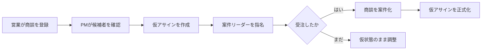

:::message
Googleスプレッドシートで管理していた商談・案件・人員アサインを、AIとの壁打ちから本番Webアプリへ変えました。本記事では、まず完成した開発会社向けプロダクト **RADAR** の全体像と、それを支える設計・リポジトリ構成を紹介します。
:::

## この連載の構成

|  回   | テーマ                                                                                       | 主な内容                                                               |
| :---: | :------------------------------------------------------------------------------------------- | :--------------------------------------------------------------------- |
| 第1回 | [完成形と全体像](https://zenn.dev/scalar_sol_blog/articles/nexus-product-new-development-01) | 完成したRADARの機能、利用者、中核業務、リポジトリ構成                  |
| 第2回 | [企画と壁打ち](https://zenn.dev/scalar_sol_blog/articles/nexus-product-new-development-02)   | AIとの壁打ち、Vision、成功指標、仮説、ペルソナ、UIモック               |
| 第3回 | [MVPと本番設計](https://zenn.dev/scalar_sol_blog/articles/nexus-product-new-development-03)  | コンシェルジュMVP、実運用検証、本番技術選定、MMI・DDD評価              |
| 第4回 | [設計レビュー](https://zenn.dev/scalar_sol_blog/articles/nexus-product-new-development-04)   | 境界コンテキスト、正式化トランザクション、5観点レビュー、P0/P1対応     |
| 第5回 | [実装と再設計](https://zenn.dev/scalar_sol_blog/articles/nexus-product-new-development-05)   | Spring Boot、Next.js、OIDC、行レベル認可、通知、監査、実利用後の再設計 |

---

## はじめに

:::message
本連載では、Nexus Architectとの壁打ちから生まれた商談・案件管理アプリ **RADAR** を題材に、成果物を先に確認したうえで、その構想、検証、設計、実装の順に開発をたどります。
:::

### 本連載で扱う成果物

RADARは、営業とPM/プロジェクトリーダーが、商談、案件、人員アサイン、遅延リスクを同じ場所で扱うための社内向けWebアプリケーションです。

名称は、次の5つの単語から取られています。

```text
R: Resourcing
A: Availability
D: Deal
A: Assignment
R: Risk
```

もともとの業務では、Googleスプレッドシートを使って商談や案件の状態、担当者、アサイン期間を管理していました。

RADARは、その運用を単にWeb画面へ移すのではなく、スプレッドシートでは表現しづらかった業務ルールをプロダクトとして実装しています。

### 現在のリポジトリ

本連載で参照する実際の成果物は、次の構成です。

```text
radar/
├── backend/                     Spring Boot + PostgreSQL
├── frontend/                    Next.js App Router
├── design-system/default/       デザイントークンとガイドライン
└── docs/
    ├── design-history/          Nexus Architectの設計成果物
    ├── concierge-mvp-archive/   検証に使ったMVP
    └── plans/                   実装計画
```

`backend/`と`frontend/`が現在動いているプロダクトです。
一方、Nexus Architectが生成した設計書、パイプラインの進行記録、レビュー結果、初期MVPは、`docs/`配下に履歴として残されています。

この構成により、現在のコードだけでなく、 なぜこの設計になったのかまで追跡できます。

### 本連載の読み方

1. RADARで何ができるのか
2. 成果物がどのような構造になっているのか
3. Nexus Architectと何を壁打ちしたのか
4. 仮説を確かめるMVPをどう作ったのか
5. ProductパイプラインからArchitectパイプラインへどう渡したのか
6. 設計レビューで何が不足していたのか
7. Spring BootとNext.jsでどう実装したのか

本連載は、最初に完成したRADARを説明します。
既存の設計成果物を紹介するだけではなく、設計書の内容が実コードのどこに現れているのかも見ていきます。

### 本連載で重視すること

AIエージェントを使うと、成果物を大量に生成できます。しかし、文書やコードの数が多いことと、良いプロダクトができることは同じではありません。

RADARの開発で重要だったのは、次の流れを分断しなかったことです。


_AIによる提案と人間の判断をつなぎ、実利用の学びを次の仮説へ戻す開発フロー_

AIエージェントが候補を出し、人間が節目で判断し、その判断を次の成果物へ渡す一連の流れを、Nexus Architectを活用して実現しました。

---

## 完成したRADARでできること

:::message
最初に、Nexus Architectによる設計や実装手順へ入る前に、最終的にどのようなプロダクトができたのかを確認します。
:::

### 商談と案件を一つの流れで扱う

RADARでは、営業中の情報を**商談**、受注後の情報を**案件**として扱います。

営業は商談を作成し、ステータス、受注確度、契約形態、売上計上予定などを更新します。


_商談情報、仮アサイン、経過記録を一つの画面で確認する_

受注が決まると、商談は案件フェーズへ移行します。


_受注後の案件をステータス、納期、契約金額とともに一覧で管理する_

単にステータス文字列を変更するだけではありません。
受注確定時には、仮アサインの正式化、履歴の記録、監査ログ、売上実績の作成といった複数の処理が同じ業務操作から実行されます。

### 仮アサインから正式アサインへ

RADARの中核機能は仮アサインです。

受注前の商談でも、PM/リーダーは次のような判断を始めています。

- 誰を案件リーダーにするか
- どのメンバーをいつから押さえるか
- 既存案件との期間重複はないか
- プロパーとBPのどちらで要員を確保するか
- 終了日が未定の状態をどう扱うか

RADARでは、これらを仮アサインとして先に登録できます。受注が確定したら、対象商談と紐づく仮アサインを1アクションで正式化します。

```text
商談
  └─ 仮アサイン
       ├─ メンバー
       ├─ 開始月・終了月または未定
       ├─ 案件リーダー候補
       └─ 月額単価・要員区分

受注確定
  ↓
案件 + 正式アサイン
```

確定状態と仮状態は、色だけでは区別しません。ラベルと枠線の違いも併用し、視覚上もデータ上も混同しないようにしています。

### アサインの重複を業務ルールとして扱う

アサイン期間の重複ルールも実装されています。

現在の業務ルールでは、正式アサインのうち、準委任同士の期間重複を禁止します。一方、受託案件との重複や仮アサインは許容します。

この制約は画面の警告だけではなく、PostgreSQLの排他制約でも守られます。複数のリクエストが同時に到着しても、最後の防波堤をデータベース側に置く設計です。

### 遅延リスクを見つける

RADARは、未終了の商談を定期的に確認し、アサイン終了日が近い商談へリスクフラグを立てます。

既定では、最も早い将来のアサイン終了日が3日以内なら **危険** 、14日以内なら **注意** と判定します。すでに未解決のフラグがある場合は重複して増やさず、深刻度が上がったときだけ更新します。


_未対応の遅延リスクと進行中案件をダッシュボードで確認する_

### 予実・営業依頼・調達へ広がった機能

初期のプロダクト設計では、仮アサインが中心でした。その後、実利用側の業務フローと照合した結果、RADARは次の領域まで広がっています。

- グループ別・月別の売上予実
- リーダーから営業への営業依頼
- プロパー/BPを含む要員計画
- 外部人材の調達依頼
- パートナー会社と面談情報の管理


_月別・グループ別の目標と実績を比較し、予算の不足を把握する_

最初の設計が固定された完成図ではなかったことではなく、Nexus Architectで作った境界を土台にしながら、実利用で見えた業務へプロダクトを更新しています。

### 現時点で未完了のもの

実装済みと、本番運用まで完了したものは分けて考える必要があります。

たとえば、通知はイベント受信、重複排除、再試行回数と失敗状態のモデルまでありますが、実際に再試行を起動するワーカーと、メールやGoogle Chatなどの実チャネルはまだ接続していません。監査ログのINSERT-only権限も、AWS RDS構築時に適用する項目として残っています。

RADARは **すべて完成した製品** ではなく、価値検証を終え、本番実装を積み上げているプロダクトです。

---

## RADARのユーザーと中核業務

:::message
RADARの画面や機能は、営業とPM/プロジェクトリーダーが行っていたスプレッドシート上の判断を、業務フローとして実装したものです。
:::

### 解決したかった課題

Googleスプレッドシートは、小さく始める業務管理に向いています。一方、商談数や人員調整が増えると、次の問題が見え始めます。

- 商談が受注済みなのか、まだ営業中なのか分かりづらい
- 誰がどの案件に入っているかを横断して確認しづらい
- 確定前の人員調整を色やコメントで表現している
- 同じメンバーを同じ期間へ重複アサインしやすい
- 状態変更の理由と履歴がセルの上書きで失われる
- 遅延の兆候を人がシートを見て探す必要がある

問題は、スプレッドシートそのものではありません。自由な表形式へ、状態遷移、権限、同時実行制御、監査といった責務が集まりすぎたことです。

### 主な利用者

Productパイプラインでは、2つの主要ペルソナを定義しました。

| ペルソナ | 役割                    | 主な判断                                     |
| :------- | :---------------------- | :------------------------------------------- |
| 田中さん | PM/プロジェクトリーダー | 空き要員、仮アサイン、正式化、遅延リスク     |
| 佐藤さん | 営業                    | 商談作成、受注確度、ステータス更新、営業依頼 |

現在の実装では、利用者を次のロールとして扱います。

| ロール      | 主な責務                                   |
| :---------- | :----------------------------------------- |
| ADMIN       | 全体管理、組織、予算、監査ログ             |
| PM_LEADER   | 仮アサイン、正式化、予算目標、営業依頼     |
| SALES       | 担当商談、受注確度、売上明細、営業依頼対応 |
| PROCUREMENT | 外部人材の調達とパートナー会社管理         |
| MEMBER      | 閲覧と自分に関係する情報の確認             |

初期の4ロールへ、実利用の再設計時に`PROCUREMENT`が追加されています。

### 最重要の業務フロー

設計と実装をつなぐ中心になったのは、仮アサインから正式化までの流れです。



このフローでは、複数の業務判断が関係します。

- 受注前の情報を確定情報と混同しない
- 受注確定には案件リーダーを必要とする
- 正式化を二重実行しても結果を重複させない
- 正式アサインの期間制約を守る
- 誰が確定したのかを監査ログへ残す

単純なCRUDではなく、プロダクト固有のルールが集まる場所です。

### 最初から決めなかったこと

初期構想では将来的なSaaS化も候補にありました。しかし、最初の対象は自社利用です。

マルチテナント、高度な予測分析、会計連携、外部カレンダー連携は初期スコープから外しました。
また、既存スプレッドシートのデータ移行も、ゼロから運用を開始する判断によって採用しない方針になりました。

新規プロダクトでは、**何を作れるか**よりも**最初にどの業務判断を改善するか**を絞ることが重要です。

---

## 成果物を支えるリポジトリ構成

:::message
RADARでは、現在動くプロダクトと、Nexus Architectが生成した設計履歴を分けて保存しています。この構成そのものが、AI駆動開発の重要な成果です。
:::

### 現在動く2つのプロジェクト

本番実装は、`backend/`と`frontend/`に分かれています。

| ディレクトリ | 技術                                    | 役割                               |
| :----------- | :-------------------------------------- | :--------------------------------- |
| `backend/`   | Java 21 / Spring Boot 3.3 / PostgreSQL  | ドメイン、認証、権限、永続化、監査 |
| `frontend/`  | Next.js App Router / React / TypeScript | SSR画面、Server Actions、業務操作  |


_RADARのアプリケーションアーキテクチャ。実線は実行時通信、破線は設計成果物から実装へのトレーサビリティを示す_

バックエンドは、単一のSpring Bootアプリケーションとしてデプロイするモジュラーモノリスです。境界コンテキストごとにJavaパッケージとPostgreSQLスキーマを分けています。

```text
com.radar.app
├── dealassignment   BC-001 商談・アサイン
├── risk             BC-002 遅延リスク
├── member           BC-003 メンバー
├── notification     BC-004 通知
├── auth             BC-005 認証・権限
├── budget           BC-006 予実
├── procurement      調達
└── audit            横断的な監査ログ
```

現在の成果物には、バックエンドのJavaソース約200ファイル、テストクラス40件以上、15個のNext.jsページ、20本以上のFlywayマイグレーションがあります。

### 業務ルールをトランザクションへ落とし込む

たとえば、仮アサインの正式化は`AssignmentFormalizationService`に集約しています。

ここでは、単にアサインの種別を更新するのではなく、次の処理を1つのトランザクションで行います。

- `Idempotency-Key`による二重実行の防止
- 商談の行ロックと、案件化済みかどうかの確認
- 案件リーダーと仮アサインの整合性確認
- 商談とアサインの正式化、および履歴の保存
- 監査ログと売上実績の作成
- DBの排他制約違反を業務例外へ変換

実際のサービス実装から、中核となるメソッドを抜粋します。

:::details AssignmentFormalizationServiceの実コード
```java:backend/src/main/java/com/radar/app/dealassignment/service/AssignmentFormalizationService.java
@Transactional
public FormalizationResult formalizeDealAssignments(UUID dealId, UUID actorUserId, String idempotencyKey) {
    // SYN2-008対応: クライアント再送の検知（Idempotency-Keyパターン）
    Optional<FormalizationResult> cached = idempotencyStore.find(idempotencyKey);
    if (cached.isPresent()) {
        return cached.get(); // 前回の成功レスポンスをそのまま再送（真のべき等性）
    }

    // DIN-101対応: 事前条件チェックをトランザクション内で行い、行ロックを取得する
    Deal deal = dealRepository.findByIdForUpdate(dealId)
            .orElseThrow(() -> new DealNotFoundException(dealId));

    if (deal.getPhase() == DealPhase.案件) {
        throw new DealAlreadyFormalizedException(dealId); // 409相当（既に受注確定済み）
    }

    List<Assignment> tentativeAssignments =
            assignmentRepository.findByDealIdAndType(dealId, AssignmentType.仮アサイン);
    if (deal.getLeaderUserId() == null) {
        throw new IllegalStateException("受注確定には、仮アサインのうち1名を案件リーダーに指名してください");
    }
    boolean leaderAmongTentative = tentativeAssignments.stream()
            .anyMatch(a -> a.getUserId().equals(deal.getLeaderUserId()));
    if (!leaderAmongTentative) {
        throw new IllegalStateException("受注確定には、案件リーダー本人の仮アサインが1件以上必要です");
    }

    try {
        DealStatus previousStatus = deal.getStatus();
        deal.formalize();
        dealRepository.save(deal); // @Versionによる楽観的ロックも併用（二重防御）
        dealStatusHistoryRepository.save(
                new DealStatusHistory(UUID.randomUUID(), dealId, previousStatus, DealStatus.準備中, actorUserId));

        for (Assignment a : tentativeAssignments) {
            a.formalize(); // 内部で排他制約違反の可能性がある保存を行う
        }
        // DIN-106対応: flushを明示し、排他制約違反をこのtry-catchブロック内で確実に捕捉する
        assignmentRepository.saveAllAndFlush(tentativeAssignments);
        for (Assignment a : tentativeAssignments) {
            assignmentStatusHistoryRepository.save(
                    new AssignmentStatusHistory(UUID.randomUUID(), a.getId(), "formalized"));
        }

        FormalizationResult result =
                FormalizationResult.success(dealId, tentativeAssignments.size(), actorUserId);
        idempotencyStore.save(idempotencyKey, result); // 成功レスポンスを記録（再送時に返す）

        // security-design.md §5対応: コア業務トランザクションと同一トランザクション内で
        // 監査ログを記録する（書き込み失敗時は例外がコア業務全体をロールバックさせる、§5.1）
        auditService.record(AuditActionType.DEAL_FORMALIZED, dealId, actorUserId,
                "formalizedAssignments=%d".formatted(tentativeAssignments.size()),
                List.of(new FieldChange("フェーズ", "商談", "案件"),
                        new FieldChange("正式化アサイン数", null, String.valueOf(tentativeAssignments.size()))));

        revenueLineService.upsertRecognizedFromFormalization(deal, tentativeAssignments);

        return result;
    } catch (DataIntegrityViolationException e) {
        throw new AssignmentConflictException(dealId, e);
    }
}
```
:::

サービス内のコメントには、設計レビューで付与した`SYN2-008`や`DIN-106`などの指摘IDも残しています。設計書の指摘が実装のどこで解消されたかを、コードから逆引きできるようにするためです。

### 読み取りはServer Components、更新はServer Actions

フロントエンドは、ブラウザからバックエンドへ直接アクセスする構成ではありません。

Server Componentsからの読み取りは`apiFetch()`へ集約し、ブラウザから届いたCookieをバックエンドへ中継します。
すべてのデータがセッションに依存するため、取得には`cache: 'no-store'`を指定しています。

```ts:frontend/lib/api/server.ts
export async function apiFetch<T>(path: string, init?: RequestInit): Promise<T> {
  const cookieStore = await cookies();
  const response = await fetch(`${BACKEND_URL}${path}`, {
    ...init,
    headers: {
      ...init?.headers,
      Cookie: cookieStore.toString(),
    },
    cache: "no-store",
  });

  if (response.status === 401) {
    redirect(`${BACKEND_URL}/auth/login`);
  }

  if (!response.ok) {
    const body = (await response.json().catch(() => ({
      error: response.statusText,
      code: "UNKNOWN_ERROR",
    }))) as ApiErrorBody;
    throw new ApiError(response.status, body);
  }

  if (response.status === 204) {
    return undefined as T;
  }

  return response.json() as Promise<T>;
}
```

更新操作はServer Actionsを経由します。クライアント側に汎用fetchラッパーを作らず、認証Cookieと業務操作の境界をサーバー側へ寄せています。

正式化のServer Actionでは、画面で生成した`Idempotency-Key`をバックエンドへ渡します。成功後は商談、案件、トップページのキャッシュを再検証し、同じ操作の結果が各画面へ反映されるようにしています。

```ts:frontend/lib/actions/assignments.ts
export async function formalizeDeal(
  dealId: string,
  idempotencyKey: string
): Promise<ActionResult<FormalizationResult>> {
  const result = await runAction(() =>
    apiFetch<FormalizationResult>(`/v1/deals/${dealId}/formalize`, {
      method: "POST",
      headers: { "Idempotency-Key": idempotencyKey },
    })
  );
  if (result.ok) {
    revalidatePath(`/deals/${dealId}`);
    revalidatePath(`/cases/${dealId}`);
    revalidatePath("/");
  }
  return result;
}
```

### 重複アサインをデータベースでも拒否する

正式化サービスは競合を業務例外へ変換しますが、重複そのものを最後に拒否するのはPostgreSQLです。

`daterange`の重なり演算子`&&`を使った排他制約により、同じユーザーの期間が重なる正式アサインを保存できません。仮アサインと終了日未定のアサインは、この制約の対象外です。

```sql:backend/src/main/resources/db/migration/V14__open_ended_formal_assignments_skip_overlap.sql
ALTER TABLE deal_assignment.assignments
    ADD CONSTRAINT no_overlapping_assignments
    EXCLUDE USING gist (
        user_id WITH =,
        daterange(start_date, end_date, '[]') WITH &&
    )
    WHERE (type = '正式アサイン' AND end_date IS NOT NULL);
```

画面で事前に警告し、サービスで例外を扱い、データベースで同時実行時の整合性を守るという3段階の設計です。

### デザインシステムを単一ソースにする

`design-system/default/`には、次の成果物があります。

- `tokens.css` / `tokens.json`
- コンポーネント一覧
- UIガイドライン
- プレビュー


_`tokens.css`を実行時の単一ソースとし、`globals.css`を介してshadcn/ui、Tailwind CSS、各コンポーネントへ反映する_

現在のフロントエンドはTailwind CSSとshadcn/uiを利用しますが、色や余白の値をコンポーネントへ直接書くのではなく、`design-system/default/tokens.css`を実行時の単一ソースとして参照します。

`frontend/app/globals.css`は`tokens.css`を`@import`し、その値をshadcn/uiのセマンティックスロットとTailwind CSSの`@theme inline`へ橋渡しします。そのため、コンポーネントは具体的なカラーコードではなく、`text-fg`、`bg-success-bg`、`border-warning`といった意味のあるクラス名を使えます。

特に重要な原則が、確定と仮の状態を色だけで表現しないことです。

```text
仮アサイン: 破線 + 仮ラベル + 状態色
正式アサイン: 実線 + 正式ラベル + 状態色
```

この原則はガイドラインだけでなく、稼働計画グリッドのコンポーネントにも現れています。仮アサインには「仮」というテキストと`aria-label`を付け、正式アサインとは形状も変えています。

```tsx:frontend/components/organisms/CapacityPlanGrid/CapacityPlanGrid.tsx
function ChipView({ assignment, deal }: { assignment: PlanAssignment; deal: PlanDeal }) {
  const isTentative = assignment.type === "仮アサイン";
  const tint = DEAL_TINT_CLASSES[deal.tintIndex % DEAL_TINT_CLASSES.length];

  /* 仮: 「空き」と同系のプレーンテキスト。本: 塗りチップ。VIS-009で「仮」「本」ラベル必須。 */
  if (isTentative) {
    return (
      <span
        className="flex w-full min-w-0 items-center justify-center gap-1 text-xs leading-tight text-fg-muted"
        aria-label={`${deal.name}（仮）`}
      >
        <span className="truncate">{deal.name}</span>
        <span className="shrink-0 text-[10px]">仮</span>
      </span>
    );
  }

  return (
    <span
      className={cn(
        "flex w-full min-w-0 items-center justify-center rounded-sm border border-solid px-1 py-0.5 text-xs font-medium leading-tight",
        tint
      )}
      aria-label={`${deal.name}（本アサイン）`}
    >
      <span className="truncate">{deal.name}</span>
    </span>
  );
}
```

### 設計履歴をアーカイブする

`docs/design-history/`には、ProductパイプラインとArchitectパイプラインが生成した成果物が残っています。

```text
reports/
├── 00_core           Vision、成功指標、スコープ、仮説
├── 01_ux             ペルソナ、ジャーニー、ドメインストーリー
├── 02_spec           機能一覧、データモデル、UIモック
├── 03_domain         初期ドメイン設計
├── 03_design         本番アーキテクチャ、API、データ設計
├── 04_quality        NFR、SLA
├── 08_infrastructure セキュリティ、監視、DR、AWS
└── review            5観点レビュー
```

`work/traceability.json`は、Vision、仮説、スコープ、機能、要求、API、境界コンテキストのIDをつなぎます。AIが生成した文書をフォルダへ置くだけで終わらず、後から設計判断をたどれる状態にしています。

### MVPは削除せず凍結する

Hono、SQLite、React、Viteで作ったコンシェルジュMVPは、`docs/concierge-mvp-archive/`へ移動しました。

MVPは本番コードの土台ではありません。しかし、何を検証し、どの画面が使われ、どこに技術的負債があったかを示す証拠です。そのため、現在の実装と混ぜず、削除もせず、読み取り専用の履歴として残しています。

### この節のまとめ

- 現在動くプロダクトはSpring BootバックエンドとNext.jsフロントエンドです。
- バックエンドは境界コンテキストごとに分けたモジュラーモノリスです。
- 正式化の業務ルールはサービス、Server Action、DB制約に分担されています。
- デザインシステムはトークンを単一ソースとして管理します。
- Nexus Architectの成果物とMVPを`docs/`へアーカイブし、意思決定の履歴を追跡できます。

---

次回は、AIとの壁打ち、Vision、成功指標、仮説、ペルソナ、UIモックを扱います。

@[card](https://zenn.dev/scalar_sol_blog/articles/nexus-product-new-development-02)
