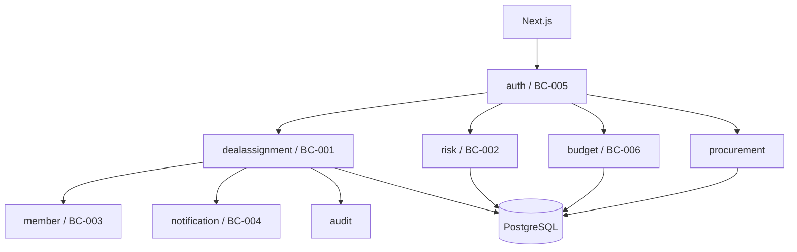

---
前回の記事はこちら

@[card](https://zenn.dev/scalar_sol_blog/articles/nexus-product-new-development-03)
---

:::message
本記事は、Nexus Architectとの壁打ちから生まれた社内向けWebアプリ **RADAR** の開発を追う全5回連載の第4回です。今回は境界コンテキスト、正式化トランザクション、5観点レビュー、P0/P1対応を扱います。
:::

## この連載の構成

| 回 | テーマ | 主な内容 |
| :---: | :--- | :--- |
| 第1回 | [完成形と全体像](https://zenn.dev/scalar_sol_blog/articles/nexus-product-new-development-01) | 完成したRADARの機能、利用者、中核業務、リポジトリ構成 |
| 第2回 | [企画と壁打ち](https://zenn.dev/scalar_sol_blog/articles/nexus-product-new-development-02) | AIとの壁打ち、Vision、成功指標、仮説、ペルソナ、UIモック |
| 第3回 | [MVPと本番設計](https://zenn.dev/scalar_sol_blog/articles/nexus-product-new-development-03) | コンシェルジュMVP、実運用検証、本番技術選定、MMI・DDD評価 |
| 第4回 | [設計レビュー](https://zenn.dev/scalar_sol_blog/articles/nexus-product-new-development-04) | 境界コンテキスト、正式化トランザクション、5観点レビュー、P0/P1対応 |
| 第5回 | [実装と再設計](https://zenn.dev/scalar_sol_blog/articles/nexus-product-new-development-05) | Spring Boot、Next.js、OIDC、行レベル認可、通知、監査、実利用後の再設計 |

---

## 境界コンテキストとモジュラーモノリスを再設計する

:::message
MVP評価をもとに、業務概念を5つの境界コンテキストへ整理し、単一Spring Bootアプリ内の実装単位へ落としました。
:::

### 初期の5境界コンテキスト

本番設計では、次の5つを定義しました。

| ID | 境界コンテキスト | 分類 | 主な責務 |
| :--- | :--- | :--- | :--- |
| BC-001 | 商談・アサイン | Core | Deal、Assignment、正式化 |
| BC-002 | 遅延リスク | Supporting | RiskFlag、RiskResponse |
| BC-003 | メンバー | Generic | User、MemberProfile |
| BC-004 | 通知 | Supporting | 通知状態、重複排除、配送 |
| BC-005 | 認証・権限 | Supporting | OIDC、ロール、PermissionAggregate |

ここでBCは、Bounded Contextを意味します。現在のJavaパッケージも、ほぼこの境界に対応しています。

### 商談とアサインを同じCoreに置く

DealとAssignmentを別サービスへ分ける案も考えられます。しかしRADARでは、受注確定とアサイン正式化が同じ業務トランザクションです。

```text
Deal: 商談 → 案件
Assignment: 仮 → 正式
```

この2つを初期段階で分散させると、整合性確保のためにSagaや補償処理が必要になります。単一PostgreSQL上でACIDトランザクションを使えるため、BC-001の中で扱う方針にしました。

### 集約をまたぐ処理をドメインサービスにする

Deal集約とAssignment集約は、それぞれ独立した不変条件を持ちます。一方、正式化は両方を協調させます。

そのため、`AssignmentFormalizationService`をドメインサービスとして設計しました。

このサービスは現在の実装で、次をまとめて扱います。

- Idempotency-Keyの再送確認
- Dealの行ロック
- 商談から案件への状態遷移
- 仮アサインの正式化
- 履歴保存
- 監査ログ
- 売上実績の更新

### コンテキスト間依存を制御する

モジュラーモノリスでも、他コンテキストのRepositoryを直接呼び始めると境界が崩れます。

設計では、メンバー参照はサービス層またはACLを経由し、通知は業務イベントから受け取る形にしました。調達機能が後から加わった際も、正式アサイン作成は`ProcurementAssignmentGateway`を通し、調達側がAssignmentRepositoryを直接操作しない構造にしています。

### 実利用で境界を追加する

初期設計後、実利用とのギャップから`budget`と`procurement`が追加されました。

予実管理は、初期設計には存在しなかった新しい業務能力です。既存のDealへすべて押し込まず、BC-006として追加しました。

この変化は、最初の境界が間違っていたという意味ではありません。初期の仮説を実装し、実利用から新しい業務の背骨が見えたため、境界を更新したものです。

### 現在のアーキテクチャ



デプロイ単位は一つですが、変更理由と業務責務は分離されています。


_単一のSpring BootとPostgreSQLを使いながら、BCごとの責務と許可された依存関係を分離する_

### この節のまとめ

- 初期設計では、商談・アサイン、リスク、メンバー、通知、認証の5BCを定義しました。
- DealとAssignmentは、正式化の整合性を重視して同じCoreへ置きました。
- 集約間の協調を`AssignmentFormalizationService`へ集めました。
- 実利用で新しい業務能力が見えたため、budgetとprocurementを追加しました。

---

## データ・API・正式化トランザクションを設計する

:::message
RADARの設計で最も重要な技術的論点は、仮アサインの正式化を、再送や同時実行が起きても正しく完了させることでした。
:::

### 正式化APIを業務操作として表す

正式化は、Assignmentの種別を1件ずつ更新するCRUDではありません。

```http
POST /v1/deals/{dealId}/formalize
Idempotency-Key: <UUID>
```

このAPIは、商談を案件へ移し、紐づく仮アサインをまとめて正式化します。

業務上の意味を持つ操作としてAPIを定義することで、認可、監査、冪等性、トランザクションの単位を合わせられます。

### トランザクション内で行ロックを取る

現在の`AssignmentFormalizationService`は、最初にDealを`SELECT ... FOR UPDATE`相当で取得します。

```java
@Transactional
public FormalizationResult formalizeDealAssignments(
        UUID dealId, UUID actorUserId, String idempotencyKey) {
    var cached = idempotencyStore.find(idempotencyKey);
    if (cached.isPresent()) return cached.get();

    Deal deal = dealRepository.findByIdForUpdate(dealId)
            .orElseThrow(() -> new DealNotFoundException(dealId));

    // 事前条件をロック取得後に確認する
    // Deal更新、Assignment正式化、履歴、監査を同一トランザクションで実行
}
```

事前条件チェックをロックの外で行うと、確認後から更新までの間に別リクエストが状態を変えるTOCTOU競合が起きます。設計レビューでこの問題が指摘され、ロック取得後に確認する形へ修正しました。

### Idempotency-Keyを画面から保持する

バックエンドがIdempotency-Keyに対応していても、画面がクリックごとに新しいキーを作ると再送を検知できません。

RADARの`FormalizeAction`では、コンポーネントのマウント時に一度だけ生成します。

```tsx
const [idempotencyKey] = useState(() => crypto.randomUUID());
```

失敗後に再送しても同じキーを使います。フロントエンドとバックエンドを一つの冪等性設計として扱っています。

### PostgreSQLを最後の防波堤にする

正式アサインの期間重複は、アプリケーションの事前チェックだけでは完全に防げません。並行リクエストが同じ空き期間を確認し、同時に保存する可能性があるためです。

そこでPostgreSQLの`EXCLUDE USING gist`を利用します。

```sql
EXCLUDE USING gist (
  user_id WITH =,
  daterange(start_date, end_date, '[]') WITH &&
)
```

現在のマイグレーションでは、業務変更に合わせて対象を **正式かつ終了日があり、準委任同士** に絞っています。

### flushで例外の発生位置を制御する

JPAはSQL発行をトランザクション終端まで遅らせることがあります。その場合、`try-catch`の外で制約違反が起き、業務エラーへ変換できません。

RADARでは`saveAllAndFlush()`を使い、排他制約違反を捕捉したいブロック内で確実に発生させます。これも5観点レビューから実装へ反映された修正です。


_Idempotency-Key、行ロック、同一トランザクション、PostgreSQL制約の4層で重複正式化を防ぐ_

### この節のまとめ

- 正式化を、専用の業務APIとして設計しました。
- Dealの行ロック取得後に事前条件を確認し、TOCTOU競合を防ぎました。
- Idempotency-Keyをフロントエンドとバックエンドで一貫して扱います。
- PostgreSQL排他制約と明示的flushで、並行実行時の重複を防ぎます。

---

## 5観点レビューでP0ブロッカーを見つける

:::message
本番設計を一通り作ったあと、Consistency、Data Integrity、Operations、Risk、Businessの5観点でレビューしました。
:::

### 5観点と重み

RADARのレビューは、次の5つです。

| 観点 | 重み | 主に確認すること |
| :--- | :---: | :--- |
| Consistency | 0.15 | 文書、API、用語、図の整合性 |
| Data Integrity | 0.25 | トランザクション、制約、同時実行 |
| Operations | 0.20 | 監視、デプロイ、復旧、運用手順 |
| Risk | 0.25 | セキュリティ、障害モード、依存リスク |
| Business | 0.15 | 価値、継続性、計画、要求との対応 |

初回の集約スコアは2.67で、判定はFAILでした。Criticalは7件あり、すべて次工程へ進む前に解消すべきP0 Blockerとして扱われました。

### 初回レビューで不足していたもの

機能、ドメイン、APIの設計は進んでいました。一方、本番運用に必要な基盤設計が体系的に不足していました。

| P0 | 不足していた設計 |
| :--- | :--- |
| SYN-001 | ヘルスチェック |
| SYN-002 | アラート閾値とrunbook |
| SYN-003 | バックアップとRPO/RTO |
| SYN-004 | Multi-AZとフェイルオーバー |
| SYN-005 | シークレット管理 |
| SYN-006 | デプロイ戦略 |
| SYN-007 | OIDC障害時の挙動 |

MVPで価値を確認したあとでも、本番設計へ移るときにはこの空白を埋める必要があります。

### 4つの設計文書でP0を解消する

P0 Blockerに対応するため、次の文書を追加しました。

- `security-design.md`
- `observability-design.md`
- `disaster-recovery-design.md`
- `infrastructure-architecture.md`

一つの文書が一つのP0に対応するのではありません。たとえばobservability設計が、ヘルスチェック、メトリクス、アラート、runbook参照をまとめて扱います。

### レビュー中に実バグを見つける

レビューは文章の採点だけではありません。実際に検証スクリプトを動かし、2件のバグを見つけました。

1. `auth-api.yaml`末尾へMarkdownが混入し、YAMLとしてパースできなかった
2. データ設計のコード例が、存在しない`DealStatus`列挙値を参照していた

どちらもレビューと同時に修正しています。

### 再レビューの結果

P0対応後、同じ5観点で再レビューしました。

| 指標 | 初回 | 2回目 |
| :--- | :---: | :---: |
| aggregate | 2.67 | 3.62 |
| critical | 7 | 0 |
| major | 26 | 18 |
| 判定 | FAIL | FAIL |

全観点が最低3.0を超え、集約スコアもPASS基準3.5へ到達しました。しかし、CONDITIONAL_PASSの条件であるmajor 8件以下を満たさず、判定はFAILのままでした。

合否だけを見ると変化がないように見えますが、Criticalが0になり、本番運用基盤の空白が埋まったことは大きな前進です。


_4つの運用設計文書を追加し、判定はFAILのままでもCriticalを7件から0件へ減らす_

### この節のまとめ

- レビューはConsistency、Data Integrity、Operations、Risk、Businessの5観点です。
- 初回はaggregate 2.67、Critical 7件でFAILでした。
- 4つの本番運用設計文書を追加し、P0 Blockerをすべて解消しました。
- 再レビューは3.62、Critical 0件まで改善しましたが、major件数によりFAILが続きました。

---

## P1課題を反映して実装へ進む

:::message
Criticalを0件にしたあと、残るP1を設計へ反映し、3回目のレビューを行わず実装へ進む判断をしました。
:::

### P0解消が新しい論点を生む

本番運用基盤を設計すると、別の障害モードが見えるようになりました。

たとえば、ECSで複数タスクを動かす設計を追加すると、セッションをどこへ保存するかが問題になります。監査ログを必須にすると、監査DBへの書き込み失敗がコア業務を止めるかという判断が必要です。

2回目レビューでは、このようなP1課題が8件抽出されました。

### 主なP1課題

| 課題 | 設計上の判断 |
| :--- | :--- |
| DB接続プールの競合 | 通知など重い処理との分離を検討 |
| Multi-AZ切替中の再試行 | トランザクション再試行方針を追加 |
| 監査ログ障害 | 書き込み失敗時は業務もロールバック |
| 複数タスクのセッション | セッションストア方針を確定 |
| 通知の最終失敗 | failed状態と監視対象を定義 |
| formalizeの再送 | Idempotency-Keyを必須化 |
| JPA例外の発生位置 | 明示的flushを設計へ追加 |
| 個人情報の法務確認 | 担当と期限をリリース条件へ追加 |

### 監査ログの失敗を握りつぶさない

監査ログの扱いには、可用性と監査完全性のトレードオフがあります。

RADARでは、正式化、仮アサイン、リスク対応などの重要操作について、監査ログ書き込みが失敗したら業務トランザクション全体をロールバックする方針を選びました。

```text
業務更新 成功
監査記録 失敗
  ↓
全体を失敗としてロールバック
```

利用者には厳しい挙動ですが、 **操作は成功したのに記録がない** 状態を許さない判断です。実装では`AuditService`が呼び出し元の`@Transactional`へ相乗りし、例外を握りつぶしません。

### 3回目レビューを省略する

P1の8件を設計文書へ軽量反映したあと、次の選択肢がありました。

- 3回目の5観点レビューを行う
- P1反映後に実装へ進む
- 設計修正だけで止める

ユーザーは、P1反映後に実装へ進む方針を選びました。

この時点ではCriticalが0件で、P0 Blockerも解消済みです。残る問題の一部は、実コードとテストを作ることで具体化できます。

### 実装へ渡した単位

実装計画は、次のフェーズへ分けました。

1. Spring Boot基盤とBC-001/002/003
2. Google Workspace OIDCとBC-005
3. Next.jsフロントエンド
4. BC-004通知
5. 本番リリース準備

一度にすべてを生成せず、境界コンテキストとリスクの単位で実装し、各段階でテストを通す方針です。


_Critical 0件とP0解消を条件に3回目レビューを省略し、残課題をコードとテストで具体化する_

### この節のまとめ

- P0を解消したことで、セッション、監査、再試行など二次的な障害モードが見えました。
- P1課題8件を設計へ反映しました。
- 監査ログ障害時は、重要な業務操作もロールバックする方針を選びました。
- Critical 0件とP0解消を条件に、3回目レビューを省略して実装へ進みました。

---

次回は、Spring Boot、Next.js、OIDC、行レベル認可、通知、監査、実利用後の再設計を扱います。

@[card](https://zenn.dev/scalar_sol_blog/articles/nexus-product-new-development-05)
