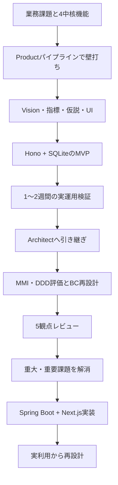

---
前回の記事はこちら

@[card](https://zenn.dev/scalar_sol_blog/articles/nexus-product-new-development-04)
---

:::message
本記事は、Nexus Architectとの壁打ちから生まれた社内向けWebアプリ **RADAR** の開発を追う全5回連載の第5回です。今回はSpring Boot、Next.js、OIDC、行レベル認可、通知、監査、実利用後の再設計を扱います。
:::

## この連載の構成

| 回 | テーマ | 主な内容 |
| :---: | :--- | :--- |
| 第1回 | [完成形と全体像](https://zenn.dev/scalar_sol_blog/articles/nexus-product-new-development-01) | 完成したRADARの機能、利用者、中核業務、リポジトリ構成 |
| 第2回 | [企画と壁打ち](https://zenn.dev/scalar_sol_blog/articles/nexus-product-new-development-02) | AIとの壁打ち、Vision、成功指標、仮説、ペルソナ、UIモック |
| 第3回 | [MVPと本番設計](https://zenn.dev/scalar_sol_blog/articles/nexus-product-new-development-03) | コンシェルジュMVP、実運用検証、本番技術選定、MMI・DDD評価 |
| 第4回 | [設計レビュー](https://zenn.dev/scalar_sol_blog/articles/nexus-product-new-development-04) | 境界コンテキスト、正式化トランザクション、5観点レビュー、重大課題への対応 |
| 第5回 | [実装と再設計](https://zenn.dev/scalar_sol_blog/articles/nexus-product-new-development-05) | Spring Boot、Next.js、OIDC、行レベル認可、通知、監査、実利用後の再設計 |

---

## Spring BootとPostgreSQLで本番バックエンドを実装する

:::message
本番バックエンドは、Java 21、Spring Boot 3.3、PostgreSQL 16を使い、境界コンテキストごとに段階的に実装しました。
:::

### Dockerでビルド環境をそろえる

実装開始時、ホストにはJDKとGradleがありませんでした。

選択肢は、ホストへインストールする、コードだけ作る、Dockerでビルドする、の3つです。ユーザーはDockerを選びました。

現在のリポジトリでも、`gradle:8.11-jdk21`イメージを使う手順が残っています。

```bash
docker run --rm -v "$PWD":/app -w /app \
  -v gradle-cache:/root/.gradle \
  gradle:8.11-jdk21 gradle build -x test --no-daemon
```

ローカル環境を勝手に変更せず、再現可能な実行方法を選んだ例です。

### フェーズ1で実装したもの

最初に、BC-001、BC-002、BC-003を実装しました。

| BC | Javaパッケージ | 主な実装 |
| :--- | :--- | :--- |
| BC-001 | `dealassignment` | Deal、Assignment、正式化、履歴 |
| BC-002 | `risk` | RiskFlag、RiskResponse、検知 |
| BC-003 | `member` | User、ロール、メンバー情報 |

Controller、Service、Repositoryを分離し、Flywayだけがスキーマを変更する構成にしました。Hibernateは`ddl-auto: validate`で、マイグレーションとの差分があれば起動を失敗させます。

### ドメインルールを集約へ置く

`Assignment`は、単なるJPAのデータ入れ物ではありません。

現在の実装には、次のルールがあります。

- 開始日は月初、終了日は月末へ正規化する
- 終了日がない場合は **未定** などのラベルを必要とする
- BPアサインにはBP単価が必要
- 取消済みアサインは変更できない
- 正式化は二重実行しても状態を壊さない

```java
public void formalize() {
    if (this.type == AssignmentType.正式アサイン) {
        return;
    }
    this.type = AssignmentType.正式アサイン;
    this.formalizedAt = Instant.now();
}
```

業務ルールをControllerやフォームだけへ置かず、集約自身が不正な状態を拒否します。

### テストでレビュー課題を確認する

初期フェーズでは、重複アサイン防止とIdempotency-Keyを統合テストで確認しました。

その後、認証、通知、監査、予実、営業依頼、調達へ実装が広がり、現在は40を超えるバックエンドテストクラスがあります。

テスト数そのものより、レビューで見つけたリスクがテストケースへ変わったことが重要です。

- 同じIdempotency-Keyなら同じ結果を返す
- 権限のないロールは操作できない
- SALESは他人の商談を取得できない
- 期間重複をDBが拒否する
- 重要な業務操作で監査ログが作られる


_BCごとのSpring Boot実装、Flywayによるスキーマ管理、レビューリスクから導いたテストを一つにつなぐ_

Docker上にビルド環境をそろえ、商談・アサイン、遅延リスク、メンバーの各領域を段階的に実装しながら、業務ルールとレビュー指摘をコードとテストへ落とし込みました。

---

## Next.js・OIDC・権限境界を実装する

:::message
バックエンドの中核実装後、Google Workspace OIDC、PermissionAggregate、行レベルアクセス制御、Next.jsフロントエンドを追加しました。
:::

### 認証を後付けにしない

フェーズ1の次は、AWS基盤よりBC-005認証を優先しました。

業務アプリでは、認証だけでなく **誰がどの操作とデータへアクセスできるか** がAPI設計へ影響します。全員が全件を見られる状態で画面を作り切ると、後から取得条件とテストを広範囲に直すことになります。

### PermissionAggregateで操作権限を表す

RADARは、ロールと操作の対応を`PermissionAggregate`へ集約しています。

```java
MATRIX.put(Role.PM_LEADER, EnumSet.of(
    Operation.DEAL_VIEW,
    Operation.ASSIGNMENT_CREATE_TENTATIVE,
    Operation.ASSIGNMENT_FORMALIZE,
    Operation.RISK_RECORD_RESPONSE,
    Operation.BUDGET_TARGET_MANAGE
));
```

このマトリクスは、Nexus Architectが作った`actors-roles-permissions.md`をコード化したものです。

### 操作権限と行レベル制御を分ける

**SALESは商談を閲覧できる** という権限だけでは不十分です。営業は、自分が担当する商談または営業依頼で紐づいた商談だけを見られる必要があります。

RADARでは、Controllerの`@PreAuthorize`に加え、Serviceで所有者条件を適用します。

実装後の追加開発では、SALESが`ownerUserId`を省略すると全商談を見られる行レベル制御の欠落も発見されました。現在は、SALESから渡された検索条件にかかわらず、バックエンド側で自分のIDへ上書きします。

フロントエンドでボタンを隠すことはUX上の補助です。実際の認可境界はバックエンドです。

### CookieセッションをSSRで中継する

Next.jsはApp Routerを使い、読み取りをServer Components、更新をServer Actionsへ寄せています。

SSRのfetchはブラウザを経由しないため、受け取ったCookieをバックエンドへ明示的に中継します。

```ts
const response = await fetch(`${BACKEND_URL}${path}`, {
  ...init,
  headers: {
    ...init?.headers,
    Cookie: cookieStore.toString(),
  },
  cache: "no-store",
});
```

`middleware.ts`は`JSESSIONID`の存在だけを高速確認し、`app/layout.tsx`の`requireSession()`がバックエンドへ問い合わせて実際のセッションを検証します。

### OIDCの契約不一致を実ログインで見つける

当初、Google Cloud Consoleでのクライアント登録は開発環境外の作業として手順書へ切り出しました。

その後、実クライアントを登録してログインを試したところ、Google側の認証後に`/auth/callback`で401になりました。

原因は、設定したredirect URIとSpring Securityが実際に待ち受けるコールバックパスの不一致です。

```java
.redirectionEndpoint(r -> r.baseUri("/auth/callback"))
```

この指定を追加して解消し、Google Workspaceアカウントによるログイン成立まで確認しました。

設計書と設定ファイルが一致して見えても、外部サービスとの契約はE2Eで初めて確認できることがあります。


_OIDCとCookie中継の先で、セッション、PermissionAggregate、SALESの行レベル制御をバックエンドへ重ねる_

認証・操作権限・データ単位のアクセス制御を早い段階でAPIへ組み込み、Next.jsから実際にログインして、設定の不一致まで確認・修正しました。

---

## 通知・監査と実利用からのプロダクト再設計

:::message
本番実装は、初期設計をコードへ移すだけでは終わりません。通知・監査を追加し、実利用側の業務フローと照合しながらRADAR自体を更新しました。
:::

### コミット後に通知する

通知は、遅延リスクなどの業務イベントを受けて作成します。

RADARでは、`@TransactionalEventListener`を`AFTER_COMMIT`で実行します。

```java
@Async("notificationExecutor")
@TransactionalEventListener(phase = TransactionPhase.AFTER_COMMIT)
public void onRiskFlagDetected(RiskFlagDetectedEvent event) {
    // 通知作成
}
```

業務トランザクションがロールバックしたのに通知だけ送られる状態を避けるためです。

通知には`dedup_key`のユニーク制約があり、同じイベントの重複を防ぎます。ドメインモデルには最大3回の再試行回数と`failed`状態があります。専用のbounded thread poolも用意し、通知処理がHTTPリクエスト処理を圧迫しないようにしています。

ただし、現在の配信先はログ出力のプレースホルダーです。失敗時に`retryCount`を増やす処理はありますが、次の配信試行を起動するスケジューラやキューはまだありません。メールやGoogle Chatなど、実チャネルへの接続と合わせて残っている実装課題です。

### 監査ログを同じトランザクションで記録する

正式化、仮アサイン、リスク対応では、`AuditService`をコア業務と同じトランザクションから呼びます。

監査ログには、操作者、操作種別、対象リソース、時刻、変更前後の値を記録します。

現在の方針では、監査ログの書き込みに失敗した場合、業務操作もロールバックします。一方、DBユーザーからUPDATE/DELETE権限を剥奪するINSERT-only運用は、RDS構築時の残課題です。


_通知はコミット後に非同期処理し、監査は重要業務と同じトランザクションで記録する_

### 初期の背骨を見直す

初期のRADARは、仮アサインをプロダクトの中心に置きました。

その後、実利用側の業務設計と照合すると、組織が最初に見るのは **グループ別・月別の予算と売上の差** であり、不足を営業、アサイン、調達で埋める流れだと分かりました。

```text
予算と売上実績
  ↓ 不足を把握
営業依頼
  ↓ 商談を作る
アサイン計画
  ↓ 社内で不足
外部人材を調達
```

このギャップを受け、RADARは次を追加しました。

- OrgGroupによる組織構造
- RevenueLineによる月別売上の事実源
- SalesRequestによるリーダーから営業への依頼
- PROCUREMENTロール
- 外部人材の調達コンテキスト

### 設計履歴と実コードの差を管理する

`docs/design-history/`は初期パイプラインの履歴として凍結しています。後から機能を追加するたびに過去文書を完成形へ書き換えると、当時何を判断したか分からなくなります。

そこで、現在のコードと`PRODUCT.md`を生きた状態として扱い、初期設計との差分は`MEMORY.md`と実装計画へ追記します。

AI駆動開発では、生成物を常に最新へ上書きするより、次の3種類を区別する方が追跡しやすくなります。

| 種類 | RADARでの場所 |
| :--- | :--- |
| 現在動くコード | `backend/`、`frontend/` |
| 現在の原則 | `PRODUCT.md`、`DESIGN.md`、`CLAUDE.md` |
| 過去の判断 | `docs/design-history/`、`docs/plans/` |


_仮アサイン中心の初期構造を、予実、営業依頼、アサイン、調達の業務フローへ広げ、過去の判断との差分を管理する_

通知と監査の整合性を保つ土台を実装し、未完成部分を明記しつつ、実利用で見えた予実・営業依頼・アサイン・調達へプロダクトの中心を広げました。

---

## おわりに：Nexus Architectと実装をつなぐ型

:::message
RADARの開発から得られたのは、特定の設計書やコードだけではなく、壁打ち、検証、設計、レビュー、実装をつなぐ進め方です。
:::

### RADARを作った流れ

本連載では、完成したRADARから始め、開発の起点へ戻って流れを追いました。




_業務課題から壁打ち、MVP、実運用、設計レビュー、実装、再設計までをつなぎ、学びを次の仮説へ戻す_

### 型1：完成像より先に検証条件を決める

新規プロダクトでは、機能一覧を詳細にするほど安心してしまいます。

RADARで本番開発へ進む判断ができたのは、 **アプリが優先して使われるか**、**仮アサインが使われるか** という仮説に、検証方法と見直し基準を置いたためです。MVPが動いたことではなく、実利用で基準を満たしたことを判断の根拠にしました。

### 型2：MVPのコードではなく学びを引き継ぐ

MVPはHonoとSQLite、本番はSpring BootとPostgreSQLです。

直接引き継いだのはコードではありません。利用された画面、仮アサインの状態遷移、正式化のトランザクション境界、利用者の判断です。

MVPをアーカイブし、本番コードと混ぜなかったことで、それぞれの目的が明確になりました。

### 型3：レビューの数値を実装課題へ変える

MMI、DDD、5観点レビューのスコアは、評価のための評価ではありません。

- 責務集中 → パッケージと集約の分離
- 重複リスク → PostgreSQL排他制約
- TOCTOU → 行ロック後の事前条件確認
- 再送リスク → Idempotency-Key
- 認証不足 → OIDCとPermissionAggregate
- 運用設計不足 → 監視、DR、セキュリティ文書

このように、指摘を設計変更、コード、テストへ変えることが重要です。

### 型4：人間が判断する場所を残す

RADARでは、AIエージェントが文書、コード、レビューを作りました。一方、次の判断はユーザーが行いました。

- 自社利用を先にする
- PM/リーダーをプライマリにする
- データ移行をしない
- MVPを実運用へ出す
- 3回目レビューを省略して実装へ進む
- Dockerでビルドする
- 認証をAWS基盤より先に実装する
- 実利用に合わせて予実と調達を追加する

AIの自律性を高めることと、業務上の判断を委ねることは別です。

### 型5：未完了を正直に残す

現在のRADARにも未完了項目があります。

- アサイン調整時間がどれだけ短縮したかの測定
- 遅延リスクを早期に検知できたかの検証
- 通知の実チャネル接続
- RDS上の監査ログINSERT-only権限
- 本番トポロジ確定後のCookie Domain戦略
- フロントエンド自動テスト基盤

これらを隠して **本番化完了** と表現せず、次の判断材料として残すことも品質の一部です。

### おわりに

Nexus Architectの価値は、大量の設計書を生成することだけではありません。

曖昧な業務課題を、Vision、仮説、スコープ、画面、ドメイン、API、運用、実装へ段階的に変換し、その途中で人間が判断できる状態を作ることにあります。

RADARは、一度のプロンプトで完成したプロダクトではありません。壁打ちで方向を決め、MVPで確かめ、レビューで不足を見つけ、実装で設計を検証し、実利用から再び構造を変えています。

AI駆動プロダクト開発で再利用できるのは、最終成果物の形よりも、この往復の仕組みです。

企画の壁打ちからMVP検証、設計レビュー、実装までを一つの流れでつなぎ、人間の判断と未完了項目を明示しながら、得られた業務知識をプロダクトへ反映しました。

---

全5回の連載は以上です。最後までお読みいただき、ありがとうございました。
