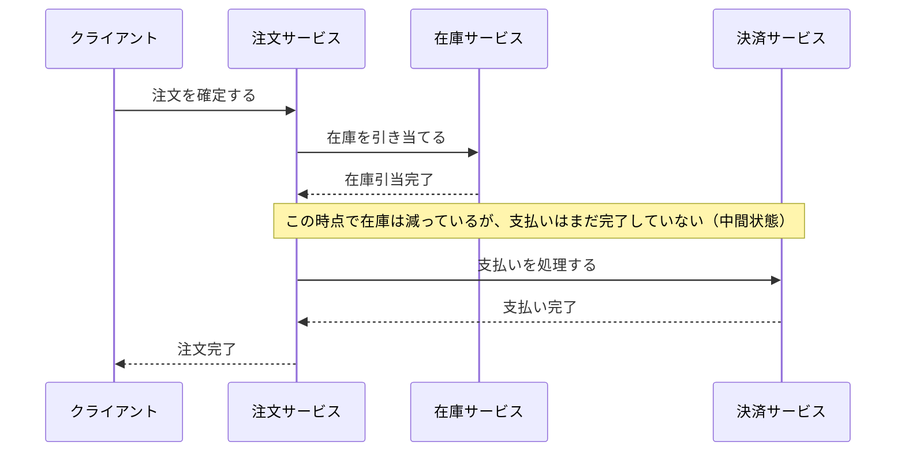

# はじめに

全3回を通して、[POSシステム](#posシステムとは)を[マイクロサービス](#マイクロサービスとは)化する際の課題と、その解決策について解説していきます！

## 対象読者

- モノリスからマイクロサービスへの移行を考えている人
- [分散トランザクション](#分散トランザクションとは)の設計に悩んでいる人
- 異種DBを連携するシステムを構築したい人

# なぜPOSシステムをマイクロサービス化するのか？

POSは一見シンプルですが、実態は以下の複合システムです。

- 売上登録（高頻度[トランザクション](#トランザクションとは)）
- 在庫管理（整合性重視）
- 決済連携（外部依存・可用性）
- 会員・ポイント（ビジネスロジック頻繁変更）
- 分析・レポート（非同期処理）

以下はモノリスとして運用した場合の課題です。

- 全機能が同じスケール単位にならざるを得ない
- 一部変更が全体リリースに波及してしまう
- 外部障害が全体停止を引き起こしてしまう
- トランザクション境界が広くなり、データベースのロック競合が起きやすい

マイクロサービス化の最大のモチベーションは、デプロイの独立性を高めることです。
POSシステムにおいては、ビジネスの変化に対して柔軟に対応できることが極めて重要になります。

:::message
現在（2026年時点）国会では食品の軽減税率を0%にするような議論もなされています。
このような制度変更があった場合でも、機能が独立したサービスとして分割されていれば、
変更による影響範囲を最小限に抑えることができます。
:::

また、データの性質という観点でもメリットがあります。
商品管理はPostgreSQLのようなRDBで管理し、注文や支払管理はDynamoDBのようなNoSQLで管理するなど、それぞれのデータの特性に合わせたDBを選択することが可能になります。

しかし、このような異種DBを連携させるとなると、分散トランザクションの仕組みが必要になります。

---

実際に注文処理を例に考えてみます。

お客さんが商品を購入すると、以下の処理が発生します。


_注文処理の流れ_

# トランザクション管理手法の比較

マイクロサービス環境で異種データベース間のデータ整合性をどのように保つかは、非常に悩ましい問題です。
モノリス時代のアプローチも含め、代表的な手法とその特徴を比較します。

### モノリス

すべてのデータが単一のデータベースにまとまっているため、データベース自身のトランザクション機能を利用するだけで強整合性を保証できます。
非常にシンプルで確実なアプローチですが、先ほど触れたようにシステムが巨大化するとデプロイや拡張の単位が固定化されてしまうというデメリットがあります。

### Sagaパターン

各マイクロサービスがローカルトランザクションを順次実行し、もし途中でエラーが起きた場合は、それまでの処理を取り消すための補償処理を実行してつじつまを合わせる手法です。
可用性が高くシステムを疎結合に保ちやすいというメリットがありますが、処理の途中で不整合な状態が見えてしまう結果整合性という扱いになります。POSシステムのような、お金や在庫を扱うため強整合性が求められるシステムにはあまり向きません。


### TCCパターン

処理をリソースの仮押さえ、確定、取り消しの3つのフェーズに分けて行う手法です。
Sagaパターンよりも状態を管理しやすく整合性を保ちやすいメリットがありますが、やはり結果整合性の範囲にとどまります。
また、各サービスに対応するAPIを実装する必要があり、開発コストが非常に高くなるというデメリットがあります。


### 2PCパターン

コミットの準備フェーズと確定フェーズの2段階でトランザクションを制御し、すべてのサービスで同期的にデータを書き換えます。
これによりモノリスのような強整合性を保証できるため、POSシステムのような厳密な要件に適しています。
しかし、各サービスがロックを保持する時間が長くなることや、一部のサービスがダウンすると全体が停止してしまうなど、パフォーマンスと可用性に大きなデメリットがあります。


---

このように、どのアプローチにも明確なトレードオフが存在します。
POSシステムにおいては強整合性が求められるため、SagaパターンやTCCパターンでは要件を満たせないケースが多く、かといって従来の2PCパターンを採用すると可用性やパフォーマンスの課題に直面します...
この従来の2PCパターンのデメリットを解消し、モダナイズした手法として次の記事でScalarDBをご紹介します！

なお、本記事で触れたような各手法のトレードオフや、トランザクション管理の課題をどのように乗り越えていくかについては、以下のスライド資料にて体系的にまとめられています。
全体像をより深く理解したい方は、ぜひこちらもあわせてご覧ください！

https://speakerdeck.com/scalar/maikurosabisuniokerurong-yi-natoranzakusiyonguan-li-nixiang-kete

---

本記事では、分散トランザクションの解決策として一般的によく挙げられるSagaパターンについて、もう少し踏み込んでその具体的な課題を見ていきます！

# Sagaパターンの具体的な課題

Sagaパターンは分散トランザクションを実現する強力な手法ですが、実際に運用や実装をしていく上でいくつかの大きな壁が存在します。

### 実装の複雑さ

各サービスの正常処理に加えて、補償処理を個別に実装する必要があります。
例えば在庫引当に対する在庫の戻しや、支払処理に対する支払いのキャンセルなど、それぞれの固有のドメイン知識を持った補償ロジックを書かなければなりません。

### 状態管理の負担

どのステップまで完了したかという、トランザクション全体の進行状態を明示的に管理する必要があります。

どこかで失敗した場合、どの補償を、どの順番で実行すべきかを判断する複雑な制御ロジックが要求されます。
（例：支払いキャンセル → 注文キャンセル → 在庫戻し、といった順序制約など）

### データ整合性保証のハードル

一番厄介なのが補償処理自体が失敗した場合の考慮です。
キャンセル処理を実行しようとしたが、ネットワークエラーなどでキャンセル自体に失敗した場合どうするのか？
リトライ処理、[デッドレターキュー](#デッドレターキューとは)の導入、最終的にはシステム管理者の手動介入によるデータ修正の仕組みまで必要になってしまいます。

また、リトライを考慮して各処理の冪等性（同じ操作を複数回行っても結果が同じになること）も保証しなければなりません。

### AI開発支援の限界

近年のLLM等のAIを使ったコーディング支援においても、Sagaパターンの実装をそのまま任せることは困難です。

POSシステムの場合、単にデータを元の状態に戻すという技術的な処理だけでは不十分です。
例えば、ポイントを使った支払いがキャンセルされた際にポイントの有効期限が切れていたらどうするのか、在庫を引き当てた後にエラーが起きて戻す際、その間に別の顧客から注文が入っていたらどう扱うのかなど、補償トランザクション自体が複雑なビジネスロジックと完全に一体化しています。

さらに、トランザクションの処理途中で他から中間状態が見えてしまうというSagaパターン特有の課題もあります。
以下のシーケンス図のように、在庫は減っているのに支払いがまだ完了していないという状態が一時的に発生するため、この中途半端なタイミングで別の処理が走った場合の整合性をどう担保するのかといった、具体的な業務ルールまでAIに細かく指示しなければなりません。



このように、各ステップの補償処理の設計や順序依存関係の管理など、極めて詳細で業務に直結したドメイン知識をすべて言語化して指示する必要があるため、AIによる自動生成が非常に難しい領域となっています。

### 具体的な擬似コード例

実際にSagaパターンを用いてチェックアウト処理の擬似コードを書くと、以下のようになります。

```java
// チェックアウト処理（正常系 + 補償ロジック）
public void checkout(Order order) {
    List<String> completedSteps = new ArrayList<>();
    try {
        // ステップ1: 在庫引当
        inventoryService.reserve(order);
        completedSteps.add("inventory");

        // ステップ2: 支払処理
        paymentService.charge(order);
        completedSteps.add("payment");

        // ステップ3: 注文確定
        orderService.confirm(order);
        completedSteps.add("order");

    } catch (Exception e) {
        // 補償処理（逆順で実行）
        if (completedSteps.contains("order")) {
            try { orderService.cancel(order); }
            catch (Exception ce) { /* デッドレターキュー送信など */ }
        }
        if (completedSteps.contains("payment")) {
            try { paymentService.refund(order); }
            catch (Exception ce) { /* デッドレターキュー送信など */ }
        }
        if (completedSteps.contains("inventory")) {
            try { inventoryService.release(order); }
            catch (Exception ce) { /* デッドレターキュー送信など */ }
        }
        throw new CheckoutFailedException(e);
    }
}
```

このように、本質的なビジネスロジック（正常系）の数倍のコード量をエラーハンドリングや補償処理に割く必要があり、すべてのフローにこれを実装して保守していくことは、開発生産性に大きな悪影響を与えてしまいます...

# まとめ

本記事では、POSシステムをマイクロサービス化する意義と、そこに立ちはだかる分散トランザクション（特にSagaパターン）の課題について解説しました。

マイクロサービスごとに最適なデータベースを持たせつつ、システム全体のデータの一貫性を保証したい。
しかし、そのためにSagaパターンを採用すると、補償処理の個別実装や状態管理によってコードは急激に複雑化し、開発・保守のコストが跳ね上がってしまうという課題があります。

その課題の解決策となるのがScalarDBです。

次回は、Sagaパターンのような複雑なエラーハンドリングや補償ロジックを開発者が自前で実装することなく、複数の異なるデータベースをまたいだ分散トランザクション（ACIDトランザクション）をシンプルかつ安全に実現できるScalarDBの仕組みや実装例についてご紹介します！

## 用語解説

### POSシステムとは

商品管理や在庫管理、注文管理、支払処理、ポイント管理などを行うシステム（店舗運営の中核となるシステム）です。

皆さんは人生で一度はコンビニやスーパーで買い物をしたことがあると思います。
その際に利用するレジもPOSシステムです。

:::message
Point of Sale でPOS、日本語では販売時点情報管理と呼ばれているそうです。
:::


### マイクロサービスとは

巨大なシステム（モノリス）を、機能ごとに独立した小さなサービス（注文サービス、在庫サービスなど）に分割して開発・運用するアーキテクチャ手法です。  
各サービスがそれぞれ独自のデータベースを持つのが一般的です。

### 分散トランザクションとは

複数のデータベースやマイクロサービスをまたいでデータの読み書きを行う際、
全体のデータの一貫性を保つための仕組みです。

### トランザクションとは

すべての処理が成功するか、すべて失敗するかのどちらかを保証する仕組み（ACID特性と呼ばれます）です。

例えばPOSの購入処理では、在庫が減ったのに支払いが完了していない、といった中途半端な状態を防ぐために必須となります。

### デッドレターキューとは

そもそもキューとはメッセージを一時的に保存する箱のようなものです。
通常のキューで何らかのエラーが発生した場合、メッセージは消えてしまいます。
これに対してデッドレターキューは、処理に失敗したメッセージを一時的に退避しておくための別のキューです。
これにより、エラーの原因を調査したり、手動で修正した上で再投入したりすることが可能になります。
