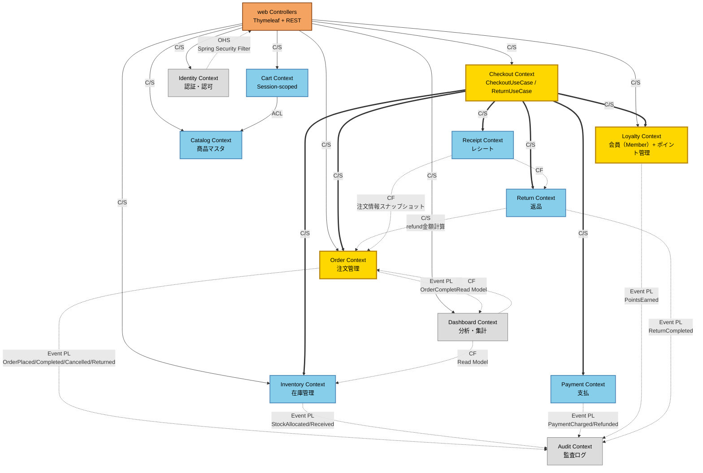
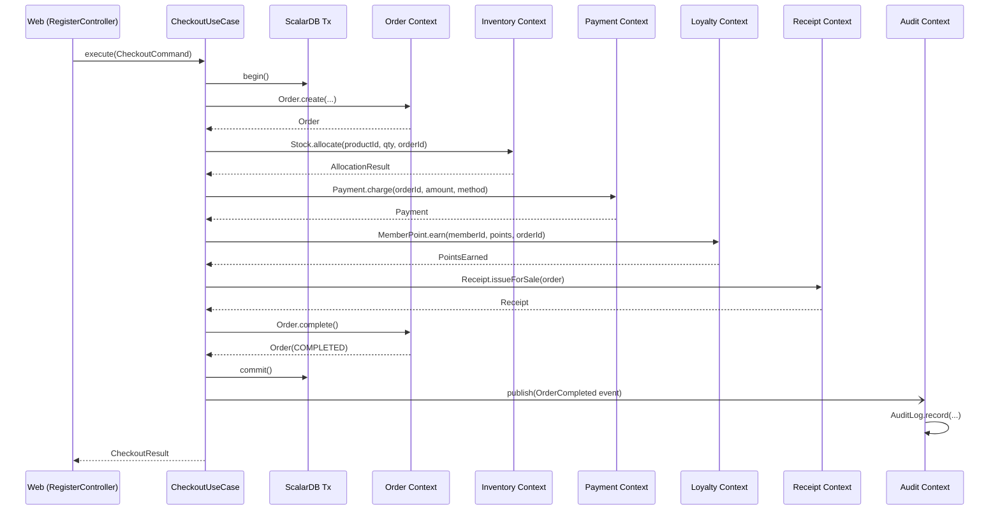

:::message
現状分析の結果をもとに、境界コンテキスト再設計、マイクロサービス設計、ScalarDB/API設計を生成する流れを追います。
:::

## 業務境界とシステム構成の再設計（/architect:redesign & /architect:design-microservices）

現状が可視化されたため、ここから本格的な設計フェーズへと移行します。
まず、モノリスを12個の境界づけられたコンテキスト（Bounded Context）に再設計し、統合パターンを自動生成します。

```text
⏺ redesign フェーズ完了しました。

  ---
  再設計完了サマリ

  12 個の Bounded Context

  Core Subdomain（黄）:
  - Order ─ 注文管理（集約ルート: Order + OrderItem）
  - Loyalty ─ ポイント管理（集約: MemberPoint, PointTransactionHistory, PointRule）
  - Checkout ─ Application Service / Use Case 層

  Supporting Subdomain（青）: Catalog / Inventory / Cart / Payment / Return / Receipt
  Generic Subdomain（灰）: Identity & Access / Audit / Dashboard / Analytics
```

#### レポート出力例

##### コンテキストマップ


以下のようなコンテキストマップがMermaid形式で出力されます。



---


*主要な統合パターン*

決済時のシーケンス図



さらに、これに基づき、ターゲットアーキテクチャとして**13個の独立したマイクロサービス**に切り出す変革計画と、切り出し順序を策定します。

```text
⏺ design-microservices フェーズが完了しました。

  ---
  設計完了サマリ
```

ターゲットアーキテクチャ（13 サービス）

| 種別 | サービス |
| :--- | :--- |
| Process（業務処理） | Order, Inventory, Payment, Loyalty, Return, Checkout Orchestrator, Cart |
| Master（マスタ管理） | Catalog, Receipt |
| Supporting（横断的） | Identity, Audit |
| Integration（連携） | Dashboard, API Gateway/BFF |


*アーキテクチャ概観、設計原則、サービスカタログ(全13サービス)*


*各サービスの詳細（責務、エンドポイント、永続化、並行制御、ドメインイベント発行など）*


*システム全体のアーキテクチャ図*

## ScalarDB設計とAPI設計（/architect:design-scalardb & /architect:design-api）

ターゲットアーキテクチャに基づき、データベースレイヤ（ScalarDBスキーマ、トランザクション境界、マイグレーション設計）と、APIインターフェース（OpenAPI 3.x、AsyncAPI、gRPC、BFF向けGraphQL、API Gateway）を並列で自動設計します。

```text
⏺ design-scalardb と design-api を並列実行します。
...
⏺ 両フェーズが完了しました。

  ---
  design-scalardb + design-api 完了サマリ

  ScalarDB 設計（3 ドキュメント）
  - スキーマ: Multi-storage（PostgreSQL + MySQL）構成、9 namespace × 15 テーブル
  - トランザクション: モノリス内（Consensus Commit）から将来的な 2PC（参加者最大3）へ
  - 補償処理は tx.abort() 1 行に集約 ─ 例外握り潰し問題が完全に消滅

  API 設計
  - OpenAPI 3.x: 11 サービス（checkout, order, inventory, payment 等）
  - AsyncAPI: 11 種のドメインイベント（OrderCompleted, StockAllocated 等、Outbox パターン）
  - gRPC（.proto）: サービス間通信用 5 サービス（transaction_id を全 RPC に伝播）
```

#### レポート出力例

##### ScalarDB設計


*ScalarDB スキーマ設計*


*ScalarDB トランザクション設計*

##### API設計


*design-api実行時にOpenAPIのyamlファイルなど生成される*

## 本章のまとめ

* 現状分析と評価結果をもとに、レガシーPOSを境界コンテキスト単位へ再設計しました。
* ターゲットアーキテクチャでは、13サービス構成、サービス間通信、外部副作用、段階的移行方針が整理されました。
* ScalarDB設計とAPI設計により、データ一貫性とサービス境界を実装へ落とし込むための設計成果物が生成されました。

## 用語解説

### 境界づけられたコンテキスト（Bounded Context）
業務モデルや用語が一貫して成立する範囲です。本章では、注文、在庫、支払、ポイントなどを別々の境界づけられたコンテキストとして整理し、サービス分割の候補を考える単位にしています。

### ターゲットアーキテクチャ
リファクタリング後に目指すシステム構造です。サービス構成、データ配置、通信方式、運用方針などを含みます。

### OpenAPI
HTTP APIのエンドポイント、リクエスト、レスポンスを機械可読な形で定義する仕様です。サービス間やフロントエンドとの接続設計に使います。

### AsyncAPI
イベントやメッセージングの仕様を定義するための形式です。Outboxやドメインイベントを使う非同期連携の設計に役立ちます。
