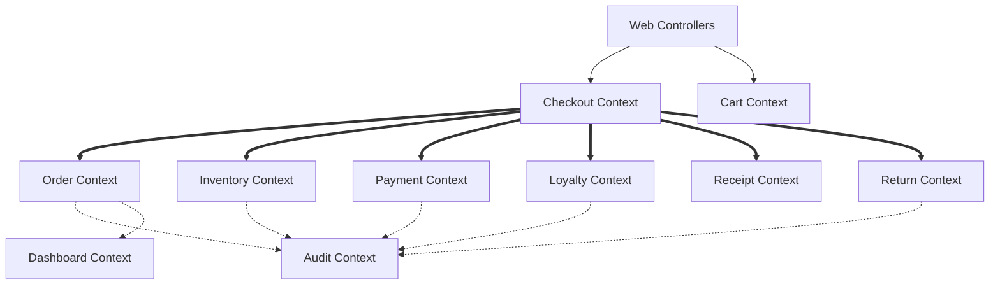

:::message
境界コンテキスト再設計、コンテキストマップ、13サービスのターゲットアーキテクチャ、段階的移行ロードマップを読み解きます。
:::

## 境界コンテキスト再設計

まず重要なのが、`bounded-contexts-redesign.md` です。


*境界コンテキストの再設計とサブドメイン分類*

::::details レポート要約
このレポートでは、既存のPOSモノリスを境界コンテキスト単位に再分割しています。

**設計の要点**

- `Checkout`、`Order`、`Loyalty` を Core Subdomain として扱う
- `Catalog`、`Inventory`、`Payment`、`Return`、`Receipt`、`Cart` は Supporting Subdomain として整理する
- `Identity & Access`、`Audit`、`Dashboard` は Generic Subdomain として扱う
- `OrderService` に集中していた責務を、注文、会計、在庫、返品、集計などの文脈へ分離する
- 各コンテキストに集約ルート、主要ドメイン操作、永続化先、公開インタフェースを定義する

**読みどころ**

単なるクラス分割ではなく、業務上の言葉と責務を再定義している点が重要です。特に、既存の `OrderService` が抱えていたダッシュボード集計、返品可否判定、カート計算などを別コンテキストへ移すことで、注文管理そのものの境界を明確にしています。

**設計上の含意**

この分割により、まずはモジュラモノリスとして境界を整え、その後にサービス単位で抽出できる土台ができます。ScalarDBのトランザクション境界も、コンテキストと集約を基準に考えやすくなります。
::::


このレポートでは、既存の業務領域を以下のような境界コンテキストに再分割しています。

| コンテキスト | 種別 | 主な責務 |
| :--- | :--- | :--- |
| Checkout | Core | 会計処理全体のオーケストレーション |
| Order | Core | 注文ライフサイクル、注文明細、冪等性 |
| Loyalty | Core | 会員、ポイント、ポイント取引 |
| Inventory | Supporting | 在庫数量、在庫引当、在庫移動履歴 |
| Catalog | Supporting | 商品マスタ、バーコード検索、価格・税区分 |
| Payment | Supporting | 支払、返金、外部決済SaaS連携 |
| Return | Supporting | 返品プロセス |
| Receipt | Supporting | レシート発行、レシートスナップショット |
| Cart | Supporting | 会計前のカート状態 |
| Identity & Access | Generic | 認証・認可 |
| Audit | Generic | 監査ログ |
| Dashboard | Generic | 集計・分析 |

この分割で特に重要なのは、**Checkout/Order/LoyaltyをCore Subdomainとして扱っている点**です。

POSシステムにおいて、単に商品を登録することや在庫を表示することよりも、会計処理を正しく・速く・二重実行なく完了させることが事業上の中核になります。つまり、最も注意深く設計すべき場所は、画面やDAOではなく、Checkoutを中心とした注文・在庫・支払・ポイント・レシートの協調部分です。


この方針は、現状把握レポートで見たOrderServiceにすべてが集まっているという問題への直接的な回答になっています。

たとえば、既存の `OrderService` は注文管理だけでなく、ダッシュボード集計、返品可否判定、カート計算のような責務まで抱えていました。設計レポートでは、それらを `OrderCommandService`、`OrderQueryService`、`DashboardService`、`ReturnEligibilityService` へ分割する方針が示されています。

これは単なるクラス分割ではなく、**注文とは何か在庫とは何か会計とは何かを再定義する作業**です。


### コンテキストマップ

次に、`context-map.md` です。


*境界コンテキスト間の関係性と同期・非同期の協調*

::::details レポート要約
このレポートでは、分割した境界コンテキスト同士の関係をコンテキストマップとして整理しています。

**設計の要点**

- Web層は `Checkout`、`Cart`、`Catalog`、`Order` などのコンテキストを利用する
- `Checkout` は `Order`、`Inventory`、`Payment`、`Loyalty`、`Receipt`、`Return` を同期的に協調させる
- `Audit` と `Dashboard` はOutbox経由の非同期イベントで更新する
- `Cart` から `Catalog` への参照にはACLを置き、カート側のモデルを汚染しない
- 上流・下流関係、Published Language、Open Host Service、ACLの使い分けを明示する

**読みどころ**

境界コンテキストを分けるだけでは業務フローは完成しません。会計処理では複数のコンテキストを一貫して進める必要がある一方、監査や集計はユーザー応答を止めずに反映したい。この同期・非同期の使い分けが、このレポートの中心です。

**設計上の含意**

Checkoutを同期協調の中心に置き、AuditとDashboardを非同期更新へ逃がすことで、整合性が必要な処理と遅延を許容できる処理を分離できます。後続のOutbox設計やRead Model設計の前提にもなっています。
::::


境界コンテキストを分けるだけでは、まだ設計としては不十分です。実際の業務フローでは、CheckoutがOrder、Inventory、Payment、Loyalty、Receiptを協調させる必要がありますし、AuditやDashboardにはイベントを流す必要があります。

コンテキストマップでは、この関係が以下のように整理されています。



太い実線はチェックアウトフロー内の同期協調、点線はイベント駆動の非同期通知を表します。

ここで読み取るべきなのは、**同期と非同期の使い分け**です。

会計処理では、注文作成、在庫引当、支払、ポイント、レシート発行の整合性が重要なので、ScalarDBのトランザクション境界に乗せます。一方で、監査ログやダッシュボード集計は会計処理の成功に付随するものですが、ユーザーへの応答をブロックしてまで同期実行するべきものではありません。

そのため、AuditとDashboardはOutbox経由の非同期イベントで更新する設計になっています。

この設計判断は、あとでレビューによりさらに強化されます。


### ターゲットアーキテクチャ

`target-architecture.md` では、最終的な構成として13個のサービスが定義されています。


*13サービス構成のターゲットアーキテクチャ*

::::details レポート要約
このレポートでは、最終的なターゲットアーキテクチャとして13個のサービス候補を定義しています。

**設計の要点**

- まずはモノリス内モジュラ構造を作り、その後に段階的にマイクロサービス化する
- `Catalog`、`Inventory`、`Order`、`Payment`、`Loyalty`、`Receipt`、`Return`、`Checkout Orchestrator` などをサービス候補として定義する
- 業務データ更新はScalarDBのトランザクション境界に揃える
- `Dashboard Service` は独立PostgreSQLのRead Modelを所有し、ScalarDBの集計制約を回避する
- API Gateway/BFF、認証、監査、可観測性などの横断要素もターゲット構成に含める

**読みどころ**

重要なのは、最終像が13サービスだからといって、すぐに13サービスへ分割しない点です。まずパッケージ構造と依存方向を整え、テスト可能なモジュラモノリスを作る。そのうえで、独立性の高い周辺領域からサービス化します。

**設計上の含意**

MMIやDDD準備度が低い状態で一気に分散化すると、ネットワーク越しの複雑さだけが増えます。このレポートは、ターゲット像を示しつつも、移行リスクを抑えるために段階的な抽出を前提にしています。
::::


| # | サービス名 | 種別 | 主な責務 | 主要永続化 |
| :--- | :--- | :--- | :--- | :--- |
| S1 | Catalog Service | Master | 商品マスタ管理 | ScalarDB(PostgreSQL) |
| S2 | Inventory Service | Process | 在庫管理・在庫引当 | ScalarDB(MySQL) |
| S3 | Order Service | Process | 注文作成・確定・キャンセル | ScalarDB(MySQL) |
| S4 | Payment Service | Process | 支払処理・返金・外部決済連携 | ScalarDB(MySQL) |
| S5 | Loyalty Service | Process | 会員・ポイント管理 | ScalarDB(PostgreSQL) |
| S6 | Receipt Service | Master | レシート発行 | ScalarDB(PostgreSQL) |
| S7 | Return Service | Process | 返品プロセス | ScalarDB(MySQL) |
| S8 | Checkout Orchestrator | Process | 複数サービスを跨ぐ会計処理 | ステートレス |
| S9 | Cart Service | Process | カート一時保持 | Redis |
| S10 | Identity Service | Supporting | 認証・認可 | ScalarDB(PostgreSQL) |
| S11 | Audit Service | Supporting | 監査ログ | ScalarDB(PostgreSQL) |
| S12 | Dashboard Service | Integration | 集計・分析 | 独立PostgreSQL |
| S13 | API Gateway/BFF | Integration | ルーティング・JWT検証・レート制限 | なし |

ここで面白いのは、**最終構成はマイクロサービスだが、最初からマイクロサービス化しない**と明記されている点です。

レポートでは、まずモノリス内で以下のようなパッケージ構造へ再編することを推奨しています。

```text
com.example.legacypos.<context>/
├── domain/           # エンティティ・値オブジェクト・集約・ドメインサービス
├── application/      # ユースケース
├── infrastructure/   # Repository実装、外部アダプタ
└── presentation/     # Controller
```

これにより、プロセスはまだ1つのSpring Bootアプリケーションでも、内部構造としては境界コンテキスト単位に分離できます。

いわゆる **モジュラモノリス** です。

評価レポートでは、このシステムのMMI（Modularity Maturity Index：モジュール成熟度指標）が46%、DDD準備度が24.5%という低い状態でした。その状態でいきなり13サービスへ分割すると、分散システムの複雑さだけが先に増え、業務ロジックの混乱は残ったままになります。

そのため、まずはコードの境界を整え、依存方向を制御し、テスト可能な構造にしてから、段階的にサービスとして抽出する方針が取られています。


### 変革ロードマップ

`transformation-plan.md` では、移行を5段階に分けています。


*段階的移行ロードマップ*

::::details レポート要約
このレポートでは、現状のモノリスからターゲットアーキテクチャへ移行するロードマップを5段階で整理しています。

**設計の要点**

- Phase 1ではセキュリティ、テスト、Enum化などのクイックウィンで土台を整える
- Phase 2ではモノリス内モジュラ化とScalarDB導入を進める
- Phase 3では集約、値オブジェクト、ドメインイベントなどDDD戦術パターンを適用する
- Phase 4ではCatalog、Identity、Dashboardなど周辺サービスから抽出する
- Phase 5でCheckout、Order、Payment、Loyaltyなどコア領域を段階的にサービス化する

**読みどころ**

このロードマップは、Strangler Figパターンを前提にしています。既存システムを一度に置き換えるのではなく、境界を作り、外側から少しずつ抽出し、最後にコアの会計処理を切り出す順序です。

**設計上の含意**

早すぎるマイクロサービス化を避け、品質改善、境界整理、トランザクション基盤、運用監視を順に整える計画になっています。移行の成否は、各Phaseで測定可能なKPIを置き、段階ごとにリスクを潰せるかにかかっています。
::::


| Phase | 内容 | 狙い |
| :--- | :--- | :--- |
| Phase0 | 現状 | God Service / 手書きSaga/MMI 46% |
| Phase1 | 基盤整備・クイックウィン | セキュリティ、Enum化、DAO統一、テスト基盤 |
| Phase2 | モジュラ化 + ScalarDB導入 | BC分離、God Service解体、手書きSaga廃止 |
| Phase3 | DDD戦術パターン適用 | 値オブジェクト、集約、Repositoryインターフェース |
| Phase4 | 周辺サービスの抽出 | Identity、Catalog、Receiptなどから分離 |
| Phase5 | コアサービスの抽出 | Checkout、Order、Payment、Inventoryなどを分離 |

特に重要なのはPhase2です。

ここで、既存の大きな負債に直接手を入れます。

| 解体対象 | 分割後 |
| :--- | :--- |
| `OrderService`（976行） | `OrderCommandService` / `OrderQueryService` / `DashboardService` / `ReturnEligibilityService` |
| `CheckoutSaga`（557行） | `CheckoutUseCase` + 各BCのサービス |
| `ReturnSaga`（448行） | `ReturnUseCase` + 各BCのサービス |
| `RegisterController`（303行） | `RegisterViewController` / `RegisterApiController` |
| `Utils.java` | `TaxCalculator` / `PointCalculator` / `IdGenerator` / `HashUtil` |

ここでまず周辺サービスを切り出しましょうではなく、**モノリス内部でGod Serviceと手書きSagaを解体する**のがポイントです。

サービス分割は、責務が整理された後に行うからこそ意味があります。責務が混ざったままサービスを分けると、ネットワーク越しのGod Serviceが生まれるだけです。

## 本章のまとめ

* レガシーPOSの業務領域を12の境界コンテキストに再設計し、サブドメイン分類とコンテキスト間の関係を整理しました。
* ターゲットアーキテクチャでは、13サービス、API Gateway、Outbox、Saga、Dashboard Read Modelまで含む構成が示されました。
* 移行ロードマップでは、いきなりサービス分割するのではなく、まずモノリス内部でGod Serviceと手書きSagaを解体する方針が重要でした。

## 用語解説

### コンテキストマップ
境界コンテキスト同士の関係を示す図や整理表です。どの領域が上流か、どこに変換や依存があるかを把握できます。

### サブドメイン
業務領域を重要度や性質で分類したものです。Core、Supporting、Genericなどに分けることで、投資すべき領域を判断しやすくなります。

### Core Subdomain
事業や業務の強みにつながる中核領域です。本章では、Checkout、Order、Loyaltyのように、POSの正確性や顧客体験に直結する領域をCore Subdomainとして扱っています。

### Anti-Corruption Layer
外部や他コンテキストのモデルをそのまま取り込まず、自分たちのモデルへ変換する層です。境界の汚染を防ぐために使います。

### 段階的移行ロードマップ
現状から目標アーキテクチャへ進むための段階的な計画です。リスクを抑えながら、構造改善とサービス分割を進めるための道筋になります。
