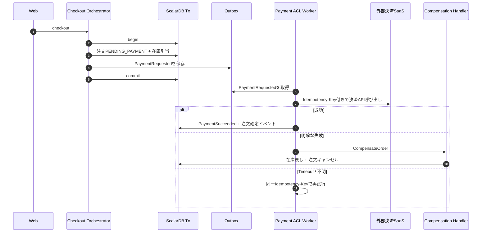
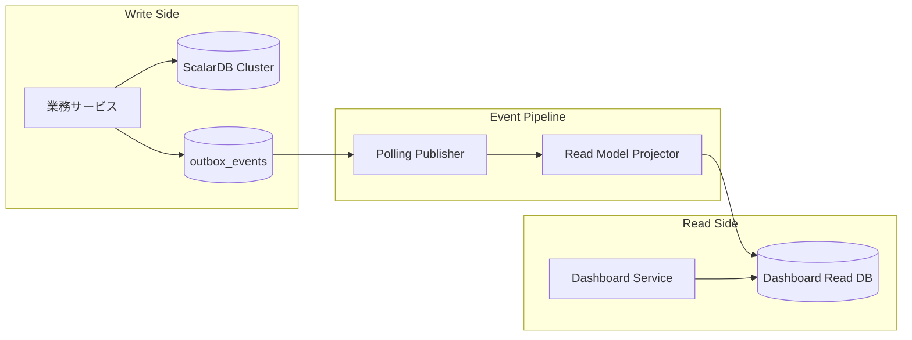

:::message
ScalarDBトランザクション、外部副作用を扱うハイブリッドSaga、CQRS Read Modelの設計をまとめて読み解きます。
:::

## ScalarDBトランザクション設計

`scalardb-transaction.md` では、どの業務にどのトランザクションパターンを使うかが整理されています。

*ScalarDBトランザクションとOutbox設計*

::::details レポート要約
このレポートでは、ScalarDB導入後にどの業務処理をどのトランザクションパターンで扱うかを整理しています。

**設計の要点**

- モノリス内で複数namespaceを更新する処理はConsensus Commitを基本にする
- サービス分離後のCheckoutなど、複数サービスをまたぐ処理では2PCを検討する
- ScalarDB内で完結するPure Tx領域では、手書きSagaの補償処理をScalarDB rollbackに置き換える
- 外部決済SaaSなどrollback不能な副作用は、Outbox + Side-effect Worker + Saga補償で扱う
- AuditやDashboard更新はOutbox + Polling Publisherでat-least-once配信にする

**読みどころ**

重要なのは「ScalarDBを入れたからSagaが不要」ではなく、「Sagaが不要になる範囲はScalarDB内で完結する更新に限られる」と明確にしている点です。外部APIや通知のような副作用は、トランザクションとは別の設計問題として扱います。

**設計上の含意**

Pure Tx領域と副作用境界を分けることで、DB整合性と外部世界の副作用を混同せずに済みます。この整理が、後続のハイブリッドSaga設計とRead Model設計の前提になります。
::::

| ユースケース | パターン | 理由 |
| :--- | :--- | :--- |
| チェックアウト（モノリス内） | Consensus Commit | 単一プロセスから複数Namespaceを更新 |
| チェックアウト（サービス分離後） | 2PC | 複数サービス間の分散トランザクション |
| 返品 | Consensus Commit/2PC | 移行段階により変化 |
| 監査ログ記録 | Outbox + Polling Publisher | at-least-onceを構造的に保証 |
| Dashboard集計更新 | Outbox + Projector | メインフローを阻害せず集計反映 |
| 外部決済SaaS呼び出し | Outbox + Side-effect Worker | rollback不能な副作用を隔離 |

ここで最も大事なのは、**Saga不要と言える範囲を限定していること**です。

ScalarDB内で完結する更新であれば、`tx.abort()` によって原子的にロールバックできます。つまり、注文作成、在庫引当、支払レコード作成、ポイント加算、レシート保存などがすべてScalarDB管理下にあるなら、手書きSagaの補償処理は不要になります。

一方で、外部決済SaaSのような外部API呼び出しは、ScalarDBのrollbackでは取り消せません。

この境界をレポートでは **Pure Tx領域** と **副作用境界（Side-Effect Boundary）** として分けています。

| 領域 | 性質 | 補償戦略 |
| :--- | :--- | :--- |
| Pure Tx領域 | ScalarDBのみで完結し、`tx.abort()` で戻せる | ScalarDB rollback |
| 副作用境界 | 外部APIや物理出力など、rollback不能な副作用を持つ | Outbox + Worker + Saga補償 |

この整理がないままScalarDBを入れたのでSaga不要と言ってしまうと、将来StripeやPAY.JPなどの外部決済を導入した瞬間に設計が破綻します。

レビューではまさにこの点がP0として指摘され、`saga-design.md` が追加されました。

### ハイブリッドSaga設計

`saga-design.md` は、外部決済SaaSのような副作用境界を扱うための設計です。

*副作用境界とハイブリッドSaga設計*

::::details レポート要約
このレポートでは、外部決済SaaSなどの副作用境界を扱うためのハイブリッドSagaを設計しています。

**設計の要点**

- 外部API呼び出しはScalarDB Tx内で直接実行せず、Outboxに要求を記録してcommit後にWorkerが処理する
- 外部決済の結果が確定するまでは、注文を `PENDING_PAYMENT` のようなSemantic Lock状態に置く
- Sagaの進行状態は `saga_state` テーブルに永続化し、プロセス再起動やタイムアウトから復旧できるようにする
- 外部API呼び出しには必ず冪等性キーを付与する
- 失敗時は補償コマンドを発行し、再試行不能な場合は人手介入キューへ送る

**読みどころ**

既存の手書きSagaを単にきれいに書き換える話ではなく、障害から復旧できる業務プロセスとしてSagaを再設計している点が重要です。特に、外部決済の成功・失敗・結果不明を明示的に状態として扱う設計になっています。

**設計上の含意**

副作用をOutboxの外側に隔離することで、DB commitと外部API呼び出しの順序問題を制御しやすくなります。これにより、二重決済、在庫戻し漏れ、決済結果不明の放置といった運用事故を減らせます。
::::

たとえば、外部決済を伴うチェックアウトでは、以下のような流れになります。

ここでポイントになるのは、注文をいきなり確定状態にしないことです。

外部決済の結果が返るまでは、`PENDING_PAYMENT` というSemantic Lock状態に置きます。これにより、決済結果が不明な注文に対して返品やキャンセルなどの後続業務が進まないようにします。

さらに、Sagaの状態は `saga_state` テーブルに永続化されます。

| カラム | 役割 |
| :--- | :--- |
| `saga_id` | Saga識別子 |
| `saga_type` | `PaymentSaga` / `RefundSaga` など |
| `status` | `STARTED` / `AWAITING_EXTERNAL` / `COMPLETED` / `COMPENSATING` / `ESCALATED` |
| `idempotency_key` | 外部API用の冪等性キー |
| `external_id` | Stripe charge IDなど |
| `retry_count` | 再試行回数 |
| `last_error` | 直近エラー |

既存の `CheckoutSaga` / `ReturnSaga` では、Sagaの進行状態がプロセス内のローカル変数に近い形で扱われていました。新しい設計では、進行中のSagaを永続化し、プロセス再起動や外部APIタイムアウトから復旧できるようにしています。

これは、単にSagaをきれいに書き直すという話ではなく、**障害から復旧可能な業務プロセスとして再設計する**という話です。

### CQRS Read Model設計

もうひとつレビューで大きく修正されたのが、Dashboard集計です。

初回設計では、ScalarDB上で `GROUP BY` や集計関数を使ってDashboardを改善するような前提がありました。しかし、ScalarDB Cluster Standardでは、任意の `GROUP BY` や `SUM`、`COUNT`、複雑なJOINをそのまま使うことはできません。

このため、レビューではSYN-004としてP0 Blockerになりました。

v2以降では、Dashboard用に独立PostgreSQLのRead Modelを持つCQRS設計へ変更されています。

*Dashboard集計をCQRS Read Modelへ分離する設計*

::::details レポート要約
このレポートでは、Dashboard集計をScalarDB上で直接行うのではなく、CQRS Read Modelとして独立PostgreSQLへ分離する設計を定義しています。

**設計の要点**

- Write SideはScalarDB Cluster Standardで一貫性を保つ
- Read SideはDashboard Service専用の独立PostgreSQLに置く
- OutboxイベントをPolling Publisherが配信し、ProjectorがRead Modelへupsertする
- DashboardはRead Modelに対して `GROUP BY` や集計関数を使う
- 整合性はEventually Consistentとし、P95 30秒以内の反映をSLOにする

**読みどころ**

ScalarDB Standardでは任意の `GROUP BY`、`SUM`、`COUNT`、複雑なJOINを前提にした集計改善は成立しません。その制約を受け入れたうえで、集計専用のRead Modelを作る判断がこのレポートの中心です。

**設計上の含意**

更新系の整合性と参照系の集計性能を分離できます。DashboardのためにWrite Sideのトランザクション設計を歪めず、集計要件はPostgreSQL側で自然に満たす構成になります。
::::

Read Model側には、以下のような集計専用テーブルが定義されます。

| テーブル | 用途 |
| :--- | :--- |
| `daily_sales_summary` | 日次売上サマリ |
| `hourly_sales_summary` | 時間帯別売上 |
| `monthly_sales_summary` | 月次売上 |
| `product_sales_ranking` | 商品別売上ランキング |
| `member_purchase_summary` | 会員別購買サマリ |

Write SideはScalarDBで一貫性を守り、Read SideはPostgreSQLで集計クエリに最適化する。

この設計により、ScalarDB Standardの制約を受け入れながら、既存のDashboard課題である時間帯別売上やベストセラー集計を解決できます。

ただし、これは結果整合の設計です。

レポートでは、伝搬遅延のSLOも定義されています。

| 指標 | 目標 |
| :--- | :--- |
| 伝搬遅延P50 | 5秒未満 |
| 伝搬遅延P95 | 30秒未満 |
| 伝搬遅延P99 | 2分未満 |
| イベントロス率 | 0% |
| 二重適用 | 0% |

Dashboardは今この瞬間の完全な真実ではなく、少し遅れて反映される分析用ビューとして扱う。ここを明確にしているのが良い設計だと思いました。

## 本章のまとめ

* ScalarDBトランザクション設計では、どの業務処理を強い一貫性で扱い、どこからを副作用として分離するかを整理しました。
* 外部決済や通知のような取り消しが難しい処理は、ハイブリッドSagaとして状態管理、補償、タイムアウト監視を明示しました。
* DashboardはCQRS Read Modelとして切り出し、Write Sideの一貫性とRead Sideの集計性能を分けて扱う設計になりました。

## 用語解説

### Pure Tx
ScalarDBトランザクション内で完結し、外部API呼び出しなどの副作用を含まない更新処理です。強い一貫性を守りやすい領域です。

### 副作用境界
DB更新の外側で発生する、外部決済、通知、メール送信などの副作用を識別する境界です。トランザクションと分けて設計する必要があります。

### ハイブリッドSaga
ScalarDBで守れる一貫性と、外部副作用を扱うSagaを組み合わせる設計です。外部システムとの連携で不明状態や補償を扱うために使います。

### CQRS Read Model
更新用モデルと参照用モデルを分け、参照側を集計や検索に最適化したモデルです。Dashboardのような分析系画面で効果があります。
