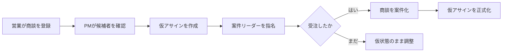

:::message
RADARの画面や機能は、営業とPM/プロジェクトリーダーが行っていたスプレッドシート上の判断を、業務フローとして実装したものです。
:::

## 解決したかった課題

Googleスプレッドシートは、小さく始める業務管理に向いています。一方、商談数や人員調整が増えると、次の問題が見え始めます。

- 商談が受注済みなのか、まだ営業中なのか分かりづらい
- 誰がどの案件に入っているかを横断して確認しづらい
- 確定前の人員調整を色やコメントで表現している
- 同じメンバーを同じ期間へ重複アサインしやすい
- 状態変更の理由と履歴がセルの上書きで失われる
- 遅延の兆候を人がシートを見て探す必要がある

問題は、スプレッドシートそのものではありません。自由な表形式へ、状態遷移、権限、同時実行制御、監査といった責務が集まりすぎたことです。

## 主な利用者

Productパイプラインでは、2つの主要ペルソナを定義しました。

| ペルソナ | 役割 | 主な判断 |
| :--- | :--- | :--- |
| 田中さん | PM/プロジェクトリーダー | 空き要員、仮アサイン、正式化、遅延リスク |
| 佐藤さん | 営業 | 商談作成、受注確度、ステータス更新、営業依頼 |

現在の実装では、利用者を次のロールとして扱います。

| ロール | 主な責務 |
| :--- | :--- |
| ADMIN | 全体管理、組織、予算、監査ログ |
| PM_LEADER | 仮アサイン、正式化、予算目標、営業依頼 |
| SALES | 担当商談、受注確度、売上明細、営業依頼対応 |
| PROCUREMENT | 外部人材の調達とパートナー会社管理 |
| MEMBER | 閲覧と自分に関係する情報の確認 |

初期の4ロールへ、実利用の再設計時に`PROCUREMENT`が追加されています。

## 最重要の業務フロー

設計と実装をつなぐ中心になったのは、仮アサインから正式化までの流れです。

このフローでは、複数の業務判断が関係します。

- 受注前の情報を確定情報と混同しない
- 受注確定には案件リーダーを必要とする
- 正式化を二重実行しても結果を重複させない
- 正式アサインの期間制約を守る
- 誰が確定したのかを監査ログへ残す

単純なCRUDではなく、プロダクト固有のルールが集まる場所です。

## 最初から決めなかったこと

初期構想では将来的なSaaS化も候補にありました。しかし、最初の対象は自社利用です。

マルチテナント、高度な予測分析、会計連携、外部カレンダー連携は初期スコープから外しました。また、既存スプレッドシートのデータ移行も、ゼロから運用を開始する判断によってWon't-haveになりました。

新規プロダクトでは、 **何を作れるか** よりも **最初にどの業務判断を改善するか** を絞ることが重要です。

## 本章のまとめ

- RADARは、スプレッドシートに集中していた状態遷移、アサイン、権限、監査の責務を分けるために作られました。
- 初期の中心ユーザーはPM/リーダーと営業です。
- 仮アサインから受注確定・正式化までが最重要の業務フローです。
- SaaS化や外部連携を急がず、自社の中核業務へスコープを絞りました。
