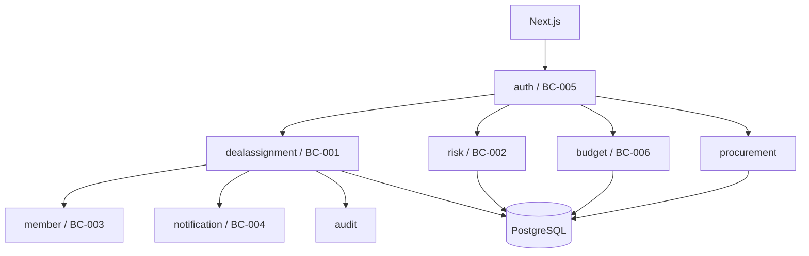

:::message
MVP評価をもとに、業務概念を5つの境界コンテキストへ整理し、単一Spring Bootアプリ内の実装単位へ落としました。
:::

## 初期の5境界コンテキスト


本番設計では、次の5つを定義しました。

| ID | 境界コンテキスト | 分類 | 主な責務 |
| :--- | :--- | :--- | :--- |
| BC-001 | 商談・アサイン | Core | Deal、Assignment、正式化 |
| BC-002 | 遅延リスク | Supporting | RiskFlag、RiskResponse |
| BC-003 | メンバー | Generic | User、MemberProfile |
| BC-004 | 通知 | Supporting | 通知状態、重複排除、配送 |
| BC-005 | 認証・権限 | Supporting | OIDC、ロール、PermissionAggregate |

ここでBCは、Bounded Contextを意味します。現在のJavaパッケージも、ほぼこの境界に対応しています。

## 商談とアサインを同じCoreに置く


DealとAssignmentを別サービスへ分ける案も考えられます。しかしRADARでは、受注確定とアサイン正式化が同じ業務トランザクションです。

```text
Deal: 商談 → 案件
Assignment: 仮 → 正式
```

この2つを初期段階で分散させると、整合性確保のためにSagaや補償処理が必要になります。単一PostgreSQL上でACIDトランザクションを使えるため、BC-001の中で扱う方針にしました。

## 集約をまたぐ処理をドメインサービスにする


Deal集約とAssignment集約は、それぞれ独立した不変条件を持ちます。一方、正式化は両方を協調させます。

そのため、`AssignmentFormalizationService`をドメインサービスとして設計しました。

このサービスは現在の実装で、次をまとめて扱います。

- Idempotency-Keyの再送確認
- Dealの行ロック
- 商談から案件への状態遷移
- 仮アサインの正式化
- 履歴保存
- 監査ログ
- 売上実績の更新

## コンテキスト間依存を制御する


モジュラーモノリスでも、他コンテキストのRepositoryを直接呼び始めると境界が崩れます。

設計では、メンバー参照はサービス層またはACL（Anti-Corruption Layer：腐敗防止層。異なる境界コンテキスト間でモデルが混入しないよう変換を担う層）を経由し、通知は業務イベントから受け取る形にしました。調達機能が後から加わった際も、正式アサイン作成は`ProcurementAssignmentGateway`を通し、調達側がAssignmentRepositoryを直接操作しない構造にしています。

## 実利用で境界を追加する


初期設計後、実利用とのギャップから`budget`と`procurement`が追加されました。

予実管理は、初期設計には存在しなかった新しい業務能力です。既存のDealへすべて押し込まず、BC-006として追加しました。

この変化は、最初の境界が間違っていたという意味ではありません。初期の仮説を実装し、実利用から新しい業務の背骨が見えたため、境界を更新したものです。

## 現在のアーキテクチャ




デプロイ単位は一つですが、変更理由と業務責務は分離されています。

境界をパッケージとデータの責務へ変換し、実利用で見えた予実と調達も追加しました。次章では、境界をまたぐ正式化をAPIとトランザクションへ落とし込みます。
