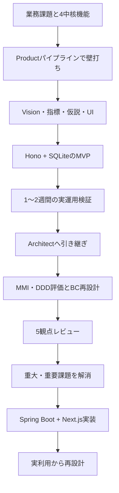

:::message
RADARの開発から得られたのは、特定の設計書やコードだけではなく、壁打ち、検証、設計、レビュー、実装をつなぐ進め方です。
:::

## RADARを作った流れ

本書では、完成したRADARから始め、開発の起点へ戻って流れを追いました。

## 型1：完成像より先に検証条件を決める

新規プロダクトでは、機能一覧を詳細にするほど安心してしまいます。

RADARで本番投資を判断できたのは、ASM-001/002に検証方法とキル閾値を置いたためです。MVPが動いたことではなく、実利用で閾値へ抵触しなかったことをGoの根拠にしました。

## 型2：MVPのコードではなく学びを引き継ぐ

MVPはHonoとSQLite、本番はSpring BootとPostgreSQLです。

直接引き継いだのはコードではありません。利用された画面、仮アサインの状態遷移、正式化のトランザクション境界、利用者の判断です。

MVPをアーカイブし、本番コードと混ぜなかったことで、それぞれの目的が明確になりました。

## 型3：レビューの数値を実装課題へ変える

MMI、DDD、5観点レビューのスコアは、評価のための評価ではありません。

- 責務集中 → パッケージと集約の分離
- 重複リスク → PostgreSQL排他制約
- TOCTOU → 行ロック後の事前条件確認
- 再送リスク → Idempotency-Key
- 認証不足 → OIDCとPermissionAggregate
- 運用設計不足 → 監視、DR、セキュリティ文書

このように、指摘を設計変更、コード、テストへ変えることが重要です。

## 型4：人間が判断する場所を残す

RADARでは、AIエージェントが文書、コード、レビューを作りました。一方、次の判断はユーザーが行いました。

- 自社利用を先にする
- PM/リーダーをプライマリにする
- データ移行をしない
- MVPを実運用へ出す
- 3回目レビューを省略して実装へ進む
- Dockerでビルドする
- 認証をAWS基盤より先に実装する
- 実利用に合わせて予実と調達を追加する

AIの自律性を高めることと、業務上の判断を委ねることは別です。

## 型5：未完了を正直に残す

現在のRADARにも未完了項目があります。

- ASM-004の定量効果測定
- ASM-006のリスク検知実効性
- 通知の実チャネル接続
- RDS上の監査ログINSERT-only権限
- 本番トポロジ確定後のCookie Domain戦略
- フロントエンド自動テスト基盤

これらを隠して **本番化完了** と表現せず、次の判断材料として残すことも品質の一部です。

## おわりに

Nexus Architectの価値は、大量の設計書を生成することだけではありません。

曖昧な業務課題を、Vision、仮説、スコープ、画面、ドメイン、API、運用、実装へ段階的に変換し、その途中で人間が判断できる状態を作ることにあります。

RADARは、一度のプロンプトで完成したプロダクトではありません。壁打ちで方向を決め、MVPで確かめ、レビューで不足を見つけ、実装で設計を検証し、実利用から再び構造を変えています。

AI駆動プロダクト開発で再利用できるのは、最終成果物の形よりも、この往復の仕組みです。

企画・設計・Issue・実装・運用をつなぐ鍵は、AIが作業を進めることと、人が判断を引き受けることを分け、判断と学びを次の工程へ残すことです。RADARの未完了項目も含めたこの往復が、本書から持ち帰れる開発の型です。
